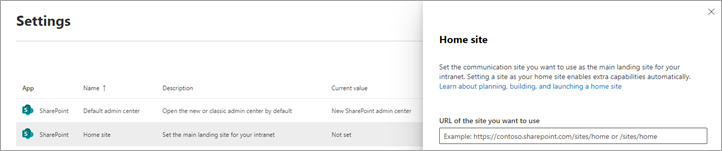

# Set a site as your home site
  
A home site is a SharePoint [communication site](https://support.office.com/article/94A33429-E580-45C3-A090-5512A8070732) that you create and set as the main landing site for your intranet. It brings together news, events, embedded video and conversations, and other resources to deliver an engaging experience that reflects your organization's voice, priorities, and brand, it also allows users to search for content (such as sites, news, and files) across the entire intranet. You can set the home site in the <a href="https://go.microsoft.com/fwlink/?linkid=2185219" target="_blank">SharePoint admin center</a> or by using PowerShell.

Before you begin, make sure you've reviewed how to [plan, build, and launch a home site](./home-site-plan.md). 

> [!NOTE]
> You can set only one site in your organization as a home site. The site can be registered as a hub site, but can't be associated with a hub. The first time you set up a home site, it might take up to several minutes for the changes to take effect. If you run the command again to switch your home site to a different site, it might take up to 2 hours.

> [!IMPORTANT]
> If the site you want to be your home site isn't currently your root site and you want it to be, first [replace your root site with the site](modern-root-site.md), and then make the site your home site. 

## Use the SharePoint admin center

After you create and customize the communication site that you want to use as your home site, follow these steps to set it as your home site. 

1. Go to <a href="https://go.microsoft.com/fwlink/?linkid=2185072" target="_blank">**Settings** in the SharePoint admin center</a>, and sign in with an account that has [admin permissions](./sharepoint-admin-role.md) for your organization.

   >[!NOTE]
   > If you have Office 365 operated by 21Vianet (China), [sign in to the Microsoft 365 admin center](https://go.microsoft.com/fwlink/p/?linkid=850627), then browse to the SharePoint admin center and open the Settings page.
    
2. Select **Home site**.

    

3. Paste the URL of the communication site that you want to become the home site. 

4. Select **Save**.

On the Settings page, the home site URL will appear in the Current value column.

> [!NOTE] 
> It might take up to 10 minutes for the change to take effect and the Global navigation and Set up Viva Connections options to appear.

## Use PowerShell

Follow these steps if you want to use PowerShell to set your home site. To run this cmdlet, you must be a site admin of the site.

1. [Download the latest SharePoint Online Management Shell](https://go.microsoft.com/fwlink/p/?LinkId=255251).

    > [!NOTE]
    > If you installed a previous version of the SharePoint Online Management Shell, go to Add or remove programs and uninstall "SharePoint Online Management Shell."

2. Connect to SharePoint as a [global admin or SharePoint admin](./sharepoint-admin-role.md) in Microsoft 365. To learn how, see [Getting started with SharePoint Online Management Shell](/powershell/sharepoint/sharepoint-online/connect-sharepoint-online).

3. Run `Set-SPOHomeSite -HomeSiteUrl <siteUrl>`.

    (Where siteUrl is the site you want to use)

> [!TIP]
> After you set your home site, you might want to [enable and customize the global navigation](sharepoint-app-bar.md#customize-global-navigation-in-the-app-bar).

## Remove a site as your home site

If you remove a site as your home site:

- The Home button will be removed from the Find tab of the SharePoint mobile app.
- If you enabled global navigation, the global navigation pane will be removed from the SharePoint app bar.
- Search will be scoped to the site only.

To remove the site as your home site: 

1. Go to <a href="https://go.microsoft.com/fwlink/?linkid=2185072" target="_blank">**Settings** in the SharePoint admin center</a>.
2. select **Home site**.
3. Next to your current home site, select **Remove as home site**.
4. Select **Save**.

To perform this task by using PowerShell, run `Remove-SPOHomeSite`.

The site will continue to be an organization news site. To remove it as an organization news site, see [Create an organization news site](organization-news-site.md).

## See also

**Watch:** [Build and launch a SharePoint Home Site: Tips and Tricks From The Product Team](https://techcommunity.microsoft.com/t5/video-hub/build-and-launch-a-sharepoint-home-site-tips-and-tricks-from-the/m-p/1696758)

[Creating and launching a healthy SharePoint portal](portal-health.md)

Use and customize the [The Landing template](https://lookbook.microsoft.com/details/c9300e94-6e83-471a-b767-b7878689e97e) from the SharePoint look book 
