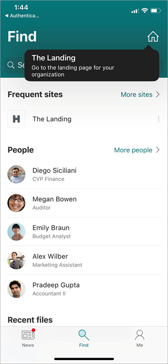

# Set up a home site for your organization
  
A home site is a [communication site](https://support.office.com/article/94A33429-E580-45C3-A090-5512A8070732
) that you create and set as the top landing page for all users in your intranet. It brings together news, events, embedded video and conversations, and other resources to deliver an engaging experience that reflects your organization's voice, priorities, and brand. 

> [!NOTE]
> Some functionality is introduced gradually to organizations that have opted in to the [Targeted release option in Microsoft 365](/office365/admin/manage/release-options-in-microsoft-365). This means that you might not yet see the feature described in this article.

## Home site capabilities

When you set a site as your home site:

- It's easily accessible from the SharePoint mobile app for Android and iOS. All users that have access to the home site will see a home button on the Find tab of the mobile app. Being communication sites, home sites are designed to be mobile friendly from the start.

    

- Search for the site is scoped to all sites within the organization. Having a great search experience is critical for the success of the home site. [Learn more about Microsoft Search](/microsoftsearch/overview-microsoft-search)

- The site is automatically set up as an [organization news site](organization-news-site.md). (Although you can have only one home site, you can have multiple organization news sites.)

> [!NOTE]
> Integration between the home site and [SharePoint start page](https://support.office.com/article/6b85097a-87e0-4611-a29a-dfd49b1a1220) (where the branding, theming, header, navigation, and footer elements from the home site are applied to the start page and users can easily navigate between the pages) is not available at this time. Please watch for updates in the [Microsoft 365 roadmap](https://www.microsoft.com/microsoft-365/roadmap?filters=&searchterms=start%20page).

## Plan and create your home site

To set a site as your organization's home site, you first need to create and customize the site you want to use.

1. When you design your organization's top landing page, consider the goals from the perspective of your IT department, your organization's communications team, and end users of the experience.
2. Create a communication site to use for the home site, and customize it using built-in features as much as possible:
    - Use the megamenu style for navigation and add a site footer. For info, see [Change the look of your SharePoint site](https://support.office.com/article/06bbadc3-6b04-4a60-9d14-894f6a170818).
    - Try out various page layouts, including the vertical section. For info, see [Add sections and columns](https://support.office.com/article/fc491eb4-f733-4825-8fe2-e1ed80bd0899).
    - Use [audience targeting](https://support.office.com/article/68113d1b-be99-4d4c-a61c-73b087f48a81) with SharePoint news and navigation links to tailor the experience for your audiences.
    - Use personalized web parts, preferably in a unique visual location like the vertical section with background color, which allows users to quickly consume organization content and get back to their work. 
    - Extend the site as needed by using the SharePoint Framework (SPFx). To get started building custom web parts, see [SharePoint Framework Tutorial 1](https://www.youtube.com/watch?v=S3tG2DE8tR8). For info about app extensions, see [Getting started with SharePoint Framework Application customizers](https://www.youtube.com/watch?v=gp056PEZoRQ&list=PLR9nK3mnD-OV6WhWHOMAvW-T_EBGKIs3u&index=18&t=0s).
    - Make sure the site is set up for regular content updates. Turn on [content approval](https://support.office.com/article/a8b2e689-d4a1-4639-8028-333c0ece30d9) to ensure high-quality content.
    - Consider making the site a [hub site](create-hub-site.md). Your home site can be registered as a hub site, but can't be associated with another hub.
3. Create a launch plan for redirecting from your current solution to the new home site and notifying users of the change.
**Important**: Make sure the site adheres to the [guidelines for healthy portals](https://Aka.ms/portalhealth).
4. Optional (recommended): When you're ready to launch, [replace your root site with the new site](modern-root-site.md#replace-your-root-site).
5. To make the site a home site, follow the steps in the next section.
6. Make sure to [customize the Microsoft 365 theme for your organization](/microsoft365/admin/setup/customize-your-organization-theme), adding your logo and linking it to the home site. 

## Set a site as your home site

After you create and customize the communication site that you want to use as your home site, you need to run a PowerShell cmdlet to set it as your home site. To run this cmdlet, you must be a site admin of the site.

1. [Download the latest SharePoint Online Management Shell](https://go.microsoft.com/fwlink/p/?LinkId=255251).

    > [!NOTE]
    > If you installed a previous version of the SharePoint Online Management Shell, go to Add or remove programs and uninstall "SharePoint Online Management Shell."  On the Download Center page, select your language and then click the Download button. You'll be asked to choose between downloading a x64 and x86 .msi file. Download the x64 file if you're running the 64-bit version of Windows or the x86 file if you're running the 32-bit version. If you don't know, see https://support.microsoft.com/help/13443/windows-which-operating-system. After the file downloads, run it and follow the steps in the Setup Wizard. 
    
2. Connect to SharePoint Online as a [global admin or SharePoint admin](https://docs.microsoft.com/sharepoint/sharepoint-admin-role) in Microsoft 365. To learn how, see [Getting started with SharePoint Online Management Shell](/powershell/sharepoint/sharepoint-online/connect-sharepoint-online).
    
3. Run `Set-SPOHomeSite -HomeSiteUrl <siteUrl>`.

    (Where siteUrl is the site you want to use)

> [!NOTE]
> You can set only one site in your organization as a home site. The site can be registered as a hub site, but can't be associated with a hub. The first time you set up a home site, it might take up to several minutes for the changes to take effect. If you run the command again to switch your home site to a different site, it might take up to 2 hours.
