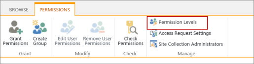
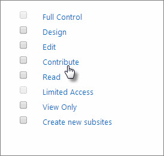
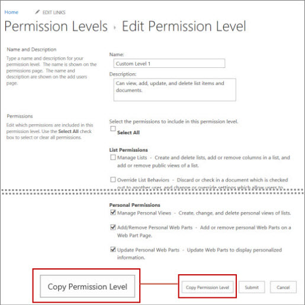
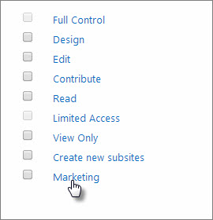

# Permission levels

While SharePoint allows considerable customization of site permissions, including custom permission levels, we highly recommend using the built-in SharePoint groups for communication site permissions and managing team site permissions through the associated Office 365 group. This allows for much easier administration. For information about managing permissions in the SharePoint modern experience, see [Sharing and permissions in the SharePoint modern experience](modern-experience-sharing-permissions.md).

If you do need to create custom permission levels, this article describes how.

## How to create and edit permission levels

Permissions allow SharePoint users to perform certain actions, such as edit items in a list or create a site. But you can't assign individual permissions to individual users in SharePoint. Instead, you group related permissions together into a [permission level](understanding-permission-levels.md). Then you assign that permission level to a [SharePoint group](customize-sharepoint-site-permissions.md) that includes the people you are assigning permissions for. 
  
 SharePoint comes with some default [permission levels](understanding-permission-levels.md) that you can use, such as **Contribute** and **View Only**. But if one of those doesn't meet your needs, you can create a new permissions level. It's easier to keep track of permission levels if you don't change the defaults.
  
## Create a permission level

You create and make changes to permission levels on the **Permissions Levels** page. 
  
To create or make changes to permission levels, you must belong to a SharePoint group that includes the permission to Manage Permissions. By default, you have this permission if you belong to the Owners group or if you are a Site Collection Administrator.
  
1. On the top-level site of the site collection, select **Settings** .

  - For a classic site, select **Site settings**. On the **Site Settings** page, in the **Users and Permissions** section, select **Site permissions**.
  - For a modern site, select **Site permissions**, and then **Advanced permissions settings**.
    
2. On the **Permissions** tab, in the Manage group, choose **Permission Levels**. 
    
    
  
3. On the **Permission Levels** page, choose **Add a Permission Level**. 
    
4. On the **Add a Permission Level** page provide the name and the description. 
    
5. In the **Permissions area**, select the check boxes next to the list, site, and personal permissions that you want this permission level to include.
    
6. Click **Create**.
    
You can make changes to any of the listed permissions levels, except **Full Control** and **Limited Access**.
  
After you create the permission level, assign it to a [SharePoint group](customize-sharepoint-site-permissions.md).
  
## Create a permission level by copying an existing permission level

A quick way to create a new permission level is to make a copy of an existing permission level. You might want to do this when the existing permission level has permissions similar to what the new permission level will have. After you make the copy, you can add or remove the permissions you need the new permission level to have.
  
 **To copy a permission level:**
  
1. On the **Permission Levels** page, click the name of the permission level that you want to copy. Be sure to click the link; do not select the checkbox next to the name. For example, **Contribute**, as shown in the following figure.
    
    
  
2. On the **Edit Permission Level** page, choose **Copy Permission Level**, which is at the bottom of the page after the **Personal Permissions** section. 
    
    
  
3. On the **Copy Permission Level** page, type a name and description for the new permission level. 
    
4. Choose which permissions you want to add or remove, and then choose **Create**
    
After you create the permission level, assign it to a [SharePoint group](customize-sharepoint-site-permissions.md).
  
## Make changes to a permission level

You can make the following changes to a permission level:
  
- Update the name or description
    
- Add or remove permissions
    
We recommend that you don't make any changes to the default permission levels that come with SharePoint. You can't make changes to the **Full Control** and **Limited Access** default permission levels. 
  
 **To make changes to a permission level:**
  
1. On the **Permission Levels** page, click the name of the permission level you want to edit. Be sure to click the link; do not select the checkbox next to the name. For example, **Marketing**, as shown in the following figure.
    
    
  
2. On **Edit Permission Level** page you can: 
    
  - Change the description. 
    
  - Add or remove permissions to the level.
    
3. After you have made you changes, click **Submit.**
    
You can delete any permission level, except for **Full Control** and **Limited Access**. We don't recommend that you delete a default permission level.
  
To delete a permission level, on the **Permissions Levels** page, select the check box next to the permission level that you want to delete, and then chose **Delete Selected Permission Levels**.
  
## Best practices for permission levels

Permission levels apply to a specific site collection. This means that any changes you make to a permission level will have an effect throughout the site collection. Therefore, here are some recommendations:
  
- **Don't edit default permission levels** If you change a default permission level, the changes affect all the built-in SharePoint groups within the site collection. It can also cause confusion if you have two site collections that have permission levels with the same name, but each contains a different set of permissions. 
    
- **Don't delete default permission levels** If you delete a default permission level, it will be removed from all built-in SharePoint groups that contain it within the site collection. This can cause users assigned to those groups to lose critical permissions. 
    
- **Assign permission levels to SharePoint groups** You can assign a permission level to a single SharePoint user, but it's easier to keep track of who has permissions to which sites if you assign permission levels to a SharePoint group, and add that individual to the group. This can also help site performance. 
    

