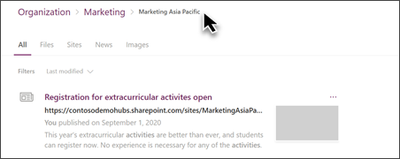
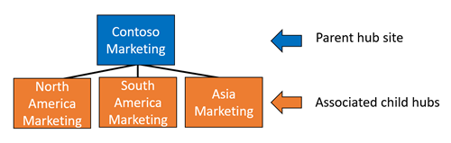
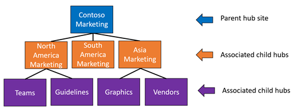
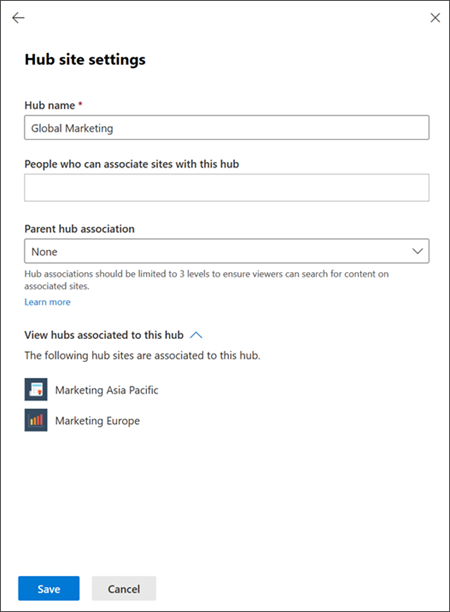
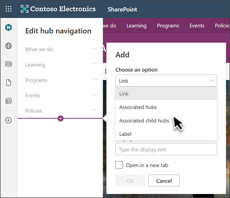
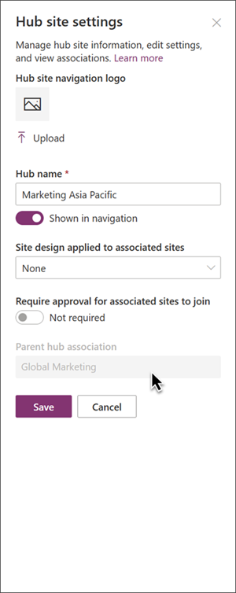

# Associate a SharePoint hub site to another hub to connect search experiences

Associate a [SharePoint hub](https://support.microsoft.com/office/what-is-a-sharepoint-hub-site-fe26ae84-14b7-45b6-a6d1-948b3966427f) to another hub to expand search results across multiple hubs in your organization. This enables users to discover relevant content when searching on any sites related to the associated hubs. Learn more about [how to plan](planning-hub-sites.md) and [create hub sites](create-hub-site.md) for your organization.

> [!NOTE]
>
> - You must have administrator editing privileges to associate hubs to each other in the SharePoint admin center.
> - Hub level associations do not change site permissions.
> - Web parts configured to show content from all sites in the hub will continue to show data from the original parent hub only.

## How hub to hub associations work

When you associate hubs, there are no visual changes to the user experience except when viewing search results. When viewing search results, the breadcrumb path at the top of the page will display the associated hub name where content can be found. Hub associations are designed to expand the availability of related content to end users.

Hub to hub site associations create a network of hubs that roll-up to each other to create connections. When hubs are associated with each other, content can be searched for and displayed on hubs up to three levels of association.

**Basic hub association diagram:**

The following diagram illustrates how hub sites can be associated to other hubs and what site content will appear in search for users searching on any of these sites.

- **Parent hub (level 1):** Think of associated hubs on level one as "Parent" hubs that determine the search scope for peer associated hubs.
- **Associated child hub (level 2):** These hub sites are already associated to the parent hub and content within these sites will appear when users search at any of these hubs.
- **Associated child hub (level 3):** This level (and all preceding levels) of peer associated hubs behaves the same way as the first level. Content on sites beyond level 3 will not appear in search results.

## Associate a hub to another hub

1. Go to <a href="https://go.microsoft.com/fwlink/?linkid=2185220" target="_blank">**Active sites** in the SharePoint admin center</a>, and sign in with an account that has [admin permissions](./sharepoint-admin-role.md) for your organization.
2. Select the hub site that you'd like to make an association. Then select **Hub** on the command bar and select **Edit hub site settings** to open to hub settings panel.
3. Next, select a hub to associate to in the **Parent hub association** field. Hubs that are available for association will appear here.
4. To confirm which hubs have already been associated with your hub site, select **View child hubs associated to this hub**.
5. Select **Save**.

## Add links to hub associations to the hub site navigation
Hub site owners can quickly add links to the associated parent hub or child hubs when editing site navigation. Adding links to associated hubs is *optional* but makes it even easier for users to discover more relevant content across hubs.

1. On the hub site, select **Edit** in the hub navigation bar.
2. Next, select **Associated hubs** to add navigational links to the Parent hub(s).

    - In the hub structure example above, if you are on the North American marketing hub (level 2) and you select **Associated hubs**, you will see a links to the *Teams*, and *Guidelines* hubs.

3. Or, select **Associated child hubs** to add navigational links to associated child hubs (hubs on levels 2 and three) if available.

    - In the hub structure example above, if you are on the North American marketing hub (level 2) and you select **Associated child hubs**, you will see links to the *South America Marketing* and *Asia Marketing* hubs.

4. Then, enter a display name for the new navigational links.
5. Select **OK** to save your selection.
6. Select **Save** when you are done.

> [!NOTE]
> Navigational links to associated hubs *are not* automatically updated when there are changes to hub associations in the SharePoint admin center.

## How to confirm the Parent hub association

To view the parent hub association, select **Settings** and then **Hub site settings**.

> [!NOTE]
> Changes to hub associations must be made in the SharePoint admin center and require administrative privileges.

### Resources

[Planning your SharePoint hub sites](planning-hub-sites.md)
 

[Set up your SharePoint hub site](https://support.microsoft.com/office/set-up-your-sharepoint-hub-site-e2daed64-658c-4462-aeaf-7d1a92eba098)

