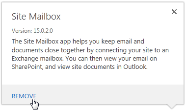
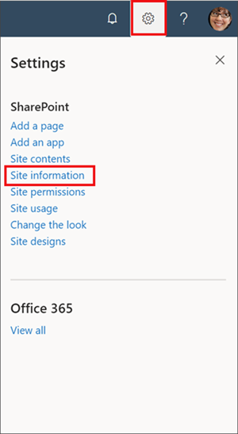
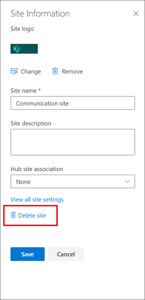
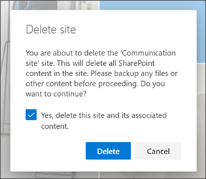
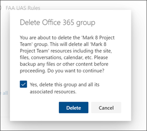

# Identify and remove site mailboxes

A site mailbox is functionally comprised of SharePoint site membership (owners and members), shared storage through an Exchange 2016 or Exchange 2019 mailbox for email messages and a SharePoint site for documents, and a management interface that addresses provisioning and lifecycle needs.

## To view a list of site mailboxes

Run the following command in Exchange PowerShell:

```Powershell
Get-SiteMailbox -BypassOwnerCheck -ResultSize Unlimited | ft Name, WhenCreated, ClosedTime, SharePointUrl -AutoSize
```

The 'create' date shows the recently created site mailboxes. 
The 'ClosedTime' in the output of 'Get-SiteMailbox' refers to the status of the associated SharePoint site. The companies set a SharePoint policy to close sites after a period of time or provide users permission to close the sites. Closing the site generally means it is out of service. Closed site mailboxes are removed from view in the Outlook desktop client, but they are available in the Outlook Web Access.

For more information see, [Use policies for site closure and deletion](https://support.office.com/article/use-policies-for-site-closure-and-deletion-a8280d82-27fd-48c5-9adf-8a5431208ba5).

## To identify active site mailboxes

Run the following command in Exchange PowerShell:

```powershell
# If you run this more than once, delete/rename the output file first because this command appends to it.
# This is a single, long command line. It could take minutes or hours depending on the number of site mailboxes; thus, the countdown.
$sms = Get-SiteMailbox -BypassOwnerCheck -ResultSize unlimited ; 
$count = $sms.Count ; 
$sms | %{ $count-- ; echo "$count" ; 
Get-MailboxFolderStatistics $_.Identity -FolderScope Inbox | sort LastModifiedTime -Descending | ft Identity,LastModifiedTime >> c:\temp\sitemailboxes.txt 
```

There are no commands to show if the site mailboxes are still active. The above example lists the number of site mailboxes that were recently updated. The details of the site mailboxes are stored in a file. 

>[!NOTE]
> The processing time varies based on the number of site mailboxes.

## To Identify the owners of site mailboxes

Run the following command in Exchange PowerShell:

```powershell
Get-SiteMailbox -BypassOwnerCheck | fl Name, Owners
```

## To remove the site mailboxes

Use one of the following options:

Option 1: Hiding the mailbox from a SharePoint Site

You can remove the site mailbox, which essentially hides the mailbox from those who are using the site. It exists in Exchange and can be accessed through Outlook Web Access if the browser is bookmarked.

1. Click **Settings**  > **Site contents**.

2. Under **Lists, Libraries, and other APPs**, point to **Site Mailbox**, and then click **…** for more information.

   

3. Click **Remove** on the box that pops up.

   

4.	Click **OK** to remove the site mailbox app.

>[!NOTE]
> If you remove a mailbox from a site, it won’t be displayed on the site, but it will still be visible in Outlook (if you’re using Exchange).

Option 2: Delete the SharePoint Site

If the SharePoint site is deleted, Exchange is notified to also delete the site mailbox.

1.	Navigate to the SharePoint site you want to delete.

2.	Select **Settings**  at the top of the site and then click **Site information**.

    
    
>[!NOTE]
> If you do not see **Site information** in the **Settings** panel, work with your SharePoint administrator to get access.

3.	At the bottom of the Site Information panel, select **Delete site**.

    

4.	Check the confirmation box, and then select **Delete**.

   **Confirmation for communication sites**

   

   **Confirmation for team sites**

   

### Delete a site or subsite quicksteps

If you're experienced with SharePoint, here's how to delete a site or subsite in any version.
- SharePoint in Microsoft 365 team site — **Settings** > **Site Information** > **Delete site** — Check box to delete group, and then click **Delete**

- SharePoint in Microsoft 365 or SharePoint Server 2019 communication site — **Settings**  > **Site Information** >  **Delete site** — Click **Delete**

- SharePoint Server 2019 Team site — **Settings**  > **Site Information** > **View all site settings** >  **Site Actions** >  **Delete this site** — Click **Delete**

- SharePoint Classic Experience or earlier versions of SharePoint in Microsoft 365 — **Settings** >  **Site settings** > **Site Actions** > **Delete this site** — Click **Delete**

- SharePoint Server 2016, 2013 — **Settings**  > **Site settings** > **Site Actions** > **Delete this site** — Click **Delete**

- SharePoint Server 2010 — **Site Actions** >  **Site settings** >  **Site Actions** > **Delete this site** — Click **Delete**

Option 3: Delete the site mailbox manually

For example, run the following command in Exchange PowerShell:

```powershell
Get-Mailbox MDEL:* | ?{$_.RecipientTypeDetails -eq "TeamMailbox"} | Remove-Mailbox -Confirm:$false
```
Use 'Remove-Mailbox' to delete a site mailbox. The system removes the site mailbox link from the SharePoint site when a site mailbox is deleted. In the example, change the 'MDEL' to the name of the site mailbox you want to delete.

## What else do I need to know?
There are a couple of things worth noting about removing a site mailbox:
- The only way to fully delete a site mailbox is to [delete the entire site itself](https://support.microsoft.com/office/delete-a-sharepoint-site-or-subsite-bc37b743-0cef-475e-9a8c-8fc4d40179fb). When a site is closed or deleted (either manually, or by following [site closure policies](https://support.microsoft.com/en-us/office/use-policies-for-site-closure-and-deletion-a8280d82-27fd-48c5-9adf-8a5431208ba5)), the site mailbox is also closed or deleted.

- After removing the site mailbox app from a site, mail sent to the mailbox will still be stored. If you [add the mailbox back to the site](https://support.microsoft.com/office/add-a-site-mailbox-to-keep-email-in-context-cccaa235-c611-48e3-9653-0b9e161840e7) later, any mail sent to the site mailbox since it was originally created will still be there.

