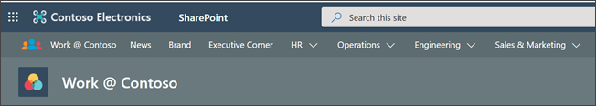
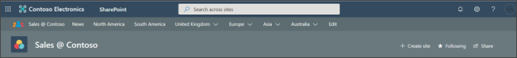
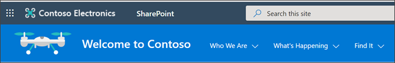
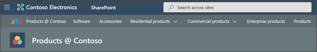
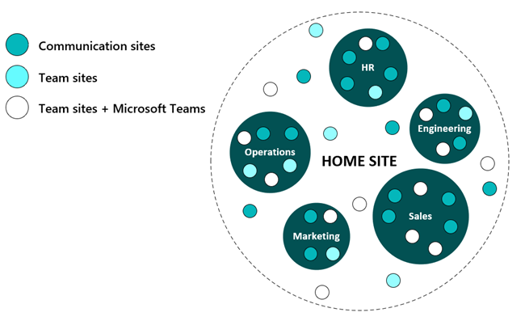
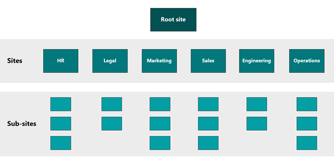
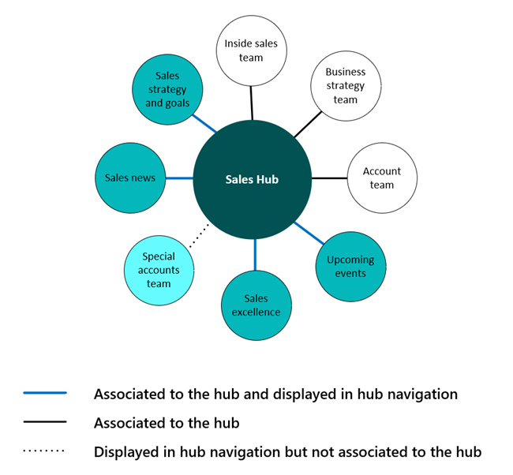

# Information architecture models and examples

Navigation design accounts for the visual way of finding components (menus, links, sites, and pages) that help users understand how to interact with SharePoint sites and portals and what types of information is available. Options for implementing navigation differ based on the framework for your sites and intranet. 

**In this article:**

- [Learn about information architecture elements](#information-architecture-modeling-elements)
- [Explore common information architecture models and scenarios](#common-models-for-navigation-design)
- [Use the models and scenarios as a starting point for navigational design](#scenarios)

## Information architecture modeling elements

Information architecture elements are secondary components to navigation design that compliment building blocks. The following components should be considered when selecting, planning, and implementing navigational design for global, hub, or local navigation.

- **Site hierarchy** – Use hubs and visual layouts to establish visual hierarchy 
- **Security** – Data governance, administration and editing privileges
- **Taxonomy** – Record management, compliance requirements

## Common models for navigation design

The way you organize sites and content will depend on the composition of your organization and the needs and goals of your users. For example, if your goal is to enable front-line workers with specific sites and documents, you may decide to optimize navigation for a mobile device. Another example, if your goal is to create a collaboration space for your team, you may decide to design your SharePoint team site to align with Microsoft Teams.

Common methods of organizing navigational design:

### By department

**Benefits** - Most users already have a well-established mental model for navigation broken down by department. This model scales many sizes and types of organizations and is a common method for [organizing and planning hubs](https://docs.microsoft.com/sharepoint/planning-hub-sites).

**Governance considerations**  - For large organizations, especially with international offices, it can be challenging to make sure the right people have access to the right content for security and compliance purposes. Consider using personalization elements like [information barriers](https://docs.microsoft.com/sharepoint/information-barriers) and [audience targeting](https://support.microsoft.com/office/overview-of-audience-targeting-in-modern-sharepoint-sites-68113d1b-be99-4d4c-a61c-73b087f48a81) to help surface content the specific audiences. 

**Maintenance considerations** - As the business grows and departments and team move, you will need to update global, hub, and local navigation to reflect organizational changes. 

### By geographic location

**Benefits** - Organizing by geographic location is an effective way to bring people of similar disciplines together to collaborate and build community. For large or organizations, and international organizations, location can be an important decision-making factor for users. Organizing by region may be important when certain topics have different laws and mandates depending on the region. For example, crisis management sites or human resource guidelines. 

**Governance considerations** - Many governance details may very among region, for example site creation policy, data retention, and data storage policies too. Learn more about the [multi-geo user experience](https://docs.microsoft.com/microsoft-365/enterprise/multi-geo-user-experience) and [multi-geo configuration](https://docs.microsoft.com/sharepoint/dev/solution-guidance/multigeo-introduction).

**Maintenance considerations** - When the organization moves locations, navigation will need to be updated to reflect those changes. There are other [multi-geo considerations](https://docs.microsoft.com/microsoft-365/enterprise/multi-geo-capabilities-in-onedrive-and-sharepoint-online-in-microsoft-365) to plan when enabling SharePoint, [Microsoft 365 groups](https://docs.microsoft.com/microsoft-365/admin/create-groups/office-365-groups), and other Microsoft 365 apps globally. Multi-geo enables global businesses to control the country or region where shared resources like SharePoint Team Sites, Office 365 Groups content (associated SharePoint Sites and shared mailboxes) are stored and managed. 

### By task or scenario

**Benefits** - Organizing by scenario within navigation helps users learn about a general concept, for example “about us” pages. Organizing by common and frequently used tasks is helpful in the same way, for example tasks like “get reimbursed” or “pick a healthcare plan.” 

**Governance considerations** - This style of navigation could attract a broad and high-volume audience depending on the rest of your navigation design. High volume sites should take extra care in ensuring [page performance](https://docs.microsoft.com/sharepoint/modern-experience-performance) is managed by optimizing image sizes and other details. Consider using tactics like [creating hubs](https://docs.microsoft.com/sharepoint/create-hub-site) to organize tasks by departmental needs, which will make it easier to manage page access and organization. 

**Maintenance considerations** - When organizational information (leadership, locations, etc.) becomes outdated, navigation will need to be updated.

### By portfolio

**Benefits** - Sometimes content is best organized by type, or portfolio, to display content in natural groupings or for specific audiences. Organizing your navigation by portfolio offers flexibility as your business scales and grows. 

**Governance considerations** - For large organizations, especially with international offices, it can be challenging to make sure the right people have access to the right content for security and compliance purposes. Consider using personalization elements like [information barriers](https://docs.microsoft.com/sharepoint/information-barriers) and [audience targeting](https://support.microsoft.com/office/overview-of-audience-targeting-in-modern-sharepoint-sites-68113d1b-be99-4d4c-a61c-73b087f48a81) to help surface content the specific audiences.

**Maintenance considerations** - As the business and portfolios grow, the navigation needs to reflect organizational changes. 

## Scenarios

### Scenario 1: Move to modern navigation from classic navigation

**Modern navigation**

> [!div class="mx-imgBorder"]
> 

**Classic navigation**

> [!div class="mx-imgBorder"]
> 

Your intranet is an ever-evolving component of your business that will need to grow and scale alongside your organization. Modern intranet navigation differs from classic navigation in the sense that it is “flat” -- in the modern SharePoint experience, sub-sites are not recommended. In the new “flat” world of modern SharePoint, plan to create one site for each discrete topic or unit of work. Classic SharePoint architecture is typically built using a hierarchical system of site collections and sub-sites, with inherited navigation, permissions, and site designs. Once built, this structure can be inflexible and difficult to maintain.

Focus on incorporating modern changes that will have the greatest impact to your business first. [Plan and schedule](https://docs.microsoft.com/sharepoint/intranet-overview) when changes will be incorporated and how you will track progress. Use site analytics to understand user behavior and collect feedback from users along the way.
How to get started

Moving to modern navigation from classic SharePoint navigation is a process that depends on the size of your organization and the complexity of your tenant’s configuration. Below are general guidelines and tools you can use to get started:

- Define new intranet [business objectives](https://docs.microsoft.com/sharepoint/plan-intranet#identify-initiatives) and [choose pilot scenarios](https://docs.microsoft.com/sharepoint/plan-intranet#choose-pilot-scenarios)
- Learn about [user needs](https://docs.microsoft.com/sharepoint/information-architecture-modern-experience#understand-your-content) and find methods to [test potential designs](https://www.nngroup.com/articles/quantitative-user-research-methods/)
- Take an inventory of your current sites and subsites
- Start [planning hubs](https://docs.microsoft.com/sharepoint/planning-hub-sites) and your [home site](https://docs.microsoft.com/sharepoint/home-site) by grouping high priority tasks and content
- Release hubs and associated sites in phases
- Regularly review [hub and site analytics](https://support.microsoft.com/office/view-usage-data-for-your-sharepoint-site-2fa8ddc2-c4b3-4268-8d26-a772dc55779e) to track page traffic and popular content
- Make navigation changes based on your learning from user testing and analytics

### Scenario 2: Consider modern hub navigation configuration

> [!div class="mx-imgBorder"]
> 

These are special considerations for planning hub navigation. A site can be:

- In the hub navigation and be associated to the hub
- Associated to a hub and not be in the hub navigation
- In the hub navigation and not associated to the hub

*Example 1* - Site is in the hub navigation and associated to the hub

Showcasing sites associated to the hub allows viewers to discover the sites within the hub family and easily navigate among and across the “family members.” Adding an associated site to the hub navigation displays the organizational framework for the collection of sites in the hub navigation. All sites in the hub share a common theme and navigation helps to establish the identity of the hub family both visually and via viewer interaction. Your hub links can go to sites or content pages or a combination of both – but use the practices described for link labeling to ensure that you are providing clear and consistent experiences.

When you choose to show all associated sites (and associate hubs) in the hub navigation, think about whether all the people who have access to the hub will also have access to each of the sites associated to the hub. For example, if you add links to private sites in the navigation, you are increasing their "discoverability," which can be a good thing – if the site owners for those private sites are prepared to get access requests. However, you may not want to show restricted sites in the navigation if the site owner does not want the site or the content to be discovered. 

To ensure that your hub navigation links keep their promises, consider the following options:

- For links that should not be discoverable to all viewers, target the link so that it only shows up for audiences who have access to the content.

- For "discoverable" but restricted links, consider adding the word restricted, or request access, or private to the label. Have a conversation with those site owners to make sure that they are prepared for potentially more frequent access requests. In addition, you could consider adding the “lock” emoji to your private or restricted sites.

*Example 2* - Site is associated to the hub and not shown in the hub navigation

If the use case for your hub is primarily about sharing a common theme or for rolling up content for people who are members of private sites, you may want to associate a site to a hub but not showcase the site in the shared hub navigation. One reason that this might be OK is that the members of the private sites already know about the sites and don't need the hub to provide links to the site. However, these same site members would find it useful to see the news and activity rolled up from their private sites on the hub (via the Highlighted Content and News web parts.

Another reason not to show associated sites is that the owners of one or more private sites do not want the sites to be discovered in the hub navigation or they are not prepared to manage unexpected access requests.

*Example 3* - Site is added to hub navigation but not associated to the hub

One of the nice features of hub navigation is that it allows you to plan a shared navigation experience for all the sites associated to the hub – including links to frequently needed sites that are not part of the hub.

If a site is associated to a hub, it is reflected in the hub navigation. You may not want all sites that are related to the hub "family" to be associated to the hub. For example, consider a scenario when you are collaborating with external partners on a team site. You may not want to associate external sites to your hub because you may not want to display the shared navigation for the hub to external partners. But, you may want to add links to the external sites to the hub navigation to make it easier for internal viewers to discover these related external sites. 

This presents a convenient way to showcase links to all the external sites managed by the business group without having to worry about exposing navigation links to external viewers. When internal viewers navigate to the external sites, they will no longer see the hub context and theme – but this is the desired outcome.

A site can only be associated to one hub. However, you can increase discovery by adding navigational links to other hubs or other sites in your hub navigation.

[**Next: learn how to get started planning and implementing SharePoint navigational design**](plan-implement-navigation-design.md)

