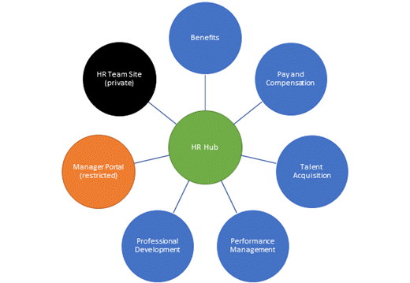

# Information architecture in modern SharePoint

Having a solid information architecture is an important prerequisite for realizing a well-maintained and well-performing portal. A good information architecture helps people find what they need and accomplish the tasks they want to complete – in a way that makes sense to them. Information architecture includes how you will organize and label your content and how your visitors will interact with the content to get work done.

A great information architecture helps improve user adoption, satisfaction and productivity, reduce IT cost, reduce information overload, and minimize compliance and bad information risk.

Designing the optimal structure requires good planning. It requires knowledge of the domain or content to be modeled, understanding the user and user experiences, and awareness of approaches and best practices in SharePoint. Even with a good plan, information architecture is a continuous process. Over time, organizations change, people change, and projects change. Plus, the more you learn about your users, the more discoverable you can make your content.

## Understand your users

The most important step in planning an effective information architecture is understanding your users:

- Who are your users? What key roles do they have?
- What vocabulary to they have? What terms do they use to look for content?
- What do they want to learn?
- What do they want to do? What are their top task?

## Understand your content

In addition to understanding your users and their experiences, you also need to understand your content. Think about how content is distributed across current intranet sites, libraries, and folders. Look at usage data to understand what content is accessed most and least frequently. Think about the categories of information in your organization, such as services, products, areas of expertise, and functions. Don’t just think about the organization chart. Think about the information people need in their daily work and the key business outcomes you want to achieve.

Use this information, and your knowledge of your users, to organize groups of related information, such as key business processes, major projects or initiatives, key business roles, key tasks or services, as well as organizational units.

## Understand your scope

Your information architecture includes four primary elements:

- Navigational/Site Architecture – how you will structure your sites so that users can find content.
- Page Architecture – how content will be organized on each page so that users can further navigate or consume content effectively.
- Metadata Architecture – how you will structure and label your individual content items for browsing and searching as well as compliance and retention.
- Search Experiences – how your users will “consume” your information architecture in addition to browsing.

## Guiding principle – the world is flat

Classic SharePoint architecture is typically built using a hierarchical system of site collections and sub-sites, with inherited navigation, permissions, and site designs. Once built, this structure can be inflexible and difficult to maintain. In the modern SharePoint experience, sub-sites are not recommended. In the new “flat” world of modern SharePoint, plan to create one site for each discrete topic or unit of work. This will allow you to easily distribute the management and accountability for each content collection and support your ability to move sites around in your navigational architecture without breaking links. Moreover, when a topic is no longer needed, you can easily archive or delete a site with minimal impact.

In the new flat world, you have several ways to connect sites and content to each another as part of your information architecture toolkit:

- Use “roll up” web parts such as [News](https://support.office.com/article/use-the-news-web-part-on-a-sharepoint-page-c2dcee50-f5d7-434b-8cb9-a7feefd9f165) or [Highlighted Content](https://support.office.com/article/use-the-highlighted-content-web-part-e34199b0-ff1a-47fb-8f4d-dbcaed329efd) or [Sites](https://support.office.com/article/use-the-sites-web-part-93cbd17b-0bf8-4355-9f32-cc90e0443e6d) to dynamically surface content from other sites in an existing site.
- Use inline hyperlinks to provide additional detail about a topic to provide more information to your reader (as demonstrated in the previous bullet).
- Add explicit links to related sites in your site navigation.
- Connect families of related sites using hubs.

## Navigation architecture

The most effective SharePoint sites (and web sites in general) help visitors find what they need quickly so that they can use the information they find to make decisions, learn about what is going on, access the tools they need, or engage with colleagues to help solve a problem. The fundamental principles and good practices for site and page navigation are equally applicable to both classic and modern SharePoint architectures. However, your options for *implementing* navigation differs based on the framework for your sites and intranet. For example, the “inherited” navigation experiences available in classic SharePoint site hierarchies (sites with subsites) are not available in the modern experience, but hubs can provide a great way to achieve the cross-site navigation features previously available in managed navigation and site hierarchies in classic SharePoint.

No matter which framework you are using, to help make good decisions for navigation, use the guidance in [Plan navigation in the modern experience](https://docs.microsoft.com/sharepoint/plan-navigation-modern-experience).

### Hubs

A hub is a special capability that a SharePoint Administrator can add to a site that designates a site as the “head” of a family of related sites. Sites that are associated to the hub share navigation, branding, and other elements.

Each site can belong to only one hub at a time, but you can associate hubs together in a combination of navigation links and associated hubs as part of your navigation experience. Using hubs is far more flexible and adaptive to the changing needs of your organization. For more info, see [Planning your SharePoint hubs](https://docs.microsoft.com/sharepoint/planning-hub-sites)

## Home site

A home site is a [communication site](https://support.office.com/article/what-is-a-sharepoint-communication-site-94a33429-e580-45c3-a090-5512a8070732?ui=en-US&rs=en-001&ad=US) that you create and set as the top landing page for all users in your intranet. It brings together news, events, embedded video and conversations, and other resources to deliver an engaging experience that reflects your organization's voice, priorities, and brand. For more info, see [Set up a home site for your organization](https://docs.microsoft.com/sharepoint/home-site).

## Page architecture

Every page in each site tells a story for the reader. For each page, you need to think about who is reading the page and what they want to accomplish or learn. It’s not just about the story you want to *tell*, it’s also about the story your visitor wants to *read*.

Your site will generally include three types of pages:

- The **home page** where you will provide an overview of your content and introduce the reader to what they will find on the site.
- **Navigation pages** that provide options or summary information for the reader and help them get to a decision point about where they want to go next.
- **Destination pages** that are the end point of the reader’s journey. This is where you will present information to read, print, or download. If you have a lot of information on your destination page or you want to provide supplemental explanations for detailed topics, you can create an ancillary page.

Because we know that most readers do not read every word on a web page or even scroll to the bottom, you need to pay attention to how you present information on each and every page. Make sure that you put the most important information – the information that your readers must have for your communication to be successful – at the top of the page. As the page continues, you can add additional information that is helpful, but not crucial. Think of this as writing with your summary or conclusion up front, instead of at the end. Use sections, headings, and bullets to make your pages easier to read. For more info, see [Add sections and columns on SharePoint modern page](https://support.microsoft.com/office/add-sections-and-columns-on-a-sharepoint-modern-page-fc491eb4-f733-4825-8fe2-e1ed80bd0899?ui=en-us&rs=en-us&ad=us).

## Metadata architecture

[Columns](https://support.office.com/article/List-and-library-column-types-and-options-0d8ddb7b-7dc7-414d-a283-ee9dca891df7) and [content types](https://support.office.com/article/Use-content-types-to-manage-content-consistently-on-a-site-48512BCB-6527-480B-B096-C03B7EC1D978) are the two most important metadata elements that you can use to organize documents and pages in your SharePoint site. Metadata helps your users filter and sort content within a list or library – but also helps with search. Use columns in your Site Pages library as well so that you can use highlighted content web parts to dynamically connect related pages based on shared metadata.

Folders are another way to organize document content, but folders are a physical construct with limited flexibility. Folders are not necessarily bad – they can help you manage performance and security in your document libraries – but folder structures with more than one or two levels of nesting create a significant discoverability burden for users and should be avoided. Every site comes with one document library – but you are not limited to just one library. Instead of using the one default Documents library on your intranet sites, consider adding topic-specific libraries and add site columns to organize your content within the libraries to avoid creating multiple levels of nested folders.

## Plan search experiences

Search leverages your information architecture investments to help users find content when they don’t know where it might be in your architecture. It also helps users discover content that they may not have known about.

You can help users discover content and improve search outcomes by leveraging several features in search, including acronyms, bookmarks, Q&A, floor plans, and locations. For more info, see [Make content easy to find](https://docs.microsoft.com/en-us/microsoftsearch/make-content-easy-to-find) and [Search experiences in SharePoint](https://docs.microsoft.com/sharepoint/get-started-with-modern-search-experience).
