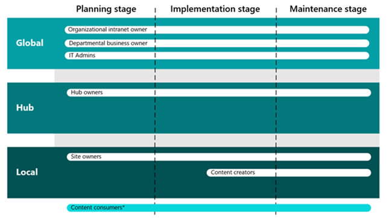
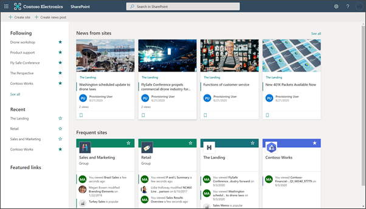
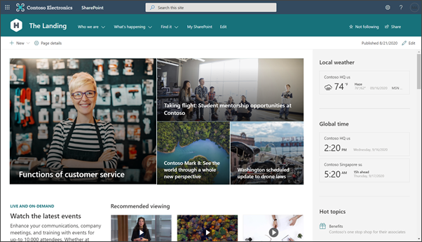
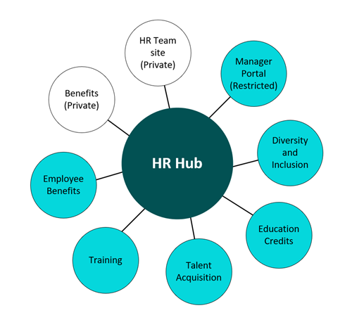
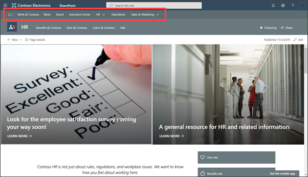
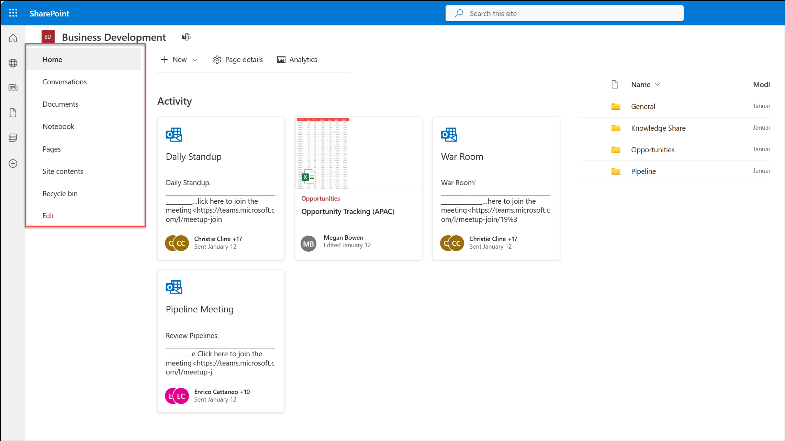
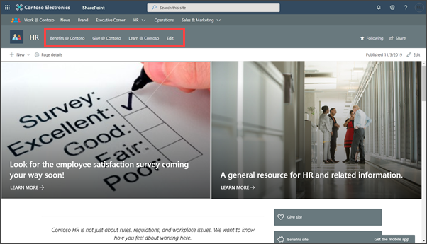
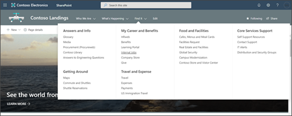
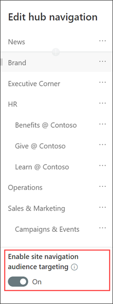

# Introduction to SharePoint information architecture

Well-planned and executed information architecture is a prerequisite for an intelligent and high-performing intranet, hub, or site. The most important first step in planning an effective information architecture is understanding your users and helping them find what they need to complete tasks in a way that makes the most sense to them. 

Information architecture also helps improve user adoption, satisfaction, and productivity while reducing IT costs, information overload, and minimize compliance and security risks. 

**In this article:**

- [Learn the main elements of information architecture](#information-architecture-elements-in-sharepoint)
- [Review the different roles involved in implementing information architecture](#understand-your-role-and-how-to-collaborate)
- [Understand the different levels of information architecture – global, hub, and local](#guiding-principle-the-world-is-flat)
- [Explore SharePoint information architecture building blocks](#navigational-elements)

## Information architecture elements in SharePoint

Information architecture is about how you organize and label your content and how your visitors interact with the content to get work done. This includes elements like navigation, search, site hierarchy, taxonomy, and security. Modern SharePoint information architecture is also about how to ensure the right content gets to the right people and follows your organization’s content compliance regulations. 

Information architecture covers 6 main elements that relate to way finding in SharePoint:

- **Global navigational structure** – Considered the top level of navigation across your SharePoint tenant and how you structure your sites so that users can find content including the [home site](https://docs.microsoft.com/sharepoint/home-site) of your intranet.
- **Hub structure and organization** – [Hubs](https://support.microsoft.com/office/what-is-a-sharepoint-hub-site-fe26ae84-14b7-45b6-a6d1-948b3966427f) enable you to group together similar topics, tasks, and content.
- **Local site and page navigational structure** – How content is organized on each site and page so that users can further navigate or consume content effectively.
- **Metadata architecture** – [Metadata](https://docs.microsoft.com/sharepoint/managed-metadata) impacts search and browsing structure as well as compliance and retention policies.
- **Search experiences** – How your users “consume” information architecture in addition to browsing.
- **Personalized content experiences** – How specific content is targeted to certain users and groups of users.

Designing the optimal structure for hubs, sites, and pages requires sufficient planning. It also requires knowledge of the domain, content, understanding the user experience, awareness of design approaches, and best practices in Microsoft SharePoint. Even with a good plan, information architecture is a continuous process. Over time, organizations change, people change, and projects change. Over time you will learn about your users, which will allow for adjustment that make content more discoverable.

## Understand your role and how to collaborate 

Information architecture for your organization will be the most effective by collaborating with many types of roles involved in your intranet such as: intranet owners, departmental business owners, IT administrators, and hub owners just to name a few. Learn more about how each role plays a part in planning, implementing, and managing ongoing maintenance for organizational information architecture. 

**Organization intranet owner(s)** – The organizational intranet owner(s) consist of a mix of decision-makers and job functions to manage the overall direction and coordination of your organization's intranet. Organizational intranet owners work with business owners (departments) and IT admins to establish global and hub level navigation. Organizational intranet owners will spend most of their time working on planning and implementing global and hub level navigation.

**Departmental business owners** – Departmental business owners represent large areas of the organization, like human resources, marketing, and engineering. Departmental business owners work with organizational intranet owners to ensure their area of the business is well-represented in global and hub navigation. Organizational intranet owners should be included early in the planning stage to ensure business and user needs are met. 

**IT Admins** – IT admins partner with organizational intranet owners and departmental business owners to implement high level navigational structure like implementing the [start page](https://support.microsoft.com/office/discover-content-with-the-sharepoint-start-page-6b85097a-87e0-4611-a29a-dfd49b1a1220) and [hubs](https://docs.microsoft.com/sharepoint/create-hub-site). IT admins also help implement certain governance policies around [site creation and usage](https://docs.microsoft.com/sharepoint/sites-usage-guidelines). IT admins are involved in planning, implementing, and maintaining information architecture as the business changes and scales. 
Hub owners – Hub owners manage hub-level content, branding, permissions, and navigational elements for hub in your organization’s intranet. Hub owners partner with departmental business owners and IT admins to [plan](https://docs.microsoft.com/sharepoint/planning-hub-sites), create, and manage hubs throughout the lifecycle of your organization’s intranet architecture. 

**Site owners** – Site owners manage site-level content, branding, permissions, and navigation. Depending on the needs of the business and users, site owners can [associate their sites to hubs](https://support.microsoft.com/office/associate-a-sharepoint-site-with-a-hub-site-ae0009fd-af04-4d3d-917d-88edb43efc05) if the hub owner allows. 

**Content creators** – Content creators are responsible for keeping site content updated and [publishing news](https://support.microsoft.com/office/create-and-share-news-on-your-sharepoint-sites-495f8f1a-3bef-4045-b33a-55e5abe7aed7). Content creators should be given a site member permission level to make changes to sites and pages. Content creators partner with site owners during the implementation and management stages. 

**Content consumers** – Content consumers are not represented in the counts as anyone who is using and viewing content throughout the three levels of navigation. Intranet owners, departmental business owners, hub owners, and site owners should regularly engage with content consumer – especially during the planning process – to ensure the right content is findable and usable.  

## Guiding principle: the world is flat

Classic SharePoint architecture is typically built using a hierarchical system of site collections and sub-sites, with inherited navigation, permissions, and site designs. Once built, this structure can be inflexible and difficult to maintain. 
In the modern SharePoint experience, sub-sites are not recommended. In the new “flat” world of modern SharePoint, plan to create one site for each discrete topic, task, or unit of work. This will allow you to easily distribute management and accountability for each content collection and support your ability to move sites around in your navigational architecture without breaking links. Moreover, when a topic is no longer needed, you can easily archive or delete a site with minimal impact. 

In the new flat world, you have several ways to connect sites and content to each other as part of your information architecture toolkit:

- Use “roll up” web parts such as [News](https://support.office.com/article/use-the-news-web-part-on-a-sharepoint-page-c2dcee50-f5d7-434b-8cb9-a7feefd9f165), [Highlighted content](https://support.office.com/article/use-the-highlighted-content-web-part-e34199b0-ff1a-47fb-8f4d-dbcaed329efd), or [Sites](https://support.office.com/article/use-the-sites-web-part-93cbd17b-0bf8-4355-9f32-cc90e0443e6d) to dynamically surface content from other sites in an existing site.
- Use [inline hyperlinks](https://support.microsoft.com/office/add-text-and-tables-to-your-page-with-the-text-web-part-729c0aa1-bc0d-41e3-9cde-c60533f2c801) to provide additional detail about a topic to provide more information to your reader (as demonstrated in the previous bullet).
- Add explicit links to related sites in your [site navigation](https://support.microsoft.com/office/customize-the-navigation-on-your-sharepoint-site-3cd61ae7-a9ed-4e1e-bf6d-4655f0bf25ca).
- Connect families of related sites using [hubs](https://support.microsoft.com/office/what-is-a-sharepoint-hub-site-fe26ae84-14b7-45b6-a6d1-948b3966427f).

## Levels of navigation

There are three levels of navigation to think about for modern SharePoint experiences:

- Global navigation for the entire collection of sites that comprise your intranet
- Hub navigation for groups of related sites
- Local navigation of an individual site

### Global navigation

Many intranets include top navigation that persists on every site. Global navigation allows you to create an overall navigation story for your intranet that visually connects all the sites, content, and tools your viewers need to get work done. Every organization has a different requirement for what goes in global navigation, but some of the category labels often used include concepts such as:

- Home
- About Us
- News
- Working Here/Work Resources/Administrative Services/Administration
- Operations/Operations Services
- Pay & Benefits
- Life & Career
- Locations
- Policies & Procedures/Tools & Resources/Safety & Security

The goal of global navigation is to support browsing to content, but since there is limited real estate available for global navigation links, global links generally point to major category navigation pages, sub-links, or a mega menu experience to provide enough "information scent" to help viewers navigate their way to the content they need. Because the context for global navigation must be broad, it is challenging to make the labels both comprehensive and useful. If you plan to implement global navigation, consider using one of the testing methods discussed earlier to make sure that your proposed navigation resonates with users.

Global navigation is not yet available for modern SharePoint intranets. Until it is available, there are several ways to create a global navigation experience for your modern SharePoint intranet:

- Create a custom [SharePoint Framework Extension](https://docs.microsoft.com/sharepoint/dev/spfx/sharepoint-framework-overview) to deliver and apply global navigation to each new site as it is created.
- Create a "navigation" site (for example, your intranet "home" site) and use the logo in the suite bar and a Featured Site link on the SharePoint start page to make it easy for people to navigate to the "home" site from every destination site in your tenant.
- Use a single hub for the entire organization. This might be a reasonable strategy for a small organization, but the benefits of hubs decrease in value if you only have one so this may not work for the long term.
- Wait to add global navigation until it is available natively in the product.

Where you’ll see global navigation elements:

#### The start page

The SharePoint [start page](https://support.microsoft.com/office/discover-content-with-the-sharepoint-start-page-6b85097a-87e0-4611-a29a-dfd49b1a1220) is where you can easily find and access SharePoint sites and portals within your organization. This is the first opportunity users will have to start discovering news, sites, and easily navigate to the top of your intranet by selecting the logo.

#### The home site

A [home site](https://docs.microsoft.com/sharepoint/home-site) is a SharePoint communication site that you create and set as the top landing page for all users in your intranet. It brings together news, events, embedded video and conversations, and other resources to deliver an engaging experience that reflects your organization's voice, priorities, and brand. This is a good place to display entry points to frequently accessed resources for human relations, information technology, departmental portals, and organizational news.

### Hub navigation

The default navigation experiences available in classic SharePoint site hierarchies (sites with subsites) are not available in the "flat" world of modern SharePoint, where each unit of work or project or team gets its own site collection. Flat architectures are great for governance but can make it harder to implement navigation that connects multiple sites.

[Hubs](https://support.office.com/article/fe26ae84-14b7-45b6-a6d1-948b3966427f) provide a great way to achieve the cross-site navigation features previously available in managed navigation and site hierarchies in classic SharePoint. One of the important planning decisions for hubs is [planning the hub navigation](https://docs.microsoft.com/sharepoint/planning-hub-sites).

Hub navigation appears above the local navigation on each site, just below the suite bar, as shown in the image earlier in this article. Hub navigation is established in the site that is declared to be the hub. It is defined by the hub owner and is shared by all the associated sites.

Where you’ll see hub navigation elements:

SharePoint [hubs](https://support.microsoft.com/office/what-is-a-sharepoint-hub-site-fe26ae84-14b7-45b6-a6d1-948b3966427f) help you meet the needs of your organization by connecting and organizing sites based on project, department, division, region, etc. making it easier to discover related content such as news and other site activities, apply common navigation, branding, site structure across associated sites and search across all [associated sites](https://support.microsoft.com/office/associate-a-sharepoint-site-with-a-hub-site-ae0009fd-af04-4d3d-917d-88edb43efc05).

A hub is a special capability that a SharePoint Administrator can add to a site that designates a site as the “head” of a family of related sites. Sites that are associated to the hub share navigation, branding, and other elements.

Each site can belong to only one hub at a time, but you can associate hubs together in a combination of navigation links and associated hubs as part of your navigation experience. Using hubs is far more flexible and adaptive to the changing needs of your organization. For more info, see [Planning your SharePoint hubs](https://docs.microsoft.com/sharepoint/planning-hub-sites).

### Local navigation

Local navigation is the static navigation that viewers see on every page of your site. For team sites, local navigation shows up on the left side of the page in the area referred to as the "quick launch". For communication sites, local navigation shows up at the top of the page. Local navigation is on every page in your site – so make sure it is relevant. Think about how viewers might explore your content and use local navigation to support that exploration. 

Example: A travel site might have the following local navigation links that support viewers who are exploring the travel site from the perspective of "what am I allowed to do?" as well as viewers who are exploring the travel site from the perspective of the travel process – before, during, and after their trip.
- Travel guidelines
  - Air
  - Car
  - Ground transportation
  - Hotel
  - Train
- Before you go
  - Travel approval
  - Booking service
- During your trip
  - Travel safety
  - Itinerary changes
- After you return
  - Expense reporting
  - Trip reports

Where you’ll see local navigation elements:

**Team site navigation**

**Communication site navigation**

### Sites

Your intranet and portals will be comprised of [team sites](https://support.microsoft.com/office/what-is-a-sharepoint-team-site-75545757-36c3-46a7-beed-0aaa74f0401e) and [communication sites](https://support.microsoft.com/office/what-is-a-sharepoint-communication-site-94a33429-e580-45c3-a090-5512a8070732) that will provide further access into the site’s pages, lists, and libraries. Every page in each site tells a story for the reader. 

One component to modern SharePoint team sites that makes information architecture easier to implement and maintain are [Microsoft 365 groups](https://docs.microsoft.com/microsoft-365/admin/create-groups/office-365-groups). M365 groups is a membership service that allows for easy hub and site permissions as well as additional functionality for SharePoint team sites and [Microsoft Teams](https://docs.microsoft.com/microsoftteams/office-365-groups). With Microsoft 365 groups, you can give a group of people access to a collection of collaboration resources like Planner, OneNote, SharePoint team sites, and more. M365 groups can only be used on SharePoint team sites.

### Pages

[Pages](https://support.microsoft.com/office/create-and-use-modern-pages-on-a-sharepoint-site-b3d46deb-27a6-4b1e-87b8-df851e503dec) within team or communication sites provide an opportunity to use dynamic web parts that automatically update content from other sites and pages like [News](https://support.office.com/article/use-the-news-web-part-on-a-sharepoint-page-c2dcee50-f5d7-434b-8cb9-a7feefd9f165), [Highlighted content](https://support.office.com/article/use-the-highlighted-content-web-part-e34199b0-ff1a-47fb-8f4d-dbcaed329efd), or [Sites web parts](https://support.office.com/article/use-the-sites-web-part-93cbd17b-0bf8-4355-9f32-cc90e0443e6d).

Your sites will generally include three types of pages:

- The **home page** where you will provide an overview of your content and introduce the reader to what they will find on the site.
- Navigation pages that provide options or summary information for the reader and help them get to a decision point about where they want to go next.
- **Destination pages** that are the end point of the reader’s journey. This is where you will present information to read, print, or download. If you have a lot of information on your destination page or you want to provide supplemental explanations for detailed topics, you can create an ancillary page.

Since we know that most readers do not read every word on a web page or even scroll to the bottom, you need to pay attention to how you present information on each page. Make sure that you put the most important information – the information that your readers must have for your communication to be successful – at the top of the page. As the page continues, you can add additional information that is helpful, but not crucial. Think of this as writing with your summary or conclusion up front, instead of at the end. Use sections, headings, and bullets to make your pages easier to read. For more info, see [Add sections and columns on SharePoint modern page](https://support.microsoft.com/office/fc491eb4-f733-4825-8fe2-e1ed80bd0899).

## Navigational elements

[Navigational elements](https://support.microsoft.com/office/customize-the-navigation-on-your-sharepoint-site-3cd61ae7-a9ed-4e1e-bf6d-4655f0bf25ca) are menu styles like the mega menu, cascade menu, and footer menus. Secondary navigational elements include [inline links](https://support.microsoft.com/office/add-text-and-tables-to-your-page-with-the-text-web-part-729c0aa1-bc0d-41e3-9cde-c60533f2c801) and [buttons](https://support.microsoft.com/office/use-the-button-web-part-d2e37c48-11e8-45b9-8d9e-abdaa97c2a7a).

### Personalization elements

[Audience targeting](https://support.microsoft.com/office/overview-of-audience-targeting-in-modern-sharepoint-sites-68113d1b-be99-4d4c-a61c-73b087f48a81) - Audience targeting helps the most relevant content get to the right audiences. By enabling audience targeting, specific content will be prioritized to specific audiences through SharePoint web parts, page libraries, and navigational links.

[Information barriers](https://docs.microsoft.com/sharepoint/information-barriers) - Information barriers are policies in Microsoft 365 that a compliance admin can configure to prevent users from communicating and collaborating with each other. This is useful if, for example, one division is handling information that shouldn't be shared with specific other divisions, or a division needs to be prevented, or isolated, from collaborating with all users outside of the division. Information barriers are often used in highly regulated industries and those with compliance requirements, such as finance, legal, and government.

[Multilingual considerations](https://support.microsoft.com/office/create-multilingual-communication-sites-pages-and-news-2bb7d610-5453-41c6-a0e8-6f40b3ed750c) - If your organization spans a diverse population, you may want to make content in your intranet sites available in multiple languages. User interface elements like site navigation, site title, and site description can be shown in the user's preferred language. Additionally, you can provide pages and news posts on communication sites that you translate and that are shown in the user's preferred language.

To show the site name, navigation, and footer of your site in the different languages you've made available, each must be translated manually.
For example, let's say you've created a communication site with an English default language, and you've enabled the site for Spanish and German languages. When you create a site, you set up the site name and description in the default language (in this case, English). You can also update the site name and description after site creation. Then you create the navigation nodes and footer content in English.

After the site is set up in English, a user with Spanish as their preferred personal language manually edits and translates the title, description, navigation and footer content into Spanish. A user with German as their preferred personal language does the same for German. Once the content is translated, it will display for all users of those preferred languages.

### Metadata architecture

[Columns](https://support.office.com/article/List-and-library-column-types-and-options-0d8ddb7b-7dc7-414d-a283-ee9dca891df7) and [content types](https://support.office.com/article/Use-content-types-to-manage-content-consistently-on-a-site-48512BCB-6527-480B-B096-C03B7EC1D978) are the two most important metadata elements that you can use to organize documents and pages in your SharePoint site. Metadata helps your users filter and sort content within a list or library – but also helps with search. Use columns in your Site Pages library as well so that you can use highlighted content web parts to dynamically connect related pages based on shared metadata.

Folders are another way to organize document content, but folders are a physical construct with limited flexibility. Folders are not necessarily bad – they can help you manage performance and security in your document libraries – but folder structures with more than one or two levels of nesting create a significant discoverability burden for users and should be avoided. Every site comes with one document library – but you are not limited to just one library. Instead of using the one default Documents library on your intranet sites, consider adding topic-specific libraries and add site columns to organize your content within the libraries to avoid creating multiple levels of nested folders.

### Search experiences

Search leverages your information architecture investments to help users find content when they don’t know where it might be in your architecture. It also helps users discover content that they may not have known about.

You can help users discover content and improve search outcomes by leveraging several features in search, including acronyms, bookmarks, Q&A, floor plans, and locations. For more info, see [Make content easy to find](https://docs.microsoft.com/microsoftsearch/make-content-easy-to-find) and [Search experiences in SharePoint](https://docs.microsoft.com/sharepoint/get-started-with-modern-search-experience).

[**Next: learn about SharePoint information architecture principals**](information-architecture-principles.md)
