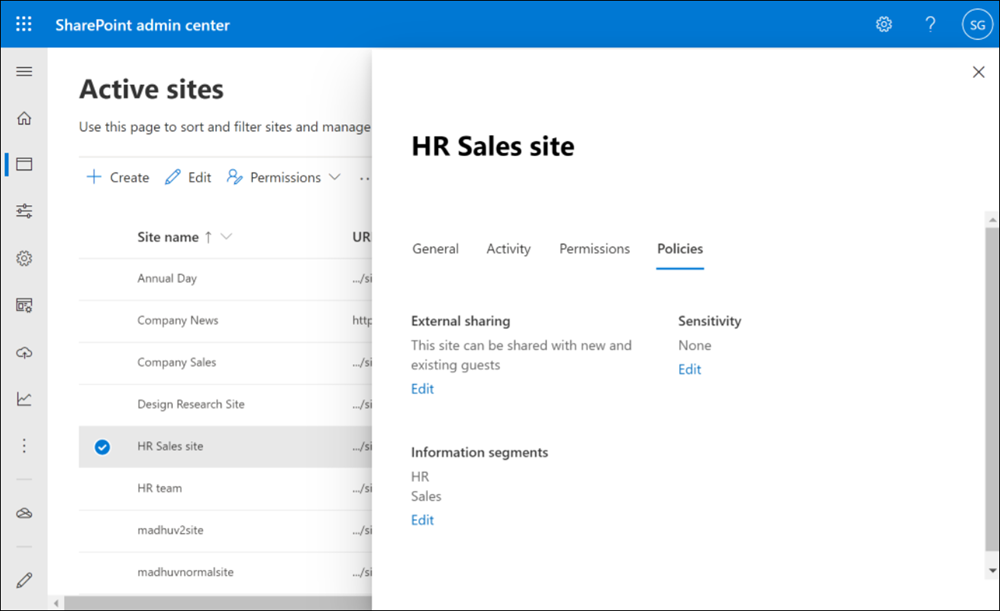

# Use information barriers with SharePoint

Information barriers are policies in Microsoft 365 that a compliance admin can configure to prevent users from communicating and collaborating with each other. This solution is useful if, for example, one division is handling information that shouldn't be shared with specific other divisions, or a division needs to be prevented, or isolated, from collaborating with all users outside of the division. Information barriers are often used in highly regulated industries and those organizations with compliance requirements, such as finance, legal, and government. [Learn more about information barriers](/microsoft-365/compliance/information-barriers).

The following image illustrates three segments in an organization: HR, Sales, and Research. An information barrier policy has been defined that blocks communication and collaboration between the Sales and Research segments. These segments are incompatible.


With SharePoint information barriers, a SharePoint or global admin can associate segments to a site to prevent the site from being shared with or accessed by users outside the segments. Up to 100 compatible segments can be associated with a site. The segments are associated at the site level (previously called site collection level). The Microsoft 365 group connected to the site is also associated with the site's segment.

In the above example, the HR segment is compatible with both Sales and Research. However, because the Sales and Research segments are incompatible, they can't be associated with the same site.

## Prerequisites

- [Make sure you meet the licensing requirements for information barriers](/office365/servicedescriptions/microsoft-365-service-descriptions/microsoft-365-tenantlevel-services-licensing-guidance/microsoft-365-security-compliance-licensing-guidance#information-barriers).
- Create segments and define the users in each. Create policies that allow or block communication between the segments, and then set them to active. For info, see [Define policies for information barriers](/office365/securitycompliance/information-barriers-policies).
- After you've set your information barrier policies to active, wait 24 hours for the changes to propagate through your environment.
- [Complete the form](https://forms.microsoft.com/Pages/ResponsePage.aspx?id=v4j5cvGGr0GRqy180BHbR_mCQfArPllNo4NRhexFZxRUNEZCTTZLVVJHOEJOVVlCTUdJNDVERko5Qy4u) to enable SharePoint and OneDrive information barriers in your organization.

## View and manage segments as an administrator

An SharePoint Administrator or Global Administrator can view and manage segments on a SharePoint site as follows:

### 1. Use the SharePoint admin center to view and manage information segments

To view, edit, or remove information segments for a site, use the [Active sites page of the new SharePoint admin center](https://admin.microsoft.com/sharepoint?page=siteManagement&modern=true).  

The Segments column lists the first segment associated with the site and shows whether the site has additional segments associated. [Learn how to show or move this column](manage-sites-in-new-admin-center.md#customize-columns)


To view the complete list of segments associated with a site, select the site, and then select the **Policies** tab.



To edit the segments associated with the site, select **Edit**, add or remove segments, and then select **Save**.


### 2. Use SharePoint PowerShell to view and manage information segments on a site

1. Connect to the [Security & Compliance Center PowerShell](/powershell/exchange/office-365-scc/connect-to-scc-powershell/connect-to-scc-powershell) as a global admin.

2. Run the following command to get the list of segments and their GUIDs.

    ```PowerShell
    Get-OrganizationSegment | ft Name, EXOSegmentID
    ```

3. Save the list of segments.

    |Name  |EXOSegmentId  |
    |---------|---------|
    |Sales     |  a9592060-c856-4301-b60f-bf9a04990d4d       |
    |Research     |     27d20a85-1c1b-4af2-bf45-a41093b5d111    |
    |HR     |      a17efb47-e3c9-4d85-a188-1cd59c83de32   |

4. [Download the latest SharePoint Online Management Shell](https://go.microsoft.com/fwlink/p/?LinkId=255251).

    > [!NOTE]
    > If you installed a previous version of the SharePoint Online Management Shell, go to Add or remove programs and uninstall "SharePoint Online Management Shell". <br>On the Download Center page, select your language and then click the Download button. You'll be asked to choose between downloading a x64 and x86 .msi file. Download the x64 file if you're running the 64-bit version of Windows or the x86 file if you're running the 32-bit version. If you don't know, see [Which version of Windows operating system am I running?](https://support.microsoft.com/help/13443/windows-which-operating-system). After the file downloads, run it and follow the steps in the Setup Wizard.

5. Connect to SharePoint Online as a [global admin or SharePoint admin](/sharepoint/sharepoint-admin-role) in Microsoft 365. To learn how, see [Getting started with SharePoint Online Management Shell](/powershell/sharepoint/sharepoint-online/connect-sharepoint-online).

6. Run the following command:

      ```PowerShell
      Set-Sposite -Identity <site URL> -AddInformationSegment <segment GUID>
      ```

    Example:
    Set-SPOSite -Identity https:<i></i>//contoso<i></i>.sharepoint<i></i>.com/sites/ResearchTeamSite
-AddInformationSegment 27d20a85-1c1b-4af2-bf45-a41093b5d111

An error will appear if you attempt to associate a segment that isn't compatible with the site's existing segments.

To remove segment from a site, run the following command.  

```PowerShell
Set-Sposite -Identity <site URL> -RemoveInformationSegment <segment GUID>
 ```

Example: Set-SPOSite -Identity https:<i></i>//contoso<i></i>.sharepoint<i></i>.com/sites/ResearchTeamSite  
-RemoveInformationSegment 27d20a85-1c1b-4af2-bf45-a41093b5d111

To view the segments of a site, run the following command to return the GUIDs of any segments associated with the site.

```PowerShell
Get-SPOSite -Identity <site URL> | Select InformationSegment
```

### 3. Use the SharePoint REST API to view and manage information segments on a site

SharePoint includes a Representational State Transfer (REST) service that you can use to manage segments on a site. To access SharePoint resources and manage site segments using REST, you'll construct a RESTful HTTP request by using the OData standard, which corresponds to the desired client object model application programming interface (API).

For more information about the SharePoint REST service, see [Get to know the SharePoint REST service](/sharepoint/dev/sp-add-ins/get-to-know-the-sharepoint-rest-service).

## Auditing

After you enable information barriers for SharePoint, audit events are available in the Office 365 audit log to help you monitor information barrier SharePoint activities. Audit events are logged whenever the following activities occur:

- Segments are added to a site
- Segments are changed on a site
- Segments are removed from a site

For more information about SharePoint segment auditing in Office 365, see [Search the audit log in the compliance center](/microsoft-365/compliance/search-the-audit-log-in-security-and-compliance#information-barriers-activities).

## Site creation and management by site owners

When a segmented user creates a SharePoint site, the site will get associated with the user's segment.

In addition, the site owners will have the capability to add more segments to a SharePoint site already has segments. Site owners cannot remove added segments from sites. SharePoint admins will have to remove added segments in your organization if needed.

To help site owners add a segment to a site, share the [Associate information segments with SharePoint sites](https://support.microsoft.com/office/associate-information-segments-with-sharepoint-sites-2b03db07-6d3f-4297-a388-b943317a26a7) article with your SharePoint site owners.

## Segments associated with Microsoft Teams sites

When a team is created in Microsoft Teams, a SharePoint site is automatically created for the team's files. Within 24 hours, the segments associated with the team's members are automatically associated with the site. SharePoint admins can't change the segments associated with a site when the site is connected to a team. [Learn more about information barriers in Teams](/microsoftteams/information-barriers-in-teams).

## Sharing sites that have segments associated

When a segment is associated with a site:

- The option to share with "Anyone with the link" is disabled.
- The site and its content can be shared only with users whose segment matches that of the site. For example, if a site is associated with only HR, the site can be shared with other HR users only (even though HR is compatible with both Sales and Research).
- New users can be added to the site as site members only if their segment matches that of the site.

When a site has no segments associated:

- The site and its contents can be shared based on the information barrier policy applied to the user. For example, if a user in HR is allowed to communicate with users in Research, the user will be able to share the site with those users.

## Access to sites that have segments associated

For a user to access SharePoint sites that have segments associated:

- The user's segment must match a segment that is associated with the site.

    AND

- The user must have access permission to the site.  

Non-segment users can't access a site that is associated with segments. They will see an error.

## Search

Users will see search results from:

- Sites that have an associated segment that matches the user's segment and the user has access permission to the site.
- Sites that don't have associated segments if they have access to the site.

## Effects of changes to user segments or information barrier policies

If a SharePoint site owner's segment changes, the user won't be able to access the site if their segment doesn't match any of the segments associated with the site. To allow the user to access the site, a SharePoint admin must associate the user's new segment with the site.

If a compliance administrator changes an existing policy, the change may impact the compatibility of the segments associated with a site. For example, segments that were once compatible may no longer be compatible. A SharePoint admin must change the segments associated with an affected site accordingly. [Learn how to create an information barriers policy compliance report in PowerShell](info-barriers-report.md)

Any sharing links will only work if a user's new segment or the new information barrier policy still allows the user to access the site.

## See also

[Information barriers in OneDrive](/onedrive/information-barriers)
