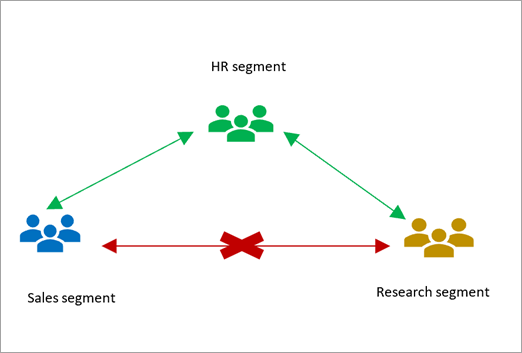

# Use information barriers with SharePoint

Information barriers are policies in Microsoft 365 that an admin can configure to prevent users from communicating and collaborating with each other. This is useful if, for example, one department is handling information that shouldn't be shared with specific other departments or a group needs to be prevented, or isolated, from collaborating with all users outside of that group. Information barriers are often used in highly regulated industries and those with compliance requirements. [Learn more about information barriers](/microsoft-365/compliance/information-barriers).

The following image illustrates three segments in an organization: HR, Sales, and Research. An information barrier policy has been defined that allows Research and Sales to communicate with HR, but not with each other. 



With SharePoint information barriers, a SharePoint or global admin can associate up to 10 segments with any SharePoint site. The segments are associated at the site level (previously called site collection level). Segments can't be associated at the subsite level.

In the above example, Sales and HR are compatible segments, and Research and HR are compatible segments. Because Sales and Research are incompatible, users in Sales will see an Access Denied error if they try to access sites that have the Research segment associated. 

> [!NOTE]
> Associating a segment with a site doesn't grant permission to the site. To access a site, users still need to have access permission to it. 

## Prerequisites

- [Assign users a license that provides the rights to information barriers](/office365/servicedescriptions/microsoft-365-service-descriptions/microsoft-365-tenantlevel-services-licensing-guidance/microsoft-365-security-compliance-licensing-guidance#information-barriers)
- Complete the form to enable information barriers in your organization. 
- Create segments and define the users in each. Create policies that allow or block communication between the segments, and then set them to active. For info, see [Define policies for information barriers](/office365/securitycompliance/information-barriers-policies).

## Use PowerShell to associate segments to a site

1. Connect to the [Security & Compliance Center PowerShell](/powershell/exchange/office-365-scc/connect-to-scc-powershell/connect-to-scc-powershell) as a global admin. 

2.	Run the following command to get the list of segments and their GUIDs.

      ```PowerShell
      Get-OrganizationSegment | ft Name, EXOSegmentID
      ```

3.	Save the list of segments.

    |Name  |EXOSegmentId  |
    |---------|---------|
    |Sales     |  a9592060-c856-4301-b60f-bf9a04990d4d       |
    |Research     |     27d20a85-1c1b-4af2-bf45-a41093b5d111    |
    |HR     |      a17efb47-e3c9-4d85-a188-1cd59c83de32   |

4. [Download the latest SharePoint Online Management Shell](https://go.microsoft.com/fwlink/p/?LinkId=255251).

    > [!NOTE]
    > If you installed a previous version of the SharePoint Online Management Shell, go to Add or remove programs and uninstall "SharePoint Online Management Shell." <br>On the Download Center page, select your language and then click the Download button. You'll be asked to choose between downloading a x64 and x86 .msi file. Download the x64 file if you're running the 64-bit version of Windows or the x86 file if you're running the 32-bit version. If you don't know, see https://support.microsoft.com/help/13443/windows-which-operating-system. After the file downloads, run it and follow the steps in the Setup Wizard. 

5. Connect to SharePoint Online as a [global admin or SharePoint admin](/sharepoint/sharepoint-admin-role) in Microsoft 365. To learn how, see [Getting started with SharePoint Online Management Shell](/powershell/sharepoint/sharepoint-online/connect-sharepoint-online).
    
6. Run the following command:

      ```PowerShell
      Set-Sposite -Identity <site URL> -AddInformationSegment <segment GUID>
      ```

    Example: 
    Set-SPOSite -Identity https://contoso.sharepoint.com/sites/ResearchTeamSite 
-AddInformationSegment 27d20a85-1c1b-4af2-bf45-a41093b5d111

An error will appear if you attempt to associate a segment that isn't compatible with the site’s existing segments. 

> [!NOTE]
> To remove a segment, use the -RemoveInformationSegment parameter.

> [!NOTE]
> When a team is created in Microsoft Teams, a SharePoint site is automatically created for the team's files. Within 24 hours, the segments associated with the team's members are automatically associated with the site. SharePoint admins can't change the segments associated with a site when the site is connected to a team.

## View the segments associated with a site

Run the following command in the SharePoint Online Management Shell to return the GUIDs of any segments associated with a site.

      ```PowerShell
      Get-SPOSite -Identity <site URL> | Select InformationSegment
      ```

## Sharing sites that have segments associated

When a segment is associated with a site:

- The option to share with "Anyone with the link" is disabled.
- The site and its content can be shared only with users whose segment matches that of the site. Users can share with other users in a compatible segment only if that compatible segment is also associated with the site.
- New users can be added to the site as site members only if their segment matches that of the site. 

When a site has no segments associated: 

- The site and its contents can be shared based on the information barriers policy applied to the user. If the user is allowed to communicate and collaborate with another user, the user will be able to share the site with that user.

## Search

Users will see search results from sites:

- That have an associated segment that matches that of the user and the user has access permission to the site. 
- That don't have associated segments if they have access to the site. 

SharePoint site owner’s segment changes: 
If the site owner’s segment is changed, they will not be able to access the SharePoint site if their segment does not match the segments associated with the site. In this case, the SharePoint Admin is advised to update the site accordingly. 

Example: 
In Contoso Corporation, there is an existing site ‘contosobank.sharepoint.com/sites/SalesTeam’ which is associated with segment – Sales. User Enrico (segment – Sales) is the Site owner. 
When compliance admin updates user Enrico’s segment from Sales to Research; user Enrico will no longer be able to access site ‘contosobank.sharepoint.com/sites/SalesTeam’. 

Segment’s policy changes: 
When the information barriers policy administrator makes changes to an existing policy, the change may impact the compatibility of the existing segments in the tenant. As a result, we recommend the SharePoint Admin to update the impacted site’s segments accordingly.
Example: 
In Contoso Corporation, there is an existing site ‘contosobank.sharepoint.com/sites/GlobalFinance’ which
is associated with compatible segments – Sales and HR. 
Few months later, the compliance admin updates the policy of the segment ‘Sales’ due to which Sales is no longer allowed communication and collaboration with HR i.e. segment Sales and HR are not compatible segments anymore. 
In this case, we recommend the SharePoint Admin to update the site – ‘contosobank.sharepoint.com/sites/GlobalFinance’ with the appropriate segment association to make it compliant with the information barrier policy in the tenant. 
In future, we will have a reporting capability using which the SharePoint Admin will be able to see the list of all existing sites which are no longer compatible due to policy changes done by the compliance admin. 

Known End User Experiences

1.	Multi-geo tenant (provide link aka.ms/sharepointmultigeo)

a.	Site geo-move of a segment associated site is currently not supported. 
b.	If your tenant admin needs to geo-move a site, we recommend you to first geo-move the site and then associate segment to it. 

2.	Open SharePoint Site experience: 

More Information: 
•	To learn more about information barriers, see Information barriers.
•	To set up information barrier policies, see Define policies for information barriers.
•	To edit or remove information barrier policies, see Edit (or remove) information barrier policies.
•	Info barriers in Teams https://docs.microsoft.com/en-us/microsoftteams/information-barriers-in-teams 
•	Teams and SharePoint site connected to it https://docs.microsoft.com/en-us/microsoftteams/information-barriers-in-teams#teams-policies-and-sharepoint-sites


