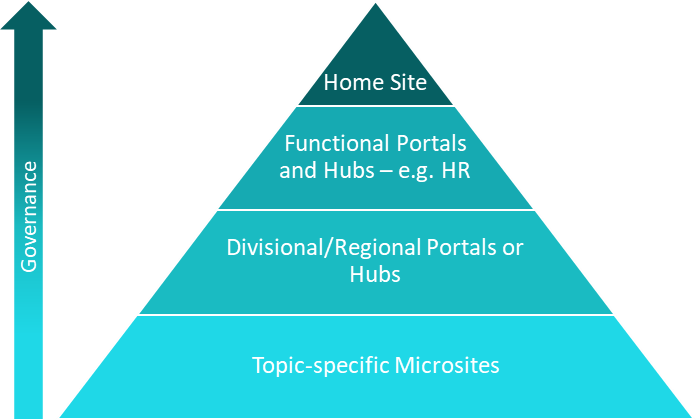

# Planning intranet governance

As you plan your new intranet project, think about how you’ll govern the site architecture and the content. Your intranet governance plan should be created in the context of the overall governance plan for Microsoft 365. As a key business solution in your digital workplace, your intranet will have its own unique governance requirements and expectations, especially because of its organization-wide focus and impact. 

Planning intranet governance should happen during the [envisioning process](https://docs.microsoft.com/sharepoint/intranet-overview#envision) - to ensure that all stakeholders have shared vision and goals. Envisioning is only the beginning. Your intranet governance plan will evolve as your organization evolves and as new capabilities are added to SharePoint and Microsoft 365.

A good governance plan helps define the priorities for the intranet and helps to prevent content sprawl. It also ensures that roles and responsibilities are clearly defined and communicated – and ideally, incorporated into job descriptions or performance goals. One aspect that often separates your intranet from other solutions is the number of people who are involved in creating and maintaining content. To ensure ongoing success, it is important to make sure that each of your intranet stakeholders and users understand their roles and responsibilities.

Intranet governance also includes policies and procedures but it is so much more than that. Intranet governances should include a plan for user training, monitoring usage, user behavior, and communicating expectations to all of the diverse stakeholders involved. This is what makes creating a governance plan document is challenging. It is difficult to create a single document that addresses these multiple audiences and can be communicated in a way that encourages adherence and adoption. 

Instead of creating a document or series of documents, consider creating a resource site  that incorporates training and governance in a single place. Think about how you can combine “how to” (training) with “how should” (governance) so that when your intranet users visit your user resource destination, they understand both “why” and “how” your intranet is designed and governed the way you have implemented. 

You can consider using the [Microsoft 365 Learning Pathways](https://docs.microsoft.com/office365/customlearning/) site as a possible starting point or create your own user resource center that integrates with or complements the Learning Pathways content.

Having an effective governance plan in place enables the decision-making process for the intranet. By reviewing and revising the governance plan regularly, you can help ensure that your intranet remains a critical asset for your organization.

## Governance Team
As a key business asset, intranet governance needs to reflect the goals of business stakeholders and the legal and regulatory environment for your organization – not just the expectations of your IT department. Create a governance team that includes core members from key business stakeholder groups in your organization in addition to IT. 

There is no magic size for the governance team, but it should be small enough to make it easy to make decisions and representative enough to incorporate the “voice of the business” and IT. When you have specific topics to review that extend beyond the expertise of the team, you can bring in outside members (such as Legal or Records Management) to ensure that your decisions are aligned with organizational constraints.

Your governance team may meet on a frequent basis during intranet planning and then less frequently over time. The goal is to establish a rhythm that works for your intranet and team members. Since governance has an ongoing role for your intranet success, the governance team should not be disbanded when you launch.

## Governance Plan Elements
There is no “one size fits all” model when it comes to intranet governance. In fact, your intranet governance plan may be different for different types of content. For example, you may want to have more formal policies and stricter governance guidelines for sites that face the entire organization and less strict policies for content that is more targeted, such as content for an individual department or a one-time event (see Figure 1). The best approach is to look at the different elements and think about what is critical or necessary for your organization. Consider your audience and the culture of your organization to guide your decisions and approach, as well as your overall Microsoft 365 governance expectations.
 

 
*Figure 1. Your governance decisions may be different (and stricter) based on the "reach" of your content.*

At a minimum, consider each of these elements as part of your intranet governance planning effort. 
- Vision
- Policies and guidelines
- Site provisioning and decommissioning
- Information architecture and search
- Branding
- Content management
- Security and information management
- Roles and responsibilities
- Feedback
- Training and support
- Measurement

### Vision
The vision statement describes, at a high level, what you want to want to achieve with your intranet - essentially how the solution delivers value to the organization and to each individual employee. Use the intranet vision statement to guide your governance plan. Be sure that the vision is clear because the degree of formality and the depth to which you need to document the governance plan should align with the outcomes you want to achieve. 

A clear vision statement provides critical guidance to the inevitable decision tradeoffs you will need to make for your governance plan. For example, you probably do not want a completely uncontrolled environment with unstructured and “unfindable” content if your intranet vision is to provide a key source of organizational knowledge and information. In this case, the unstructured environment with no controls is unpredictable and will likely misalign with desired business outcomes. In a different scenario, some users may have a goal to create an experimental place where new site owners can create “practice” sites to try out new skills or test alternative approaches to solve specific business problems. For this use case, an overly restrictive governance plan may not make a lot of sense. You may determine that you don’t want to support an unlimited number of “practice” sites, so you may want a governance policy that says that all “test” sites are deleted after a specific period of time. But, for these practice or test sites, the unstructured environment is fine. You can only know what is level of governance is ideal because you have a clear vision. The vision provides a framework for both the context and your investment in governance. Once you are clear about your intranet vision, your governance team can use that vision to guide the governance decisions.

Your intranet vision includes defining ownership. There is no right answer about which organizational entity should “own” the intranet – and often, intranet ownership is shared by more than one organizational unit. However, most intranet professionals agree that there is one organization that should not be the exclusive intranet owner – IT. IT cannot build an intranet for the business. IT can only build an intranet with the business and with a commitment from the business. Successful intranets have a champion and owner from the business, ideally at an executive level. 

### Policies and guidelines
Policies define the rules and guidelines for your intranet. From a governance perspective, policies are usually driven by statutory, regulatory, or organizational requirements. Users are expected to meet policies without deviation. If your organization is subject to regulatory oversight, be sure you can enforce your policies as a failure to do so may target your organization as being “non-compliant.” Guidelines are usually established to encourage consistent practices. In many cases, guidelines are more recommendations, but policies are requirements.

For example, consider the topic of site ownership. A policy might state, “All SharePoint sites will have a primary and secondary contact responsible for the site and its content.” A related guideline might state, “The site contact is listed in a web part in the lower left-hand corner of the site home page.” The guideline might become a policy for major functional sites but remain a guideline or recommendation for topic-specific microsites. Another example of a policy is whether external users can have access to the intranet as a whole or only to individual sites. The policy might have a default value of no external access but there could be a process that allows for exceptions to allow specific partner users to have access to some intranet sites.

Each organization will have its own set of policies and guidelines. General topics should include content oversight, site design, branding and user experience, site management, and security. 

#### Steps to ensure success:

- Verify that your intranet policies and guidelines do not conflict with broader organizational polices and your overall governance decisions for Microsoft 365.
- Publish policies and guidelines where users can easily find and follow them. Some policies may need to be published for “all users,” while others may need to be secured to protect the integrity of the application. Consider creating a governance site rather than a document to facilitate publishing and “consuming” governance policies and guidelines.
- Leverage capabilities to automatically apply policies and guidelines wherever you can. For example, you can enforce content management and retention policies with [information protection capabilities](https://docs.microsoft.com/microsoft-365/compliance/protect-information) in Microsoft 365. You can encourage following design guidelines by using [site designs](https://docs.microsoft.com/sharepoint/dev/declarative-customization/site-design-overview) to embed best practices in sites as they are created. The best way to ensure that your policies are followed is to ensure that site owners and authors don’t have to think about them. Try to automate as much as you can and where you can’t automate, plan to provide training to ensure that site owners and content authors clearly understand governance expectations.
- Regularly review and revise policies and guidelines to keep them aligned to organizational needs.

#### Consider these topics for your intranet policies and guidelines:
- [External sharing](https://docs.microsoft.com/sharepoint/external-sharing-overview) – can external users access intranet sites?
- [Default sharing links for intranet documents](https://docs.microsoft.com/sharepoint/change-default-sharing-link) - consider setting the default for all intranet sites to be “People with existing access” to ensure that site owners don’t accidentally create links that allow visitors to edit key intranet documents.
- [Site navigation](https://docs.microsoft.com/sharepoint/plan-navigation-modern-experience) – for individual sites and the intranet as a whole.
- [Site designs](https://docs.microsoft.com/sharepoint/dev/declarative-customization/site-design-overview) - including guidance for items like the positions of key web parts on departmental home pages. Do you want all sites to follow a similar pattern so that users can easily find key content as they move from site to site? If so, then you may want to apply site designs to ensure that it is easy for site owners to follow your design patterns.
- [Metadata architecture and content types](https://docs.microsoft.com/sharepoint/managed-metadata) - for example, policies for enterprise content types and organization-wide metadata).
- Guidelines for Teams chat and Yammer conversations - including more than just [messaging policies](https://docs.microsoft.com/microsoftteams/messaging-policies-in-teams) for Teams and [how to participate in a Yammer conversation](https://support.microsoft.com/office/join-the-conversation-in-yammer-873100a0-0fac-4f93-88f7-1a0945ec93ed), but also conversation guidelines (such as using @mentions sparingly and organization-specific “do’s and don’ts”).
- [User profiles](https://support.microsoft.com/office/update-your-profile-0ddb9ebf-2850-4533-b07f-cba2c90acbc1) – including expectations for the About me statement and expectations for skills and expertise (for example, how well do you have to know a topic to list it in the skills and expertise area of your profile?).
- Organizational policies and guidelines for intranet site names, file names, [Microsoft 365 Group names](https://docs.microsoft.com/microsoft-365/admin/create-groups/groups-naming-policy), etc.
- Learn more about [Microsoft 365 intranet governance decisions](https://view.officeapps.live.com/op/view.aspx?src=https://storage.snappages.site/op8ir2nu2f/assets/files/Governance_Policy_and_Guideline_Question-76.pptx).

### Site provisioning and decommissioning
A key intranet governance decision involves determining who can create a new intranet site. Your modern [intranet architecture will be “flat”](https://docs.microsoft.com/sharepoint/information-architecture-modern-experience#guiding-principle--the-world-is-flat) which means that your intranet will contain many sites. Do you want to provide a self-service model for new intranet sites or do you want to manage site creation through a form submission and workflow? There is no right answer to this question – but no matter which approach you choose, you need to think about governance. There are two popular solutions to governing new site creation:

#### Implement a site request process for intranet sites

You can easily [hide the option to create a new site](https://docs.microsoft.com/sharepoint/manage-site-creation) in the SharePoint admin center. If you do so, you will want to create a process for users to request a new intranet site. Having a request process makes it easy to review and track site requests and ensures that your environment remains “tidy,” but if your review and approval process takes too long, it could be frustrating for your users. Your provisioning process can leverage a site design to ensure consistency or you can manually create sites to follow your design patterns. A key part of your provisioning process will be to ensure that new site owners have the appropriate guidance and training that they need to be successful when you fulfill their site requests.

#### Allow self-service site creation

If you enable self-service site provisioning, you will want to consider providing site designs that embed your best practices so that new site owners start with a “template” that aligns to your governance guidelines. You will also want to track new sites in the Admin Center so that you can follow up with new site owners to provide the information that they need to be successful after the site has been created.

In addition to providing a process to provision new sites, you will also want to think about a process to provision new [hubs](https://docs.microsoft.com/sharepoint/planning-hub-sites) and associated hubs. Hubs must be provisioned by the Global or SharePoint Admin so you will need to think about how you will plan and govern the creation of new hubs.

When an intranet site is no longer needed, there may be cases where your records management process prohibits deletion of the site and/or content. Another key governance decision is planning how you will delete or decommission intranet sites in the context of both legal holds and records management requirements. Learn more about [Microsoft 365 compliance](https://docs.microsoft.com/microsoft-365/compliance), including [records management](https://docs.microsoft.com/microsoft-365/compliance/records-management) and advanced [eDiscovery](https://docs.microsoft.com/microsoft-365/compliance/overview-ediscovery-20).

### Information architecture and search
Well-planned [information architecture](https://docs.microsoft.com/sharepoint/information-architecture-modern-experience) is a prerequisite for a successful and well-performing intranet. It is difficult to separate planning your intranet information architecture from planning your intranet governance. These two planning tasks go together and you will likely find that you are thinking about the two aspects of your intranet iteratively and simultaneously.
Intranet governance should cover several key aspects of your information architecture:
- **Navigation architecture** – how your sites and hubs will be associated to support users who navigate or browse for content.
- **Page architecture** – guidelines for pages, especially site home pages, to help create consistent experiences across all intranet sites.
- **Metadata architecture** – columns and content type planning to support consistent approaches for organizing content and pages.
- **Search experiences** – understanding how users will find content when they don’t know where it might be in the architecture and how they will discover content. You can help users discover content and improve search outcomes by leveraging several features in search, including acronyms, bookmarks, Q&A, floor plans, and locations. For more information, learn how to [make content easy to find](https://docs.microsoft.com/microsoftsearch/make-content-easy-to-find) and how [search experiences](https://docs.microsoft.com/sharepoint/get-started-with-modern-search-experience) work in SharePoint. Your governance plan should include how you will support and manage the creation of the search discovery attributes.

### Branding
Brand standards help to define the look and feel of your intranet. These standards are reflected in site and page designs. Your brand standards can include standards for the use of imagery, including requirements to use only brand-compliant images or icons from an [organization assets library](https://docs.microsoft.com/sharepoint/organization-assets-library) on intranet pages, as well as requirements to leverage only brand-compliant [custom themes](https://docs.microsoft.com/sharepoint/dev/declarative-customization/site-theming/sharepoint-site-theming-overview) for sites. Your standards might prescribe a specific theme for different types of sites or sites with different access levels. Your standards might also include content authoring standards such as tone of voice, spelling conventions, [accessibility standards](https://www.microsoft.com/accessibility/office?activetab=pivot_1:primaryr2), and other guidelines that support your organizational brand. Learn more about [branding in SharePoint](https://docs.microsoft.com/sharepoint/branding-sharepoint-online-sites-modern-experience).

### Content management
Content management is one of the most important parts of your intranet governance plan. Many intranet users complain about intranet search – that they can’t find what they are looking for. Most often, the problem is not with search; the problem is that there is no content management in the governance plan! 

Some common content issues include: Files are often duplicated rather than linked – so search finds multiple copies of the same document and the searcher doesn’t know which one is the correct version. File names often include version numbers instead of allowing SharePoint to manage versions – so search finds all the various versions of a document and not just the most recent, making it harder for the searcher to find the current version of a file.

Your governance plan should include these key content management concepts:
 
**Content creation**
- Where should content be published? For example, if I am not the “owner” of a document, should I publish it to my intranet site? Or instead, should I find the owner and ask them to publish it so that I can add a link?
- Are there guidelines for creating intranet content? For example, what is the appropriate tone of voice and are there specific guidelines organizing content on pages? When should content authors create documents for the intranet and when should they create pages?
- Are there accessibility standards that content authors need to follow? [Consider these 8 tips](https://techcommunity.microsoft.com/t5/humans-of-it-blog/guest-blog-8-tips-to-create-accessible-sharepoint-pages/ba-p/1338062) to create accessible SharePoint pages (from the [Humans of IT Blog](https://techcommunity.microsoft.com/t5/humans-of-it-blog/bg-p/HoIT-Blog) on the Microsoft Tech Community).
- How should files be named? Should your governance content include file naming recommendations such as not including version numbers in file names?
 

**Information protection**
- Does your organization have a requirement to protect certain types of sensitive information? If so, can your governance plan (and deployment) leverage [Microsoft 365 information protection](https://docs.microsoft.com/microsoft-365/compliance/protect-information) capabilities such as sensitivity labels and retention policies?
 

**Content review**
- Do you want to set up [flows using Power Automate](https://docs.microsoft.com/power-automate/modern-approvals) to trigger intranet content review at a specific time interval?
- Who is accountable to review content and at what frequency? Is it the site owner or the content author or another role? Is the expectation different for different types of sites or different types of content?
 

**Content disposition**
- Do you have requirements to implement [records retention policies](https://docs.microsoft.com/microsoft-365/compliance/records-management) on some or all content to prevent accidental deletion?

### Security and information management
Your governance plan should not only include what *should* be posted on the intranet – but it should also include guidelines for content that *should not* be posted on the intranet. You may be able to enforce some policies using [automated information protection](https://docs.microsoft.com/microsoft-365/compliance/protect-information) capabilities, but you will want to provide training and guidance for site owners and content authors to ensure that they understand their responsibilities when it comes to security and information management for both sites and content.

### Roles and responsibilities
Roles and responsibilities describe how each employee as an individual or in a role (such as Site Owner) is responsible for ensuring success of the intranet. Documenting roles and responsibilities is a critical aspect of your intranet governance plan. To ensure that intranet responsibilities are treated seriously, it is helpful to partner with your human resources organization to ensure that intranet responsibilities are part of job descriptions or performance goals.

It “takes a village” to successfully support an intranet in any organization. You will need a team - and the team may include specialized roles that you leverage on an occasional basis, such as developers to create a custom web part, permanent roles such as site owners for whom intranet site management is a small part of their job, and other permanent roles for people whose entire job responsibilities involve intranet management. Some organizations find it helpful to organize their intranet resources in a center of excellence, which may include full time members of the IT staff supplemented with virtual members who work in different business groups around the organization. Others extend their centralized staff to include “[intranet champions](https://www.microsoft.com/microsoft-365/success/champions),” who extend the support team into various departments and geographic locations by volunteering to help ensure intranet success. 

No matter who is in your “village,” it is critically important that everyone understands their role and for which aspects of the intranet they are responsible. Figure 2 shows an example of a role and responsibilities description for an intranet Site Owner. 

#### Some of the key roles to consider for your intranet governance plan include:
- Intranet Steering Committee
- Intranet Business Owner
- Intranet Technology Owner
- Corporate Communications
- Training
- Intranet Governance Team
- Site Owners
- Hub Owners
- Site Members/Editors
- Site Visitors
- Yammer Community Owners
- Yammer Community Members
- Team Owners
- Team Members
- Intranet/SharePoint/Microsoft 365 Champions

### Feedback channel
Your intranet governance plan should incorporate a mechanism to collect feedback from intranet users. This includes a vehicle to collect feedback – for example, a Microsoft Form linked from the footer of your home site – but also mechanisms to gather and process the feedback and take actions based on the feedback. It is a good idea to acknowledge all feedback, even if you don’t plan to take an immediate action.

### Training and support
Your intranet will not be successful if you don’t incorporate a way to provide training and support for all users, but most especially, Site Owners. The best way to reinforce your governance policies and guidelines is to build them in to your training. In other words, don’t provide training that only shows “how to” – make sure that your training also includes your policies and guidelines – the “how should” aspect of your governance plan.

It is helpful to provide a dedicated site where Site Owners and other intranet users can find training and governance information. You can create your own “user resource center” as described earlier or leverage a third-party or Microsoft-provided training environment. To ensure that your training content is always current, you can link to content in Microsoft’s training platforms such as support.office.com and docs.microsoft.com. You can also embed the support.office.com training into your own environment by deploying [Microsoft 365 Learning Pathways](https://docs.microsoft.com/office365/customlearning/) in your tenant and adapting the content to include your governance policies and guidelines.

You can help your intranet users find your training content by [adding a custom tile](https://docs.microsoft.com/microsoft-365/admin/manage/customize-the-app-launcher) to your Organization Profile or adding a [custom help link](https://docs.microsoft.com/microsoft-365/admin/misc/customize-help-desk) directly in Microsoft 365. 

### Measurement 
Your intranet measurement plan should be aligned to the criteria for success defined for the [intranet vision](https://docs.microsoft.com/sharepoint/plan-intranet). It should define the metrics and analytics used to track success, any associated KPIs, and processes for evaluating metrics and taking action to make improvements. 

Look for metrics that are more than just page views. Just because a page is viewed does not mean it is adding value to users. Instead, look at metrics that measure business value. For example, are you seeing fewer support tickets related to expense processing because your intranet was updated to include better and more up-to-date content about expense reports? Are you seeing fewer help desk calls regarding how to upload documents because you have updated your training content and made it more accessible? Are HR representatives spending more time on unique issues because the HR content is organized more effectively?

If your initial design plan identified key business outcomes or surveyed users to ensure they had easy access to the information they need for their job, repeat the process after you have deployed or updated your intranet to identify the business impact of your intranet update or investment. Supplement this data with qualitative feedback from site owners and users to create a comprehensive assessment of the effectiveness of your intranet and your governance plan. Don't be afraid to decommission content or sites that are no longer relevant. You can optimize your intranet value by using metrics to identify duplicate, out-dated, and irrelevant content and sites. 

### Additional intranet governance resources:

[SharePoint governance overview](https://docs.microsoft.com/sharepoint/governance-overview)

[How to think about your modern intranet](https://docs.microsoft.com/sharepoint/trad-vs-modern-intranet)

