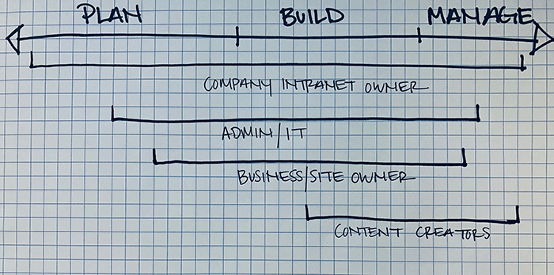
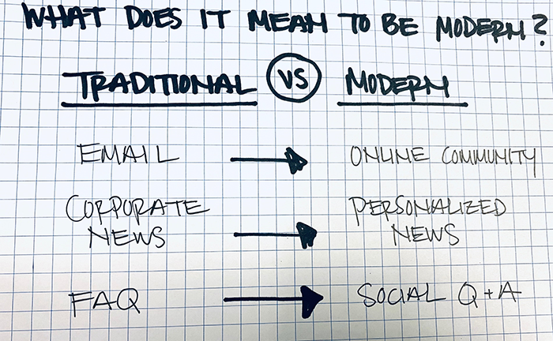
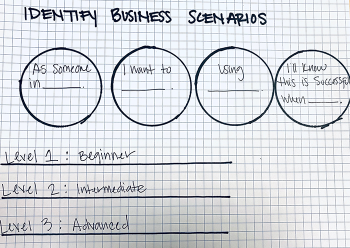

# Modern intranet roadmap

Your intranet might include your company's main landing page, portals for corporate communications, and individual sites for departments or divisions (like IT or HR). In this article we look at the high level tasks you need to do to create and maintain a successful intranet with SharePoint.

Whether you're the company intranet owner, an IT Professional or administrator, a site owner, or a content creator, you're in the right place. Use this article as a hub to help you find the resources that you need for your role and the goals that you have for your intranet. As you read the sections below, follow the links for more detailed information on the areas that you're working on.

## Roadmap contents:

- Section 1: Introduction to intranet roles, key tasks, planning stages, and timelines
- Section 2: Intranet design fundamentals  
- Section 3: How to get started 

### Who should use this roadmap?

- Company intranet owners - the person managing the overall direction and coordination of your organization's intranet
- IT/Admins - traditional admin role
- Business owners/site owners - the various stakeholders who are responsible for portions of the intranet
- Content creators - the people creating and managing content on sites and pages

### What you'll learn:

- Understand at a high level the various roles and responsibilities of creating a modern intranet
- See what you can do with SharePoint online out-of-the-box sites and web parts verse custom solutions
- Use checkpoints and checklists to track your progress
	
### How to think about a modern vs traditional intranet

- Lorem ipsum dolor sit amet, consectetur adipisci elit
- Iure reprehenderit in voluptate velit esse cillum dolore eu fugiat nulla pariatur
- Lorem ipsum dolor sit amet, consectetur adipisci elit
- Iure reprehenderit in voluptate velit esse cillum dolore eu fugiat nulla pariatur

### Key success factors:

Over the years we have learned about what makes an intranet successful. These are known factors that can help accelerate the creation, adoption, and over all success of your intranet:

> [!div class="checklist"]
> * Have an executive sponsor and identify intranet champions
> * Established KPIs that are regularly communicated from the project's start to finish
> * Design for simplicity and longevity 
> * Involve your business owners and other decision makers
> * Ask for feedback from users during all stages of the design process
> * Establish a governance plan that allows for self-service sites creation
> * Audit content to ensure quality and relevancy before migrating
> * Enable social connection that encourages communication, engagement, and collaboration 
> * Train your content creators and your end users

## Section 1: Introduction to intranet roles, tasks, planning stages, and timelines

### Roles, key tasks, and stages at-a-glance:

|Your role|Planning tasks|Build tasks|Management tasks|
|:--------|:-------------|:----------|:--------------------|
|[Company intranet owner](#company-intranet-owner)|Branding, adoption, governance, information architecture, and change management|||
|[IT / Admin](#it-pros-and-admins)|Platform integration, content migration, performance, scalability, end user training|Site creation, navigation, search, branding, publishing||
|[Business owners / site owners](#business-owners-and-site-owners)|Business objectives, permissions, content audit and migration|Site creation, navigation, branding, audience targeting|Site management, scheduled content audits|
|[Content creators](#content-creators)|Content best practices, content and site design|Create and share content, content collaboration|Update existing content, publish new content|

### Summary of intranet design stages

| Stage 1: Plan          | Stage 2: Build         | Stage 3: Manage   |
| :--------------------- | :--------------------- |:------------------|
| Analyze your current intranet  | Communicate goals progress regularly |Use metrics to measure progress |
| Organize your current content and assets|Measure, learn and pivot as you go|Communicate what's new |
| Develop business objectives |Get feedback regularly|Maintain high quality content |
| Plan solutions to business objectives | Celebrate the launch of your new intranet |Educate end users |

#### How roles, stages and timelines work together

- Visio PDF

### Summary of roles and key tasks

#### Company intranet owner

The company intranet owner works with business owners and IT to prioritize the intranet projects in your portfolio for the greatest business benefit in the shortest time.

Start by getting inspired with the [SharePoint lookbook](https://aka.ms/sharepointlookbook). The lookbook provides examples of intranet pages that you can build in SharePoint and will give you an idea of the possibilities. Keep these in mind as you proceed through the planning and implementation process.

Next, start to [plan your intelligent SharePoint intranet](https://docs.microsoft.com/sharepoint/plan-intranet) by reviewing your existing intranet and determining which project to start with for your best return on investment. As you prioritize your intranet projects, consider how to get the [best performance and scalability](https://docs.microsoft.com/SharePoint/portal-health) from the portals that you build. If your existing intranet is using SharePoint server, consider how [migrating your content to SharePoint Online](https://docs.microsoft.com/sharepointmigration/migrate-to-sharepoint-online) fits into your overall plan.

Then, choose a project to start with and meet with the business owners in that area of your organization to plan the project.

Keep in mind these key success factors as you plan and implement your intranet:

> [!div class="checklist"]
> * Have an executive sponsor and find intranet champions
> * Design for simplicity and longevity 
> * Ask for feedback from users during all stages of the design process
> * Establish KPIs and regularly communicate them from project start to finish

**Key tasks:**
#### Organize your intranet

A critical part of your SharePoint intranet is your site architecture. By using a series of [communication sites](https://support.office.com/article/94A33429-E580-45C3-A090-5512A8070732) and [hub sites](planning-hub-sites.md), you can create an intuitive intranet with common navigation across sites and an easy-to-manage permissions structure. See [Planning navigation for the modern SharePoint experience](https://docs.microsoft.com/sharepoint/plan-navigation-modern-experience) for a detailed look at site navigation in SharePoint.

*Start by:*
*You'll know your done when:*

#### Brand your intranet

Branding is an important part of your intranet. With SharePoint, you can [add branding your SharePoint site](https://docs.microsoft.com/sharepoint/branding-sharepoint-online-sites-modern-experience), and also [customize the Office 365 theme for your organization](https://docs.microsoft.com/office365/admin/setup/customize-your-organization-theme).

*Start by:*
*You'll know your done when:*

#### IT/Admins

- Implement the needed platform integration steps - such as with databases or line of business applications - needed by your business owners for their intranet portals.
- Training business owners, content creators, and end users

- High level summary of role
- Key success factors relevant to specific role
- Entry points to role specific content

**Key tasks:**
#### Train your content creators

[Microsoft 365 learning pathways](https://docs.microsoft.com/office365/customlearning/)

These references can help your content creators manage updates to the site.

- [Create a document library in SharePoint](https://support.office.com/client/306728fe-0325-4b28-b60d-f902e1d75939)
- [Create a list in SharePoint](https://support.office.com/article/0D397414-D95F-41EB-ADDD-5E6EFF41B083)
- [Add texts and tables to your page](https://support.office.com/article/729c0aa1-bc0d-41e3-9cde-c60533f2c801)
- [Add content to your page using the Embed web part](https://support.office.com/article/721f3b2f-437f-45ef-ac4e-df29dba74de8)
- [Use the image web part](https://support.office.com/article/A63B335B-AD0A-4954-A65D-33C6AF68BEB2)
- [Use the News web part on a SharePoint page](https://support.office.com/article/C2DCEE50-F5D7-434B-8CB9-A7FEEFD9F165)

*Start by:*
*You'll know your done when:*

#### Business owners and site owners

As a business owner, you may be responsible for intranet content for a particular area of your organization such as HR or facilities. With SharePoint, you can easily create and maintain the content that you need. Look over the [SharePoint lookbook](https://aka.ms/sharepointlookbook) for some ideas before you start your intranet planning.

Keep in mind these key success factors as you plan and implement your intranet:

> [!div class="checklist"]
> * Have an executive sponsor
> * Design for simplicity and longevity 
> * Ask for feedback from users during all stages of the design process
> * Work with champions and thought leaders in the organization
> * Establish KPIs and regularly communicate them from project start to finish

**Key tasks:**
#### Migrate your data

One of the largest tasks in creating a new intranet site is migrating your existing data to SharePoint. We highly recommend doing a content audit to see what's being used, what's up-to-date, and what's no longer needed and can be unpublished. Oftentimes, organizations can achieve higher user satisfaction and easier maintenance by removing content that's no longer needed. This also reduces the amount of content that you need to migrate to SharePoint.

If you're migrating files from SharePoint Server on-premises or file shares, you can use the [SharePoint Migration Tool](https://docs.microsoft.com/sharepointmigration/migrate-to-sharepoint-online).

Video is a great way to communicate to the people in your organization. Videos ranging from executive briefings to individual users creating tutorials or sharing ideas can lead to greater engagement of intranet users. An important component of this in Microsoft 365 is [Microsoft Stream](https://docs.microsoft.com/stream). You can use Stream to deliver live and on-demand meetings, events, and training. If you have existing video content that you want to make available on your new intranet site, [upload it to Stream](https://docs.microsoft.com/stream/portal-upload-video) as part of your content migration process.

*Start by:*

*You'll know your done when:*

#### Design the intranet portal page

The [main intranet portal for your organization](home-site.md) is a big part of your new SharePoint intranet. You can create this page at any time during your intranet development project. With a modern portal page, you can still point to your legacy intranet sites. If you have an existing communication site that you want to use as your main portal page, you can [move it to the root site](modern-root-site.md#replace-your-root-site).

The [mega menu](https://support.office.com/article/d6768545-2391-4c66-9a8c-a85eb76b4cf5), [news web part](https://support.office.com/article/C2DCEE50-F5D7-434B-8CB9-A7FEEFD9F165), and [Yammer feeds](https://docs.microsoft.com/yammer/yammer-landing-page) can all be used to make your main portal page an engaging and productive destination for your users. Read [Guided walkthrough: Creating an Enterprise Landing site for your organization](https://support.office.com/article/9c1842c3-543e-4891-85d3-0eaf680e242d) for an end-to-end look at creating this page.

*Start by:*

*You'll know your done when:*

#### Design your business-specific intranet site

As you start designing the intranet sites for your group, consider surveying your users to better understand their needs and how they currently interact with your content. You can use [Forms](https://docs.microsoft.com/forms-pro)
to create custom surveys and questionnaires.

We recommend developing your intranet pages using [communication sites](https://support.office.com/article/94A33429-E580-45C3-A090-5512A8070732). With communication sites, you can share news, reports, statuses, and other information through a variety of templates and web parts. For an end-to-end look at setting up a communication site, see [Guided walkthrough: Creating a communication site for your organization](https://support.office.com/article/d9aaecc7-e2df-43a7-acc2-bd37f1fe7cfe).

You can use the [news web part](https://support.office.com/article/C2DCEE50-F5D7-434B-8CB9-A7FEEFD9F165) to post important or interesting stories, announcements, people news, status updates, and more that can include graphics and rich formatting. Within the news web part, you can set up [audience targeting](https://support.office.com/article/68113d1b-be99-4d4c-a61c-73b087f48a81) to prioritize specific content for specific audiences. For an end-to-end look at using news in SharePoint, see [Guided walkthrough: setting up news for your organization](https://support.office.com/article/95a90834-96a2-463c-b741-31c4d2230706).

You can [change the look of your site](https://support.office.com/article/06bbadc3-6b04-4a60-9d14-894f6a170818) to match your organization's branding requirements.

Consider setting up an [approval flow](https://support.office.com/article/a8b2e689-d4a1-4639-8028-333c0ece30d9) for changes to your site. This can help you maintain standards within your group as people update pages with the latest information.

*Start by:*

*You'll know your done when:*

### Content creators

Content creators are the people who will be responsible for the day-to-day management and creation of content. Content creators can take on many responsibilities such as creating and publishing organizational news, subject matter experts for special projects and initiatives and thought leaders.

Content creators should get familiar with SharePoint design fundamentals and building blocks. 

Keep in mind these key success factors as you create and manage content for your intranet:

- Develop a content strategy and publishing schedule
- Ask for feedback and allow for comments and social interaction
- Schedule content audits as needed to ensure content is relevant

**Key tasks:**

- Launch and manage sites
- Create and manage content
- Inform and engage
- Build culture and community
- Connect and collaborate

*Start by:*

*You'll know your done when:*

## Section 2: SharePoint design fundamentals and building blocks

- Visio intranet building blocks
- Visio site/page building blocks
- SOC article - SPO design fundamentals

## Section 3: How to get started

- New video: conceptual video of how to define business objectives
- New: Powerpoint template and scenario planning template
- Provide guidance on how to use PowerPoint and objectives templates

### Plan

| Role                 |Plan tasks            |                 
| :------------------- | -------------------: |
|[Company intranet owner](#company-intranet-owner)| Plan tasks | 
|[IT / Admin](#it-pros-and-admins)| Plan tasks          | 
|[Business owners / site owners](#business-owners-and-site-owners)               | Plan tasks                 | 
|[Content creators](#content-creators)|Plan tasks                  |

### Build

| Role                 |Build tasks           |                
| :------------------- | -------------------: |
| [Company intranet owner](#company-intranet-owner) | Build tasks  | 
|[IT / Admin](#it-pros-and-admins)|  Build tasks                | 
|[Business owners / site owners](#business-owners-and-site-owners)             |  Build tasks                | 
| [Content creators](#content-creators)                 | Build tasks                   |

### Manage

| Role                 |Manage tasks          |             
| :------------------- | -------------------: |
| [Company intranet owner](#company-intranet-owner) |  Manage tasks | 
| [IT / Admin](#it-pros-and-admins)| Manage tasks             | 
| [Business owners / site owners](#business-owners-and-site-owners)                 | Manage tasks                 | 
| [Content creators](#content-creators)                |Manage tasks               |

## Related topics

[Your new SharePoint start page](https://support.office.com/article/5ffd35a6-9fd8-47a4-900d-c548208d092e?)

[Intelligent Intranet Envisioning Workshop PowerPoint deck](https://resources.techcommunity.microsoft.com/link/sharepoint-envisioning-workshop-concept/)
