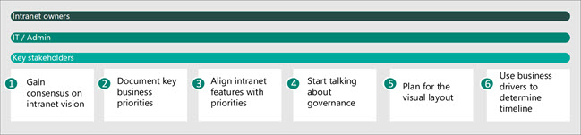
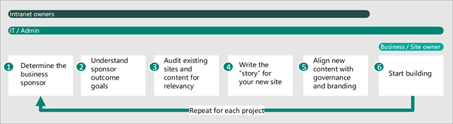
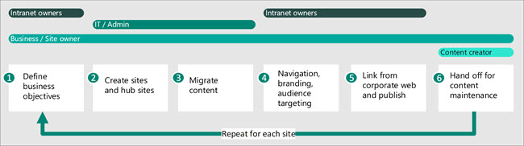
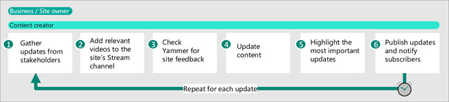

# Modern intranet roadmap

Your intranet might include your organization's main landing page, portals for corporate communications, and individual sites for departments or divisions (like IT or HR). In this article we look at the high-level tasks needed to create and maintain a successful intranet with SharePoint.

Whether you're the organization intranet owners, an IT Professional or administrator, a site owner, or a content creator you're in the right place. Use this article as a guide to help you find the resources that you need for your role and the goals that you have for your intranet. As you read the sections below, follow the links for more detailed information on the areas that you're working on.

**Roadmap contents**:

- [Introduction to roles, tasks, and timelines](#introduction-to-roles-tasks-and-timelines)
- Key tasks for the [organization intranet owners](#organization-intranet-owners)
- Key tasks for [IT pros and admins](#it-pros-and-admins)
- Key tasks for [business owners and site owners](#business-owners-and-site-owners)
- Key tasks for [content authors](#content-authors)
- How to [get started](#get-started)

**Who should use this roadmap?**

- [Organization intranet owners](#organization-intranet-owners) — This is the person managing the overall direction and coordination of your organization's intranet.
- [IT pros and admins](#it-pros-and-admins) — One or more IT and SharePoint administrators who will be responsible for managing the backend configuration and implementation for your organization's intranet.
- [Business owners and site owners](#business-owners-and-site-owners) — The various stakeholders who will be responsible for creating and maintaining portions of the intranet.
- [Content authors](#content-authors) — The people creating and managing content on sites and pages.

**What you'll learn**:

- Understand, at a high level, the various roles and responsibilities of creating a modern intranet.
- See what you can do with SharePoint out-of-the-box sites and web parts.
- Framework for planning your intranet around strategic business outcomes.
- Known success factors for creating engaging intranet experiences.

**Keep in mind**:

Intranets are a constant work in progress and are never really considered done. Make sure you have a plan to keep your content relevant, otherwise your intranet will start losing value on the day that you launch. Celebrate your initial launch, plan to monitor and maintain your intranet and its content over time as the organization changes and business goals evolve.

**How to think about a modern vs traditional intranet design**

The new, modern experience in SharePoint is designed to be compelling, flexible, and more performant. The [modern experience](https://docs.microsoft.com/sharepoint/guide-to-sharepoint-modern-experience) makes it easier for anyone to create beautiful, dynamic sites and pages that are accessible and mobile-ready. Modern SharePoint supports intelligent workplaces — those that leverage the collective knowledge of current users, share and collaborate easily, and engage audiences with targeted content and news. 

| Traditional intranet           | Modern intranet                |
| :----------------------------- | :----------------------------- |
| Communication primarily through email  | Communication primarily through [SharePoint sites](https://support.office.com/en-us/article/What-is-a-SharePoint-communication-site-94A33429-E580-45C3-A090-5512A8070732) and [community portals](https://support.office.com/en-us/article/video-what-is-yammer-47526868-b136-40cc-a80d-c870eadd9ba5)| 
| Static information like FAQ| Dynamic information that's community generated in [Yammer](https://support.office.com/en-us/article/Video-What-is-Yammer-1b0f3b3e-89ee-4b66-aac5-30def12f287c)| 
| Corporate news dominates the newsfeed | Personalized news and content is [targeted to specific audiences](https://support.office.com/en-us/article/target-files-news-and-pages-to-specific-audiences-33d84cb6-14ed-4e53-a426-74c38ea32293) | 
|Hierarchical collection of websites | Dynamic collection of experiences and services provided by independent site collections |

**Key success factors**

Over the years, we have learned about what makes an intranet successful. These factors can help accelerate the creation, adoption, and overall success of your intranet:

- Ensure that your intranet goals are directly tied to [key business outcomes](https://docs.microsoft.com/sharepoint/plan-intranet).
- Have an executive sponsor and identify intranet champions.
- Establish KPIs that are regularly communicated from the project's start to finish.
- Design for simplicity and longevity.
- Involve your business owners and users to get feedback during all stages of the design process.
- Establish a governance plan that defines roles and responsibilities, guidelines, and best practices, compliance and retention, provisioning sites, and expectations for content management.
- Audit existing content to ensure quality and relevancy before migrating to a new intranet.
- Align your intranet with your organization brand and culture.
- Enable social connection that encourages communication, engagement, and collaboration.
- Train your content creators and your users.

## Introduction to roles, tasks, and timelines

### At-a-glance:

|Your role|Planning tasks|Build tasks|Management tasks|
|:--------|:-------------|:----------|:--------------------|
|[Organization intranet owners](#organization-intranet-owners)|Strategy, branding, adoption, governance, information architecture, and change management|||
|[IT pros / Admins](#it-pros-and-admins)|Platform integration, content migration, performance, scalability, user training|Site creation, navigation, search, branding, publishing||
|[Business owners / site owners](#business-owners-and-site-owners)|Business objectives, permissions, content audit, and migration|Site creation, navigation, branding, audience targeting|Site management, scheduled content audits|
|[Content authors](#content-authors)|Content best practices, content, and site design|Create and maintain content, content collaboration|Update existing content, publish new content|

See what the [intranet lifecycle](https://raw.githubusercontent.com/MicrosoftDocs/OfficeDocs-SharePoint/live/SharePoint/SharePointOnline/spodownloads/Intranet%20lifecycle.pdf) looks like

Learn more about basic site [building blocks](https://raw.githubusercontent.com/MicrosoftDocs/OfficeDocs-SharePoint/live/SharePoint/SharePointOnline/spodownloads/Building%20blocks%20-%20sites%20and%20pages.pdf)

## Organization intranet owners

The intranet owners work with business owners and IT to prioritize the intranet projects in your portfolio for the greatest business benefit.

Start by getting inspired with the [SharePoint look book](https://aka.ms/sharepointlookbook). The look book provides examples of intranet pages that you can build in SharePoint and will give you an idea of the possibilities. Keep these in mind as you proceed through the planning and implementation process.

Next, start to [plan your intelligent SharePoint intranet](https://docs.microsoft.com/sharepoint/plan-intranet) by working with your key stakeholders to understand your key business and intranet goals. Do research with intranet users to discover key personas and scenarios. Review your existing intranet and determine which initiative to start with for your best return on investment. As you prioritize your intranet initiatives, consider how to get the [best performance and scalability](https://docs.microsoft.com/SharePoint/portal-health) from the portals that you build. If your existing intranet is using SharePoint server, consider how [migrating your content to SharePoint](https://docs.microsoft.com/sharepointmigration/migrate-to-sharepoint-online) fits into your overall plan. To troubleshoot page performance issues, use the [page diagnostics tool](https://docs.microsoft.com/office365/enterprise/page-diagnostics-for-spo).

Choose one or more opportunities to start with and meet with the business owners in that area of your organization to plan the solution Some solutions may require coordination among different parts of the organization.

As you plan and implement your intranet, keep in mind these key success factors:

- For your intranet, as a whole:
  - Have a sponsor for each initiative and an executive sponsor from the business for the intranet as a whole.
  - Ensure that your intranet goals are directly tied to key business goals.
  - Get a core team together to think about governance — make sure you align your governance decisions to business goals.
  - Align your intranet with your organization brand and culture.
  - Don’t assume you have to launch with a “big bang” — align communications and training with your launch plan.

- For each initiative:
  - Gather outcomes, not requirements — be sure to talk to site users, not just owners. 
  - Design to align to your organization standards — but allow the site “story” to dictate the navigation and page layouts.
  - Establish success goals for each site and review them regularly.
  - Test your proposed navigation with site visitors — make sure that visitors can easily get to their top tasks.

### Key tasks:

#### Organize your intranet

A critical part of your SharePoint intranet is your site architecture. By using a series of [communication sites](https://support.office.com/article/94A33429-E580-45C3-A090-5512A8070732) and [hubs](planning-hub-sites.md), you can create an intuitive intranet with common navigation across related sites and an easy-to-manage permissions structure. For a detailed look at site navigation in SharePoint, see [Planning navigation for the modern SharePoint experience](https://docs.microsoft.com/sharepoint/plan-navigation-modern-experience).

*Start by* — Developing an understanding about what you need your intranet to accomplish and start organizing content assets to align with key outcome goals. Organize depending on the needs of the business — by region, department, or function — and by the topics that your users care about.  

*You'll know you're done when* — Business owners and users confirm they can find and have access to the content that makes their jobs more productive.

#### Brand your intranet

Branding provides a way to align your intranet with your organizational culture. With SharePoint, you can [add branding to your SharePoint site](https://docs.microsoft.com/sharepoint/branding-sharepoint-online-sites-modern-experience), and also [customize the Microsoft 365 theme for your organization](https://docs.microsoft.com/office365/admin/setup/customize-your-organization-theme).

*Start by* — Answer, do you need a consistent brand across all sites or will different divisions, departments, or groups in your organization have their own look and feel? Then, collect approved brand assets like brand colors, logos, and images depending on your organization's branding requirements.

*You'll know you're done when* — You've determined the end-to-end look of the intranet from the home page to hubs to individual sites.

## IT pros and admins

IT Pros and admins implement the needed platform integration steps needed by your business owners for their intranet portals — such as with databases or line of business applications. This may include content migration from existing systems. They also work with other stakeholders and the business to determine a governance strategy for the intranet and train people in the organization to use SharePoint and other tools to manage the intranet.

As you plan and implement your intranet, keep in mind these key success factors:

- Establish a governance plan that supports business needs as well as your retention, security, and compliance goals.
- Make sure all site owners, content authors, and visitors understand how governance applies to their roles.
- Clean up existing content prior to migration. Only migrate content that is relevant, current, and supports the outcome goals of each site.
- Enable social connection that encourages communication, engagement, and collaboration.
- Train your content authors and your users.

### Key tasks:

#### Plan the governance strategy

Governance is the set of policies, roles, and processes that control how your organization's business divisions and IT teams work together to achieve its goal — ensuring organization content and communications are secure and viewers benefit from a consistent experience. Every organization has unique needs and goals that influence its approach to governance. Some details to consider when planning your [governance strategy](https://docs.microsoft.com/sharepoint/governance-overview): naming conventions, guest access, classification of sites, groups, and files.

*Start by* — Understanding the rules and requirements of your organization, in combination with the needs of business owners and site owners. Then, develop a plan alongside IT, HR and senior leadership that allows employees to maximize the value of SharePoint with minimal oversight in a way that's compliant.

*You'll know you're done when* — When governance stakeholders, business owners, and content creators can work effortlessly in SharePoint without slowing the rhythm of business.

#### Migrate content from your existing intranet

Your existing intranet may contain content from a variety of sources located on different platforms. A key task in creating your modern SharePoint intranet is determining the state of your existing content and deciding which content to migrate to the new intranet.

Your current business owners and site owners may be best suited to evaluate if content should be migrated and you may want to have them perform the actual migration, depending on what's involved. They may need your assistance depending on the quantity and location of the content to be moved. The [SharePoint Migration Tool](https://docs.microsoft.com/sharepointmigration/migrate-to-sharepoint-online) can help you migrate content from SharePoint server and from file shares. [Mover](https://mover.io) can help you migrate from other cloud providers.

*Start by* — Working with business leaders and other content stakeholders to review your existing content for relevance and accuracy.

*You'll know you're done when* — A curated set of content has been migrated to SharePoint.

#### Customize SharePoint to meet your business needs

With the SharePoint modern experience, you can create an engaging, easy to maintain intranet without the need for customization. We highly recommend using SharePoint default experiences where possible. This will provide easier change management over time.

If you do need to customize SharePoint, SharePoint provides Framework solutions, apps, add-ins, and solutions to help you meet your business needs. For more info, see [SharePoint development](https://docs.microsoft.com/sharepoint/dev).

#### Train your content authors

Depending on their background, the people in your organization may need some help [getting started](https://support.office.com/en-us/article/plan-your-sharepoint-site-get-started-35d9adfe-d5cc-462f-a63a-bae7f2529182) with SharePoint. [Microsoft 365 learning pathways](https://docs.microsoft.com/office365/customlearning/) provides a way to bring a curated set of Microsoft content to your users. Other references that can help your content creators manage updates to the site include:

- [Create a document library in SharePoint](https://support.office.com/client/306728fe-0325-4b28-b60d-f902e1d75939)
- [Create a list in SharePoint](https://support.office.com/article/0D397414-D95F-41EB-ADDD-5E6EFF41B083)
- [Add text and tables to your page](https://support.office.com/article/729c0aa1-bc0d-41e3-9cde-c60533f2c801)
- [Add content to your page using the Embed web part](https://support.office.com/article/721f3b2f-437f-45ef-ac4e-df29dba74de8)
- [Use the image web part](https://support.office.com/article/A63B335B-AD0A-4954-A65D-33C6AF68BEB2)
- [Use the News web part on a SharePoint page](https://support.office.com/article/C2DCEE50-F5D7-434B-8CB9-A7FEEFD9F165)

*Start by* — Determining your users' needs for training on SharePoint and making these references known.

*You'll know you're done when* — Questions about SharePoint intranet usage on organization social media channels and through the help desk have decreased to a modest level.

## Business owners and site owners

As a business owner, you may be responsible for intranet content for a specific area of your organization such as HR or operations. You may also be the site owner, the person who has the permissions in SharePoint to create and maintain the content and experiences on the site. Before you start configuring individual sites, for some ideas, look over the [SharePoint look book](https://aka.ms/sharepointlookbook). As part of your overall governance plan, you may decide that sites need to follow consistent patterns to ensure that readers to not have to spend too much time orienting themselves as they go from site to site or topic to topic in the intranet.

Keep in mind these key success factors as you plan and implement your intranet:

- Have a relentless focus on user experiences as you build your site — check labels for relevance, ensure images relate to the content, don’t assume — test!
- Clean up existing content prior to migration. Only migrate content that is relevant, current, and supports the outcome goals of the site. 
- Involve your users to get feedback during all stages of the build process.
- Make sure the site owner or contact is visible in a consistent place on the home page of the site so that visitors know to whom they should reach out for feedback.
- Plan launch communications, which might include a launch event or activity. Celebrate your success!

### Key tasks:

#### Migrate your data

One of the largest tasks in creating a new intranet site is migrating your existing data to SharePoint. We highly recommend doing a content audit to see what's being used, what's up-to-date, and what's no longer needed and can be deleted or archived.

Look for opportunities to eliminate prior versions of documents that you no longer need. If you migrate files ending .v1, .v2, and so on, you will create confusion for your users who won’t be able to rely on search to consistently find the latest version of documents.

Train your users to take advantage of SharePoint’s automated versioning — and remove version IDs and dates from filenames wherever possible, migrating only the latest and most accurate version. Better still, see if you can convert legacy documents to modern pages to create more engaging and easier to consume content. You will get better search experiences and achieve higher user satisfaction and easier maintenance by removing content that's no longer needed prior to migration.

If you're migrating files from SharePoint Server on-premises or file shares, you can use the [SharePoint Migration Tool](https://docs.microsoft.com/sharepointmigration/migrate-to-sharepoint-online).

Video is a great way to communicate to the people in your organization for executive briefings or when sharing ideas through video can lead to greater engagement. Use [Microsoft Stream](https://docs.microsoft.com/stream) to deliver live and on-demand meetings, events, and training. If you have existing video content that you want to make available on your new intranet site, [upload it to Stream](https://docs.microsoft.com/stream/portal-upload-video) as part of your content migration process.

*Start by* — Understanding the full scope of content that might need to be migrated and then define the criteria used to target content that should be migrated, should be edited and then migrated, and should be retired.

*You'll know you're done when* — You've got the minimum amount of content necessary to create and launch an effective SharePoint site.

#### Determine your permissions and sharing strategy

SharePoint [permissions](https://docs.microsoft.com/sharepoint/modern-experience-sharing-permissions) are managed through a set of roles within a site — owners, members, and visitors. Depending on the type of site, there may be additional permission and sharing options available like using Microsoft 365 groups. 

*Start by* — Determining who needs access, who should not have access, and how you will grant access requests.

*You'll know you're done when* - All site owners and users have access to the content they need, while securing confidential content when appropriate.

#### Design the intranet portal page

The [main intranet portal for your organization](home-site.md) is a big part of your new SharePoint intranet. You can create this page at any time during your intranet development project. You can still point to your legacy intranet sites with a modern portal home page. If you have an existing communication site that you want to use as your main portal page, you can [move it to the root site](modern-root-site.md#replace-your-root-site).

The [mega menu](https://support.office.com/article/d6768545-2391-4c66-9a8c-a85eb76b4cf5), [news web part](https://support.office.com/article/C2DCEE50-F5D7-434B-8CB9-A7FEEFD9F165), and [Yammer feeds](https://docs.microsoft.com/yammer/yammer-landing-page) can all be used to make your main portal page an engaging and productive destination for your users. For an end-to-end look at creating this page, read [Guided walkthrough: Creating an Enterprise Landing site for your organization](https://support.office.com/article/9c1842c3-543e-4891-85d3-0eaf680e242d).

*Start by* — Considering the goals from the perspective of your organization's communications team, your executive sponsor, your IT department, and end users. Design the portal home page with simplicity and scalability in mind.

*You'll know you're done when* — You've created a launch plan for redirecting from your current portal page to the new page and have shared this plan with all stakeholders and users.

#### Design your business, or topic-specific intranet site

As you start designing the intranet sites for your services and functions, make sure you have done research with your users to better understand their needs and how they currently interact with your content. To create custom surveys and questionnaires and spend time observing users and meeting with them, you can use [Forms](https://docs.microsoft.com/forms-pro).

We recommend developing your intranet pages using [communication sites](https://support.office.com/article/94A33429-E580-45C3-A090-5512A8070732). With communication sites, you can share news, reports, statuses, and other information through a variety of templates and web parts. For an end-to-end look at setting up a communication site, see [Guided walkthrough: Creating a communication site for your organization](https://support.office.com/article/d9aaecc7-e2df-43a7-acc2-bd37f1fe7cfe). Learn more about [how to plan your sites](https://support.office.com/en-us/article/plan-your-sharepoint-site-get-started-35d9adfe-d5cc-462f-a63a-bae7f2529182?ui=en-US&rs=en-US&ad=US). 

To post important or interesting stories, announcements, people news, status updates, and more that can include graphics and rich formatting, you can use the [news web part](https://support.office.com/article/C2DCEE50-F5D7-434B-8CB9-A7FEEFD9F165). Within the news web part, to prioritize specific content for specific audiences, you can set up [audience targeting](https://support.office.com/article/68113d1b-be99-4d4c-a61c-73b087f48a81). For an end-to-end look at using news in SharePoint, see [Guided walkthrough: setting up news for your organization](https://support.office.com/article/95a90834-96a2-463c-b741-31c4d2230706).

To align your organization's branding requirements, you can [change the look of your site](https://support.office.com/article/06bbadc3-6b04-4a60-9d14-894f6a170818).

*Start by* — Prioritizing business objectives, and then decide the type of sites and web parts that will be needed initially.

*You'll know you're done when* — Business and site owners have dedicated areas in SharePoint that can been owned and maintained with little oversight.

## Content authors

Content authors are the people who create content on sites. Content authors can take on many responsibilities such as creating and publishing news, creating topic-specific pages, or serving as subject matter experts and thought leaders for special projects and initiatives. Content authors should get familiar with [SharePoint design fundamentals](https://support.office.com/article/Plan-your-SharePoint-site-21761aac-f7f7-4499-b0ca-cf283477c32f). 

As you create and manage content for your intranet, keep in mind these key success factors:

- Consider whether content is best presented as a page or a document. Use pages when your content is dynamic and most easily communicated with engaging web parts such as images, video, or links. Use documents when your content is designed to be downloaded or printed.
- Summarize up front — place the information readers must have for your communication to be successful at the top of the page before you focus on the design.
- Use sections and heading styles to visually separate topics and concepts to make your pages more readable and accessible.
- Create custom page templates to drive consistency and simplify page creation.
- Ensure you follow image and video guidelines to keep page performance high.

### Key tasks:

#### Inform and engage

Collect and manage content using SharePoint [pages](https://support.microsoft.com/office/add-sections-and-columns-on-a-sharepoint-modern-page-fc491eb4-f733-4825-8fe2-e1ed80bd0899?ui=en-us&rs=en-us&ad=us). Use [lists](https://support.office.com/article/video-introduction-to-lists-1d0b0500-baa0-4344-bdcb-7e1aea84ad11) for information you might collect in Excel. Lists enable you and your audience to gather, track, and share information. Improve the display of lists with column and list view formatting using the [List web part](https://support.office.com/article/use-the-list-web-part-ef0a1b80-f8b3-443d-b04a-1e76c70b5537). Use [libraries](https://support.office.com/article/video-introduction-to-libraries-1317b9aa-ca8f-4b5f-84aa-482c3c35dd65?ui=en-US&rs=en-US&ad=US) to store documents. Easily add, reorder, sort, filter, and create custom views of libraries using the [Document library web part](https://support.office.com/article/use-the-document-library-web-part-a9dfecc3-2050-4528-9f00-2c5afc5731b0).

Dynamically display content from a document library, a site, a site collection, or all sites using the [Highlighted content web part](https://support.office.com/article/use-the-highlighted-content-web-part-e34199b0-ff1a-47fb-8f4d-dbcaed329efd).

Create and curate news relevant to your audience using the [News web part](https://support.office.com/article/use-the-news-web-part-on-a-sharepoint-page-c2dcee50-f5d7-434b-8cb9-a7feefd9f165). Quickly create eye-catching posts like announcements, people news, status updates, and more that can include graphics and rich formatting.

Customize the way your users view content and news by using [audience targeting](https://support.office.com/article/target-files-news-and-pages-to-specific-audiences-33d84cb6-14ed-4e53-a426-74c38ea32293). Audience targeting enables specific content to be prioritized to specific audiences on the SharePoint start page, news on the mobile app, and in News web part when audience targeting is enabled.

Enable users to work on any device. When users keep files on their local device or on a network share, they're out of luck when they don't have the device with them or don't have a connection to your network. If something happens to a user's device, the data might not be recoverable. [Get the SharePoint mobile app](https://products.office.com/sharepoint/mobile-app?rtc=1).

*Start by* —  Organizing content into topics, creating pages for each topic. Determine whether the page content should include text, links, list, or libraries. Align the content to the story to ensure that the reader can get the information that they need efficiently by quickly scanning or skimming the page.

*You'll know you're done when* —  You can confirm users have access to the right information at the right time by using [site usage and analytics](https://support.office.com/article/view-usage-data-for-your-sharepoint-site-2fa8ddc2-c4b3-4268-8d26-a772dc55779e), and asking users for feedback. 

#### Build culture and community

Help work groups connect and engage across your organization using Yammer. [Learn more about the Yammer Highlights and Yammer Conversations web parts](https://support.office.com/article/use-a-yammer-web-part-in-sharepoint-online-a53cfa0c-3d09-42c8-a286-1038a81c59da). Sometimes content needs to be delivered through video - like when organization-wide announcements are made or when senior leaders host a live event or when you want to provide examples on pages that provide instructions. [Microsoft Stream](https://support.office.com/article/Microsoft-Stream-Your-company-s-video-portal-c3240bd5-5f80-4fd0-a37d-7a3275605f3a) is your organization's own video site. To display video content, use the [Stream web part](https://support.office.com/article/Use-the-Stream-web-part-B97FA87C-1337-4271-A059-17F0D2B26E8B) on your site.

*Start by* — Finding news, announcements, and events to amplify on your site.

*You'll know you're done when* — You are regularly promoting news and events that start conversations and engage and connect wide audiences. 

## Get started

### Envision

- Identify your key sponsors and stakeholders and review key organizational priorities. Document a vision that will help provide direction and help you prioritize opportunities.
- Align key outcome goals with SharePoint capabilities to identify where you may need to invest in customization. Consider whether an “intranet in a box” solution might be appropriate for your organization.
- Think about governance. What processes will you need to create to provision, manage, and maintain sites and content? Do you have security, retention, or compliance goals that need to be considered?
- Think about branding and architecture — do you want all sites to share a common look and feel?
- Analyze possible opportunities to identify priorities.

| Role                 |Plan tasks            |                 
| :------------------- | :------------------- |
|[Organization intranet owners](#organization-intranet-owners)| Identify your key sponsors and stakeholders and review key organizational priorities. Document a vision that will help provide direction and help you prioritize opportunities.| 
|[IT pros / Admins](#it-pros-and-admins)| Organize a core team to plan governance — make sure you align your governance decisions to business goals.| 
|[Business owners / site owners](#business-owners-and-site-owners)| Help identify key organizational opportunities and priorities.|

### Plan

- Work with business owners and IT to prioritize the intranet projects in your portfolio for the greatest business benefit in the shortest time.
- Start by developing an understanding about what you need your intranet to accomplish and start organizing content assets and business outcomes. Organize depending on the needs of the business — by region, department, or function — and by the topics that your users care about.
- As you prioritize your intranet projects, consider how to get the best performance and scalability from the portals that you build.

| Role                 |Build tasks           |                
| :------------------- | :------------------- |
| [Organization intranet owners](#organization-intranet-owners) | Communicate goals and progress from project start to finish. Director of the branding direction, governance strategy, information architecture, change management, and product adoption.| 
|[IT pros / Admins](#it-pros-and-admins)| Responsible for platform integration, content migration, performance, scalability, and end-user training. | 
|[Business owners / site owners](#business-owners-and-site-owners)| Develop and plan solutions to business objectives. Responsible for site permissions, content audit, and content migration. | 
| [Content authors](#content-authors)| Authority on content best practices, content creation, content management and page design.|

### Build

- Communicate goals progress regularly.
- Measure, learn, and pivot as you go.
- Get feedback regularly.

| Role                 |Build tasks           |                
| :------------------- | :------------------- |
| [Organization intranet owners](#organization-intranet-owners) | Get user feedback along the way. Use findings from user feedback to learn and pivot your intranet plan. | 
|[IT pros / Admins](#it-pros-and-admins)| Implement decisions made by the intranet stakeholders regarding site creation, navigation, search, branding, and publishing. | 
|[Business owners / site owners](#business-owners-and-site-owners)|  Use business objectives to drive decisions around site creation, navigation, branding, and audience targeting. | 
| [Content authors](#content-authors)| Create solutions to business objectives by creating and sharing relevant content with the right audiences. |

### Manage and maintain

- Celebrate the launch of your new intranet.
- Use metrics to measure progress.
- Communicate what's new.
- Maintain high quality content.
- Educate users.

| Role                 |Manage tasks          |             
| :------------------- | :------------------- |
| [Organization intranet owners](#organization-intranet-owners) | Celebrate the launch of your new intranet. Communicate goals and progress regularly after the launch. | 
| [IT pros / Admins](#it-pros-and-admins)|Communicate what's new with intranet stakeholders and business owners. Educate end-users about publishing rules like site creation and content retention policies.|
| [Business owners / site owners](#business-owners-and-site-owners) | Schedule content audits and use site usage metrics to measure progress. | 
| [Content authors](#content-authors)|Refresh existing content, publish new content and participate in scheduled content audits to keep content up-to-date and compliant.|

## Related topics

[SharePoint adoption resources](https://resources.techcommunity.microsoft.com/resources/sharepoint-adoption/#tips-campaign)

[Ways to work with SharePoint](https://support.office.com/article/ways-to-work-with-sharepoint-17688238-3285-47cf-b8c7-cba3764acbdf)

[Guide to the Modern experience in SharePoint](https://docs.microsoft.com/sharepoint/guide-to-sharepoint-modern-experience)

[Intelligent Intranet Envisioning Workshop PowerPoint deck](https://resources.techcommunity.microsoft.com/link/sharepoint-envisioning-workshop-concept/)

[Plan your intranet](https://docs.microsoft.com/sharepoint/plan-intranet)

[Plan your site — get started](https://support.office.com/article/plan-your-sharepoint-site-get-started-35d9adfe-d5cc-462f-a63a-bae7f2529182?ui=en-US&rs=en-US&ad=US)

