# Intro to file collaboration in Microsoft 365, powered by SharePoint

Are you getting the most out of file collaboration in Microsoft 365, or are your users still storing files locally or on network file shares and sending them around in email? Maybe you're paying for another cloud storage service and not taking advantage of the space you get with your Microsoft 365 subscription. This article describes the benefits and key features of file collaboration in Microsoft 365. It also covers the steps to plan for and adopt Microsoft 365 file collaboration in your organization.

The file collaboration capabilities in Microsoft 365 are available to you whatever the size of your organization. If you have a small organization, each user can store their files in their individual library in OneDrive and you might want only a single team in Microsoft Teams for everyone in the organization.

## Why use Microsoft 365 cloud file storage?

By taking full advantage of SharePoint-powered file storage in Microsoft 365, you can avoid purchasing cloud storage from other providers and enjoy:

    Anywhere access to files

    Enterprise-grade security

    Secure sharing outside the organization

    Real-time collaboration and file versioning

    Intelligence that helps users discover files

### Anywhere access

When users keep files on their local device or on a network share, they're out of luck when they don't have the device with them or don't have a connection to your network. If something happens to a user's device, the data might not be recoverable. If a user's device is upgraded, local data must be migrated. By storing files in the cloud, users can access them from all their devices, such as their phone and their home computer (depending on what you allow). They can even access files in a browser from other devices they trust. For example, if two colleagues travel to a customer site and one of their two laptops runs out of battery, they can both access all their files by signing in to portal.office.com on the other laptop. [Get the SharePoint mobile app](https://products.office.com/sharepoint/mobile-app).

> [!NOTE]
> If you're concerned about users signing in from kiosks or other shared, unmanaged devices, you might want to [enable idle session sign-out](https://docs.microsoft.com/sharepoint/sign-out-inactive-users).

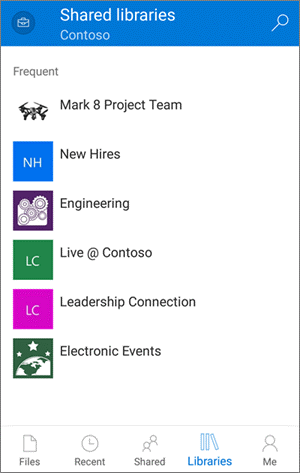

### Enterprise-grade security

Files stored in SharePoint-powered storage locations in Microsoft 365 are [encrypted in transit and in rest](https://docs.microsoft.com/office365/securitycompliance/microsoft-365-encryption-for-skype-onedrive-sharepoint-and-exchange#sharepoint-online-and-onedrive-for-business). (You can [encrypt files by using your own key](https://docs.microsoft.com/microsoft-365/compliance/controlling-your-data-using-customer-key) if you want.) Files are also [scanned for viruses](https://docs.microsoft.com/office365/securitycompliance/virus-detection-in-spo). As an admin, you can use tools in Microsoft 365 to further secure and monitor files in the Microsoft cloud:

- **Data loss prevention policies**. Warn or prevent users from sharing files that have specific labels outside the organization. [More info](https://docs.microsoft.com/office365/securitycompliance/data-loss-prevention-policies)

- **Retention labels**. Classify files to be retained, permanently deleted, or marked as a record. [More info](https://docs.microsoft.com/office365/securitycompliance/labels)

- **Sensitivity labels**. Classify and protect highly confidential files with encryption and permissions. [More info](https://docs.microsoft.com/office365/securitycompliance/sensitivity-labels)

- **Reports**. Monitor activity and usage in SharePoint and OneDrive. [More info](https://docs.microsoft.com/office365/admin/activity-reports/activity-reports?view=o365-worldwide#which-activity-reports-are-available-in-the-admin-center)

<<<<<<< Updated upstream
- **Microsoft 365 Advanced Threat Protection (ATP)**. Protect against sharing malicious files. [More info](https://docs.microsoft.com/microsoft365/securitycompliance/atp-for-spo-odb-and-teams)
=======
- **Microsoft 365 Advanced Threat Protection (ATP)**. Protect against sharing malicious files. [More info](https://docs.microsoft.com/office365/securitycompliance/atp-for-spo-odb-and-teams)
>>>>>>> Stashed changes

- **Files Restore**. If a location is affected by malicious software, or someone deletes important files, you can [restore a document library](https://support.office.com/article/317791c3-8bd0-4dfd-8254-3ca90883d39a) to an earlier point in time.

[Plan for these features](https://docs.microsoft.com/sharepoint/deploy-file-collaboration#classify-and-protect-information)

### Secure sharing outside the organization

SharePoint powers secure file sharing in Microsoft 365. You can specify if you want people outside the organization to be able to access files without authenticating (by signing in or providing a verification code). You can even block external sharing altogether. We recommend using the most permissive sharing option that you can for each set of content. If you heavily restrict sharing and it blocks user productivity, users will typically find other ways to collaborate that provide you less oversight and control. For more info, see [Control sharing](https://docs.microsoft.com/sharepoint/deploy-file-collaboration#control-sharing).

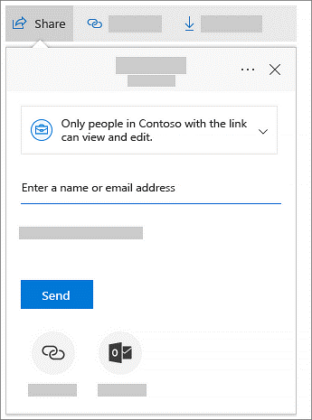

### Real-time collaboration and version management

When users store Office files in the Microsoft 365 cloud, they can avoid the hassle of managing changes in different copies of files. Instead, they can collaborate on a single version by using either the desktop apps or the web versions of Office. People don't even need to have the Office desktop apps installed to edit Office files. [Learn more about document collaboration and coauthoring](https://support.office.com/article/EE1509B4-1F6E-401E-B04A-782D26F564A4). When multiple users edit an Office file at the same time, a notification will show them that other people are working in the file and they can see where in the file others are working.

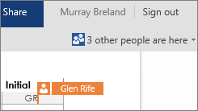

Version history is also on by default, so users can view earlier changes and roll back as necessary. [Learn more about working with version history](https://support.office.com/article/53262060-5092-424d-a50b-c798b0ec32b1).

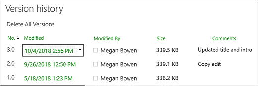

### Intelligence that helps users discover files

When users in the organization regularly store files in the Microsoft 365 cloud, they can quickly find recent files and other files that might be of interest. For example, they can discover files that coworkers or frequent collaborators are working on. [More info](https://support.office.com/article/46f92806-b52c-4187-b60e-b3bf8d25f73e)

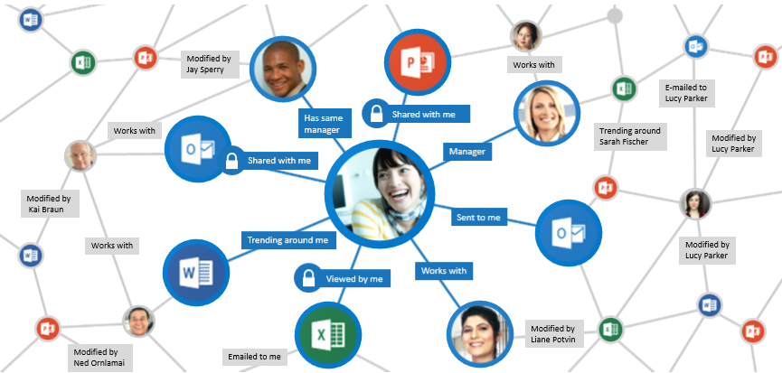

## Key features

Most of the file collaboration features in Microsoft 365 are available to you regardless of your subscription type or the size of your organization.

- Migration tools

- Modern attachments

- A hub for teamwork: Microsoft Teams

- Access to all files in OneDrive

- Syncing for offline access

- Integration with Microsoft Office

- Auditing and reporting

- Hybrid

- Multi-geo

### A hub for teamwork: Microsoft Teams

In the past, users would have to frequently switch between tools to collaborate. For example, users would write a document in Word. Then they would switch to Outlook to share the document as an attachment. Or they would open a browser to upload the document to a SharePoint site. In Microsoft 365, users can use Teams to chat, make calls, and have online meetings. They don't have to leave Teams to view and even edit the files they share. [Learn more](https://support.office.com/article/9b200289-dbac-4823-85bd-628a5c7bb0ae).

> [!NOTE]
> When a user attaches a file to a chat, it's automatically uploaded to the user's individual library in OneDrive. When a user attaches a file to a Teams channel, it's automatically uploaded to the library for that team. Files shared with Yammer groups are now also saved in SharePoint.

### Access to all files in OneDrive

When your users use OneDrive, they can access their SharePoint or Microsoft Teams files [on the web](https://support.office.com/article/9275de7b-0b0b-40ee-8fa2-b17d1b0727d0#web_app) or [in the mobile app](https://support.office.com/article/9275de7b-0b0b-40ee-8fa2-b17d1b0727d0#mobile_app) without leaving OneDrive. [Learn more](https://support.office.com/article/9275de7b-0b0b-40ee-8fa2-b17d1b0727d0) 

Because individual libraries in OneDrive are powered by SharePoint, users can easily move files between locations. For example, if a user drafts a file in their individual library in OneDrive, and later wants a team to own the file, the user can simply move the file to the team's library.

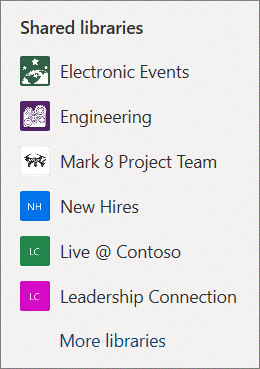

### Syncing for offline access

With the [OneDrive sync app](https://onedrive.live.com/about/download/), users can sync files between their computer and the Microsoft 365 cloud. When users add, change, or delete a file or folder locally, the file or folder is added, changed, or deleted in the cloud and vice versa. Users can work with synced files directly in File Explorer and the apps they use. Whenever the user is online, any changes that they or other users make will sync automatically. With Files On-Demand (available with Windows 10 and Mac), users can easily browse and organize files in OneDrive and SharePoint by using File Explorer or Finder, but the files don't take up space on the local computer. [Learn more about Files On-Demand](https://support.office.com/article/0e6860d3-d9f3-4971-b321-7092438fb38e).

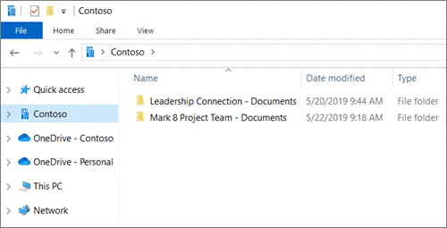

### Modern attachments in Outlook

If your users are used to sharing files as attachments in Outlook, they can use the same steps they're familiar with to share a link to a file instead of emailing a copy. Within Outlook, users can even change the permission they give to the recipient. [Learn more about attaching files](https://support.office.com/article/BDFAFEF5-792A-42B1-9A7B-84512D7DE7FC).

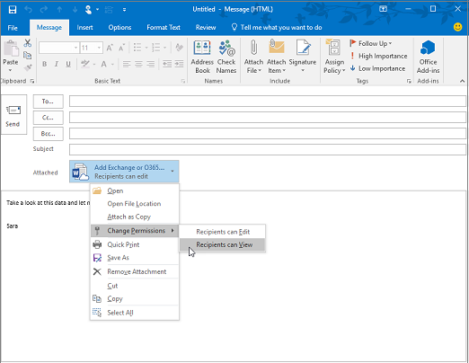

### Integration with Microsoft Office

In the Office apps, users can easily [open files saved in the Microsoft cloud](https://support.office.com/article/97f087d8-3136-4485-8e86-c5b12a8c4176) and [save documents to OneDrive](https://support.office.com/article/b9e0c0a9-2bd7-42cf-9178-24d60c51ac75). [Learn more](https://support.office.com/article/ea3807bc-2b73-406f-a8c9-a493de18258b). When users comment on an Office document and use the **@** sign with someone's name, the person mentioned receives mail with a link to the comment. Clicking the link brings them into the document and into the conversation.

### Migration tools

You can choose one or more of the following options, depending on the number and location of files that you want to migrate.

- **SharePoint Migration Tool**. To migrate files from file shares or on-premises SharePoint, you can use the SharePoint Migration Tool. For info, see [How the SharePoint Migration Tool works](https://docs.microsoft.com/sharepointmigration/how-the-sharepoint-migration-tool-works/).

- **Known Folder Move**. If your users save most of their files to their Desktop, Documents, and Pictures folders, you can seamlessly move them to OneDrive using [Known Folder Move](https://docs.microsoft.com/onedrive/redirect-known-folders) so users can continue working in the locations they're used to.  
    

- **FastTrack migration benefit**.  FastTrack provides you with a set of best practices, tools, resources, and experts. Guidance includes migrating content from file shares, Box, or Google Drive source environments, and introducing capabilities at the pace that works for you. The FastTrack data migration benefit will also perform specific data migration activities on your behalf if you have 500 or more licenses. See more details in the [FastTrack Center Benefit Overview](https://docs.microsoft.com/fasttrack/data-migration/). To get started, go to [FastTrack.Microsoft.Com](https://www.microsoft.com/fasttrack/), review resources, and submit a request for assistance.

### Hybrid

If your organization uses SharePoint Server, setting up a hybrid environment can help you move to the cloud at your own pace. Hybrid features let you tie the two environments together in a variety of ways to make a more seamless user experience. You can consolidate search results between SharePoint Server and Microsoft 365, consolidate user profiles in Microsoft 365, and migrate your users' individual storage to OneDrive. [Get started exploring hybrid](https://docs.microsoft.com/SharePoint/hybrid/hybrid).

### Auditing and reporting

In the new SharePoint admin center, you can see [SharePoint activity and usage reports](https://docs.microsoft.com/sharepoint/get-started-new-admin-center), and go to the Microsoft 365 admin center for details.

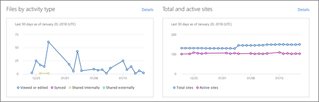

### Multi-geo

If you're a multinational organization with data residency requirements, you can use Multi-Geo in Microsoft 365 to specify where files are stored. For info, see [Multi-Geo Capabilities in OneDrive and SharePoint Online in Microsoft 365](https://docs.microsoft.com/office365/enterprise/multi-geo-capabilities-in-onedrive-and-sharepoint-online-in-microsoft-365/).

### Unified search

Microsoft Search helps users find files within modern SharePoint sites and from the SharePoint start page, Office.com, Bing, and more. [Learn more about the modern search experience in SharePoint](https://support.office.com/article/b81ab573-ec9c-4aa9-a369-b3c630f878a7).

## Management options

As a global or SharePoint admin for your organization, you have a couple of options for managing SharePoint sites and settings:

- **New SharePoint admin center**. In the new SharePoint admin center, you can create and delete sites, manage site settings, and manage organization-level settings for SharePoint and OneDrive. The **Active sites** page of the SharePoint admin center lets you view the SharePoint sites in your organization, including communication sites and sites that belong to Microsoft 365 Groups. It also lets you sort and filter sites, search for a site, and create new sites. [Get started with the new SharePoint admin center](https://docs.microsoft.com/sharepoint/get-started-new-admin-center).

    

- **Microsoft PowerShell**. The SharePoint Online Management Shell is a PowerShell module that lets you run command-line operations. It makes performing batch operations more efficient, and is the only way to perform some management tasks in SharePoint and OneDrive. [Get started with the SharePoint Online Management Shell](https://docs.microsoft.com/powershell/sharepoint/sharepoint-online/connect-sharepoint-online?view=sharepoint-ps).

## Prerequisites

**Purchase and assign licenses**. SharePoint comes with Microsoft 365 plans and Office 365 plans. It also comes as a standalone plan. For more info about the features available in each plan, see the [SharePoint Online service description](https://docs.microsoft.com/office365/servicedescriptions/sharepoint-online-service-description/sharepoint-online-service-description). Some security features, such as Azure Information Protection, require an E3 or E5 plan. Cloud App Security, Advanced Threat Protection, Customer Lockbox, Customer Key, Advanced eDiscovery. For info, see <https://docs.microsoft.com/office365/servicedescriptions/office-365-platform-service-description/office-365-platform-service-description>.

**Assign the SharePoint admin role**. Users assigned this role will have access to the SharePoint admin center and can change organization-level SharePoint and OneDrive settings, create and delete sites, and change site owners and other site settings. [Learn more about the SharePoint admin role](https://docs.microsoft.com/sharepoint/sharepoint-admin-role).

**Estimate and test your network bandwidth**. Before you roll out Microsoft 365 in your organization, make sure that your network is set up for optimum performance. [Network planning and performance tuning](https://docs.microsoft.com/office365/enterprise/network-planning-and-performance). Before you deploy the sync app, make sure you also [estimate the bandwidth users will need for syncing](https://docs.microsoft.com/onedrive/network-utilization-planning).

## Limitations

- For info about SharePoint limits, see the [SharePoint service description](https://docs.microsoft.com/office365/servicedescriptions/sharepoint-online-service-description/sharepoint-online-limits).

- For info about file name, size, and type limits when using the OneDrive sync app, see [Invalid file names and file types](https://support.office.com/article/64883a5d-228e-48f5-b3d2-eb39e07630fa).

## Manage feature changes

- To learn about features coming soon, see the [Microsoft 365 Roadmap](https://www.microsoft.com/microsoft-365/roadmap).

- To keep on top of the latest SharePoint features rolling out, refer to the [Message Center](https://docs.microsoft.com/office365/admin/manage/message-center?view=o365-worldwide).

- To vote on feature requests or submit your own idea, visit the [SharePoint UserVoice](https://sharepoint.uservoice.com/).

## Plan user adoption

User adoption is important to the overall success of any rollout. To maximize your investment, you need to maximize your user engagement. To do that, start by focusing on three critical success factors:

- **Stakeholders.** Securing the participation and buy-in of key people within your organization is critical to successful user adoption. This support can come from business-focused leaders, IT leadership, or anyone else who has a vested interest in seeing Microsoft 365 file collaboration succeed in your organization. It's important to have both executive or business leader support and product champions to help carry the knowledge to their peers. Whether you're formally delegating the product champion role or allowing it to grow organically, champions are mission critical to user adoption. Studies have shown that people prefer to learn from a coworker than from an IT employee. For more information about how to identify key stakeholders, see the [Identify key stakeholders guide](https://aka.ms/execsponsor). For more information about building a sustainable champion community, see [Build a champion program](https://aka.ms/office365champions).

- **Scenarios.** Identify and define your business scenarios and how those scenarios align with the benefits of file collaboration in Microsoft 365. Work with your key stakeholders to identify the goals of the business scenarios, and then match those goals against usage scenarios. For example, a business goal may be to maximize user productivity; a key usage scenario enabling that goal would be using OneDrive to access files from mobile devices, PCs, and Macs. For help with this process, see the [Office 365 Productivity Library](https://www.microsoft.com/microsoft-365/success/?rtc=1).

- **Awareness and training.** Creating awareness through awareness campaigns such as announcements, launch events, newsletters, town hall meetings, contests, and giveaways is a critical path to maximizing adoption. In addition, providing users with knowledge through classroom-style sessions and self-help guides helps them feel empowered to use OneDrive and Office 365. For more information about user communication and training on Office 365, see the [Plan your Office 365 Launch: Communication and Training Guide](https://aka.ms/commandtraining).

Many resources are available from Microsoft to help you drive user adoption within your environment. For more information about a recommended Microsoft 365 user adoption strategy, see the [Microsoft 365 End User Adoption Guide](https://fto365dev.blob.core.windows.net/media/Default/DocResources/en-us/Microsoft%20365%20User%20Adoption%20Guide.pdf). For more information about driving user engagement, see [Success Factors for Office 365 End User Engagement](https://fto365dev.blob.core.windows.net/media/Default/DocResources/en-us/Resources/Office365_AdoptionBrochure_v2.0_Screen.pdf). You can also contribute to or comment on adoption-related ideas in the [Driving Adoption Tech Community](https://techcommunity.microsoft.com/t5/Driving-Adoption/ct-p/DrivingAdoption).

## Configure settings

To prepare for file collaboration in Microsoft 365, configure the following settings.

### Site creation

When a Microsoft 365 group is created from anywhere within Microsoft 365, a SharePoint site is automatically created. You can let all users create groups, only some users, or you can block group creation and manage it centrally in your IT department. For info, see [Manage who can create Office groups](https://docs.microsoft.com/office365/admin/create-groups/manage-creation-of-groups). You can also use a naming policy for groups and set an expiration period so that groups that are no longer being used will be deleted. For more info, see [Plan for governance in Microsoft 365 Groups](https://docs.microsoft.com/office365/admin/create-groups/plan-for-groups-governance?view=o365-worldwide). If you allow users to create groups, you can also allow them to create team sites from the SharePoint start page and from OneDrive and manage default site settings. For info, see [Manage site creation](https://docs.microsoft.com/sharepoint/manage-site-creation).

### Sharing

To set up external sharing in your organization, you need to make sure that settings across multiple admin centers are set the way you want. Sharing with people outside your organization is enabled by default in SharePoint and OneDrive, but disabled for Microsoft Teams. [Configure Microsoft 365 to enable guest collaboration for Teams](https://docs.microsoft.com/Office365/Enterprise/collaborate-as-a-team). Set the external sharing level and the default sharing link type.

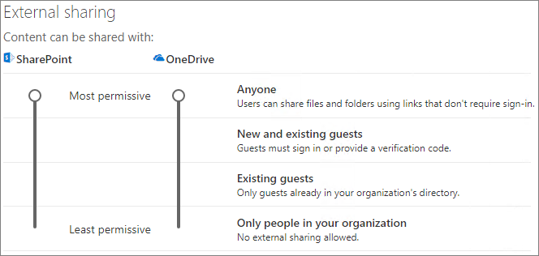

### Security

- Design and deploy retention labels and DLP policies to protect sensitive and highly confidential files. [Learn how](https://docs.microsoft.com/microsoft-365/compliance/protect-sharepoint-online-files-with-microsoft-365-labels-and-dlp).

- Block or limit access from unmanaged devices, sign out inactive users on unmanaged devices, or allow access from only specific IP address ranges. For info about setting up identity and device-access policies to protect content, see [Policy recommendations for securing SharePoint sites and files](https://docs.microsoft.com/microsoft-365/enterprise/sharepoint-file-access-policies).  

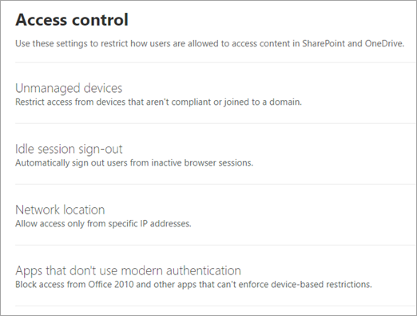

### Storage

By default, file storage for team sites is managed automatically. If you prefer to control storage manually, see [Manage site storage limits](https://docs.microsoft.com/sharepoint/manage-site-collection-storage-limits). For info about setting the default storage space for individual libraries in OneDrive, see [Set the default storage space for OneDrive users](https://docs.microsoft.com/onedrive/set-default-storage-space). For information about the amount of storage that comes with your plan, see [SharePoint Online limits](https://docs.microsoft.com/office365/servicedescriptions/sharepoint-online-service-description/sharepoint-online-limits).

### Specify team site libraries to sync automatically

To let users easily access team site files from File Explorer (as they might have previously accessed network file shares), you can specify particular team site libraries to sync on your users' computers automatically. To do this, use the OneDrive Group Policy object "[Configure team site libraries to sync automatically](https://docs.microsoft.com/onedrive/use-group-policy#configure-team-site-libraries-to-sync-automatically)." Your users need to be running Windows 10 and OneDrive Files On-Demand must be enabled.
