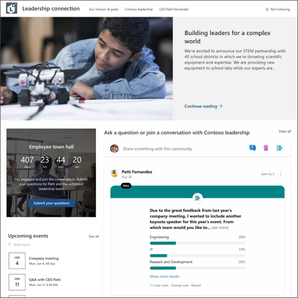
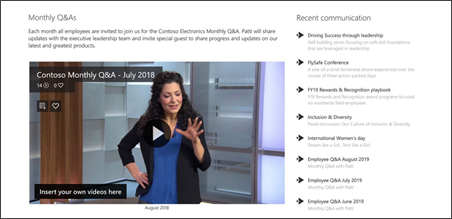
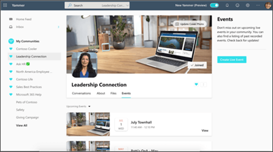
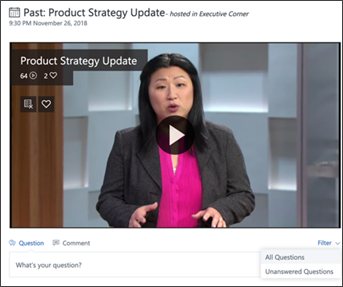
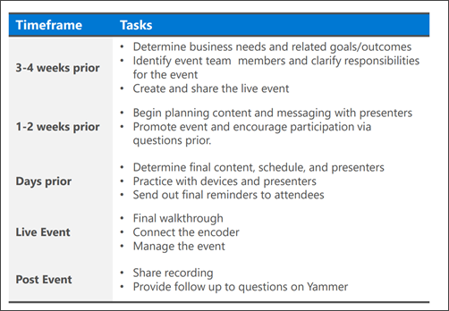
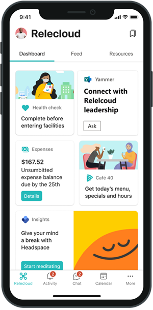

# Leadership connection: Use Microsoft 365 to connect leaders and teams

Microsoft 365 can help your organization's leadership teams connect with employees to build community around a common purpose and goal. Learn how to create a culture and internal place to help engage and connect leadership teams with the rest of your organization.

**Help unite your organization by:**

- Creating a sustainable, two-way dialogue between leadership and the rest of the organization by removing communication barriers
- Hosting organizational or department-wide meetings with live Q&A sessions so everyone is up-to-speed on leadership initiatives
- Sharing relevant news, ideas, and updates to encourage employees to engage and network with leadership teams
- Using analytics to gain insights on engagement and understand the impact of activities
- Bringing elements of the experience together using Viva Connections

|Stage|Tasks|
|---|---|
|**Plan**|- Define audience profile and scope audience size   - Align with stakeholders   - Develop a support team that ensures content is relevant, plan future events, and publish news   - Consider multi-geo and multi-lingual options   - Find corporate sponsorship and champions   - Determine success metrics|
|**Build**|- Create a SharePoint leadership site   - Start a new community in Viva Engage   - Set up news that can be shared in SharePoint, Teams, and Outlook   - Use M365 groups to provide access to large audiences   - Use audience targeting to make sure your audience can find the right content   - Get user feedback before launching your communications   - Plan a kickoff event and identify promotional channels|
|**Launch**|- Share the leadership SharePoint site, Viva Engage community, and event invites with their intended audiences   - Send email invites to the kickoff event   - Use Microsoft Teams and Viva Engage to post messages about the kickoff event   - Equip champions and corporate sponsors with promotional materials   - Produce and host a live event with Q&A   - Create feedback channels   - Post the event recording on the leadership connection site|
|**Maintain**|- Ensure content stays relevant   - Audit M365 group membership, access, and settings periodically   - Develop a news publishing cycle   - Schedule regular events and share them in advance|

## Plan your leadership connection strategy
Start by making sure you understand your audience's needs and preferences. Review [how to profile and scope your audience](audience-profile.md). This scenario will have the most successful outcome when multiple communication methods are combined. Start with a SharePoint communication site and a Viva Engage channel that connects the organization with leadership. Then, plan and host a live event that is recorded and shared with others. Finally, bring all these communication elements together into an engaging mobile experience using Viva Connections.

- **1. SharePoint communication site** - Create a SharePoint communication site that houses all things leadership – everything from news and announcements to events, people profiles and networking opportunities. [Use the Leadership connection site template.](https://support.microsoft.com/office/use-the-sharepoint-leadership-connection-site-template-a2996d9f-c08e-4de6-8696-a7de323c8add)
- **2. Viva Engage community** - [Use Viva Engage](https://support.microsoft.com/office/join-and-create-a-community-in-yammer-56aaf591-1fbc-4160-ba26-0c4723c23fd6) to instantly connect, ask questions, and share ideas with the leadership team. Then, [use the Viva Engage web part](https://support.microsoft.com/office/join-and-create-a-community-in-yammer-56aaf591-1fbc-4160-ba26-0c4723c23fd6) to embed the conversation on the leadership connection SharePoint site.
- **3. Viva Engage live events** - Use the [Viva Engage community for live events](/stream/live-event-m365#live-events-and-microsoft-365) and questions and answers.
- **4. Viva Connections** - Bring the SharePoint site and Viva Engage conversation into one place where users can catch up and connect with leaders in the Microsoft Teams mobile app. [Learn more about Viva Connections](guide-to-setting-up-viva-connections.md).

### Planning considerations

- Multiple communication solutions can be combined to provide opportunities across the organization to connect with leadership regardless of worksite location or time zone.
- Create opportunities outside of a live event to allow everyone within the organization to connect, network, and learn from leadership teams.
- Develop communication channels that collect feedback and questions for the leadership team, and save responses for the next live event.
- Create a practice of recording live events that can be shared and viewed later.
- Build durable communication methods that do not require organized events to generate content.
- Identify other opportunities across the organization to spread awareness about the leadership connection initiative such as new. employee orientation, regular communications to networking groups, and promotion in employee resource groups.

## Build your communication strategy
Start by creating or using an existing SharePoint communication site. Then connect a new or existing Viva Engage community to the SharePoint site using the Viva Engage conversations web part. Then, plan and host live events, share the recordings on the leadership site, and keep the conversation going in Viva Engage channels.

## Step 1: Create a SharePoint leadership site
SharePoint communication sites are a great tool to create a landing place to share leadership news, initiatives, and opportunities to network and connect. This is an ideal opportunity to use the [Viva Engage web part](https://support.microsoft.com/office/use-a-yammer-web-part-in-sharepoint-online-a53cfa0c-3d09-42c8-a286-1038a81c59da) on the home page to connect to an existing Viva Engage community that connects leadership team members with the rest of the organization. Use the [Events web part](https://support.microsoft.com/\office/use-the-events-web-part-5fe4da93-5fa9-4695-b1ee-b0ae4c981909) to post and [target leadership events to specific audiences](https://support.microsoft.com/office/target-navigation-news-and-files-to-specific-audiences-33d84cb6-14ed-4e53-a426-74c38ea32293).

**Image of the Leadership connection site template:**

**Share recording from leadership events:**

**Showcase leadership profiles:**

#### Get started creating your SharePoint leadership site
There are several resources that can help you quickly create a leadership site:

- Use a SharePoint site template provided by Microsoft. [Apply the Leadership connection template](https://support.microsoft.com/office/use-the-sharepoint-leadership-connection-site-template-a2996d9f-c08e-4de6-8696-a7de323c8add), then customize the site to for the needs of your organization.
- Create your own leadership site following [step-by-step instructions in this guided walkthrough](https://support.microsoft.com/office/guided-walkthrough-creating-a-leadership-site-for-your-organization-e4a984db-d277-45ab-b18e-fa117b25bb4d).
- Use the Leadership connection template in the SharePoint look book by navigating to the [custom PnP site templates](/sharepoint/dev/solution-guidance/applying-pnp-templates) and selecting the template you need. Learn how to [apply the PnP templates here](/sharepoint/dev/solution-guidance/applying-pnp-templates).

#### Publish news from the leadership site
Once your leadership site has been created and shared with the right audiences, you can [publish news from this site](https://support.microsoft.com/office/create-and-share-news-on-your-sharepoint-sites-495f8f1a-3bef-4045-b33a-55e5abe7aed7). Then, use the [News web part](https://support.microsoft.com/office/use-the-news-web-part-on-a-sharepoint-page-c2dcee50-f5d7-434b-8cb9-a7feefd9f165) on the home page to display leadership news and [target leadership news to specific audiences](https://support.microsoft.com/office/target-navigation-news-and-files-to-specific-audiences-33d84cb6-14ed-4e53-a426-74c38ea32293). Other sites across your organization can customize the settings in the News web part to pull news from an organizational news site. Consider cross promoting leadership news on the home site, on a new employee onboarding site, and where other leadership-oriented news can be found.

#### Monitor usage analytics for your SharePoint site
As a SharePoint site owner, you can view information about how users interact with your site. For example, you can view the number of people who have visited the site, how many times people have visited the site, and a list of files that have received the most views. Learn more about how to [access usage data for your leadership site](https://support.microsoft.com/office/view-usage-data-for-your-sharepoint-site-2fa8ddc2-c4b3-4268-8d26-a772dc55779e).

## Step 2: Create a leadership community in Viva Engage
Communities in Viva Engage help employees share knowledge, engage with others in the employee experience, and provide a social platform for company-wide communications. It can also be used to drive leadership engagement by providing a central place for your conversations, documents, events, and updates. Viva Engage can help you host a live event with [moderated Q&A](https://support.microsoft.com/office/drive-engagement-in-a-classic-viva-engage-live-event-c0244ad8-6dcb-419c-add9-2e4a00543412) for up to 10,000 attendees.

**Use Viva Engage to help engage your organization by:**

- Engaging employees in the goals and vision of the company
- Informing employees about strategic initiatives and important updates
- Showing employees that their feedback is being heard by senior leadership

If your organization doesn't already have a Viva Engage community that includes members of the leadership team, start by [creating a new Viva Engage community](https://support.microsoft.com/office/join-and-create-a-community-in-viva-engage-56aaf591-1fbc-4160-ba26-0c4723c23fd6). Then, [use the Viva Engage web part](https://support.microsoft.com/office/use-a-yammer-web-part-in-sharepoint-online-a53cfa0c-3d09-42c8-a286-1038a81c59da) to embed conversations or highlights from existing Viva Engage communities on the SharePoint site.

New to Viva Engage? Learn more about [managing a community in Viva Engage](https://support.microsoft.com/office/manage-a-community-in-yammer-4f590d87-16ff-4035-9124-d7add883df67) and [administrative tips and tricks](https://onedrive.live.com/?authkey=%21AJbveZ0P7DPno9c&cid=8D13E85F1CF91770&id=8D13E85F1CF91770%21187&parId=root&o=OneUp). Help [onboard your organization to Viva Engage](https://onedrive.live.com/view.aspx?resid=8D13E85F1CF91770!237&ithint=file%2cdocx&authkey=!AMh1sXi46TE875I) and help others understand [how to use Viva Engage](https://onedrive.live.com/view.aspx?resid=8D13E85F1CF91770!254&ithint=file%2cpptx&authkey=!ACrN15bnGCy_ZTs).

#### Monitor conversations and engagement insights
[Viva Engage community insights](https://support.microsoft.com/office/view-community-insights-in-yammer-48bc648e-b567-49d7-b2b5-5fea23777c46) help you measure your community's reach and engagement. You can find out more about the people, conversations, and questions and answers that make up your community. [Learn more about managing communities in Viva Engage](https://support.microsoft.com/office/manage-a-group-in-yammer-6e05c6d6-5548-4c88-89cd-e6757a514ef2).

## Step 3: Host a live leadership event in Viva Engage with Q&A
Create and produce live events for people in the leadership Viva Engage network, with built-in discussions for use before, during, and after the event. Up to 10,000 people can attend at once from anywhere on their device or computer (higher limits for event attendees are temporarily available through the [Microsoft 365 Live Events Assistance program](/stream/live-events-assistance). Make the video available after the event on the leadership site, so that people who can't make it at the scheduled time can still participate.

**Image of live questions and answers during an event**

There are two ways [live events in Viva Engage can be produced](https://support.microsoft.com/office/organize-a-live-event-in-viva-engage-7338782a-4f0b-4fd0-a6c3-33625906ead1). The requirements depend on which video production methods you intend to use in your organization. Learn more about which method of live event you should use. For live events that only require visual and audio support, consider [hosting a live event using Viva Engage in Teams](https://support.microsoft.com/office/schedule-and-produce-a-live-event-in-new-yammer-using-teams-d891bff6-eda2-493f-8b0d-d87932e7937d).

Once you've determined the right method for your live event, get started organizing and scheduling the event.

Learn more about [how to organize the live event in Viva Engage](https://support.microsoft.com/office/organize-a-live-event-in-new-viva-engage-7338782a-4f0b-4fd0-a6c3-33625906ead1). Review the [Viva Engage live event playbook](https://support.office.com/article/organize-a-live-event-in-yammer-105dd7af-9caf-4a5e-8a44-56d203e96551) and [Viva Engage live event FAQs](https://support.microsoft.com/office/new-yammer-live-event-faq-ec9deff2-3181-4300-a204-c809729e4dff) to understand all the different roles and responsibilities, how to ensure the event goes smoothly, and how to drive engagement. Consider using guidance from [How to host a town hall for your organization](hold-town-hall-using-yammer.md) to plan your live event.

### Insights and engagement metrics for live events
Before the event starts, you will have access to a dashboard that will help you understand event reach, engagement during the event, top conversations, and more. Insights are only available to event organizers and producers. Learn more about [how to view live event data](https://support.microsoft.com/office/get-insights-about-live-events-in-yammer-2ce5e236-8b72-4715-88ea-a8e15d9488ba) and use insights to host powerful live events.

## Step 4: Expand your reach and engagement using Viva Connections
Bring the SharePoint leadership site, news, and conversations from the Viva Engage community into one central place in Microsoft Teams using [Viva Connections](/viva/connections/viva-connections-overview). Viva Connections creates an opportunity to push specific content and display popular resources by combining the power of your SharePoint intranet with Microsoft Teams and other Microsoft 365 apps like Viva Engage and Stream. 

**Use Viva Connections to:**

- Meet your employees in the apps and devices they know and love with a personalized view of news, conversations, and communities
- Promote events, news, and conversations in Viva Connections dashboard to specific audiences using audience targeting
- Boost important news and announcements to the top of employees' news feeds

Viva Connections offers added functionality through three primary components - the Dashboard, the Feed, and Resources. 

- **Dashboard:** [The Viva Connections Dashboard](/viva/connections/viva-connections-overview#viva-connections-dashboard) is your employee’s digital toolset. It brings together the tools your employees need, enabling quick and easy access whether they are in the office or in the field.
- **Feed:** [The Feed](/viva/connections/viva-connections-overview#viva-connections-feed) delivers updates to the right people at the right time and is tightly integrated with Viva Engage, SharePoint news, and Stream to display a personalized feed, based on post-level targeting of the groups that employees belong to.
- **Resources:** [The Resources](/viva/connections/viva-connections-overview#viva-connections-resources) experience enables way finding across platforms. It uses navigation elements from the SharePoint app bar, which can be [audience targeted](https://support.microsoft.com/office/target-navigation-news-files-links-and-web-parts-to-specific-audiences-33d84cb6-14ed-4e53-a426-74c38ea32293).

## Launch and manage your communication strategy
Help others in your organization discover the leadership connection resource. Consider [hosting a kickoff event in Viva Engage](https://support.microsoft.com/office/organize-a-live-event-in-new-viva-engage-7338782a-4f0b-4fd0-a6c3-33625906ead1) to announce the new SharePoint site and Viva Engage community. Set the tone for what to expect in terms of ongoing engagement, mentorship and networking opportunities, event, and news publishing schedules.

**Launch checklist:**

- Assign site owners and content authors who will be responsible for making sure the leadership site and news are always up to date
- Make sure your audience has [access to the SharePoint site](https://support.microsoft.com/office/share-a-site-958771a8-d041-4eb8-b51c-afea2eae3658)
- Make sure your audience has been [added to the Viva Engage community](https://support.microsoft.com/office/manage-yammer-community-members-75253554-d0f3-4148-b835-e6a9a8a0c294)
- Assign a Viva Engage community moderator and [review Viva Engage community best practices](https://techcommunity.microsoft.com/t5/yammer-blog/7-tips-to-run-a-successful-yammer-community-formerly-group/ba-p/444720)
- [Use audience targeting](https://support.microsoft.com/office/target-navigation-news-and-files-to-specific-audiences-33d84cb6-14ed-4e53-a426-74c38ea32293) to highlight leadership events, news, and links to the leadership SharePoint site across your intranet
- Check site [SharePoint usage and analytics](https://support.microsoft.com/office/view-usage-data-for-your-sharepoint-site-2fa8ddc2-c4b3-4268-8d26-a772dc55779e) and [Viva Engage community insights](https://support.microsoft.com/office/view-community-insights-in-yammer-48bc648e-b567-49d7-b2b5-5fea23777c46) during and after the launch to measure engagement

## More resources

[Overview of corporate communications](corporate-communications-overview.md)

[Use the SharePoint Leadership connection site template](https://support.microsoft.com/office/use-the-sharepoint-leadership-connection-site-template-a2996d9f-c08e-4de6-8696-a7de323c8add)

[Viva Connections for leaders](https://resources.techcommunity.microsoft.com/viva-connections/leaders/)

