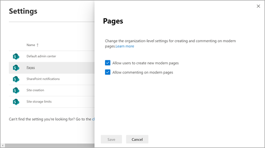

# Allow users to create modern pages

Using modern pages in Microsoft SharePoint is a great way to share ideas using images, Office files, video, and more. Users can [Add a page to a site](https://support.office.com/article/b3d46deb-27a6-4b1e-87b8-df851e503dec) quickly and easily, and modern pages look great on any device. 
  
If you're a global or SharePoint admin in Microsoft 365, you can allow or prevent users from creating modern pages. You can do this at the organization level by changing settings in the SharePoint admin center. If you allow the creation of site pages as the organization level, site owners can [turn it of or off at the site level](https://support.office.com/article/787F3BA1-9DF6-480A-AB4C-9F4525490CB9). 
  
> [!NOTE]
> If you want to prevent members from creating or modifying any SharePoint pages on a site, go to Site Pages, select **Settings**  > **Library settings** > **Permissions for this document library**, and then set the Members group to Read. 
  
## Change page creation settings at the organization level 

1. Go to the [Settings page of the new SharePoint admin center](https://admin.microsoft.com/sharepoint?page=settings&modern=true), and sign in with an account that has [admin permissions](/sharepoint/sharepoint-admin-role) for your organization.

    >[!NOTE]
    >If you have Office 365 Germany, [sign in to the Microsoft 365 admin center](https://go.microsoft.com/fwlink/p/?linkid=848041), then browse to the SharePoint admin center and open the Settings page. <br>If you have Office 365 operated by 21Vianet (China), [sign in to the Microsoft 365 admin center](https://go.microsoft.com/fwlink/p/?linkid=850627), then browse to the SharePoint admin center and open the Settings page.
    
2. Select **Pages**.
    
3. Select or clear **Allow users to create new modern pages**.

    > [!NOTE]
    > Preventing users from creating modern pages hides the following options:<br>- On the Site Pages and Site contents pages > **New** > **Page**.<br>- **Settings**  > **Add a page**.<br>Users can still add pages from other modern pages, either from the New menu or from modern webparts (such as News). 

4. You can also select to allow or prevent commenting on modern pages. If you allow commenting, it can be turned on or off at the page level. 

    


    
## Prevent users from creating modern pages on a specific site by using PowerShell

1. [Download the latest SharePoint Management Shell](https://go.microsoft.com/fwlink/p/?LinkId=255251).
    
2. Install the [SharePoint Client Components SDK](https://www.microsoft.com/download/details.aspx?id=42038).
    
3. Connect to SharePoint as a [global admin or SharePoint admin](/sharepoint/sharepoint-admin-role) in Microsoft 365. To learn how, see [Getting started with SharePoint Management Shell](/powershell/sharepoint/sharepoint-online/connect-sharepoint-online).
    
    > [!NOTE]
    > Read [About Execution Policies](https://go.microsoft.com/fwlink/?linkid=869255) and make sure you run the SharePoint Management Shell as an administrator and the correct execution policy to run unsigned scripts. 
  
4. Copy the following code and paste it into a text editor, such as Notepad. 
    

   ```PowerShell
   # Load SharePoint Online Client Components SDK Module
   Import-Module 'C:\Program Files\Common Files\microsoft shared\Web Server Extensions\16\ISAPI\Microsoft.SharePoint.Client.dll'

   # Set script constants
   $sitePagesFeatureIdString = 'B6917CB1-93A0-4B97-A84D-7CF49975D4EC'

   # Set up client context
   $userName = Read-Host "Username"
   $password = Read-Host "Password" -AsSecureString
   $siteUrl = Read-Host "Site Url"
   $webUrl = Read-Host "Server-Relative Web Url"
   $context = New-Object Microsoft.SharePoint.Client.ClientContext($siteUrl)
   $credentials = New-Object Microsoft.SharePoint.Client.SharePointOnlineCredentials($userName, $password)
   $context.Credentials = $credentials

   # Get the list of existing features
   $web = $context.Site.OpenWeb($webUrl)
   $features = $web.Features
   $context.Load($features)
   $context.ExecuteQuery()

   # Verify that the Site Pages feature is present in the web
   if(($features | ? { $_.DefinitionId -eq $sitePagesFeatureIdString }).Count -eq 0)
   {
       Write-Host "The Site Pages feature is already disabled in this web"
       return
   }

   # Remove the Site Pages feature from the web
   $features.Remove((new-object 'System.Guid' $sitePagesFeatureIdString), $false)
   $context.ExecuteQuery()

   # Verify that the Site Pages feature is no longer present in the Web
   $web = $context.Site.OpenWeb($webUrl)
   $features = $web.Features
   $context.Load($features)
   $context.ExecuteQuery()
   if(($features | ? { $_.DefinitionId -eq $sitePagesFeatureIdString }).Count -eq 0)
   {
       Write-Host "The Site Pages feature has been successfully disabled"
   }
   else
   {    
       throw "The Site Pages feature failed to be disabled"
   } 
   ```


5. Save the text file, and then change its extension. In this example, we name it SitePagesOut.ps1.
    
    > [!NOTE]
    > You can use a different file name, but you must save the file as an ANSI-encoded text file whose extension is .ps1. 
  
6. Change to the directory where you saved the file.
    
7. Run the following command:
    
   ```
   ./SitePagesOut.ps1
   ```

8. The script will prompt you for a **SiteUrl** and **WebUrl**. 
    
   If you have a site such as "https://contoso.sharepoint.com/sites/marketing/northwindcompete"
    
   For the **SiteUrl** you would enter:  `https://contoso.sharepoint.com/sites/marketing`
    
   And for the **WebUrl** you would enter  `sites/marketing/northwindcompete`
    
## Allow users to create modern pages on a specific site by using PowerShell

1. [Download the latest SharePoint Management Shell](https://go.microsoft.com/fwlink/p/?LinkId=255251).
    
2. Install the [SharePoint Client Components SDK](https://www.microsoft.com/download/details.aspx?id=42038).
    
3. Connect to SharePoint as a [global admin or SharePoint admin](/sharepoint/sharepoint-admin-role) in Microsoft 365. To learn how, see [Getting started with SharePoint Management Shell](/powershell/sharepoint/sharepoint-online/connect-sharepoint-online).
    
    > [!NOTE]
    > Read [About Execution Policies](https://go.microsoft.com/fwlink/?linkid=869255) and make sure you run the SharePoint Online Management Shell as an administrator and the correct execution policy to run unsigned scripts. 
   
4. Copy the following code and paste it into a text editor, such as Notepad. 
    
   ```PowerShell
   # Load SharePoint Online Client Components SDK Module
   Import-Module 'C:\Program Files\Common Files\microsoft shared\Web Server Extensions\16\ISAPI\Microsoft.SharePoint.Client.dll'
  
   # Set script constants
   $sitePagesFeatureIdString = 'B6917CB1-93A0-4B97-A84D-7CF49975D4EC'

   # Set up client context
   $userName = Read-Host "Username"
   $password = Read-Host "Password" -AsSecureString
   $siteUrl = Read-Host "Site Url"
   $webUrl = Read-Host "Server-Relative Web Url"
   $context = New-Object Microsoft.SharePoint.Client.ClientContext($siteUrl)
   $credentials = New-Object Microsoft.SharePoint.Client.SharePointOnlineCredentials($userName, $password)
   $context.Credentials = $credentials

   # Get the list of existing features
   $web = $context.Site.OpenWeb($webUrl)
   $features = $web.Features
   $context.Load($features)
   $context.ExecuteQuery()

   # Verify that the Site Pages feature is not present in the web
   if(($features | ? { $_.DefinitionId -eq $sitePagesFeatureIdString }).Count -gt 0)
   {
       Write-Host "The Site Pages feature is already enabled in this web"
       return
   }

   # Add the Site Pages feature back to the web
   $features.Add((new-object 'System.Guid' $sitePagesFeatureIdString), $false, [Microsoft.SharePoint.Client.FeatureDefinitionScope]::None)
   $context.ExecuteQuery()

   # Verify that the Site Pages feature is now present in the web
   $web = $context.Site.OpenWeb($webUrl)
   $features = $web.Features
   $context.Load($features)
   $context.ExecuteQuery()
   if(($features | ? { $_.DefinitionId -eq $sitePagesFeatureIdString }).Count -gt 0)
   {
       Write-Host "The Site Pages feature has been successfully enabled"
   }
   else
   {
       throw "The Site Pages feature failed to be enabled"
   }
   ```

5. Save the text file, and then change its extension. In this example, we name it SitePagesIn.ps1.
    
    > [!NOTE]
    > You can use a different file name, but you must save the file as an ANSI-encoded text file whose extension is .ps1. 
  
6. Change to the directory where you saved the file.
    
7. Run the following command:
    
   ```powershell
   ./SitePagesIn.ps1
   ```

8. The script will prompt you for a **SiteUrl** and **WebUrl**. 
    
    If you have a site such as "https://contoso.sharepoint.com/sites/marketing/northwindcompete"
    
    For the **SiteUrl** you would enter:  `https://contoso.sharepoint.com/sites/marketing`
    
    And for the **WebUrl** you would enter  `sites/marketing/northwindcompete`
    

