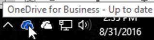
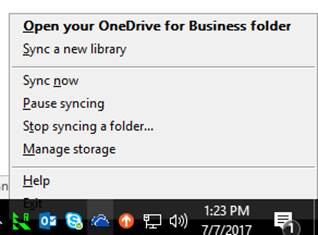
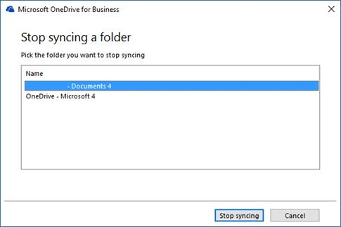

# Let users sync IRM-protected files with the OneDrive sync client

This article is for Office 365 global or SharePoint admins who want their users to be able to sync IRM-protected SharePoint document libraries and OneDrive locations using the new OneDrive sync client. 
  
## Prerequisites

> [!NOTE]
> Any IRM-protected files will maintain their IRM protection during the sync process, both during upload and download.

- You've applied [Information Rights Management (IRM) to a list or library](https://support.office.com/article/3bdb5c4e-94fc-4741-b02f-4e7cc3c54aa1). (On-premises SharePoint Server libraries can't be synced with the new OneDrive sync client.)
    
- Your users have disabled syncing using the previous OneDrive for Business sync client
    
## Known issues

- This feature doesn't support the IRM setting that expires document access rights.
    
## Disabling the previous OneDrive for Business sync client

To prevent reliability issues, any users that are using the previous OneDrive for Business sync client (Groove.exe) to sync an IRM-protected library must disable syncing.
  
1. On a computer that uses the previous OneDrive for Business sync client to sync IRM-protected libraries, right-click the blue OneDrive for Business icon in the notification area, at the far right of the taskbar:
    
    
  
2. Click **Stop syncing a folder**.
    
    
  
3. Select the IRM-protected library and click **Stop syncing**.
    
    
  
## Setup instructions

To enable this feature, you need to install the RMS client on your users' computers. [Download the Rights Management Service client](https://aka.ms/odirm).
  
To silently install the client on computers, use the /qn switch as part of the command-line options of the Microsoft Windows Installer Tool (Msiexec.exe). For example, the following command shows the silent mode installation (assuming the RMS Client installer package is already downloaded to C:\Downloads).
  
msiexec /qn c:\downloads\setup.msi
  
You can have the setup file on a network share and use managed software deployment to run the msiexec command.
  
## To sync an IRM-protected library

Have your users browse to the library in SharePoint and click the Sync button. This will open the OneDrive sync client and create the sync relationship for the location.
  

