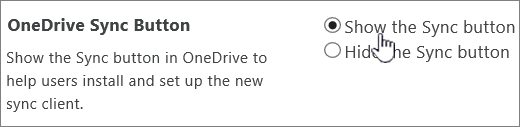
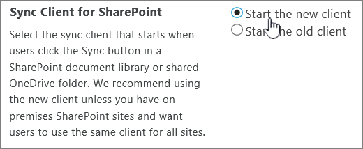

# Let users sync SharePoint files with the new OneDrive sync app

This article is for IT administrators in large organizations who want to enable users in their organizations to sync SharePoint team sites with the new OneDrive sync app. Smaller organizations and organizations that are new to Microsoft 365 are already set up to sync OneDrive and SharePoint files with the new OneDrive sync app.
  
When you enable this feature, users will be able to sync the files in a SharePoint team site to their PCs and Macs using the OneDrive sync app (OneDrive.exe). As part of this, they will be able to:
  
- Browse to a SharePoint site or shared folder and click **Sync** to sync all contents in the document library or only selected folders that are important to them.
    
- Change the folders they sync directly from their PC or Mac.
    
- Sync shared folders.
    
- Sync read-only files and folders.
    
- Coauthor files in real time with Office 2016 (C2R build 16.0.7167.2xxx or MSI build 16.0.4432.100x)
    
- Automatically transition from the existing OneDrive for Business sync app (Groove.exe)
    
   
## Deploy and configure the OneDrive sync app

To enable users in your organization to sync SharePoint team sites with the OneDrive sync app, you first need to deploy the OneDrive sync app to your organization.
  
See [Deploy the new OneDrive sync app using Microsoft Endpoint Configuration Manager](/onedrive/deploy-on-windows)
  
See [Deploy and configure the new OneDrive sync app for Mac](/onedrive/deploy-and-configure-on-macos)

For info about the latest sync app releases, see [New OneDrive sync app release notes](https://support.office.com/article/845dcf18-f921-435e-bf28-4e24b95e5fc0).
  
## Set SharePoint to sync with the OneDrive sync app

1. Go to the [Settings page of the new SharePoint admin center](https://admin.microsoft.com/sharepoint?page=settings&modern=true), and sign in with an account that has [admin permissions](/sharepoint/sharepoint-admin-role) for your organization.

>[!NOTE]
>If you have Office 365 Germany, [sign in to the Microsoft 365 admin center](https://go.microsoft.com/fwlink/p/?linkid=848041), then browse to the SharePoint admin center and open the Settings page.  If you have Office 365 operated by 21Vianet (China), [sign in to the Microsoft 365 admin center](https://go.microsoft.com/fwlink/p/?linkid=850627), then browse to the SharePoint admin center and open the Settings page.
    
2. Select **classic settings page**.
    
3. Make sure "OneDrive Sync Button" is set to "Show the Sync button."
    
    
  
    To sync SharePoint files with the new client, you must also sync OneDrive files with the new client.
    
4. For "Sync Client for SharePoint," select **Start the new client**.
    
    
  
    > [!NOTE]
    > If you don't see the "Sync Client for SharePoint" setting on the Settings page, your organization is already set up to use the new OneDrive sync app. When users sign in to the OneDrive sync app (OneDrive.exe), it will automatically take over syncing the site libraries that the previous new OneDrive sync app (Groove.exe) was syncing. For information about how this works, and about the types of libraries that will continue syncing with the previous sync app, see [Transition from the previous OneDrive for Business sync app](/onedrive/transition-from-previous-sync-client). 
  
5. Select **OK**.
    
    These changes take several hours to propagate. To check that they've propagated, go to a SharePoint site and select **Sync**. In the browser dialog that confirms the request to open a program, the "Program" should appear as "Microsoft OneDrive" and the "Address" should start with "odopen://"
    
## See also

[Sync SharePoint files with the new OneDrive sync app](https://support.office.com/article/6de9ede8-5b6e-4503-80b2-6190f3354a88)
