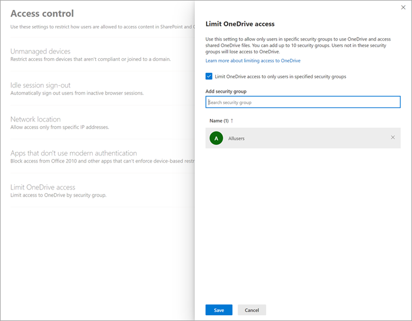

# Limit OneDrive access by security group

[!INCLUDE[Advanced Management](includes/advanced-management.md)]

Use this setting if you want to allow only users in specified security groups to access OneDrive. Even if other users outside of these security groups are licensed for OneDrive, they won’t have access to their own OneDrive or any shared OneDrive content.

## Requirements

To access and use this feature, your organization must have one of the following subscriptions: 

- Office 365 E5/A5 
- Microsoft 365 E5/A5 
- Microsoft 365 E5 Compliance/A5 Compliance 

## Enablement

To enable this feature:

1. Go to <a href="https://go.microsoft.com/fwlink/?linkid=2185071" target="_blank">Access control in the SharePoint admin center</a>, and sign in with an account that has [admin permissions](/sharepoint/sharepoint-admin-role) for your organization.

2. Select **Limit OneDrive access**.

3. Select **Limit OneDrive access to only users in specified security groups**.

   

4. Add the security groups you want to be able to use OneDrive.

5. Select **Save**.

> [!NOTE]
> Users who aren't included in the security groups you added will lose access to their own OneDrive and any shared OneDrive content.
