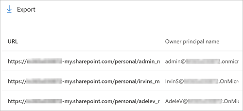

# View OneDrive URLs for users in your organization

As a global or SharePoint admin in Microsoft 365, you may need to confirm the OneDrive URLs for specific users in your organization. Whether you’re troubleshooting, provisioning new accounts, or simply ensuring accurate information, understanding the methods to retrieve OneDrive URLs is essential.

## About OneDrive URLs

The URL for a user's OneDrive is usually in the following format: `https://<tenant name>-my.sharepoint.com/personal/<user principal name>`. For the user principal name (UPN), any special characters such as a period, comma, space, and the at sign ("@") are converted to underscores ("_"). See the following table for examples.

|Domain  |UPN  |OneDrive URL  |
|---------|---------|---------|
|`onmicrosoft.com`     |      `rsimone@contoso.onmicrosoft.com`   |    `https://contoso-my.sharepoint.com/personal/rsimone_contoso_onmicrosoft_com`     |
|custom     |    `rsimone@contoso.com`     |   `https://contoso-my.sharepoint.com/personal/rsimone_contoso_com`      |

Numbers or GUIDs might be appended to the URL if a conflict is detected, so it's always best to confirm a user's OneDrive URL if you need to specify it.

> [!NOTE]
> Unless OneDrive accounts are [pre-provisioned](pre-provision-accounts.md), the URL isn't created until a user accesses their OneDrive for the first time.
>
> Also, the OneDrive URL will automatically change if the user's [UPN changes](upn-changes.md). For example, if the user changes their name or the domain name changes for a rebranding or business restructuring.
  
## Use the OneDrive usage report to view the list of OneDrive users and URLs

1. Go to the [OneDrive usage report in the Microsoft 365 admin center](https://admin.microsoft.com/#/reportsUsage/OneDriveSiteUsage) and sign in as a SharePoint admin, global admin, global reader, or reports reader. (If you see a message that you don't have permission to access the page, you don't have one of these roles in your organization.)

   > [!NOTE]
   > If you have Office 365 operated by 21Vianet (China), [sign in to the Microsoft 365 admin center](https://go.microsoft.com/fwlink/p/?linkid=850627), browse to **Reports** \> **Usage**. Under  **OneDrive files**, select **View more**.

2. Scroll to the table below the charts.

    

 If you see GUIDs in the table instead of URLs and names, go to the [Reports setting](https://admin.microsoft.com/Adminportal/Home?source=applauncher#/Settings/Services/:/Settings/L1/Reports) and clear the box **In all reports, display de-identified names for users, groups, and sites**.

You can copy individual OneDrive URLs from the URL column. For easier searching and copying, export the table as a .csv file. In the upper left of the table, select **Export**.

[Learn more about the Microsoft OneDrive usage report](/microsoft-365/admin/activity-reports/onedrive-for-business-usage-ww)

## Use PowerShell to create a list of all the OneDrive URLs in your organization

<a name="BKMK_Step2"> </a>

The list you create in these steps will be saved to a text file.
  
1. [Download the latest SharePoint Online Management Shell](https://go.microsoft.com/fwlink/p/?LinkId=255251).

    > [!NOTE]
    > If you installed a previous version of the SharePoint Online Management Shell, go to Add or remove programs and uninstall "SharePoint Online Management Shell."

2. Save the following text to a PowerShell file. For example, you could save it to a file named OneDriveSites.ps1.

    ```PowerShell
    $TenantUrl = Read-Host "Enter the SharePoint admin center URL"
    $LogFile = [Environment]::GetFolderPath("Desktop") + "\OneDriveSites.log"
    Connect-SPOService -Url $TenantUrl
    Get-SPOSite -IncludePersonalSite $true -Limit all -Filter "Url -like '-my.sharepoint.com/personal/'" | Select -ExpandProperty Url | Out-File $LogFile -Force
    Write-Host "Done! File saved as $($LogFile)."
    ```

3. Open the SharePoint Online Management Shell. Navigate to the directory where the script has been saved and run:

    ```PowerShell
    PS C:\>.\OneDriveSites.ps1
    ```

   > [!NOTE]
   > If you get an error message about being unable to run scripts, you might need to change your execution policies. For info, see [About Execution Policies](/powershell/module/microsoft.powershell.core/about/about_execution_policies).

4. The script will prompt you for the SharePoint admin center URL. For example, `https://contoso-admin.sharepoint.com` is the Contoso SharePoint admin center URL.

5. You'll then be prompted to sign in. Use a SharePoint admin or global admin account.

After the script successfully completes, a text file is created in the location specified by the **$LogFile** variable in the script. This file contains a list of all OneDrive URLs in your organization. The following text provides an example of how the list of URLs in this file should be formatted.
  
```https
https://contoso-my.sharepoint.com/personal/annb_contoso_onmicrosoft_com/
https://contoso-my.sharepoint.com/personal/carolt_contoso_onmicrosoft_com/
https://contoso-my.sharepoint.com/personal/esterv_contoso_onmicrosoft_com/  
https://contoso-my.sharepoint.com/personal/hollyh_contoso_onmicrosoft_com/
```

Once you have the URL for a user's OneDrive, you can get more info about it by using the [Get-SPOSite](/powershell/module/sharepoint-online/get-sposite) cmdlet, and change settings by using the [Set-SPOSite](/powershell/module/sharepoint-online/set-sposite) cmdlet.

### Additional Methods to Retrieve OneDrive URLs

#### Method 1: Using the **Diagnostic Information** section in OneDrive settings

1. As an admin of the OneDrive site, navigate to the site.
2. In the upper right-hand corner, click the settings or gear icon.
3. Select "OneDrive Settings."
4. Choose "More Settings."
5. Under the "Diagnostic Information" section, copy the OneDrive Web URL.

#### Method 2: Using PnP PowerShell (Get-PnPUserProfileProperty)
PnP PowerShell is a versatile tool for managing SharePoint and OneDrive. To retrieve the PersonalURL (OneDrive URL) for a user, follow these steps:

1. **Install PnP PowerShell** if you haven't already. Run the following command in PowerShell:
    ```powershell
    Install-Module PnP.PowerShell -Scope CurrentUser
    ```
    - If you need more details on installation, refer to the official PnP PowerShell installation guide.

2. Run the following command:
    ```powershell
    Get-PnPUserProfileProperty -Account "user@example.com" | Select-Object -ExpandProperty PersonalUrl
    ```
    - Replace `"user@example.com"` with the actual user's email address.

#### Method 3: Microsoft Graph API
The Microsoft Graph API provides programmatic access to OneDrive and other Microsoft 365 services. To get the OneDrive URL using Graph API:

1. **Install the Microsoft Graph PowerShell module** if you haven't already. Use this command:
    ```powershell
    Install-Module Microsoft.Graph
    ```
    - For step-by-step instructions, check out this tutorial on installing PnP PowerShell for SharePoint Online and Azure Cloud Shell.

2. Authenticate and connect to Microsoft Graph:
    ```powershell
    Connect-MgGraph -Scopes "Directory.ReadWrite.All", "Sites.ReadWrite.All", "Files.ReadWrite.All"
    ```

3. Retrieve the OneDrive URL for a specific user:
    ```powershell
    $userPrincipalName = "user@example.com"
    $userObject = Get-MgUser -Filter "userPrincipalName eq '$userPrincipalName'"
    $userOneDrive = Get-MgUserDefaultDrive -UserId $userObject.id
    $oneDriveWebUrl = $userOneDrive.webUrl
    Write-Host "OneDrive WebURL for $userPrincipalName: $oneDriveWebUrl"
    ```

