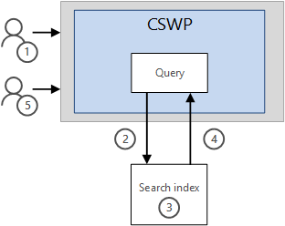
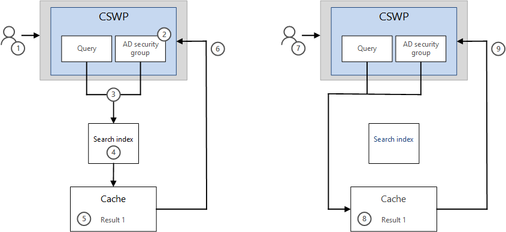

# Make pages load faster with caching in the Content Search Web Part

[Configure a Content Search Web Part in SharePoint](https://support.office.com/article/0dc16de1-dbe4-462b-babb-bf8338c36c9a) (CSWP) offers a lot of flexibility for configuring the query it contains. However, if you configure the Web Part to use a very complex query, or if you have many CSWPs on a page, the page can take longer time to load. To make the page load faster, you can configure the CSWP to cache search results for users who belong to the same AD security groups. Because it's faster to look up search results in the cache than in the search index, the page loads faster. 
  
When you have configured a CSWP to use caching, it will first look in the cache for existing search results that match the query and the AD security group. If it doesn't find any search results in the cache, it will look in the search index. 
  
We recommend that you use caching only in CSWPs that are on pages that have more than 10 page loads per 15 minutes, for example on popular home pages or on category pages that are starting points for navigating to more detailed catalog pages.
  
> [!TIP]
> See [Configure a Content Search Web Part in SharePoint](https://support.office.com/article/0dc16de1-dbe4-462b-babb-bf8338c36c9a#BKMK_Tips) for other things you can do to make pages load faster. 
  
## Configure a Content Search Web Part (CSWP) to use caching

1. Make sure that you're a member of the Designers SharePoint group on the site that contains the CSWP.
    
2. Go to the page that contains the CSWP.
    
3. From **Settings**, select **Edit Page**.
    
4. Select the CSWP that you want to configure.
    
5. In the Web Part tool pane, in the **Properties** section, in the **Search Criteria** section, select **Change query**.
    
6. Go to the **SETTINGS** tab. 
    
7. In the **Caching** section, select **Group: Everyone except external users**, or select **Group:** and then enter the name of the AD security group you want to use. 
    
    > [!NOTE]
    > To test that the CSWP returns the expected results, you have to be member of the AD security group that you select. 
  
> [!TIP]
> You can't look up the name of your AD security groups from the CSWP. To look up your AD security groups, go to your Azure classic portal. For more information, see [Managing groups in Azure Active Directory](https://azure.microsoft.com/documentation/articles/active-directory-accessmanagement-manage-groups/.)
  
## When should I use caching?

Before you change all your Content Search Web Parts (CSWP) to use caching, you should consider the characteristics of the page where the CSWPs are used:
  
- **What type of page is the CSWP on?** Caching works great in CSWPs that are on home pages or pages that many users have as a starting point when they browse for information. CSWPs on category pages that are starting points for navigating to more detailed catalog pages, can also benefit from caching. 
    
- **How many page loads does the page have?** We recommend that you use caching only in CSWPs that are on pages with more than 10 page loads per 15 minutes. 
    
- **Is the CSWP configured to show different results to different users?** If the CSWP query involves too many user groups, the search result combinations can overload the cache, and the page load time will not be reduced, or may even increase. 
    
The example below shows an intranet page with four CSWPs. On average, the page has 38 page loads per 15 minutes. These page characteristics suggest that the page can load faster if you configure some of the CSWPs to use caching. 
  

  
Let's look at the individual CSWPs:
  
- CSWP 1 shows a featured company news story, in this case a news story about upcoming training.
    
- CSWP 2 shows other company news stories.
    
- CSWP 3 shows popular documents in your department.
    
- CSWP 4 shows the documents you have been working on recently.
    
The queries in **CSWP 1 and 2** are configured to **show the same results to all users**. That means you can probably make the page load faster by configuring these two CSWPs to use caching. 
  
The queries in **CSWP 3 and 4** are configured to **show different results to different users**. 
  
 **CSWP 3** shows one set of results to people who work in the HR department, and another set of results to people who work in the Sales department. In most cases, you can make the page load faster by using caching in this Web Part. However, if you have many small departments with only a few employees in each department, the number of search results that'll be stored in the cache could overload the cache and actually increase the page load time. 
  
 **CSWP 4** shows which documents the logged-in user has worked on recently. You should not use caching in this Web Part. Because the query is tailored to each user, all individual search results will be stored in the cache. This will overload the cache and might increase the page load time. 
  
## How does caching make web pages load faster?

First, let's look at how search results are displayed in a Content Search Web Part (CSWP) **without** caching: 
  
1. A user goes to a page that has a CSWP.
    
2. The query in the CSWP is sent to the search index.
    
3. Search finds results in the search index, and removes any search results that the users in the assigned AD security group are not allowed to see.
    
4. The search results are sent from the search index to the CSWP, where the user sees the results.
    
5. A second user goes to the same page, and steps 2 - 4 are repeated.
    
    
  
Now let's look at how results are displayed in a Content Search Web Part (CSWP) **with** caching: 
  
1. A user goes to a page that has a CSWP.
    
2. An AD security group, for example **Everyone except external users**, is assigned in the CSWP. This example assumes that the user who visits the page belongs to the assigned AD security group.
    
3. The query and the assigned AD security group in the CSWP is combined, and search first looks for a matching query and security group in the cache. If it doesn't find any matching results in the cache, the query is sent to the search index. 
    
4. Search finds results in the search index, and removes any results that the users in the assigned AD security group are not allowed to see.
    
5. The search result is sent from the search index to the cache where it is stored (Result 1).
    
6. The search result is served from the cache to the CSWP, where the user sees the result.
    
7. A second user goes to the same page. The second user belongs to the same AD security group as the first user.
    
8. Search finds existing search results for the combination of the query and the AD security group in the cache.
    
9. The search result is served from the cache to the CSWP where the users sees the result. 
    
    
  
Because it's quicker to look up search results in the cache than in the search index, the page loads faster. 
  
> [!IMPORTANT]
> The cache expires after 15 minutes. It's repopulated by the first user that goes to the page after the cache has expired, so page load time might be longer for the first user that repopulates the cache after an expiration. 
  
## Troubleshooting: newly added content does not show up in CSWP results

The Content Search Web Part (CSWP) shows search results from content that has been crawled and added to the search index. When you configure the CSWP to use caching, it shows matching results from the cache, and not from the search index. Search results, **also empty search results**, are stored in the cache for a maximum of 15 minutes before the cache expires. 
  
If you search for newly added content before the content has been crawled and included in the search index, the cache will contain an **empty search result** for the query until the cache expires, and the content will not show up in the CSWP results. 
  
If newly added content does not show up in the CSWP: 
  
1. Make sure that the content has been crawled and added to the search index. Search for the content in a search box, or in a CSWP that does not use caching, until you can find the content.
    
2. Wait for at least 15 minutes to let the CSWP cache expire, and try again.
    
3. If you still don't see any results, check that you're a member of the AD security group that has been assigned to the CSWP. If you're not a member of the AD security group, you will not see any search results.
    
> [!NOTE]
> SharePoint Online automatically crawls and adds new content to the search index at scheduled intervals, but you can also [manually request crawling and re-indexing of a site, a library or a list](crawl-site-content.md). 
  

