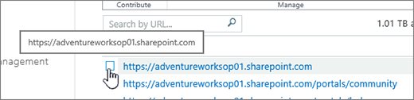
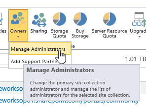
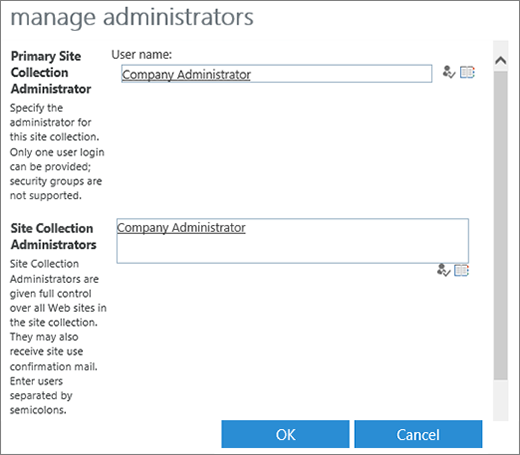

# Manage administrators for a site collection

This article describes how global admins and SharePoint admins in Office 365 can add and remove site collection admins for any site collection. If you're an owner of a communication site, or a site that belongs to an Office 365 group, see [Manage your SharePoint site settings](https://support.office.com/article/8376034d-d0c7-446e-9178-6ab51c58df42#__BKMKMngSitePermissions) for info about giving people access to your site. If you're a site collection admin for a classic site, see [Manage your SharePoint site settings](https://support.office.com/article/8376034d-d0c7-446e-9178-6ab51c58df42#id0eaabaaa=server). 
  
> [!NOTE]
> If you're a global admin and want info about assigning other users the SharePoint admin role in Office 365, see [Assigning admin permissions](https://support.office.com/article/F44FBE43-7E11-475B-A1B2-3F00719A853A). 
  
## Add or remove site collection admins

If a site belongs to an Office 365 group, you can add or remove group members in the Office 365 admin center. For info, see [Add or remove members from Office 365 groups using the Office 365 admin center](https://support.office.com/article/e186d224-a324-4afa-8300-0e4fc0c3000a). 
  
If you want to change the admins for a communication site or a site that belongs to an Office 365 group, and you as the global or SharePoint admin are also an owner of the site, see [Manage your SharePoint site settings](https://support.office.com/article/8376034d-d0c7-446e-9178-6ab51c58df42#__BKMKMngSitePermissions). If you aren't a site owner, you need to use PowerShell to add or remove site owners. For info, see [Add-PnPSiteCollectionAdmin](https://go.microsoft.com/fwlink/?linkid=872301) and [Remove-PnPSiteCollectionAdmin](https://go.microsoft.com/fwlink/?linkid=872302).
  
To add or remove site collection admins on classic sites, use the SharePoint admin center:
  
1. Sign in to Office 365 as a global admin or SharePoint admin.
    
2. Select the app launcher icon  in the upper-left and choose **Admin** to open the Office 365 admin center. (If you don't see the Admin tile, you don't have Office 365 administrator permissions in your organization.) 
    
3. In the left pane, choose **Admin centers** > **SharePoint**.
    
4. Point to the site collection for which you want to change the administrators, and then select the check box in front of it. 
    
  
5. Click **Owners**, and then click **Manage Administrators**.
    
  
6. Change the name in the **Primary Site Collection Administrator** box, or add or remove names in the **Site Collection Administrators** box. 
    
  
7. Click **Check Names** to verify that the user names are valid. 
    
8. Click **OK** **.**
    

