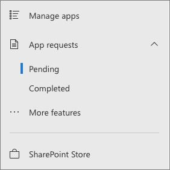
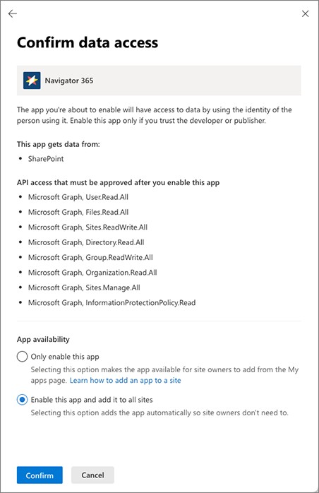

# Manage app requests

When users request an app, they are requesting that an admin get that app on their behalf. In an app request, users can request a specific number of licenses, and they can provide a business justification for why they need the app. App requests are saved to the App Requests list in the Apps site.

To manage app requests
1. Go to the [More features page of the new SharePoint admin center](https://admin.microsoft.com/sharepoint?page=classicfeatures&modern=true), and sign in with an account that has [admin permissions](./sharepoint-admin-role.md) for your organization.

   > [!NOTE]
   > If you have Office 365 Germany, [sign in to the Microsoft 365 admin center](https://go.microsoft.com/fwlink/p/?linkid=848041), then browse to the SharePoint admin center and open the More features page.
   > 
   > If you have Office 365 operated by 21Vianet (China), [sign in to the Microsoft 365 admin center](https://go.microsoft.com/fwlink/p/?linkid=850627), then browse to the SharePoint admin center and open the More features page.

1. Under **Apps**, select **Open**, and then select **More features**.

1. Select **Configure store settings**.

1. Expand **App Requests**, and then select **Pending**.

   

To approve an app    
1. In the **App Requests** list, select a request.
    
1. On the app request form, add any comments in the **Comments** field.
    
1. Select **Approve and add this app**.

1. If the app allows you to automatically add it to all sites, choose if you want to add it to all sites.

1. Confirm the data access required by the app by selecting **Confirm**.

   

1. If the app requires additional permissions, go to the API access page to approve those permissions.

1. Close the panel.

To decline an app    
1. In the **App Requests** list, select a request.
    
1. On the app request form, add any comments in the **Comments** field.
    
1. Select **Decline request**.

1. On the confirmation panel, select **Decline request**.

If you didn't add the app to all sites in the approval process, users need to add it to the site. See [Add an app to a site](https://support.office.com/article/dd98e50e-d3db-4ecb-9bb7-82b189822d43).
    
Site users who request apps can view their requests by going to **Settings** \> **Add an app** \> **Your Requests**.

## Related topics

[Add an app to a site](https://support.office.com/article/dd98e50e-d3db-4ecb-9bb7-82b189822d43)

[Office Store and SharePoint Store Terms of Use](https://support.office.com/article/64c7f343-16b5-40bb-b39f-66c9d1c4d405)

