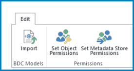
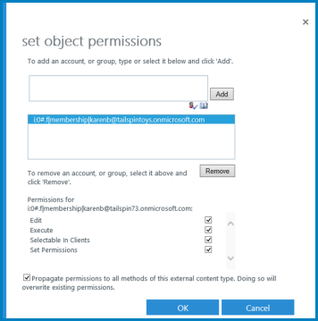
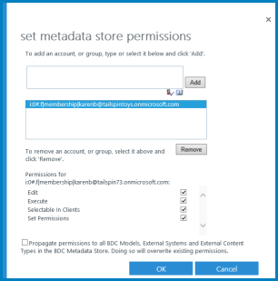
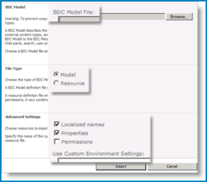
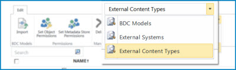
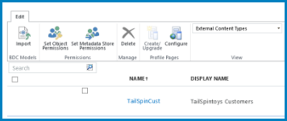
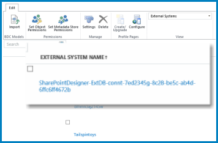
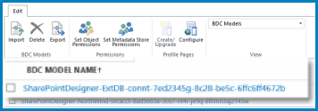

# Manage Business Connectivity Service Applications

In SharePoint for Microsoft 365, you can create Business Connectivity Services (BCS) connections to data sources, such as SQL Azure databases or Windows Communication Foundation (WCF) web services, that are outside the SharePoint site. Once you've created these connections, you can manage or edit BCS information in the SharePoint admin center. Microsoft SharePoint uses BCS together with Secure Store Services to access and retrieve data such as BDC Models from external data systems. See also [Deploy a Business Connectivity Services hybrid solution in SharePoint](/sharepoint/hybrid/deploy-a-business-connectivity-services-hybrid-solution).
  
## Manage BCS permissions

After setup is complete, user permissions control access to the data that the connection provides. BCS has two types of permissions:
  
- Object permissions
    
- Metadata Store permissions
    

  
### Object permissions

Object permissions apply only to a specific External System, BDC Model, or External Content Type (ECT). Each ECT is a securable object. For example, if you have an ECT called WCFBookSales, object permissions apply only to the WCFBookSales object, and not to any other ECT that might be defined. 
  
To set object permissions for an object, follow these steps.
  
1. Go to the [More features page of the new SharePoint admin center](https://admin.microsoft.com/sharepoint?page=classicfeatures&modern=true), and sign in with an account that has [admin permissions](/sharepoint/sharepoint-admin-role) for your organization.

>[!NOTE]
>If you have Office 365 Germany, [sign in to the Microsoft 365 admin center](https://go.microsoft.com/fwlink/p/?linkid=848041), then browse to the SharePoint admin center and open the More features page.  If you have Office 365 operated by 21Vianet (China), [sign in to the Microsoft 365 admin center](https://go.microsoft.com/fwlink/p/?linkid=850627), then browse to the SharePoint admin center and open the More features page.
 
2. Under **BCS**, select **Open**.
  
3. In the **business data catalog** section, select **Manage BDC Models and External Content Types**.
    
4. Select the check box next to the name of the ECT or external system that you want to manage. 
    
5. On the ribbon, select **Set Object Permissions**.
    
    
  
6. Enter a user account or group name in the text box, and then select **Add**. You can also select **Browse** to look for the name that you want. 
    
7. Select the name of the account or group for which you want to set access to the ECT or external system. You can set permissions for only one account at a time. If you have multiple accounts or groups, you have to set levels of access for each account separately, by selecting them one at a time. 
    
    The following table describes the permissions and their associated access levels.
    
|**Permission**|**Notes**|
|:-----|:-----|
|Edit    |Allows the user or group to create External Systems and BDC Models, to import BDC Models, and to Export BDC Models. This setting should be reserved for highly privileged users.    |
|Execute    |Allows the user or group to execute operations (create, read, update, delete, or query) on ECTs.    |
|Selectable in clients    |Allows the user or group to create external lists for any ECTs, and to view the ECTs in the external item picker.    |
|Set permissions    |Allows the user, group, or claim to set permissions on the Metadata Store.    At least one user or group must have this permission on every BCS connection so that permissions management can occur. With this permission, a user can grant **Edit** permissions to the Metadata Store. This setting should be reserved for highly privileged users    |
   
### Metadata Store Permissions

Metadata Store permissions apply globally to the whole BCS store. That is, they apply to all BDC Models, external systems, ECTs, methods, and methods instances that are defined for that external data system. You can set permissions on the metadata store to determine who can edit items and set permissions for the store.
  
Metadata Store permissions apply to many objects, such as BDC Models, ECTs, and external systems. Because Metadata Store permissions can replace object permissions, they must be managed carefully. When applied with forethought, Metadata Store permissions can grant access quickly and completely.
  

  
To set Metadata Store permissions, follow these steps.

1. In the left pane of the new SharePoint admin center, select **More features**.
 
2. Under **BCS**, select **Open**.

3. Select **Manage BDC Models and External Content Types**.
    
4. On the ribbon, select **Set Metadata Store Permissions**.
    
5. Enter a user account or group into the text box, and then select **Add**. You can also select **Browse** to look for the account that you want. 
    
6. The account or group will appear in the second text box. If you have multiple accounts or groups, you must select them one at a time to set the level of access.
    
|**Permission**|**Notes**|
|:-----|:-----|
|Edit    |Allows the user or group to create External Systems and BDC Models, to import BDC Models, and to export BDC Models. This setting should be reserved for highly privileged users.    |
|Execute    |Allows the user or group to execute operations (create, read, update, delete, or query) on ECTs.    |
|Selectable in clients    |Allow the user or group to create external lists for any ECTs, and to view the ECTs in the external item picker.    |
|Set Permissions    |Allows the user, group, or claim to set permissions on the Metadata Store.    At least one user or group must have this permission on every BCS connection so that permissions management can occur.    With this permission, a user can grant Edit permissions to the Metadata Store. This setting should be reserved for highly privileged users.    |
   
7. To propagate permissions to all items in the Metadata Store, select **Propagate permissions to all BDC Models, External Systems and External content types in the BDC Metadata Store**. If you select this option, you'll replace all existing permissions (including object permissions) that you may have set anywhere else in your selected BCS Application.
    
## Import or export a Business Data Connectivity (BDC) Model

The BDC Model view allows a user to import and export the underlying framework for the business data connection. This is very useful if you have to re-create the connection in a new environment. A BDC Model file can be imported to create an ECT connection to an external system.
  
You can import or export two types of model files:
  
 **Model** Exports the XML metadata for a selected system. 
  
 **Resource** Exports the localized names, properties, and permissions for a selected system. 
  
> [!NOTE]
>  You can create a BDC Model using XML code. If you do so, it's important to know that you cannot use the authentication modes **RevertToSelf** and **PassThrough** with SharePoint. Although you might be able to import a BDC Model that was written in XML, the connection will not be usable. 
  
### Import a BDC Model

When you import a BDC Model, you also import its specified permissions. Before you import a BDC Model, it's a good idea to understand how imported permissions interact with existing permissions. 
  
Imported permissions for a BDC Model are added to the store of existing permissions in the BDC service. If an entry for an object already exists in the access control list, the existing value is overwritten with the permissions information from the imported file. 
  
To import a BDC Model, follow these steps:
  
1. In the left pane of the new SharePoint admin center, select **More features**.
 
2. Under **BCS**, select **Open**.
    
3. In the business connectivity services section, select **Manage BDC Models and External Content Types**.
    
4. On the ribbon, select **Import**.
    
5. In the **BDC Model** section, enter the name of the BDC Model File. The Model name must not include any special characters, such as ~ " # % &amp; \* : \< \> ? \ { | } or the character 0x7f. You can also select **Browse** to locate the \*.bdcm file for a BDC Model. 
    
    
  
6. In the **File Type** section, select **Model** or **Resource** as the file type that you want to import. 
    
7. In the **Advanced Settings** section, select one or more of the following resources to import: 
    
8. **Localized names** to import localized names for the ECTs in a particular locale. Imported localized names are merged with the existing localized names by Business Data Connectivity. 
    
9. **Properties** to import properties for ECTs. Imported properties are merged with the existing property descriptions by Business Data Connectivity. 
    
10. **Permissions** to import permissions for ECTs and other securable objects in the model. 
    
11. (Optional) To save the resource settings in a file for later use, type a name for the resource file in the **Use Custom Environment Settings** text box. 
    
12. Select **Import**.
    
### Export a BDC Model

You can export a BDC Model and then read its contents to determine differences between connections. This can be useful if you are troubleshooting. You can also import an exported BDC Model file into another environment for testing or reuse.
  
To export a BDC Model or Resource file, follow these steps:
   
1. In the left pane of the new SharePoint admin center, select **More features**.
 
2. Under **BCS**, select **Open**.
    
3. Select **Manage BDC Models and External Content Types**.
    
4. Select the dropdown, and in the **View** group, select **BDC Model**. 
    
5. Select the name of the BDC Model that you want to export, on the ribbon, select **Export**. 
    
6. On the Business Data Connectivity Models page, select the model or resource file to export.
    
7. On the Export page, in the **File Type** section, to specify the type of file that you want to export, select **Model** or **Resource**. 
    
8. In the **Advanced Settings** section, to further refine the data export, select one or more of the following: 
    
  - To export localized names for the ECTs in a particular locale, select**Localized names**. 
    
  - To export properties for ECTs, select **Properties**. 
    
  - To export permissions for ECTs, select **Permissions**. 
    
  - To export an implementation-specific proxy that is used to connect to the external system, select **Proxies**.
  . 
9. If you saved a file of resource settings for later use, enter the name of the file to export in the **Use Custom Environment Settings** field. 
    
10. Select **Export** to start a dialog that enables you to save a \*.bdcm file to your local drive. You can open the \*.bdcm file in a text editor. 
    
## Add actions to external content types

By adding actions to ECTs, administrators associate a uniform resource locator (URL) with an ECT. This automatically starts a specified program or opens a specified web page. 
  
Actions can specify parameters that are based on one or more fields in an ECT. For example, you can create an action for an ECT that specifies a Search page URL. The parameter for this action might be the ID of an item in the external data source. This would allow you to specify a custom action for the ECT that automates search for this item.
  
> [!NOTE]
>  When you add a new action to an ECT, that action is not added to existing external lists for that ECT. The action is only available in new external lists for the ECT. 
  
To add an action to an ECT, follow these steps.
  
1. In the left pane of the new SharePoint admin center, select **More features**.
 
2. Under **BCS**, select **Open**.
    
3. Select **Manage BDC Models and External Content Types**.
    
4. Point to the name of the ECT to which you want to add an action, and then select the arrow that appears. From the menu, to open the **Add Action** page, select **Add Action**. 
    
5. In the **Name** field, give the action a meaningful name. 
    
6. In the URL field, for the action you want to open, enter the URL.
    
    > [!NOTE]
    >  Under the control, you can find an example URL. The example shows how to add one (or more) parameter place-holders such as {0}, or {1} (http://www.adventure-works.com/sample.aspx?p0={0}&amp;p1={1} ). 
  
7. If you want web parts on the site to be able to use this new action, select one of the following options:
    
|**Command**|**Action**|
|:-----|:-----|
|Yes    |Starts the action in a new browser window (preserves the page context).    |
|No    |Starts the action in the same browser window.    |
   
8. In the **URL Parameters** field, specify any parameters that are required by the URL. These are numbered in the interface starting at 0. 
    
9. Decide if you want to use an **Icon** or not. This field also allows you to use Standard icons. 
    
10. If you want the action to be the default action, select the **Default Action** check box.
    
    > [!IMPORTANT]
    >  Parameters can contain personally identifying information such as names and Social Security numbers. When you design an action, be careful not to use fields that display personally identifying information. 
  
## View external data and external data settings

You use the **View** section of the ribbon to choose different views of BCS connections. The three views display information about the BCS connection in different ways, and give you access to different actions. It is important to become familiar with these views because some tasks are available only in specific views. 
  
The three view options are BDC Models, External Systems, and External Content Types, as shown in the following illustration.
  

  
For more information about how you can use these views to help manage BCS, see the sections that follow.
  
### External Content Types view

By default, the BCS connection uses the **External Content Types** view. This view shows Service Application Information, and lists the following information: 
  
- ECT name 
    
- ECT display name
    
- ECT type namespace
    
- Namespace version
    
- External system name
    

  
For most processes in BCS, this view is sufficient. However, if there are many ECTs, this view can be difficult to navigate.
  
### External Systems view

The **External Systems** view shows a BCS connection in terms of its system of origin. This view is useful if you want to know the BCS connection information after you create the BCS. In this view, you can see the property settings for a named External System. In addition, you can configure some of the property settings. 
  

  
#### View property settings

The name of the External System appears on this page as a selectable link (a navigable URL). You can select the URL to open a window that shows the original property settings for that store. In addition, if you are connected to SQL Azure, you can see the database server name and database, in this view.
  
Depending on the type of BCS connection, the property settings can include any combination of the following items:
  
- Access Provider (such as WCF Service)
    
- Authentication Mode (such as User's Identity)
    
- Database Server
    
- Impersonation Level (such as None, Anonymous, Identification, Impersonation, Delegation)
    
- Initial Database name
    
- Integrated Security (such as SSPI)
    
- Secure Store Implementation
    
- Secure Store Target Application ID (as the ID entered in Secure Store)
    
- Service EndPoint Address (such as the URL pointing to SomeWCFService.svc)
    
- Connection Pooling (Active/Inactive)
    
- Secondary Secure Store Target Application ID
    
- Secure Store Implementation
    
#### Configure property settings

If you point to an External System Name, you can open a shortcut menu that includes a **Settings** command. This is useful for SharePoint connections that use Windows Communication Foundation (WCF) Web Services. By selecting the **Settings** option from the menu, you can configure any of the following settings: 
  
- Metadata Exchange URL
    
- Metadata Exchange Discovery Mode
    
- Web Services Description Language (WDSL) Authentication Mode
    
- WSDL Secure Store Target Application Id
    
- Secure Store Implementation. 
    
### BDC Model view

The **BDC Model** view offers ribbon commands that enable you to import or export BDC Models. In addition, the BDC Model view can make it easier to move around in a very large collection of ECTs. Because the BDC Model shows hyperlinks for each distinct connection, rather than showing all ECTs for each connection, it can make a more manageable list. 
  

  
If you want to see all the ECTs for a BDC Model, select the name of the Model. If you select the name of an ECT, open a table that shows the fields that are defined for the ECT. It resembles the following table.
  
|**Name**|**Type**|**Display by Default**|
|:-----|:-----|:-----|
|Order Id    |System.String    |No    |
|Employee Id    |System.String    |No    |
|Freight    |System.Nullable '1[[System.Decimal, ....    |No    |
   
This display can closely mirror the layout of the data source connected via an ECT, and give better insight into the structure of the underlying data.
  
Also, at the bottom of the page, any Associations, Actions, or Filters for this ECT appear.
