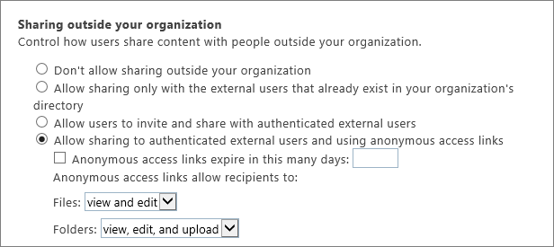
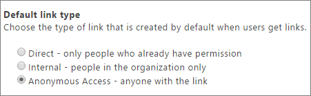
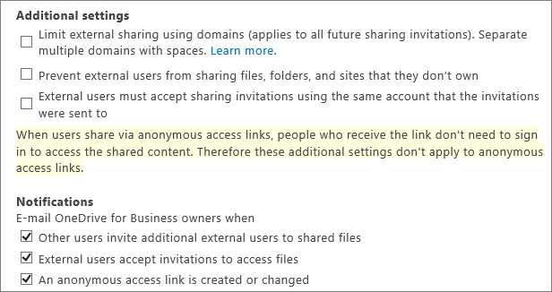
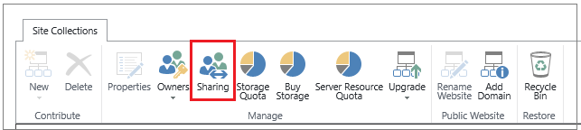
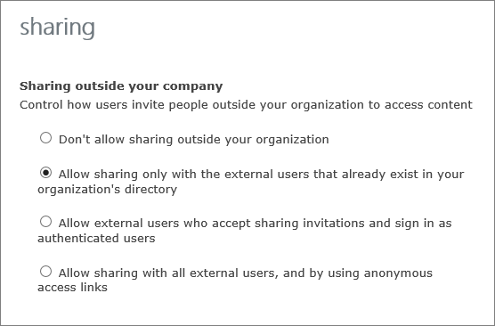

# Turn external sharing on or off for SharePoint Online

If you're working with vendors, clients, or customers outside of your organization, you might want to give them access to certain areas of your site or to specific documents. In this article, we'll show you how to turn sharing on or off sharing for SharePoint Online. You must be a SharePoint Online administrator to do this.
  
External sharing is controlled at both the tenant level (global settings that affect all of SharePoint Online) and the site collection level. The tenant-level settings determine what options are available at the site collection level.
  
The external sharing settings for individual site collections cannot be ** *less* ** restrictive than whatever is allowed at the tenant level, but these settings can be ** *more* ** restrictive. For example, if external sharing is turned on at the tenant level, but it is limited to allowing only authenticated users, then that will be the only kind of external sharing you can allow in a specific site collection. If external sharing through both sign-in and anonymous guest links is allowed at the tenant level, then those options are also available for each site collection. 
  
Choose one of the tabs below to configure sharing in SharePoint Online.
  
## 

Tenant (global)
  
### Turn external sharing on or off globally for SharePoint Online
<a name="__turn_external_sharing"> </a>

Turning external sharing on at the tenant level means that site collections can then be enabled for sharing. In turn, sites and documents in a site collection that is enabled for sharing can be enabled for sharing.
  
1. [Sign in to Office 365](e9eb7d51-5430-4929-91ab-6157c5a050b4) as a global admin or SharePoint admin. 
    
2. Select the app launcher icon  in the upper-left and choose **Admin** to open the Office 365 admin center. (If you don't see the Admin tile, you don't have Office 365 administrator permissions in your organization.) 
    
3. In the left pane, choose **Admin centers** > **SharePoint**.
    
4. From the SharePoint admin center, click **sharing**.
    
5. Select one of the following:
    
     
  
### Which option to select...
<a name="__turn_external_sharing"> </a>

|**Select this option:**|**If you want to:**|
|:-----|:-----|
|**Don't allow sharing outside your organization** <br/> |Prevent all users on all sites from sharing sites or sharing content on sites with external users. Users will not be able to share sites or content with external users, even if those users are already in your directory.  <br/> |
|**Allow sharing only with the external users that already exist in your organization's directory** <br/> |Allow sharing only for external users who are already in your directory. These users may exist in your directory because they previously accepted sharing invitations or because they were manually imported, such as through [Azure B2B collaboration](https://docs.microsoft.com/azure/active-directory/active-directory-b2b-what-is-azure-ad-b2b). (You can tell an external user because they have **#EXT#** in their user name.)  <br/> |
|**Allow users to invite and share with authenticated external users** <br/> | Require external users who have received invitations to view sites or content to sign-in with a Microsoft account before they can access the content.  <br/>  Site owners or others with full control permission can share sites with external users.  <br/>  Site owners or others with full control permissions on a site can share documents with external users.  <br/>  All external users will be required to sign in before they can view content.  <br/>  Invitations to view content can be redeemed only once. After an invitation has been accepted, it cannot be shared or used by others to gain access.  <br/> |
|**Allow sharing to authenticated external users and using anonymous access** <br/> (Optionally, you can set links to expire in a specific number of days, and select how recipients can use the links .)  <br/> | Allow site users to share sites with people who sign in as authenticated users, but you also want to allow site users to share documents through the use of anonymous guest links, which do not require invited recipients to sign in.  <br/>  Site owners or others with full control permissions can share sites with external users.  <br/>  All external users will be required to sign in before they can view content on a site that has been shared.  <br/>  When sharing documents, site owners or others with full control permissions can opt to require sign-in or send an anonymous guest link.  <br/>  When users share a document, they can grant external users either view or edit permissions to the document.  <br/>  External users who receive anonymous guest links can view or edit that content without signing in.  <br/>  Anonymous guest links could potentially be forwarded or shared with other people, who might also be able to view or edit the content without signing in.  <br/> |
   
### Additional settings
<a name="__turn_external_sharing"> </a>

 **Set a default link type**
  
To better manage the type of links users share, you can set the default type of link that shows when users select **Get a link** to share documents and folders. 
  

  
The most permissive types of links, of course, are Anonymous Access links which grant access to anyone who has the link. Internal links can be used only by users within your organization, and Direct links are accessible only by users who already have permission to access the document or folder. For more information, see [Change the default link type when users get links for sharing](change-the-default-link-type-when-users-get-links-for-sharing).
  
 **Additional settings**
  
When you choose to allow users to share outside your organization, you have some additional ways to allow or limit sharing.
  

  
 **Limit external sharing using domains**: You can allow or restrict access to specific domains. For more information, see [Restricted Domains Sharing in Office 365 SharePoint Online and OneDrive for Business](restricted-domains-sharing-in-sharepoint-online-and-onedrive-for-business).
  
 **Prevent external users from sharing files, folders, and sites they don't own**: External users cannot share anything they don't own with anyone else. 
  
 **External users must accept sharing invitations using the same account that the invitations were sent to**: External users cannot use a different account than the one that the sharing invitation was sent to get access. 
  
 **Notifications**
  
To help your OneDrive for Business users monitor and control which external users have access to their files, you can specify that owners of OneDrive for Business files and folders are emailed when:
  
- Another user invites external users to shared files
    
- An external user accepts an invitation to access their files
    
- An anonymous access link is created or changed.
    
> [!NOTE]
>  If you turn off external sharing for your entire environment and later turn it back on, external users who previously had access to content or documents on sites will regain access to them. If you know that external sharing was previously turned on and in use for specific site collections and you do not want external users to be able to regain access if external sharing is ever turned on again globally, we recommend that you first turn off external sharing for those specific site collections. >  If you disable external access, or limit external access to a more restrictive form, external users will typically lose access within one hour of the change. >  If you disable external access, access to resources will also be blocked to guest members of Office 365 Groups. 
  
Site collection
  
### Turn external sharing on or off for individual site collections
<a name="__toc332198786"> </a>

You must be a SharePoint Online admin to configure external sharing for individual site collections. Site collection administrators are not allowed to change external sharing configurations.
  
1. [Sign in to Office 365](e9eb7d51-5430-4929-91ab-6157c5a050b4) as a global admin or SharePoint admin. 
    
2. Select the app launcher icon  in the upper-left and choose **Admin** to open the Office 365 admin center. (If you don't see the Admin tile, you don't have Office 365 administrator permissions in your organization.) 
    
3. In the left pane, choose **Admin centers** > **SharePoint**.
    
4. From the SharePoint admin center, click **site collections**.
    
5. Check the box next to those site collections whose sharing settings you want to turn on or off.
    
6. In the ribbon, click **Sharing**.
    
    
  
7. Do one of the following:
    
    
  
### Which option to select...
<a name="__toc332198786"> </a>

|**Select this option:**|**If you want to:**|
|:-----|:-----|
|Don't allow sharing outside your organization  <br/> |Prevent all users on all sites from sharing sites or sharing content on sites with external users. Users will not be able to share sites or content with external users, even if those users are already in your directory.  <br/> |
|Allow sharing only with the external users that already exist in your organization's directory  <br/> |Allow sharing only for external users who are already in your directory. These users may exist in your directory because they previously accepted sharing invitations or because they were [manually imported](https://support.office.com/article/1a377d8f-4175-4c8f-ab09-7f1ed4b35404). (You can tell an external user because they have **#EXT#** in their user name.)  <br/> |
|Allow external users who accept sharing invitations and sign in as authenticated users  <br/> | Require external users who have received invitations to view sites or content to sign-in with a Microsoft account before they can access the content.  <br/>  Site owners or others with full control permission can share sites with external users.  <br/>  Site owners or others with full control permissions on a site can share documents with external users by requiring sign-in.  <br/>  All external users will be required to sign in before they can view content.  <br/>  Invitations to view content can be redeemed only once. After an invitation has been accepted, it cannot be shared or used by others to gain access.  <br/> |
|Allow both external users who accept sharing invitations and guest links  <br/> | Allow site users to share sites with people who sign in as authenticated users, but you also want to allow site users to share documents through the use of anonymous guest links, which do not require invited recipients to sign in.  <br/>  Site owners or others with full control permissions can share sites with external users.  <br/>  All external users will be required to sign in before they can view content on a site that has been shared.  <br/>  When sharing documents, site owners or others with full control permissions can opt to require sign-in or send an anonymous guest link.  <br/>  When users share a document, they can grant external users either view or edit permissions to the document.  <br/>  External users who receive anonymous guest links can view or edit that content without signing in.  <br/>  Anonymous guest links could potentially be forwarded or shared with other people, who might also be able to view or edit the content without signing in.  <br/> |
   
> [!NOTE]
>  If you change the external sharing settings for the My Site site collection, these changes will also apply to any existing or newly created personal sites (formerly called My Sites). >  You might have site content shared with an Office 365 group that has guest members, and the group settings prevent guest members from accessing group resources. In this case, even if you turn on external sharing for the site collection, guests of the group may not be able to access site content. To enable or disable Office 365 Group guest member access, see [Manage guest access to Office 365 Groups](https://support.office.com/article/7c713d74-a144-4eab-92e7-d50df526ff96). >  If external sharing is turned off globally in the SharePoint Online Admin center, any shared links will stop working. If the feature is later reactivated, these links will resume working. It is also possible to disable individual links that have been shared if you want to permanently revoke access to a specific document. 
  
Office 365 Groups
  
### Manage external sharing for Office 365 Group site collections
<a name="BKMK_GroupSiteCollections"> </a>

By default, all SharePoint site collections that are part of an Office 365 Group have the sharing setting set to **Allow external users who accept sharing invitations and sign in as authenticated users**. To change this setting, you can use the [Set-SPOSite](https://technet.microsoft.com/library/fp161394.aspx) Windows PowerShell cmdlet to update the SharingCapability parameter. ( [How do I use PowerShell](../introduction-to-the-sharepoint-online-management-shell.md)?)
  
Example:
  
```
Set-SPOSite -Identity https://contoso.sharepoint.com/sites/site1 -SharingCapability SharingOption
```

For  *SharingOption*  , use one of the following parameters: 
  
|**Parameter**|**Description**|
|:-----|:-----|
|Disabled  <br/> |Don't allow sharing outside your organization.  <br/> |
|ExistingExternalUserSharingOnly  <br/> |Allow sharing only with the external users that already exist in your organization's directory.  <br/> |
|ExternalUserSharingOnly  <br/> |Allow external users who accept sharing invitations and sign in as authenticated users.  <br/> |
|ExternalUserAndGuestSharing  <br/> |Allow sharing with all external users, and by using anonymous access links.  <br/> |
   
To view the existing sharing setting, use the Get-SPOSite Windows PowerShell cmdlet.
  
Example:
  
```
(Get-SPOSite -Identity https://contoso.sharepoint.com/sites/site1).SharingCapability
```

 **Updating the sharing setting for all sites in a tenant**
  
You can use the following script to update the sharing setting for all of your sites:
  
```
$userCredential = Get-Credential
```

```
Connect-SPOService -Url https://TenantName -admin.sharepoint.com -Credential $userCredential
```

```
$sites = Get-sposite -template GROUP#0 -includepersonalsite:$false
```

```
Foreach($site in $sites)
```

```
{
```

```
Set-SPOSite -Identity $site.Url -SharingCapability SharingOption
```

```
}
```

```
Write-Host("External Sharing Capability updated for all sites.")
```

Variables:
  
-  *TenantName*  - The name of your Office 365 tenant. 
    
-  *SharingOption*  - The sharing option that you want to use, from the table above. 
    
Enter your SharePoint Online administrator credentials when prompted.
  
For detailed information about these cmdlets and their parameters in Windows PowerShell, see [Set-SPOSite](https://technet.microsoft.com/en-us/library/fp161394.aspx) and [Get-SPOSite](https://technet.microsoft.com/en-us/library/fp161380.aspx).
  

