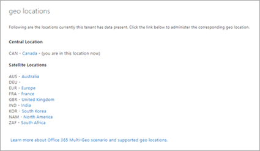
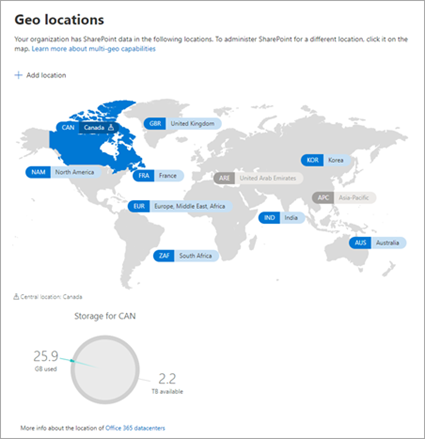

# Find geo location features in the new SharePoint admin center

This article covers all the features on the geo locations page and where you can find them in the new SharePoint admin center.

In the new SharePoint admin center, you can also add and delete satellite locations and see the storage usage for the current location. 

## Manage geo locations

|**Classic**|**New**|
|:-----|:-----|
| |  Go to the [Geo locations page of the new SharePoint admin center](https://admin.microsoft.com/sharepoint?page=geoLocations&modern=true)|

|**Classic**|**New**|
|:-----|:-----|
|Switch between locations |   Select a different location on the map or from the list at the top of the navigation pane. |
| Identify the central location |Look for the pin on the map.   |
|See list of satellite locations   | Expand the list at the top of the navigation pane. |

