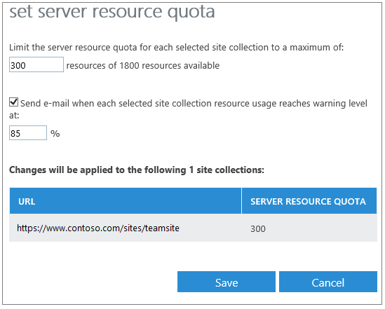

# Manage SharePoint Online server resource quotas

In SharePoint Online, the server resource quota specifies how many resources should be allocated to each site collection within a tenant. The goal is to ensure that all site collections perform optimally, particularly if you have heavily used site collections or site collections with advanced customizations. If most of your site collections are typical team sites, you can use the default resource quotas. If you have a site collection with heavy usage, app consumption, or collaboration, you can allocate a larger quota.
  
## Manage the server resource quota

To prevent depletion of server resources and performance degradation across your tenant, you can set a maximum percentage of server resources for a site collection. SharePoint Online will collect performance data, such as processor time and unhandled exceptions. If the resource usage level exceeds the quota, SharePoint Online turns off custom code so it can't run. You can set an alert to be notified by email when the resource usage level for the site collection approaches its limit so you can make adjustments before custom code gets turned off.
  
 **To set the server resource quota**
  
1. [Sign in to Office 365](e9eb7d51-5430-4929-91ab-6157c5a050b4) as a global admin or SharePoint admin. 
    
2. Select the app launcher icon  in the upper-left and choose **Admin** to open the Office 365 admin center. (If you don't see the Admin tile, you don't have Office 365 administrator permissions in your organization.) 
    
3. In the left pane, choose **Admin centers** > **SharePoint**.
    
4.  On the **site Collections** tab, choose one or more site collections. 
    
5. Click **Server Resource Quota**. 
    
6. In the **set server resource quota** dialog box, enter a maximum number of resources. The number of available resources for a site collection depends on the number of users in your tenant. 
    
7. Select the box to send an email when resource usage nears the limit. Enter the percentage of the limit that you want to use as the warning level.
    
     
  
8. Click **Save**.
    
## Related topics

- For information about how to manage storage space for your site collections, see [Manage site collection storage limits](https://support.office.com/article/77389c2c-8e7e-4b16-ab97-1c7103784b08)
    

