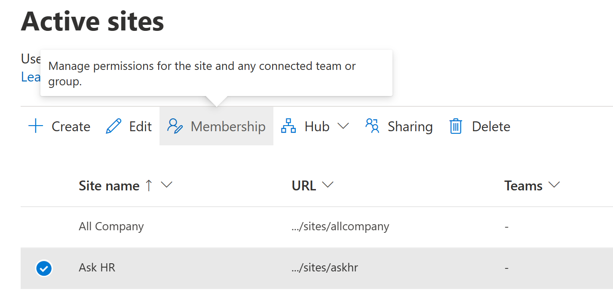

# Manage site admins

This article describes how global admins and SharePoint admins in Office 365 can add and remove site admins (previously called "site collection admins"). If you're an owner of a communication site, or a site that belongs to an Office 365 group, see [Manage your SharePoint site settings](https://support.office.com/article/8376034d-d0c7-446e-9178-6ab51c58df42#__BKMKMngSitePermissions) for info about giving people access to your site. If you're an admin for a classic site, see [Manage your SharePoint site settings](https://support.office.com/article/8376034d-d0c7-446e-9178-6ab51c58df42#id0eaabaaa=server). 
  
> [!NOTE]
> If you're a global admin and want info about assigning other users the SharePoint admin role in Office 365, see [Assigning admin permissions](/office365/admin/add-users/assign-admin-roles). 
  
## Add or remove site admins in the new SharePoint admin center

By using the new SharePoint admin center, you can change the owners for sites that use the new team site and communication site templates. You can also add and remove group members in the Microsoft 365 admin center. For info, see [Add or remove members from Office 365 groups](/office365/admin/create-groups/add-or-remove-members-from-groups). 
  
1. Go to the [Active sites page of the new SharePoint admin center](https://admin.microsoft.com/sharepoint?page=siteManagement&modern=true) and sign in with an account that has [admin permissions](/sharepoint/sharepoint-admin-role)
 for your organization.

>[!NOTE]
>If you have Office 365 Germany, [sign in to the Microsoft 365 admin center](https://go.microsoft.com/fwlink/p/?linkid=848041), then browse to the SharePoint admin center and open the Active sites page.  If you have Office 365 operated by 21Vianet (China), [sign in to the Microsoft 365 admin center](https://go.microsoft.com/fwlink/p/?linkid=850627), then browse to the SharePoint admin center and open the Active sites page.

2. In the left column, click to select a site.
  
3. Select **Permissions**. For a group-connected team site, you can add and remove group owners and additional site admins. For other sites, you can add and remove site admins and change the primary admin. Note that if you remove a person as a primary admin, they will still be listed as an additional admin. For info about each role, see [About site permissions](site-permissions.md). 

