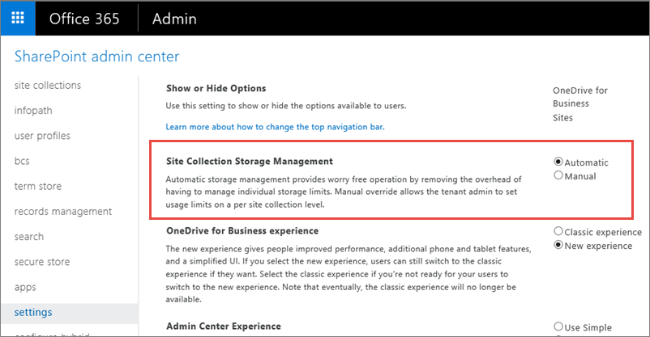
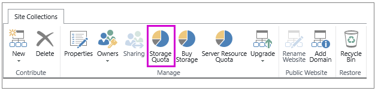
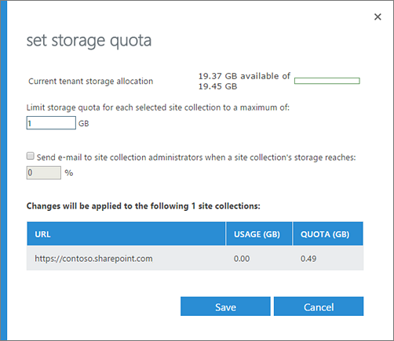

# Manage site collection storage limits

The amount of SharePoint Online space your organization has is based on your number of users (see [SharePoint Online Limits](https://go.microsoft.com/fwlink/p/?LinkID=856113)). If you're a global admin in Office 365, you can [Change storage space for your subscription](https://support.office.com/article/96ea3533-de64-4b01-839a-c560875a662c) if you run out. 
  
## Use pooled storage
<a name="__toc365547981"> </a>

By default, your SharePoint storage is available in a central pool from which all sites can draw. You, as a global or SharePoint admin, don't need to divvy up storage space or reallocate space based on usage. That's all handled automatically: sites use what they need when they need it, up to a maximum of 25 terabyte (TB) per site collection. If you previously set storage limits manually and switch to using pooled storage, SharePoint resets all the limits to 1 TB. 
  
 **Manage storage limits automatically**
  
1. [Sign in to Office 365](e9eb7d51-5430-4929-91ab-6157c5a050b4.md) as a global admin or SharePoint admin. 
    
2. Select the app launcher icon  in the upper-left and choose **Admin** to open the Office 365 admin center. (If you don't see the Admin tile, you don't have Office 365 administrator permissions in your organization.) 
    
3. In the left pane, choose **Admin centers** > **SharePoint**.
    
4. Select **settings**.
    
5. In **Site Collection Storage Management**, select **Automatic**.
    
  
6. Click **OK**.
    
## Manage individual site collection storage limits
<a name="__toc365547981"> </a>

If you prefer to fine tune the storage space allocated to each site collection, you can set your storage management option to "manual" and specify individual site collection storage limits. In this case, we recommend that you also set an email alert so that you and other site collection admins can be notified when site collections are nearing the storage limit.
  
> [!IMPORTANT]
> SharePoint Online storage is now calculated in gigabytes (GB). For more info, see [How SharePoint storage is calculated](manage-site-collection-storage-limits.md#storagecalculation). 
  
 **Manage storage limits manually**
  
1. [Sign in to Office 365](e9eb7d51-5430-4929-91ab-6157c5a050b4.md) as a global admin or SharePoint admin. 
    
2. Select the app launcher icon  in the upper-left and choose **Admin** to open the Office 365 admin center. (If you don't see the Admin tile, you don't have Office 365 administrator permissions in your organization.) 
    
3. In the left pane, choose **Admin centers** > **SharePoint**.
    
4. Select **settings**.
    
5. In **Site Collection Storage Management**, select **Manual**.
    
6. Click **OK**.
    
 **Set the storage limit**
  
1. [Sign in to Office 365](e9eb7d51-5430-4929-91ab-6157c5a050b4.md) as a global admin or SharePoint admin. 
    
2. Select the app launcher icon  in the upper-left and choose **Admin** to open the Office 365 admin center. (If you don't see the Admin tile, you don't have Office 365 administrator permissions in your organization.) 
    
3. In the left pane, choose **Admin centers** > **SharePoint**.
    
4. On the **Site Collections** tab choose one or more site collections from the list. 
    
5.  Select **Storage Quota**. If the storage quota button is not enabled, select the site collection you want to set a quota on from the list below. 
    
  
6. In **Limit storage quota for each site collection**, enter the maximum number of gigabytes (GB) to be allocated to the site collection.
    
7. Check the box to send email to the site collection administrators when the site collections approaches the storage limit. Enter a number from 1 to 100 for the percentage of the limit to reach before an email alert is triggered. 
    
  
    > [!TIP]
    > You may need to update the email alert percentage based on the new converted storage metrics. 
  
8. Click **Save**.
    
### Monitor site collection storage limits by using Microsoft PowerShell

If you manage storage limits manually, you need to regularly monitor them to make sure they aren't affecting site performance. We recommend that you also set up your own alert emails to notify site collection admins before a site collection reaches the limit. The built-in storage quota warning emails are typically sent weekly to site collections that have reached the specified warning level. So site collection admins often receive the storage quota warning email too late. For example, if the Disk Quota Warning timer job (which triggers the warning email) is scheduled weekly and sends the email warning every Sunday, but a site collection reaches the quota warning limit on Monday, the site collection admin doesn't receive the alert email for 6 days. There is a chance that this site collection can reach the maximum storage limit before the site collection admin receives the alert email. This could cause the site collection to be set to read-only and stop production.
  
You can use the following PowerShell script to monitor your site collections. This script pulls the data, composes, and then sends a storage warning alerts to the site collection administrator.
  
1. [Download the latest SharePoint Online Management Shell](https://go.microsoft.com/fwlink/p/?LinkId=255251).
    
2. Connect to SharePoint Online as a global admin or SharePoint admin in Office 365. To learn how, see [Getting started with SharePoint Online Management Shell](https://go.microsoft.com/fwlink/?linkid=869066).
    
3. Copy the following text with the variable declarations, and paste it into a text editor, such as Notepad. You must set all of the input values to be specific to your organization. Save the file, and then rename it "GetEmailWarning.ps1". 
    
    > [!NOTE]
    > You can use a different file name, but you must save the file as an ANSI-encoded text file with the extension .ps1. 
  
  ```
  #Connect to SharePoint admin center using admin account  $username = "<global or SharePoint admin account>"  $password = ConvertTo-SecureString "<Password>" -AsPlainText -Force  $cred = New-Object Microsoft.SharePoint.Client.SharePointOnlineCredentials($username, $password)  Connect-SPOService -Url <SharePoint admin center URL> -Credential $cred  #Local variable to create and store output file  $filename = Get-Date -Format o | foreach {$_ -replace ":", ""}  $result = "<Local folder path>"+$filename+".txt"  #SMTP and Inbox details  $smtp = "<smtpserver>"  $from = "<sender email>"  $to = "<recipient email>"  $subject = "Alert : PFA Site Collection Quota Usage details"  $body = "PFA quota usage details"  #Enumerating all site collections and calculating storage usage  $sites = Get-SPOSite -detailed  foreach ($site in $sites)  {  $percent = $site.StorageUsageCurrent / $site.StorageQuota * 100  $percentage = [math]::Round($percent,2)  Write-Output "$percentage %         $($site.StorageUsageCurrent)kb of $($site.StorageQuota)kb        $($site.url)" | Out-File $result -Append  }  #Sending email with output file as attachment  sleep 5  Send-MailMessage -SmtpServer $smtp -to $to -from $from -subject $subject -Attachments $result -body $body -Priority high
  ```

4. Where:
    
  - **\<global or SharePoint admin account\>** is the username for the account that has the global admin or SharePoint admin role in Office 365. 
    
  - **\<password\>** is the password for the global or SharePoint admin account. 
    
  - **\<SharePoint admin center URL\>** is the URL for your SharePoint admin center. 
    
  - **\<local folder path\>** is the local path for the folder where you want the data saved. 
    
  - **\<smtpserver\>** is the name of your SMTP mail server. 
    
  - **\<sender email\>** is the global admin or SharePoint admin account that appears in the From line in the warning email. 
    
  - **\<recipient email\>** is the admin account that will receive the email warning. 
    
5. In SharePoint Online Management Shell, change to the local directory where you saved the script file.
    
  ```
  ./GetEmailWarning.ps1
  ```

    After the script successfully completes, a text file is created in the location that you specified in the **\<Local folder path\>** variable in the script. 
    
    > [!NOTE]
    > If you get an error message about being unable to run scripts, you might need to change your execution policies. For info, see [About Execution Policies](https://go.microsoft.com/fwlink/?linkid=869255). 
  
## How SharePoint storage is calculated
<a name="storagecalculation"> </a>

Previously, SharePoint storage was calculated in megabytes (MB). Now it's calculated in gigabytes (GB) using only full integers. If you previously set your storage quota in MB, it will be converted to GB (1024 MB=1 GB) and rounded down to the nearest integer. So a value of 5000 MB becomes 4 GB. A minimum of 1 GB can be set per site collection. If you set your SharePoint storage quota by using PowerShell, that value will be rounded up to the nearest integer GB to prevent a value of less than one GB turning into 0 GB.
  
||
|:-----|
| **New to Office 365?**         Discover free video courses for [Office 365 admins and IT pros](68cc9b95-0bdc-491e-a81f-ee70b3ec63c5.md), brought to you by LinkedIn Learning. |
   
## See also
<a name="storagecalculation"> </a>

#### Other Resources

[SharePoint Online Limits](https://go.microsoft.com/fwlink/p/?LinkID=856113)

