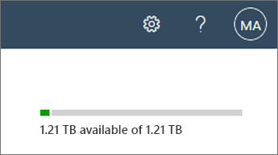
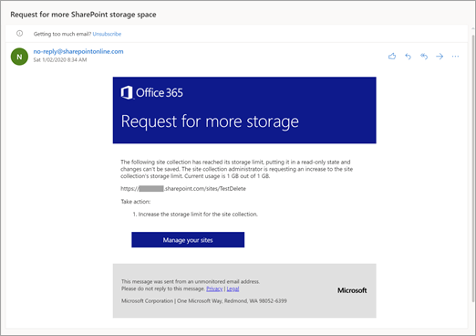

# Manage site storage limits

The amount of Microsoft SharePoint space your organization has is based on your number of licenses (see [SharePoint Limits](/office365/servicedescriptions/sharepoint-online-service-description/sharepoint-online-limits)). If you're a global admin in Microsoft 365, you can [Change storage space for your subscription](/office365/admin/subscriptions-and-billing/add-storage-space) if you run out. 
  
## View the total and available storage space for your organization

1. Go to the [Active sites page of the new SharePoint admin center](https://admin.microsoft.com/sharepoint?page=siteManagement&modern=true), and sign in with an account that has [admin permissions](/sharepoint/sharepoint-admin-role) for your organization.

>[!NOTE]
>If you have Office 365 Germany, [sign in to the Microsoft 365 admin center](https://go.microsoft.com/fwlink/p/?linkid=848041), then browse to the SharePoint admin center and open the Active sites page. <br>If you have Office 365 operated by 21Vianet (China), [sign in to the Microsoft 365 admin center](https://go.microsoft.com/fwlink/p/?linkid=850627), then browse to the SharePoint admin center and open the Active sites page.

2. In the upper right of the page, see the amount of storage used across all sites, and the total storage for your subscription. (If your organization has configured Multi-Geo in Microsoft 365, the bar also shows the amount of storage used across all geo locations.) 

    

    > [!NOTE]
    > The storage used doesn't include changes made within the last 24-48 hours.

## Set automatic or manual site storage limits
<a name="__toc365547981"> </a>

By default, your SharePoint storage is available in a central pool from which all sites can draw. You, as a global or SharePoint admin, don't need to divvy up storage space or reallocate space based on usage. That's all handled automatically: sites use what they need when they need it. If you previously set storage limits manually and switch to using pooled storage, SharePoint resets all the limits to 25 TB (25600 GB). (Note that the total storage for your organization might be less than 25 TB.)  

If you prefer to fine tune the storage space allocated to each site, you can set your storage management option to "manual" and specify individual site storage limits. 

> [!NOTE]
> Some functionality is introduced gradually to organizations that have opted in to the [Targeted release option in Microsoft 365](/office365/admin/manage/release-options-in-office-365). This means that you might not yet see some features described in this article, or they might look different.
  
   
1. Go to the [Settings page of the new SharePoint admin center](https://admin.microsoft.com/sharepoint?page=settings&modern=true), and sign in with an account that has [admin permissions](/sharepoint/sharepoint-admin-role) for your organization.

>[!NOTE]
>If you have Office 365 Germany, [sign in to the Microsoft 365 admin center](https://go.microsoft.com/fwlink/p/?linkid=848041), then browse to the SharePoint admin center and open the Settings page. <br>If you have Office 365 operated by 21Vianet (China), [sign in to the Microsoft 365 admin center](https://go.microsoft.com/fwlink/p/?linkid=850627), then browse to the SharePoint admin center and open the Settings page.
    
2. Select **Site storage limits**.

    
     
3. Select **Automatic** or **Manual**, and then select **Save**.
    
## Manage individual site storage limits
<a name="__toc365547981"> </a>

Follow these steps to specify individual site storage limits when your storage management option is set to "manual." We recommend that you also set an email alert so that you and other site admins can be notified when sites are nearing the storage limit. To learn how to set the default storage limit for new sites, see [Manage site creation](manage-site-creation.md). 
  
1. Go to the [Active sites page of the new SharePoint admin center](https://admin.microsoft.com/sharepoint?page=siteManagement&modern=true), and sign in with an account that has [admin permissions](/sharepoint/sharepoint-admin-role) for your organization.

>[!NOTE]
>If you have Office 365 Germany, [sign in to the Microsoft 365 admin center](https://go.microsoft.com/fwlink/p/?linkid=848041), then browse to the SharePoint admin center and open the Active sites page. <br>If you have Office 365 operated by 21Vianet (China), [sign in to the Microsoft 365 admin center](https://go.microsoft.com/fwlink/p/?linkid=850627), then browse to the SharePoint admin center and open the Active sites page.
    
2. Select a site, and then select **Storage**. 

    
    
3. Enter the maximum storage in GB for the site. 

    > [!NOTE]
    > The max value you can enter is 25600 GB, although this may be more space than your organization has. To learn how your total storage is calculated, see [SharePoint Limits](/office365/servicedescriptions/sharepoint-online-service-description/sharepoint-online-limits).<br> If you set site storage limits in PowerShell, you enter them in MB. The values are converted and rounded down to the nearest integer to appear in GB in both the SharePoint admin center. So a value of 5000 MB becomes 4 GB. The minimum storage limit is 1 GB, so if you set a value of less than 1024 MB by using PowerShell, it will be rounded up to 1 GB.
    
4. Make sure **Notifications** is turned on to send an email to site admins when the site approaches the storage limit. Then, enter a value as a percent for how full you want the storage to be when the email is sent. 
 
5. Select **Save**.

If a site runs out of storage, site admins can request more by following these steps:

1. Go to the Site Settings page.
2. Under **Site Collection Administration**, select **Storage Metrics**.
3. Select **Request more quota** in the upper right.

This sends a storage request email to the global and SharePoint admins in the organization.


    
### Monitor site storage limits by using PowerShell

If you manage storage limits manually, you need to regularly monitor them to make sure they aren't affecting site performance. We recommend that you also set up your own alert emails to notify site admins before a site reaches the limit. The built-in storage quota warning emails are typically sent weekly for sites that have reached the specified warning level. So site admins often receive the storage quota warning email too late. For example, if the Disk Quota Warning timer job (which triggers the warning email) is scheduled weekly and sends the email warning every Sunday, but a site reaches the quota warning limit on Monday, the site admin doesn't receive the alert email for 6 days. This site could reach the maximum storage limit and be set to read-only before the site admin receives the alert email. 
  
You can use the following Microsoft PowerShell script to monitor your sites. This script pulls the data, composes, and then sends a storage warning alerts to the site admin.
  
1. [Download the latest SharePoint Online Management Shell](https://go.microsoft.com/fwlink/p/?LinkId=255251).

    > [!NOTE]
    > If you installed a previous version of the SharePoint Online Management Shell, go to Add or remove programs and uninstall "SharePoint Online Management Shell." <br>On the Download Center page, select your language and then click the Download button. You'll be asked to choose between downloading a x64 and x86 .msi file. Download the x64 file if you're running the 64-bit version of Windows or the x86 file if you're running the 32-bit version. If you don't know, see [Which version of Windows operating system am I running?](https://support.microsoft.com/help/13443/windows-which-operating-system). After the file downloads, run it and follow the steps in the Setup Wizard.

2. Connect to SharePoint as a [global admin or SharePoint admin](/sharepoint/sharepoint-admin-role) in Microsoft 365. To learn how, see [Getting started with SharePoint Online Management Shell](/powershell/sharepoint/sharepoint-online/connect-sharepoint-online).
    
3. Copy the following text with the variable declarations, and paste it into a text editor, such as Notepad. You must set all of the input values to be specific to your organization. Save the file, and then rename it "GetEmailWarning.ps1". 
    
    > [!NOTE]
    > You can use a different file name, but you must save the file as an ANSI-encoded text file with the extension .ps1. 
  
  ```PowerShell
#Connect to SharePoint admin center using an admin account
#Specify the URL to your SharePoint admin center site, e.g. https://contoso-admin.sharepoint.com

$url = 'https://contoso-admin.sharepoint.com'

#Specify a folder path to output the results into
$path = '.\'

#SMTP details
$Smtp = '<SmtpServer>'
$From = '<SenderEmailAddress>'  
$To = '<RecipientEmailAddress>'
$Subject = 'Site Storage Warning'  
$Body = 'Storage Usage Details'

if($url -eq '') {
    $url = Read-Host -Prompt 'Enter the SharePoint admin center URL'
}

Connect-SPOService -Url $url

#Local variable to create and store output file  
$filename = (Get-Date -Format o | foreach {$_ -Replace ":", ""})+'.csv'  
$fullpath = $path+$filename

#Enumerating all sites and calculating storage usage  
$sites = Get-SPOSite
$results = @()

foreach ($site in $sites) {
    $siteStorage = New-Object PSObject
    
    $percent = $site.StorageUsageCurrent / $site.StorageQuota * 100  
    $percentage = [math]::Round($percent,2)

    $siteStorage | Add-Member -MemberType NoteProperty -Name "Site Title" -Value $site.Title
    $siteStorage | Add-Member -MemberType NoteProperty -Name "Site Url" -Value $site.Url
    $siteStorage | Add-Member -MemberType NoteProperty -Name "Percentage Used" -Value $percentage
    $siteStorage | Add-Member -MemberType NoteProperty -Name "Storage Used (MB)" -Value $site.StorageUsageCurrent
    $siteStorage | Add-Member -MemberType NoteProperty -Name "Storage Quota (MB)" -Value $site.StorageQuota

    $results += $siteStorage
    $siteStorage = $null
}

$results | Export-Csv -Path $fullpath -NoTypeInformation

#Sending email with output file as attachment  
Send-MailMessage -SmtpServer $Smtp -To $To -From $From -Subject $Subject -Attachments $fullpath -Body $Body -Priority high
```

4. Where:

  - **$url** is the URL of your SharePoint admin center. If the `$url` variable is left empty, you will be prompted to enter the URL of your admin center site.
  
  - **$path** is the file system path you want the CSV file to output to.
   
  - **\<SmtpServer\>** is the name of your SharePoint Migration Tool mail server. 
    
  - **\<SenderEmailAddress\>** is the global admin or SharePoint admin account that appears in the From line in the warning email. 
    
  - **\<RecipientEmailAddress\>** is the admin account that will receive the email warning. 
    
5. In SharePoint Online Management Shell, change to the local directory where you saved the script file.
    
  ```
  ./GetEmailWarning.ps1
  ```

   After the script successfully completes, a text file is created in the location that you specified in the **$path** variable in the script. 
    
   > [!NOTE]
   > If you get an error message about being unable to run scripts, you might need to change your execution policies. For info, see [About Execution Policies](https://go.microsoft.com/fwlink/?linkid=869255). 
