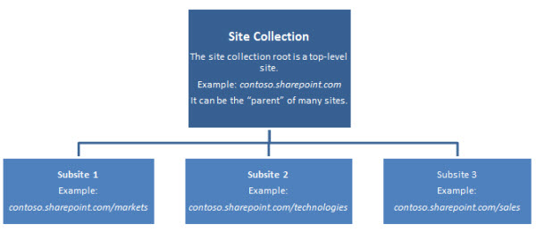

# Manage site collections and global settings in the SharePoint admin center

As the SharePoint Online admin, you can use the SharePoint admin center to:
  
- Create and manage site collections; allocate and monitor site collection storage
    
- Manage permissions and users and help secure content on sites
    
- Manage user profiles and configure personal sites (My Sites) 
    
- Enable and configure specific SharePoint Online features or global settings
    
Here's an overview of important details you should consider when planning how to build out, configure, and manage your SharePoint Online environment. 
  
> [!NOTE]
> The SharePoint Online Public Website information in this article only applies if your organization purchased Office 365 prior to March 9, 2015. 
  
## Plan the site collections you need to create

A site collection is a group of websites that have the same owner and share administrative settings, such as permissions. When you create a site collection, a top-level site is automatically created in the site collection. You can then create one or more subsites below the top-level site. 
  

  
Top-level sites and subsites allow for different levels of control over the features and settings for sites. By using this hierarchy you can allow users to have a main working site for an entire team, plus individual working sites and shared sites for side projects. You can create separate site collections for different divisions or for external websites. 
  
How you decide to organize site collections depends on the size of your organization and its business needs. If you figure out a few basic details—for example, what a site collection will be used for, and which users need to have access to it—then this will help you make decisions about what type of site template to use, how much storage to allocate, and how many site collections you might need to create. If you need to review your storage limits or the number of site collections that are supported for your plan, see [SharePoint Online Limits](https://go.microsoft.com/fwlink/p/?LinkID=856113). Once you are ready to start creating site collections, you can do so by using the SharePoint admin center.
  
|****If you want to determine this:****|****Ask this:****|
|:-----|:-----|
|What site template(s) should we use?    When you create a site collection, you can use a site template. A site template is pre-populated with lists, libraries, pages, and other elements or features that support different business needs. You can use the template as-is or you can customize the site so that it meets your needs.    Each site will inherit the properties from the template you choose for your site collection. You may use more than one site template in your site collection.    | What type of content will be stored on sites?     Will the site fill a specialized purpose?     How do people need to interact with that content?    |
|How many site collections do we need?    Business needs and your overall storage limits will affect this decision.    Certain types of sites, like the Public Website, the App Catalog, the Search Center, or the My Site host, exist as standalone site collections. Some of these may be automatically created for you when you sign up for Office 365. You may need additional site collections if your organization has other specialized purposes. For instance, some groups need to restrict access to their content.    | Are there divisions or groups that need to maintain separate data?     Will you need different site collections for specialized purposes?     Do you plan to use apps for SharePoint (if so, you will want to create an App Catalog site)    |
| How much storage do we need for each site collection?     When your organization purchases the SharePoint Online service, it is allocated a pool of storage based on the number of user licenses it purchased and the type of Office 365 plan it purchased. The total amount of storage is pooled so that you can determine how much storage to give to each site collection (minimum 50 MB).     When you assign storage to a new site collection, you will be able to see the total amount of storage allocated to your organization and how much of the total organization storage remains to be allocated to new site collections. After you set an amount of storage for a site collection you can always increase it later, if necessary. You can monitor how much storage is being used by each site collection, and to be notified by an alert when a site collection is nearing its storage allocation limit.     If you notice that your organization is running low on remaining storage, there are three things you can do:     Reduce the amount of content on your SharePoint Online sites     Delete one or more site collections     Buy more storage from Microsoft or your provider     It's important to monitor how much space is being used and to set guidelines and policies with your site collection administrators and site owners as to any file size limitations you might want to set in your organization.     For more information, see [Manage site collection storage limits](https://support.office.com/article/77389c2c-8e7e-4b16-ab97-1c7103784b08).    | How many site collections do you think you'll need overall?     How much storage comes with your subscription?     Do specific site collections have larger storage requirements than others, based on the type or volume of content they will store?     Will you enable site users to create their own team sites within a specific site collection? For more information about enabling site creation, see [Manage site creation in SharePoint Online](manage-site-creation-in-sharepoint-online).    |
|Do we need multi-language support?    The Multilingual User Interface (MUI) feature allows users to view sites or Web pages in a language other than the default set on the site or site collection. The MUI feature is not a translation tool; it just changes the display language for certain default interface elements.    MUI changes the user interface for individual users only; it does not affect how the site is displayed to other users. Also, any site content that was created in the site's default language will still be displayed in the default language.    MUI is enabled by default. However, if MUI is to be used on a site collection, then it also needs to be enabled by the site collection administrator. **You and your site owners need to decide in advance what default language to use for your site collections and sites, because once the language is specified it cannot be changed**. After you create a site collection, it is important to verify that the locale and regional settings on the site are accurate. For example, when you create French sites, the locale will always be set to France even if you are located in Canada. Therefore, no matter what language you choose, it is a good idea to verify that both the regional and locale setting are accurate for your location.    For more information about multilingual sites see [Introduction to multilingual features](https://support.office.com/article/53411469-53e3-4570-95e2-3651f166174f).    | Do any site collections need to be created in specific languages?    |
   
### Plan to keep site collections manageable

Governance is the set of policies, roles, responsibilities, and processes that control how your organization cooperates to achieve business goals. These goals center on the service you provide and the management of intellectual property your employees create. As you plan your site collections you should also build a plan for how to govern them. 
  
When you think about how to structure and govern your site collections, consider the answers to these questions.
  
|****If you want to achieve this:****|****Ask this:****|
|:-----|:-----|
|An effective site collection consists of groups of individuals and teams that share common goals.    |Does the structure of your site collections add to your organization's effectiveness?    |
|A secure site that is open to those who need the information, but where information is blocked from those who should not see it.    |Does the structure allow the information architecture to meet regulatory requirements, privacy needs, and security goals?    |
|A permissions model that allows read access, write access, or both.    |What type of access will users need to the content?    |
|Authorization for external users on only those site collections that need it. For more information about allowing external users access to your sites, see [Share a site](https://support.office.com/article/958771A8-D041-4EB8-B51C-AFEA2EAE3658) in the SharePoint Online Help.    |Do users from outside the company need to have access?    |
|A managed plan for sites that are well maintained.    |Who will be allowed to create and manage the sites in the site collection?    |
|Locations for specific actions and applications, such as sandbox solutions.    |What features and functionality will be enabled for users?    |
|A site collection where the content is useful to those sharing the site.    |Will the content found in search results be relevant to those sharing the site collection?    |
|A solution that is manageable and easy to upgrade.    |How much customization will you allow?    |
   
### Delete and restore site collections

As the SharePoint admin, you will also be able to restore deleted site collections. The recycle bin allows you to restore deleted site collections, as long as they have not been in the recycle bin longer than 90 days. After 90 days in the recycle bin, a site collection is automatically permanently deleted. The recycle bin gives you time to make sure that the site collection does not contain data your organization needs. For more information, see [Restore a deleted site collection](restore-a-deleted-site-collection).
  
## Manage permissions and help secure content

 **In this section:**
  
- [Manage site collection administrators](manage-site-collections-and-global-settings-in-the-sharepoint-admin-center)
    
- [Allow external users access to your internal sites](manage-site-collections-and-global-settings-in-the-sharepoint-admin-center)
    
### Manage site collection administrators

There are three administrative roles in the SharePoint Online service administration:
  
- **Global admin** Admin for the Office 365 Portal; can manage service licenses, users and groups, domains, and subscribed services. In Office 365, a Global admin is also a SharePoint Online admin. 
    
- **SharePoint admin** Global admin whose primary job is to manage a SharePoint Online environment using the SharePoint admin center; can create and manage site collections, designate site collection administrators, determine tenant settings, and configure Business Connectivity Services and Secure Store, Records Management, Search, and User Profiles. 
    
- **Site collection admin** User with administrator permissions to manage a site collection. A site collection can have several admins, but only one primary admin. The SharePoint Online admin should assign permissions to the primary site collection administrator when creating a site collection and can add more administrators for the site collection afterwards. 
    
When creating a site collection in SharePoint Online, a global admin or SharePoint admin designates a primary site collection admin. It's a good safeguard to designate one or more site collection admins as backups, just as it's a good practice to have a secondary global admin available inside Office 365.
  
For more information, see [Manage administrators for a site collection](manage-administrators-for-a-site-collection).
  
### Allow external users access to your internal sites

SharePoint Online provides the capability for site users to invite external users (that is, users who do not have a license to your Office 365 subscription) to view or edit content on sites. If you're wondering about what types of users are qualified to be external users and what rights an external user has, see [What is an external user?](https://support.office.com/article/c04a3ff2-6373-4d1b-bfa9-d2b877cfea93)
  
External sharing is a powerful collaboration feature that can support your organization's needs to collaborate with external vendors, customers, or clients. However, it is important to manage external sharing carefully to ensure that any content that you do not want shared is adequately protected.
  
There are three ways that users can share content on sites with people outside your organization: 
  
- They can share an entire site by inviting external users to sign in to your site using a [Microsoft account\*](http://windows.microsoft.com/en-us/windows-live/sign-up-create-account-how) or a [What is my user ID and why do I need it?](https://support.office.com/article/e456eb4c-9cb9-4aa0-9d0a-923b8c53228d). 
    
- They can share individual documents by inviting external users to sign in to your site using a [Microsoft account\*](http://windows.microsoft.com/en-us/windows-live/sign-up-create-account-how) or a [What is my user ID and why do I need it?](https://support.office.com/article/e456eb4c-9cb9-4aa0-9d0a-923b8c53228d).
    
- They can send users a guest link that they can use to view individual documents on your site anonymously.
    
\* Microsoft accounts such as Outlook.com and Hotmail.com, are provided by Microsoft Corporation and are subject to Microsoft's terms and conditions and privacy statements. The use of these apps and accounts may result in customer data being transferred, stored and/or processed in the United States or any other country where Microsoft, its affiliates or service providers maintain facilities.
  
External sharing is not enabled by default for your SharePoint Online environment (tenant) and the site collections, but you can turn it on after you know exactly how you want to use the feature. You may decide you want to allow external sharing for specific site collections, while leaving it turned off in site collections that will store content that is sensitive for your business.
  
You can configure external sharing at two levels within the SharePoint admin center: 
  
1. **You can turn external sharing on or off globally for an entire SharePoint Online environment (or tenant).** Additionally, if you turn on external sharing, you can specify if you want to allow sharing only with authenticated users, or if you want to allow users to share content with both authenticated users and anonymous users through guest links. 
    
2. **You can turn external sharing on or off for individual site collections.** This provides you with the ability to secure content on specific site collections that you do not want to be shared. You can also specify which level of sharing you want to allow in a site collection (sharing with authenticated users, or sharing with both authenticated users and anonymous users through guest links). 
    
For more information about enabling and managing external sharing, see [Manage external sharing for your SharePoint online environment](manage-external-sharing). 
  
## Enable personal sites and social features

A **user profile** is a collection of properties that describes a SharePoint user. Features such as My Sites and People Search use user profiles to provide a rich, personalized experience for the users in your organization. Because so many social features rely on user profiles, configuring user profiles goes hand-in-hand with configuring social features. 
  
In this section:
  
- [Manage user profiles and plan for any custom profile properties or policies](manage-site-collections-and-global-settings-in-the-sharepoint-admin-center)
    
- [Display personalized content to users with audience targeting](manage-site-collections-and-global-settings-in-the-sharepoint-admin-center)
    
- [Set up personal sites for users](manage-site-collections-and-global-settings-in-the-sharepoint-admin-center)
    
### Manage user profiles and plan for any custom profile properties or policies

When a user account is created with Office 365, an admin can manually enter user details, including job title, department, phone numbers, and other properties that appear in the Office 365 Global Address List. Or an admin can use the Microsoft Online Services Directory Synchronization tool to replicate your organization's Active Directory user accounts (and other Active Directory objects) into Office 365. This information feeds into a user's SharePoint Online profile. 
  
Whether you've manually entered user profile information into the Office 365 directory service or synched with Active Directory, if there's information you want to add to user profiles, but there's no field for it, then you might consider creating a SharePoint Online user **profile** **property**. You can also define the **policies** for how these properties behave. 
  
Additional user profile properties can improve your organization's SharePoint social experience, such as people search and recommendations. For example, you might want to create a user profile property for current projects that an employee is working on, which will allow others to find subject matter experts. 
  
Keep in mind that these properties are specific to SharePoint Online and this information will not be replicated to your work or school accounts. That means Office 365 services, such as Exchange Online or Lync Online, will not see this information because it will not be added to the Global Address List. 
  
When planning user profiles, you might start by evaluating your organization's collaboration needs by considering the answers to the following questions. To limit the scope of planning, focus on adding properties that enable key business needs or scenarios for each site collection. If a relevant property does not address specific scenarios, wait until a need is identified during regular operations instead of planning to add the property only because you think you might need it in the future. It's possible that you might not need to add new properties at all. 
  
|****To determine this:****|****Ask this:****|
|:-----|:-----|
|Which properties you will use for your core user profiles. Properties are important when finding users, creating audiences to use when targeting content, and establishing relationships between colleagues and workgroups.    |Do the default user profile properties meet your needs?    |
|How users will fill in this information, and who will be able to see it.    |If you create new properties, what policies should be applied to them?    |
|Whether you need a consistent taxonomy to help the SharePoint search service match and find users. For example, let's say you create a profile property that is named "Ask Me About". In this property, you want to manage what users can enter into this field. If you let them enter in their own value they might write it differently than how someone would search for it. In this case, you might want to create a term set that specifies what options a user can choose to fill in this information.    |Do you need to create a term set to give users a set of options for how they fill in a new profile property?    For more information about term sets, see [Introduction to managed metadata](introduction-to-managed-metadata).    |
   
> [!NOTE]
>  While the Directory Synchronization Tool (DirSync) allows Active Directory user profiles to be migrated and synchronized with SharePoint Online, Active Directory **information only goes in one direction** —from the on-premises Active Directory deployment to SharePoint Online. This ensures that user information in SharePoint Online reflects the most current and accurate state of your user data in Active Directory. For more information about the Office 365 directory service, read [Active Directory Synchronization in Office 365](https://technet.microsoft.com/en-us/library/hh852469.aspx). >  When user profiles are synchronized from Active Directory, you can also synchronize Active Directory groups. Synchronizing groups gives SharePoint Online information about which users are members of which groups. >  If your Active Directory administrator has created custom attributes in Active Directory that information will not map to the default Office 365 properties and will not be synched. 
  
For more information about managing user profiles, see [Manage user profiles in SharePoint Online](manage-user-profiles-in-the-sharepoint-admin-center). 
  
### Display personalized content to users with audience targeting

SharePoint **audiences** enable you to display content to users based on their job or task. Audiences can be defined by one or a combination of items: membership in a distribution list, Windows security group, SharePoint group; organization role; or public properties in user profiles You can target content to audiences for navigation links, list items, library items, and Web Parts. 
  
Before you create audiences to target content, you should work with the site collection administrators and site owners to determine what site elements will be used on their sites. This will help you think about how people will interact with the various sites and determine how you want to use content targeting. 
  
Once defined, audiences can be used to target content in numerous ways. For example, for Microsoft Office 2013 programs, you can define the links that display in **Save As** > **SharePoint Recent Folders**, and set the audiences that each link is visible to. On personal sites (formerly known as My Sites), you can set audiences for the Site navigation links that appear on the top link bar. In an environment in which audiences are configured, site administrators can use Web Parts to target content by audience. 
  
When planning audiences, the goal should be to find the smallest possible set of key audiences based on your organization's needs. 
  
SharePoint Online audiences differ from SharePoint permissions. If you want to disable a person's access to a particular site, document library, or document, then you can do that by configuring permissions. For more information about planning for this, see [Plan your permissions strategy](https://support.office.com/article/c6183e49-9287-4689-999e-0d3f817a41a3).
  
For more information about managing audiences, see [Manage SharePoint Online audiences](https://support.office.com/article/1806ec78-1d4e-4620-8a89-89d6a38c9c33). 
  
### Set up personal sites for users

My Sites are personal sites that provide a rich set of social networking and collaboration features to each member of your organization. In addition, My Sites provide Office 365 users a central location where they can store, share, and track the information they care about. Users can access their personal sites by clicking **Sites** at the top of the SharePoint Online site Clicking **Newsfeed** or **OneDrive** will take a user to different My Site locations once the My Site site collection has been created. Also, if you click the username in the top right corner of any page, and click **About Me**, this will direct you to the My Site page that describes the activities of the My Site owner.
  
As the SharePoint Online admin, you can customize My Site content for each user in any organization and enable policies to protect privacy. 
  
My Sites, by default, have the following primary components: 
  
- **My Newsfeed** is the default landing page. This page displays a feed of recent activities related to a user's specified co-workers and interests. Users can customize their newsfeeds by following co-workers, specifying interests, and configuring the kind of activities they want to follow. 
    
- **My** OneDrive for Business ** Content ** is a Web Part page that displays content a user has stored in the My Site. 
    
- **My Sites** is page of links to sites that users have decided to follow and links to suggested sites. 
    
- **About Me** displays the user's profile page to other people in the organization where users can share their expertise, profile pictures and so on. Although the My Newsfeed and My OneDrive for Business Content pages are available only to the user, the My Profile page is what that user and other people in the organization see when they access the user's My Site. 
    
To effectively plan for My Sites, a SharePoint Online admin should determine what quota My Sites require. Also, the SharePoint Online admin can specify important configuration information, such as Trusted Host Locations, the preferred Search Center, what accounts or groups will have Read Permissions on My Sites, and other privacy and security settings that can be found in the SharePoint admin center, under **user profiles**. The SharePoint Online admin also controls the user profile properties that show up on My Site users' profile pages.
  
Site collection administrators or site owners can determine whether the **Site Feed** feature, available on Team Sites, will be turned on for a site. Turning this feature on will create a  *site-specific*  Newsfeed and Microfeed that can be read on the site, or followed from a My Site. 
  
The following table provides guidance for permissions for social features:
  
|**Permission**|**Guidance**|
|:-----|:-----|
|Create Personal Site    |By default, all authenticated users can create a My Site web site. Ensure that you want the default setting to apply to the organization. Alternatively, you can use one or more security groups to grant the Create Personal Site permission to a subset of users in an organization.    |
|Use Social Features    |By default, all authenticated users can add ratings and social tags to documents, to other SharePoint Online items, and to other items, such as external Web pages and blog posts. Users can also leave impromptu notes on profile pages of a My Site Web site or any SharePoint Online page. Alternatively, you can use one or more security groups to grant the Use Social Features permission to a subset of users in an organization.    |
|Use Personal Features    |By default, all authenticated users can edit their profiles, add or edit colleagues, and add or edit memberships. Alternatively, you can use one or more security groups to grant the Use Personal Features permission to a subset of users in an organization.    |
   
For more information about managing social features, see [Manage personal and social features](https://support.office.com/article/4c5d7f20-b398-4f25-b2fa-b95bf5b81cd5).
  
 **Special Consideration**
  
My Site features that require special consideration include the following:
  
- **Newsfeed** By default, the Newsfeed feature is enabled, allowing site users to follow co-worker activities on the Newsfeed page of their My Sites. Users can only view activities in the newsfeed for which they have permission. When planning My Sites, you should consider the privacy implications of this feature and provide mitigations based on your requirements. 
    
- **The tag and note tool** The tags and notes tool can be turned on or off in the SharePoint admin center by using by setting the Use Tags and Notes permission. This setting applies to all users who have the Use Tags and Notes permission. 
    
For more information about managing My Sites, see [Set up My Sites in the SharePoint admin center](https://support.office.com/article/ec8c588e-28fd-4724-a8cb-85426869ce8a) and [Manage personal and social features](https://support.office.com/article/4c5d7f20-b398-4f25-b2fa-b95bf5b81cd5). 
  
## Evaluate business needs to help plan feature configuration

There are a number of features that can be configured or managed globally from the SharePoint admin center. To help you plan time and resources, it is useful to evaluate whether your organization has a business need for specific features. This step will help you determine where you may need to engage subject matter experts in your organization to help partner with admin staff in planning the configuration of these features. For example, to gather the necessary requirements for configuring features like the Term Store, or Records Management features like the Content Organizer, you may need to partner with the people in your organization who are responsible for corporate taxonomy, records management, or content management.
  
|****Do you need these capabilities?****|****To learn more about setting this up, go here:****|
|:-----|:-----|
|You need to work with business data that is stored in external applications, and you want to be able to integrate that data into SharePoint Online sites.    | You can use Business Connectivity Services to connect to data sources such as SQL Azure databases or Windows Communication Foundation web services (also known as WCF).    [Introduction to external data](https://support.office.com/article/676e60e7-d99f-463f-a173-65e9d63538c0)   [Create or edit a Secure Store Target Application](create-or-edit-a-secure-store-target-application)   [Create an external list](https://support.office.com/article/6e2d601d-b02f-41e7-ba87-e70297ec6665)   [Make an External List from a SQL Azure table with Business Connectivity Services and Secure Store](make-an-external-list-from-a-sql-azure-table-with-business-connectivity-services)   [Manage Business Connectivity Service Applications](manage-business-connectivity-service-applications)   |
|You want to create and use taxonomies to classify and organize information on sites.    | You can use the Term Store Management Tool to create, import, and manage hierarchical collections of centrally managed terms (called term sets).    [Plan terms and term sets in SharePoint Server 2013](https://technet.microsoft.com/en-us/library/ee519604%28v=office.15%29)   [Introduction to managed metadata](introduction-to-managed-metadata)   |
|You need to automatically route content to specified locations based on records management or document management criteria.    |[Configure Send To connections for records management](https://support.office.com/article/d3bdb395-3824-49ed-9de4-c479a4bc71ea)   |
|You need to configure Search for your SharePoint Online environment.    |[SharePoint Online search administration overview](manage-search-the-admin-center)   |
|You want to create an eDiscovery Center for managing content that may be part of eDiscovery requests in investigations, audits, or legal cases.    | An eDiscovery Center is a site collection and must be created in the SharePoint admin center. The eDiscovery Center template is located on the Enterprise tab of the new site collection dialog box. Each new case becomes a site in the eDiscovery Center site collection.    [Plan and manage cases in the eDiscovery Center](https://support.office.com/article/d955aeb8-0d48-4291-a8e2-f3b84f17943f)   |
   

