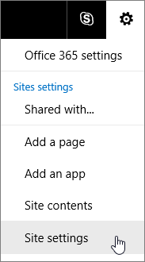
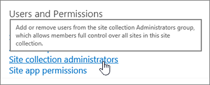

# Manage administrators for a site collection

This article describes how site collection admins can add and remove other site collection admins. It also describes how global admins and SharePoint admins can add and remove admins on any site collections.
  
- A **global administrator** in Office 365 includes all the permissions of a SharePoint admin. A **SharePoint administrator** can create and manage site collections, designate site collection admins, change organization-wide SharePoint settings, and more. 
    
-  A **site collection administrator** has permission to manage a site collection. A site collection can have several admins, but only one primary admin. When SharePoint admins create site collections, they specify the primary site collection administrator and can add other admins as backups. Site collection admins don't have access to the SharePoint Online admin center. 
    
> [!NOTE]
> A **term store administrator** can add or change terms in the term store (a directory of common terms you want to use across your organization). To learn more, see [Assign roles and permissions to manage term sets](https://support.office.com/article/951216b9-81ac-4850-9ea0-7ad4c45eb231). 
  
## Add or remove site collection admins (as a site collection admin)

Follow these steps to add or remove other site collection admins from Site Settings.
  
1. Go to the site.
    
2. Click **Settings** and then **Site Settings**.
    
     
  
3. Under **Users and Permissions** click **Site collection administrators**.
    
     
  
4. Add or remove names in the Site Collection Administrators box, and then click **OK**.
    
## Add or remove site collection admins (as a global admin or SharePoint admin)

Before you manage administrators for site collections, make sure you have a plan for your site collections and their permissions. For info about this, see [Manage site collections and global settings in the SharePoint admin center](manage-site-collections-and-global-settings-in-the-sharepoint-admin-center). If you're a global admin and want info about assigning other users the SharePoint admin role in Office 365, see [Assigning admin permissions](https://support.office.com/article/F44FBE43-7E11-475B-A1B2-3F00719A853A).
  
Follow these steps to add or remove site collection admins by using the SharePoint admin center:
  
1. [Sign in to Office 365](e9eb7d51-5430-4929-91ab-6157c5a050b4) as a global admin or SharePoint admin. 
    
2. Select the app launcher icon  in the upper-left and choose **Admin** to open the Office 365 admin center. (If you don't see the Admin tile, you don't have Office 365 administrator permissions in your organization.) 
    
3. In the left pane, choose **Admin centers** > **SharePoint**.
    
4. Point to the site collection for which you want to change the administrators, and then select the check box in front of it. 
    
     
  
5. Click **Owners**, and then click **Manage Administrators**.
    
     
  
6. Change the name in the **Primary Site Collection Administrator** box, or add or remove names in the **Site Collection Administrators** box. 
    
     
  
7. Click **Check Names** to verify that the user names are valid. 
    
8. Click **OK** **.**
    

