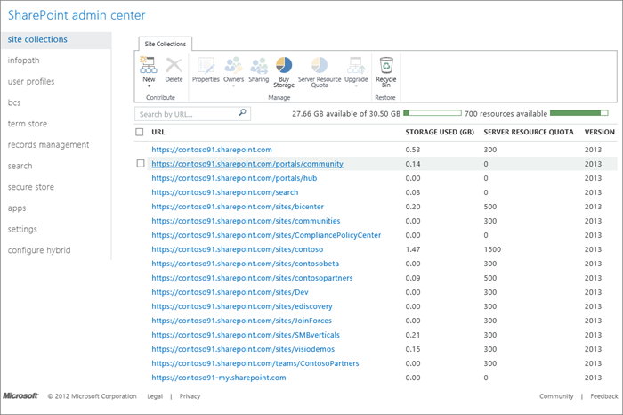

# Manage site collections and global settings in the SharePoint admin center

As an Office 365 global or SharePoint admin in your organization, you can use the SharePoint admin center to:
  
- Create and manage classic site collections including allocating and monitoring site collection storage
    
- Manage permissions and users and help secure content on sites
    
- Manage user profiles and configure OneDrive settings (called "My Sites" settings in the admin center)
    
- Enable and configure specific SharePoint Online features or global settings
    
Here's an overview of important details you should consider when planning how to build out, configure, and manage your SharePoint Online environment. 
  
## Open the admin center

1. Sign in to Office 365 as a global admin or SharePoint admin.
    
2. Select the app launcher icon  in the upper-left and choose **Admin** to open the Office 365 admin center. (If you don't see the Admin tile, you don't have Office 365 administrator permissions in your organization.) 
    
3. In the left pane, choose **Admin centers** > **SharePoint**.
    
## Plan the site collections you need to create

A site collection is a group of websites that have the same owner and share administrative settings, such as permissions. When you create a site collection, a top-level site is automatically created in the site collection. You can then create one or more subsites below the top-level site. 
  

  
Top-level sites and subsites allow for different levels of control over the features and settings for sites. By using this hierarchy you can allow users to have a main working site for an entire team, plus individual working sites and shared sites for side projects. You can create separate site collections for different divisions or for external websites. 
  

  
How you decide to organize site collections depends on the size of your organization and its business needs. For info about creating site collections, see [Create or delete a site collection](create-or-delete-a-site-collection.md).
  
Communication sites and new team sites that belong to Office 365 groups can't be created or managed in the SharePoint admin center. For info about creating these sites, see [Create a team site in SharePoint Online](https://support.office.com/article/ef10c1e7-15f3-42a3-98aa-b5972711777d) and [Create a communication site in SharePoint Online](https://support.office.com/article/7fb44b20-a72f-4d2c-9173-fc8f59ba50eb). For info about allowing users to create sites, see [Manage site creation in SharePoint Online](manage-site-creation-in-sharepoint-online.md). For info about managing these sites using Microsoft PowerShell, see [Manage team sites and communication sites by using PowerShell](manage-team-sites-and-communication-sites-by-using-powershell.md).
  
### Plan your site collection details

 If you figure out a few basic details.—for example, what a site collection will be used for, and which users need to have access to it—then this will help you make decisions about what type of site template to use, how much storage to allocate, and how many site collections you might need to create. If you need to review your storage limits or the number of site collections that are supported for your plan, see [SharePoint Online Limits](https://go.microsoft.com/fwlink/p/?LinkID=856113). 
  
|****If you want to determine this:****|****Ask this** **:****|
|:-----|:-----|
|What site template(s) should we use?    When you create a site collection, you can use a site template. A site template is pre-populated with lists, libraries, pages, and other elements or features that support different business needs. You can use the template as-is or you can customize the site so that it meets your needs.    Each site will inherit the properties from the template you choose for your site collection. You may use more than one site template in your site collection.    | What type of content will be stored on sites?     Will the site fill a specialized purpose?     How do people need to interact with that content?    |
|How many site collections do we need?    Business needs and your overall storage limits will affect this decision.    Certain types of sites, like the App Catalog and Search Center, exist as standalone site collections. Some of these may be automatically created for you when you sign up for Office 365. You may need additional site collections if your organization has other specialized purposes. For instance, some groups need to restrict access to their content.    > [!NOTE]> The SharePoint Online Public Website information in this article applies only if your organization purchased Office 365 prior to March 9, 2015. Customers who currently use this feature will continue to have access to the feature for a minimum of two years after the changeover date of March 9, 2015. New customers who subscribed to Office 365 after the changeover date don't have access to this feature. Moving forward, Office 365 customers have access to [industry-leading third-party offerings](learn-about-partner-website-hosting-and-public-websites-in-office-365.md) that enable them to have a public website that provides a complete online solution and presence. For more information about this change, see [Information about changes to the SharePoint Online Public Website feature in Office 365](https://go.microsoft.com/fwlink/?linkid=838967).           | Are there divisions or groups that need to maintain separate data?     Will you need different site collections for specialized purposes?     Do you plan to use apps for SharePoint (if so, you will want to create an App Catalog site)    |
| How much storage do we need for each site collection?     When your organization purchases the SharePoint Online service, it is allocated a pool of storage based on the number of user licenses it purchased and the type of Office 365 plan it purchased. The total amount of storage is pooled so that you can determine how much storage to give to each site collection (minimum 50 MB).     When you assign storage to a new site collection, you will be able to see the total amount of storage allocated to your organization and how much of the total organization storage remains to be allocated to new site collections. After you set an amount of storage for a site collection you can always increase it later, if necessary. You can monitor how much storage is being used by each site collection, and to be notified by an alert when a site collection is nearing its storage allocation limit.     If you notice that your organization is running low on remaining storage, there are three things you can do:     Reduce the amount of content on your SharePoint Online sites.     Delete one or more site collections.     Buy more storage from Microsoft or your provider.     It's important to monitor how much space is being used and to set guidelines and policies with your site collection administrators and site owners as to any file size limitations you might want to set in your organization.     For more information, see [Manage site collection storage limits](manage-site-collection-storage-limits.md).    | How many site collections do you think you'll need overall?     How much storage comes with your subscription?     Do specific site collections have larger storage requirements than others, based on the type or volume of content they will store?     Will you enable site users to create their own team sites within a specific site collection? For more information about enabling site creation, see [Let users create their own team site](https://support.office.com/article/0e32bfa2-b771-4807-9d1e-f23bea3d95cf).    |
|Do we need multi-language support?    The Multilingual User Interface (MUI) feature allows users to view sites or Web pages in a language other than the default set on the site or site collection. The MUI feature is not a translation tool; it just changes the display language for certain default interface elements.    MUI changes the user interface for individual users only; it does not affect how the site is displayed to other users. Also, any site content that was created in the site's default language will still be displayed in the default language.    MUI is enabled by default. However, if MUI is to be used on a site collection, then it also needs to be enabled by the site collection administrator. You and your site owners need to decide in advance what default language to use for your site collections and sites, because once the language is specified it cannot be changed.    After you create a site collection, it is important to verify that the locale and regional settings on the site are accurate. For example, when you create French sites, the locale will always be set to France even if you are located in Canada. Therefore, no matter what language you choose, it is a good idea to verify that both the regional and locale setting are accurate for your location.    For more information about multilingual sites see [Introduction to multilingual features](https://support.office.com/article/53411469-53e3-4570-95e2-3651f166174f).    | Do any site collections need to be created in specific languages?    |
   
### Plan to keep site collections manageable

Governance is the set of policies, roles, responsibilities, and processes that control how your organization cooperates to achieve business goals. These goals center on the service you provide and the management of intellectual property your employees create. As you plan your site collections you should also build a plan for how to govern them. 
  
When you think about how to structure and govern your site collections, consider the answers to these questions.
  
|**If you want to achieve this:**|**Ask this:**|
|:-----|:-----|
|An effective site collection consists of groups of individuals and teams that share common goals.    |Does the structure of your site collections add to your organization's effectiveness?    |
|A secure site that is open to those who need the information, but where information is blocked from those who should not see it.    |Does the structure allow the information architecture to meet regulatory requirements, privacy needs, and security goals?    |
|A permissions model that allows read access, write access, or both.    |What type of access will users need to the content?    |
|Authorization for external users on only those site collections that need it. For more information about allowing external users access to your sites, see [Manage external sharing for your SharePoint Online environment](manage-external-sharing.md).    |Do users from outside the company need to have access?    |
|A managed plan for sites that are well maintained.    |Who will be allowed to create and manage the sites in the site collection?    |
|Locations for specific actions and applications, such as sandbox solutions.    |What features and functionality will be enabled for users?    |
|A site collection where the content is useful to those sharing the site.    |Will the content found in search results be relevant to those sharing the site collection?    |
|A solution that is manageable and easy to upgrade.    |How much customization will you allow?    |
   
### Delete and restore site collections

As a SharePoint admin, you can delete and restore classic site collections using the SharePoint admin center. For info, see [Create or delete a site collection](create-or-delete-a-site-collection.md) and [Restore a deleted site collection](restore-a-deleted-site-collection.md).
  
## Manage permissions and help secure content

An important consideration when setting up and deploying a site collection is permission and security. Managing your user base and securing the content and data needs to be considered for a successful site. 
  
### Manage site collection administrators

There are three administrative roles in the SharePoint Online service administration:
  
- **Global admin** Admin for the Office 365 Portal; can manage service licenses, users and groups, domains, and subscribed services. In Office 365, a Global admin is also a SharePoint admin. 
    
- **SharePoint admin** Tenant-level admin whose primary job is to manage a SharePoint Online environment using the SharePoint admin center; can create and manage site collections, designate site collection administrators, determine tenant settings, and configure Business Connectivity Services and Secure Store, InfoPath Forms Services, Records Management, Search, and User Profiles. 
    
- **Site collection admin** User with permission to manage a site collection. A site collection can have several admins, but only one primary admin. The SharePoint admin should assign permissions to the primary site collection administrator when creating a site collection and can add more administrators for the site collection afterwards. 
    
For more information, see [Manage administrators for a site collection](manage-administrators-for-a-site-collection.md).
  
### Allow external users access to your internal sites

SharePoint Online provides the capability for site users to invite external users (that is, users who do not have a license to your Office 365 subscription) to view or edit content on sites. If you're wondering about what types of users are qualified to be external users and what rights an external user has, see [Manage external sharing for your SharePoint Online environment](manage-external-sharing.md). External sharing is a powerful collaboration feature that can support your organization's needs to collaborate with external vendors, customers, or clients. However, it is important to manage external sharing carefully to ensure that any content that you do not want shared is adequately protected.
  
There are three ways that users can share content on sites with people outside your organization: 
  
- They can share an entire site by inviting external users to sign in to your site using a [Microsoft account](http://windows.microsoft.com/en-us/windows-live/sign-up-create-account-how) or a [What is my user ID and why do I need it for Office 365 for business?](https://support.office.com/article/37da662b-5da6-4b56-a091-2731b2ecc8b4).
    
- They can share individual documents by inviting external users to sign in to your site using a [Microsoft account](http://windows.microsoft.com/en-us/windows-live/sign-up-create-account-how) or a [What is my user ID and why do I need it for Office 365 for business?](https://support.office.com/article/37da662b-5da6-4b56-a091-2731b2ecc8b4).
    
- They can send users a guest link that they can use to view individual documents on your site anonymously.
    
External sharing is enabled by default for your SharePoint Online environment (tenant) and the site collections in it. You may want to turn it off globally before people start using sites or until you know exactly how you want to use the feature. You may decide you want to allow external sharing for specific site collections, while leaving it turned off in site collections that will store content that is sensitive for your business. You should give thoughtful consideration to where you enable external sharing and what level of external sharing you allow.
  
You can configure external sharing at two levels within the SharePoint admin center: 
  
1. **You can turn external sharing on or off globally for an entire SharePoint Online environment (or tenant).** Additionally, if you turn on external sharing, you can specify if you want to allow sharing only with authenticated users, or if you want to allow users to share content with both authenticated users and anonymous users through guest links. You must turn on external sharing globally to be able to turn it on for specific site collections. 
    
2. **You can turn external sharing on or off for individual site collections.** This provides you with the ability to secure content on specific site collections that you do not want to share. You can also specify which level of sharing you want to allow in a site collection (sharing with authenticated users, or sharing with both authenticated users and anonymous users through guest links). 
    
For more information about enabling and managing external sharing, see [Manage external sharing for your SharePoint online environment](manage-external-sharing.md). For information about how users can share content, see [Share SharePoint files or folders in Office 365](https://support.office.com/article/1fe37332-0f9a-4719-970e-d2578da4941c).
  
### Protect content with Information Rights Management (IRM)

SharePoint Online IRM uses Microsoft Azure Active Directory Rights Management Services (RMS), an information protection technology in Office 365. Information Rights Management (IRM) protection can be applied to files in SharePoint lists and libraries. To learn more, read [What is Microsoft Azure Active Directory Rights Management?](https://docs.microsoft.com/en-us/information-protection/understand-explore/what-is-azure-rms)
  
When IRM has been enabled for a list or library, files are encrypted so that only authorized people can view them or take specific actions on them. Each rights-managed file also contains an issuance license that imposes restrictions on the people who view the file. Typical restrictions include making a file read-only, disabling the copying of text, preventing people from saving a local copy, and preventing people from printing the file. Client programs that can read IRM-supported file types use the issuance license within the rights-managed file to enforce these restrictions. This is how a rights-managed file retains its protection even after it is downloaded.
  
By default, IRM is disabled when you sign up with Office 365. Before you turn on the IRM service using the SharePoint admin center, the Office 365 global admin needs to first install the Microsoft PowerShell module for Rights Management and then connect to the Rights Management service. For more information see [Set up Information Rights Management (IRM) in SharePoint admin center](https://support.office.com/article/239ce6eb-4e81-42db-bf86-a01362fed65c) and [Apply Information Rights Management to a list or library](https://support.office.com/article/3bdb5c4e-94fc-4741-b02f-4e7cc3c54aa1).
  
## Manage user profiles

Whether you manage your user accounts in Office 365 only or sync on-premises directory objects, if there's information you want to add to user profiles, but no field for it, then you might consider creating a SharePoint Online user profile property. For info, see [Manage user profiles in the SharePoint admin center](manage-user-profiles-in-the-sharepoint-admin-center.md). Keep in mind that these properties are specific to SharePoint Online and this information will not be replicated to Office 365. 
  
If you want to help owners of classic sites target content to specific groups of people, you might want to use audiences. For info, see [Manage audiences](manage-user-profiles-in-the-sharepoint-admin-center.md#manageaudiences).
  
## Evaluate business needs to help plan feature configuration

There are some features that can be configured or managed globally from the SharePoint admin center. To help you plan time and resources, it is useful to evaluate whether your organization has a business need for specific features. 
  
### Determine subject matter experts and partners

This step will help you determine where you may need to engage subject matter experts in your organization to help partner with admin staff in planning the configuration of these features. For example, to gather the necessary requirements for configuring features like the Term Store, or Records Management features like the Content Organizer, you may need to partner with the people in your organization who are responsible for corporate taxonomy, records management, or content management.
  
|****Do you need these capabilities?****|****To learn more about setting this up, go here:****|
|:-----|:-----|
|You need to work with business data that is stored in external applications, and you want to be able to integrate that data into SharePoint Online sites.    | You can use Business Connectivity Services to connect to data sources such as SQL Azure databases or Windows Communication Foundation web services (also known as WCF).    [Introduction to external data](https://support.office.com/article/676e60e7-d99f-463f-a173-65e9d63538c0)   [Create or edit a Secure Store Target Application](create-or-edit-a-secure-store-target-application.md)   [Create an external list](https://support.office.com/article/6e2d601d-b02f-41e7-ba87-e70297ec6665)   [Make an External List from a SQL Azure table with Business Connectivity Services and Secure Store](make-an-external-list-from-a-sql-azure-table-with-business-connectivity-services.md)   [Manage Business Connectivity Service Applications](manage-business-connectivity-service-applications.md)   |
|You want to create and use taxonomies to classify and organize information on sites.    | You can use the Term Store Management Tool to create, import, and manage hierarchical collections of centrally managed terms (called term sets).    [Plan terms and term sets in SharePoint Server 2013](https://technet.microsoft.com/en-us/library/ee519604%28v=office.15%29)   [Introduction to managed metadata](introduction-to-managed-metadata.md)   |
|You need to automatically route content to specified locations based on records management or document management criteria.    |[Configure Send To connections for records management](https://support.office.com/article/d3bdb395-3824-49ed-9de4-c479a4bc71ea)   |
|You need to configure Search for your SharePoint Online environment.    |[SharePoint Online search administration overview](manage-search-the-admin-center.md)   |
|You want to provide users with the ability to find and install internally-developed business apps or third-party apps to customize and extend sites.    |[Plan customizations, solutions, and apps for SharePoint Online](plan-customizations-solutions-and-apps-for-sharepoint-online.md)   [Use the App Catalog to make custom business apps available for your SharePoint Online environment](use-the-app-catalog-to-make-custom-business-apps-available-for-your-sharepoint-o.md)   [Configure settings for the SharePoint Store](configure-settings-for-the-sharepoint-store.md)   [Manage app licenses for a SharePoint Online environment](manage-app-licenses-for-a-sharepoint-online-environment.md)   [Monitor apps for your SharePoint Online environment](monitor-apps-for-your-sharepoint-online-environment.md)   |
   
## Evaluate partner solutions

As part of your planning, you should evaluate whether your organization has specific business needs that might require you to use third-party services or applications to customize SharePoint Online. For example, your organization might need to migrate a large volume of content or a large number of users to your SharePoint Online site. Or you might have business processes that require support for email-enabled lists. If you think that your organization might benefit from third-party services or applications, please explore the professional services and applications available from partners in the [Microsoft Partner Center](https://go.microsoft.com/fwlink/?linkid=839525). You can find experts to help you deploy in the cloud or tailor Microsoft Office 365 for the needs of your business. It is a good idea to explore and research available third-party services and solutions at the beginning of your planning process. 
  
Return to [SharePoint Online Planning Guide for Office 365 for business](sharepoint-online-planning-guide-for-office-365-for-business.md).
  

