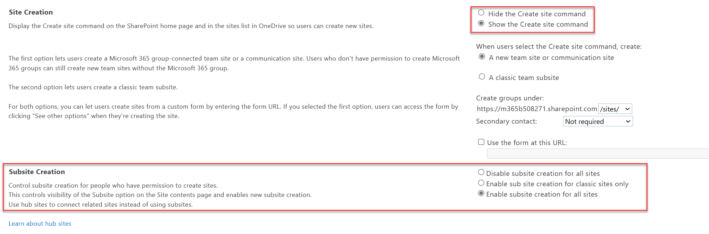

# Manage site creation in SharePoint

As a [SharePoint Administrator](/sharepoint/site-permissions#site-admins) and above (./site-permissions) in Microsoft 365, you can let your users create and administer their own SharePoint sites, determine what kind of sites they can create, and specify the location of the sites. By default, users can create communication sites and [Microsoft 365 group-connected team sites](https://support.office.com/article/b565caa1-5c40-40ef-9915-60fdb2d97fa2).
  
> [!NOTE]
> Disabling site creation for users does not remove their ability to create Microsoft 365 groups or resources, such as Microsoft Teams, which rely on a group. When a Microsoft 365 group is created, a SharePoint site is also created. To restrict creation of Microsoft 365 groups and the resources that rely on groups see [Manage who can create Microsoft 365 Groups](/office365/admin/create-groups/manage-creation-of-groups). 

## Manage site creation in the new SharePoint admin center

1. Go to <a href="https://go.microsoft.com/fwlink/?linkid=2185072" target="_blank">**Settings** in the SharePoint admin center</a>, and sign in with an account that has [admin permissions](./sharepoint-admin-role.md) for your organization.

   > [!NOTE]
   > If you have Office 365 operated by 21Vianet (China), [sign in to the Microsoft 365 admin center](https://go.microsoft.com/fwlink/p/?linkid=850627), then browse to the SharePoint admin center and open the Settings page.
    
2. Select **Site creation**. The **Site creation** page appears.

   :::image type="content" source="media/site-creation-screen.png" alt-text="The screenshot that shows the Site creation page." lightbox="media/site-creation-page.png":::

3. If you want users to be able to create sites, select **Users can create SharePoint sites**. This setting controls whether users can create sites from SharePoint, OneDrive, the PnP PowerShell cmdlet, and the REST API. This setting doesn't affect whether users can create teams or Microsoft 365 groups and their connected sites.
 
4. If you want users to be able to create sites from these services, select **Show the options to create a site in SharePoint and create a shared library from OneDrive**.

   > [!NOTE]
   > Even if you clear these checkboxes, users may be able to create Microsoft 365 groups from other places in Microsoft 365. Each group always comes with a team site. [Learn how to manage who can create Microsoft 365 groups](/office365/admin/create-groups/manage-creation-of-groups)

5. Under /sites or /teams, select to create Microsoft 365 group-connected team sites, and then select the default time zone and storage limit for new sites.

6. Select **Save**.

## Manage detailed site and subsite creation settings in the classic SharePoint admin center

Admins in the <a href="https://go.microsoft.com/fwlink/?linkid=2185219" target="_blank">SharePoint admin center</a> can choose to either enable or disable subsite creation across sites or enable for classic sites only. When subsite creation is being disabled, not only will the subsite option be hidden from the command bar including classic, but also users won't be able to create new subsites directly through a URL or API.  

> [!NOTE]
> For information about classifying Microsoft 365 groups, see [Manage Microsoft 365 Groups with PowerShell](/office365/enterprise/manage-office-365-groups-with-powershell).

1.  In the left pane of the new SharePoint admin center, select <a href="https://go.microsoft.com/fwlink/?linkid=2185072" target="_blank">**Settings**</a>. At the bottom of the page, select **classic settings page**. 
    
2. Under **Site Creation**, select to show or hide the **Create site** command.

    

   - If you choose **Disable subsite creation for all sites**, it will hide the subsite creation command (including classic) and disable users from being able to create new subsites through a URL or API. 
   - If you choose **Enable subsite creation for classic sites only**, users will be able to create new subsites for classic sites. 
   - If you choose **Enable subsite creation for all sites**, users will be able to create new subsites from any SharePoint site. 

3. Select **OK** when you're done.

> [!NOTE]
> Creating a subsite in OneDrive is not supported. You will see an error, “New subsites are not available in this site. Create a new site instead.”

> [!TIP]
> Instead of using subsites, we recommend that you use hub sites. [SharePoint hub sites](https://support.microsoft.com/office/what-is-a-sharepoint-hub-site-fe26ae84-14b7-45b6-a6d1-948b3966427f) allow you to group similar topics and content together using modern architecture design. Plan to [create hub sites.](create-hub-site.md)

