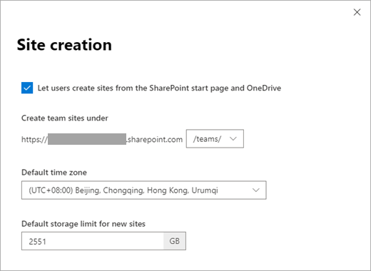
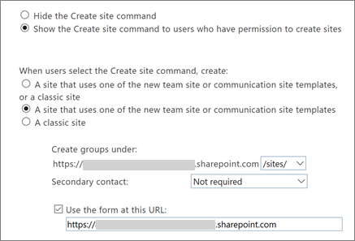

# Manage site creation in SharePoint Online

As a global or SharePoint admin in Office 365, you can let your users create and administer their own SharePoint sites, determine what kind of sites they can create, and specify the location of the sites. By default, users can create communication sites and [Office 365 group-connected team sites](https://support.office.com/article/b565caa1-5c40-40ef-9915-60fdb2d97fa2).
  
>[!NOTE]
>Disabling site creation for users does not remove their ability to create Office 365 groups or resources, such as Microsoft Teams, which rely on a group. When an Office 365 group is created, a SharePoint site is also created. To restrict creation of Office 365 groups and the resources that rely on groups see [Manage who can create Office 365 Groups](/office365/admin/create-groups/manage-creation-of-groups).
  
## Manage site creation in the new SharePoint admin center

1. Sign in to https://admin.microsoft.com as a global or SharePoint admin. (If you see a message that you don't have permission to access the page, you don't have Office 365 administrator permissions in your organization.)
    
    > [!NOTE]
    > If you have Office 365 Germany, sign in at https://portal.office.de. If you have Office 365 operated by 21Vianet (China), sign in at https://login.partner.microsoftonline.cn/. Then select the Admin tile to open the admin center.  
    
2. In the left pane, under **Admin centers**, select **SharePoint**. (You might need to select **Show all** to see the list of admin centers.) 
    
3. If the classic SharePoint admin center appears, select **Open it now** at the top of the page to open the new SharePoint admin center.
    
4. In the left pane of the new SharePoint admin center, select **Settings**, and then select **Site creation**.

    

5. Select to create Office 365 group-connected team sites under /sites or /teams, select the default time zone and storage limit for new sites, and turn **Let users create new sites** On or Off. 

6. Select **Save**.
 
## Manage detailed site and subsite creation settings in the classic SharePoint admin center

1.  In the left pane of the new SharePoint admin center, select **Settings**. At the bottom of the page, select **classic settings page**.  
    
2. Under **Site Creation**, select to show or hide the Create site command.
    
3. If you select **Show the Create site command**, specify the type of site that users can create.
    
    
  
    > [!NOTE]
    > To allow only a select set of users to create groups, use the PowerShell cmdlet  `GroupCreationAllowedGroupId`. For info about this cmdlet, see [Azure Active Directory cmdlets for configuring group settings](https://azure.microsoft.com/documentation/articles/active-directory-accessmanagement-groups-settings-cmdlets/). 
  
  
  - **A new team site or communication site**: Select to create the group-connected team sites under (/sites or /teams) and whether a secondary contact is required. To let users create sites from a custom form you've created, enter its URL in the **Use the form at this URL** box. When users select which type of site they want to create, they'll be able to access the form by clicking "See other options." 
    
  - **A classic site**: Use this option to allow users to create only default classic sites or sites from your custom form. Specify where sites are created, and whether a site classification or secondary contact is required. To specify a custom form, enter the URL for the custom form in the **Use the form at this URL** box. 
    
    > [!NOTE]
    > For info about classifying Office 365 groups, see [Manage Office 365 Groups with PowerShell](/office365/enterprise/manage-office-365-groups-with-powershell). 
  
4. Select **OK**.
