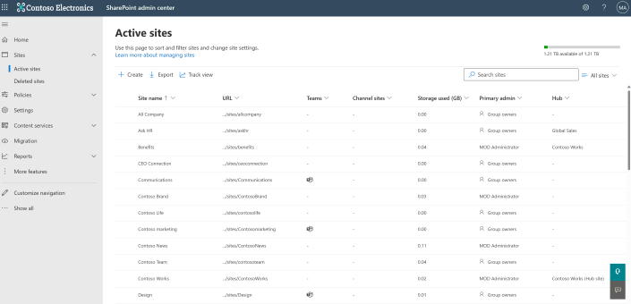
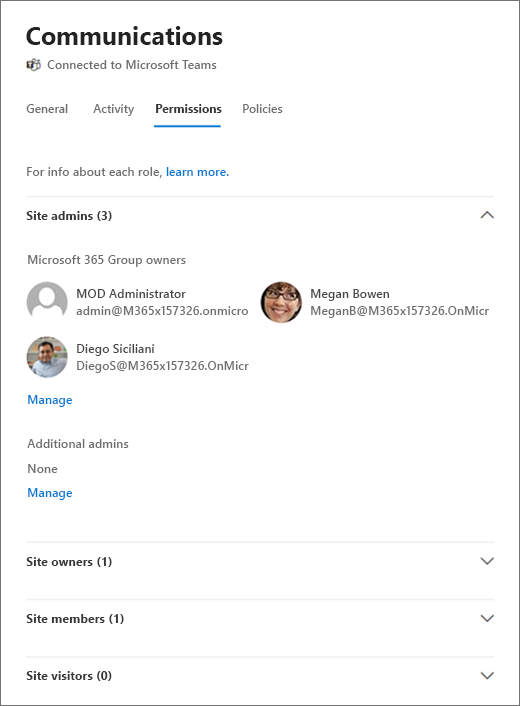
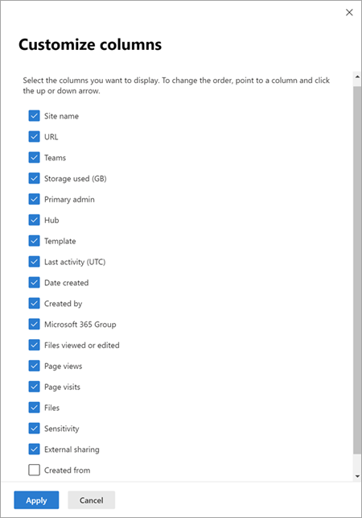
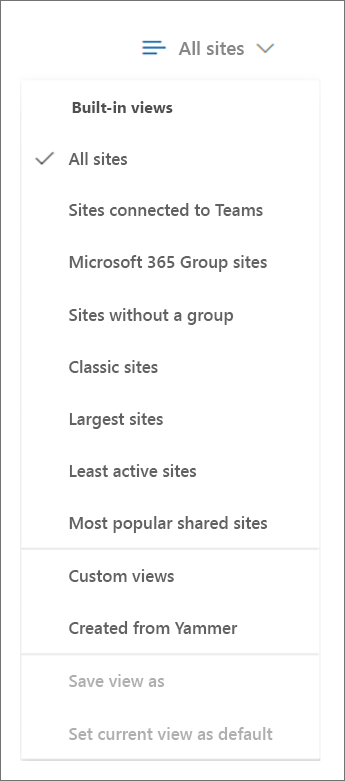
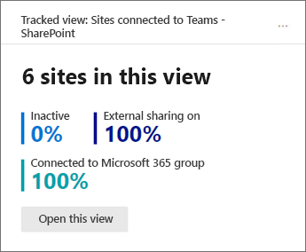

# Manage sites in the new SharePoint admin center

The [Active sites page](https://admin.microsoft.com/sharepoint?page=siteManagement&modern=true) of the new SharePoint admin center lets you view the SharePoint sites in your organization (including communication sites and sites that belong to Microsoft 365 groups). It also lets you sort and filter sites, search for a site, and create new sites.
  

  
> [!NOTE]
> The Active sites page lists the root website for each site collection. Subsites, redirect sites (REDIRECTSITE#0) created by changing a site address or replacing the root site, and Microsoft Teams private channel sites (TEAMCHANNEL#0) aren't included in the list.  Some functionality is introduced gradually to organizations that have opted in to the [Targeted release option in Microsoft 365](/office365/admin/manage/release-options-in-office-365). This means that you might not yet see some features described in this article, or they might look different. 
 
For more info about tasks on the Active sites page, see:

- [Create a site](create-site-collection.md)
- [Register a site as a hub site](create-hub-site.md) and [Unregister a site as a hub site](remove-hub-site.md)
- [Turn external sharing on or off for for a site](change-external-sharing-site.md)  
- [Delete a site](delete-site-collection.md)
- [Manage site storage limits](manage-site-collection-storage-limits.md)
  
## Add or remove site admins and group owners

  
1. In the left column, select a site. 
    
2. Select **Permissions**. For a group-connected team site, you can add and remove group owners and additional site admins. For other sites, you can add and remove site admins and change the primary admin. Note that if you remove a person as a primary admin, they will still be listed as an additional admin. For info about each role, see [About site permissions](site-permissions.md). 
    
## Change a site's hub association

  
1. In the left column, select a site. 
    
2. Select **Hub**. The options that appear depend on whether the site you selected is registered as a hub site, or associated with a hub. The Hub menu lets you register a site as a hub site, associate it with a hub, change its hub association, and unregister it as a hub site. [More info about hubs](planning-hub-sites.md) 

## View site details

For more info about a site, select the site name to open the details panel.
  

  
To view site activity including the number of files stored and storage usage, select the **Activity** tab. Activity information is not available for Office 365 Germany customers and US Government GCC High and DoD customers.
  
To view site admins, owners, members, and visitors, select the **Permissions** tab.

  
For info about the roles in this panel, see [About site permissions](site-permissions.md).
    
## Sort and filter the site list

Sorting and filtering the site list is just like sorting and filtering other lists in SharePoint.
  
1. Select the arrow next to the column header.
    
2. Select how you want to arrange the items. The options vary depending on the column. For example, you might have options to sort alphabetically, in numeric order, or chronologically.
    
    If the column allows filtering, a "Filter by" option appears. Select the value or values that you want to show. Your selections appear with a check mark beside them. To remove a selection, select that value again. To clear all filters on the column, select **Clear filters**.
    
    

## Customize columns

1. Select the arrow next to any column header, and then select **Customize columns**.
    
2. To show and hide columns, select and clear check boxes.
    
3. To rearrange the columns, point to a column, and select the up or down arrow to move the column up or down.
    
    
    
    > [!NOTE]
    > Data in the following columns is not available for Office 365 Germany customers and US Government GCC High and DoD customers:
    > - Last activity
    > - File views or edited
    > - Page views
    > - Page visits
    > - Files
    > - Storage used
  
## Switch views and create custom views

The new SharePoint admin center comes with a few built-in views: All sites, Sites connected to Teams, Microsoft 365 group sites, Sites without a group, Classic sites, Largest sites, Least active sites, and Most popular shared sites. 

To select a different view:

- On the far right of the command bar, select the **Change view** arrow next to the name of your current view, and then select a different view.

    

To create and save a custom view:
  
1. Customize columns, sort, and filter your view the way you want. (Views that are filtered through search can't be saved.)
    
2. On the far right of the command bar, select the **Change view** arrow next to the name of your current view.
    
3. Select **Save view as**.
    
4. In the **Save as** dialog box, enter a name for the view. 
    
    > [!NOTE]
    > To set the view as default, in the list of views, select **Set current view as default**. 
  
## Track a view

When you select a built-in or custom view, you can add a card to your home page that shows the number of sites in the view and summarizes info about the set of sites. 

1. Select the **Change view** arrow, and then select the view you want to track.
2. Select **Track view**.
3. Select **Add card**.
4. Go to your home page to see the card for the tracked view.

    

> [!NOTE]
> If you remove a tracked view card from your home page, you can't add it back from the Add cards panel. YOu need to open the view on the Active sites page and select **Track view**.

## Search for a site

You can search for a site by name, URL, primary admin, or template. To do this, enter keywords in the Search box, and press Enter.

> [!NOTE] 
> Search doesn't look in hub site display names for the keywords you enter.  All characters you enter are treated as part of the query. Search doesn't recognize operators or wildcards (*). 
  
## Export to CSV

To export the site list you're viewing as a .csv file that you can work with in Excel, select **Export**.
  
> [!NOTE]
> The .csv file lists the hub as a GUID and the template as an ID (for example, STS#0).
  

