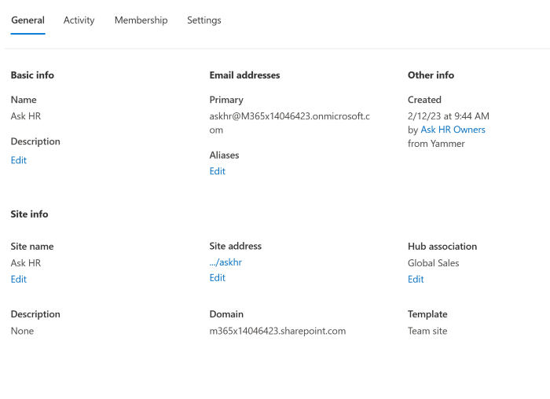

# Manage sites in the SharePoint admin center

The <a href="https://go.microsoft.com/fwlink/?linkid=2185220" target="_blank">**Active sites** page</a> of the SharePoint admin center lets you view the SharePoint sites in your organization, including communication sites, channel sites, and sites that belong to Microsoft 365 groups. It also lets you [sort and filter sites](customize-admin-center-site-list.md), search for a site, and create new sites.
  

  
> [!NOTE]
> The Active sites page lists the root website for each site collection. Subsites and redirect sites (REDIRECTSITE#0) created by changing a site address or replacing the root site aren't shown. 

> [!NOTE]
> The Active sites page in SharePoint admin center does not show all site types, for example, the `ContentTypeHub` sites, are intentionally excluded from the list.

Following are the site types that are intentionally excluded from the list.

- Sites with the following URLs:
  
   |**URL**|**Description**|
   |:-----|:-----|
   |/sites/contentTypeHub |Content hub host |
   |/sites/CompliancePolicyCenter |Policy center |
   |/portal/hub |PointPublishing hub |
   |/search |Search site |
   |/personal/ |OneDrive sites |

- Sites with the following templates:

   |**ID**|**Name**|**Description**|
   |:-----|:-----|:-----|
   |6000 |REVIEWCTR# |Review center |
   |10043 |FunSite# |SharePoint tenant fundamental site |
   |65 |POINTPUBLISHINGHUB# |PointPublishing hub |
   |66 |POINTPUBLISHINGPERSONAL#0 |Personal blog |
   |67 |POINTPUBLISHINGTOPIC#0 |PointPublishing topic |
   |3500 |POLICYCTR# |Compliance policy center |
   |30003 |TestSite# |Test site |
   |3 |CENTRALADMIN# |Central admin site |
   |54 |SPSMSITEHOST# |My Site host |
   |21 |SPSPERS# |SharePoint Portal Server personal space |
   |16 |TENANTADMIN# |Tenant admin site |
   |301 |REDIRECTSITE# |Redirect site |
   |70 |CSPCONTAINER# |CSP container |

For more info about tasks on the Active sites page, see:

- [Create a site](create-site-collection.md)
- [Register a site as a hub site](create-hub-site.md) and [Unregister a site as a hub site](remove-hub-site.md)
- [Change sharing settings for a site](change-external-sharing-site.md)  
- [Delete a site](delete-site-collection.md)
- [Manage site storage limits](manage-site-collection-storage-limits.md)

## Add or remove site admins and group owners

For all site types except channel sites, you can add or remove site admins and change the primary admin. For group-connected team sites, you can also add and remove group owners. Note that if you remove a person as a primary admin, they will still be listed as an additional admin. For info about each role, see [About site permissions](site-permissions.md).

1. In the SharePoint admin center, select **Sites** > **Active sites** or browse to the <a href="https://go.microsoft.com/fwlink/?linkid=2185220" target="_blank">**Active sites** page</a>.

2. In the left column, select a site. 
    
3. Select **Membership** on the command bar to open the details panel to update the permissions of the members.
   :::image type="content" source="media/membership-details-panel.png" alt-text="Screenshot of membership tab in details panel":::

4. Add or remove people or change their role, and then select **Save**.
    
## Change a site's hub association

  
1. In the SharePoint admin center, select **Sites** > **Active sites** or browse to the <a href="https://go.microsoft.com/fwlink/?linkid=2185220" target="_blank">**Active sites** page</a>.

2. In the left column, select a site. 
    
3. Select **Hub** on the command bar. The options that appear depend on whether the site you selected is registered as a hub site, or associated with a hub. The Hub menu lets you register a site as a hub site, associate it with a hub, change its hub association, and unregister it as a hub site. For more information, see [More info about hubs](planning-hub-sites.md).

## View site details

For more info about a site, select the site name or click anywhere on the site row except on the URL column to open the details panel or for channel sites select the link in the **Channel sites** column and then select the site name.
  

  
To view site activity including the number of files stored and storage usage, select the **Activity** tab. Activity information is not available for US Government GCC High and DoD customers.
  
To view site admins, owners, members, and visitors, select the **Membership** tab.

:::image type="content" source="media/membership-details-panel.png" alt-text="Screenshot of Membership tab selection on details panel":::
  
For info about the roles in this panel, see [About site permissions](site-permissions.md).

## Related topics

[Manage site storage limits](manage-site-collection-storage-limits.md)

