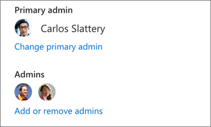
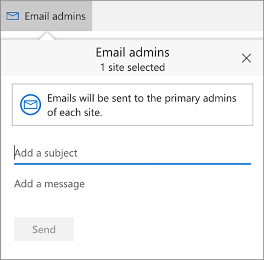

# Manage sites in the new SharePoint admin center

The Site management page of the new SharePoint admin center (preview) lets you view the SharePoint sites in your organization (including the new communication sites and sites that belong to Office 365 groups). It also lets you sort and filter sites and create new sites. 
  

  
> [!NOTE]
> The Site management page lists the root website for each site collection. Subsites aren't included in the list. 
  
To manage sites in the new SharePoint admin center, go to the current SharePoint admin center, click "Try the new SharePoint admin center preview" in the upper right, and then select **Site management**. For info about the new SharePoint admin center, see [Get started with the new SharePoint admin center](get-started-with-the-new-sharepoint-admin-center-preview).
  
## In this article

[Create a site](manage-sites-in-the-new-sharepoint-admin-center.md#createsite)
  
[Delete a site](manage-sites-in-the-new-sharepoint-admin-center.md#deletesite)
  
[Add or remove admins](manage-sites-in-the-new-sharepoint-admin-center.md#addremoveadmins)
  
[Email admins](manage-sites-in-the-new-sharepoint-admin-center.md#emailadmins)
  
[View site details](manage-sites-in-the-new-sharepoint-admin-center.md#viewsitedetails)
  
[Sort and filter the site list](manage-sites-in-the-new-sharepoint-admin-center.md#sortfilter)
  
[Export to Excel](manage-sites-in-the-new-sharepoint-admin-center.md#export)
  
[Go to a site](manage-sites-in-the-new-sharepoint-admin-center.md#gotosite)
  
[Customize columns](manage-sites-in-the-new-sharepoint-admin-center.md#customizecolumns)
  
## Create a site

You as a SharePoint or global admin in your organization can create new sites from the admin center in the same way that you can allow your users to create sites.
  
1. Click **Create site**.
    
2. Select to create a team site (which will create an Office 365 group), a communication site, or a classic site. For info about the new site templates, see [Create a team site in SharePoint Online](https://support.office.com/article/ef10c1e7-15f3-42a3-98aa-b5972711777d) and [Create a communication site in SharePoint Online](https://support.office.com/article/7fb44b20-a72f-4d2c-9173-fc8f59ba50eb). 
    

  
## Delete a site

On the Site management page, you can delete all sites except those that belong to an Office 365 group. 
  
1. In the left column, click to select one or more sites. 
    
2. Click **Delete**, and then click **Delete** to confirm. 
    
You can recover deleted sites for 30 days by going to the Recycle bin. For more info, see [View and restore deleted sites](view-and-restore-deleted-sites-in-the-new-sharepoint-admin-center).
  
## Add or remove admins

For all sites except those managed by Office 365 group owners, you can change the primary admin and add or remove additional admins.
  
1. Click the site name to open the details pane.
    
2. Under **Properties**, click **Change primary admin** or **Add or remove admins**. 
    

  
## Email admins

On the Site management page, you can email the primary admins of the sites you select.
  
1. In the left column, click to select one or more sites. 
    
    Notes: 
    
  - You can email the primary admins for all sites except those that belong to an Office 365 group. If you want to email several owners at one time, sort or filter columns to exclude sites that belong to an Office 365 group before you make your selection.
    
  - Users who are the primary admin for more than one site will receive an email for each site.
    
2. Click **Email admins**. 
    
3. Enter a subject and add a message, and then click **Send**. 
    

  
## View site details

To see more info about a site, click the site name to open the details pane. 
  

  
Site insights in the details pane:
  
- The number of page views in the last 30 days 
    
- The number of files viewed or edited in the last 30 days 
    
- The date of the last activity on the site
    
- The number of files
    
- The amount of storage used
    
Note: All these insights are available as columns in the site management list. For info about adding a column that doesn't appear, see [Customize columns](manage-sites-in-the-new-sharepoint-admin-center.md#customizecolumns).
  

  
Site properties in the details pane:
  
- The domain
    
- A link to the site
    
- The site template (also available as a column in the site management list)
    
- Whether the site belongs to an Office 365 group (also available as a column in the site management list)
    
- The site description if specified
    
- The primary admin (also available as a column in the site management list) and additional admins, with links to change the admins. If a site belongs to an Office 365 group, you can change the admins by changing the group owners. For info, see [Add or remove members from Office 365 groups using the Office 365 admin center](https://support.office.com/article/e186d224-a324-4afa-8300-0e4fc0c3000a).
    
- The external sharing status (also available as a column in the site management list)
    
## Sort and filter the site list

Sorting and filtering the site list is just like sorting and filtering other lists in SharePoint. 
  
1. Click the arrow next to the column header.
    
2. Select how you want to arrange the items. The options vary depending on the column. For example, you might have options to sort alphabetically, in numeric order, or chronologically. 
    
    If the column allows filtering, you'll see a "Filter by" option. Select the value or values that you want to show. Your selections will appear with a check mark beside them. To remove a selection, click that value again. To clear all filters on the column, select **Clear filters**. 
    

  
## Export to Excel

If you're on a PC, you can export the list of all sites to Excel. To do this, click **Export to Excel**.
  
> [!NOTE]
>  The Export to Excel command exports all sites, even if your current view is filtered. >  Exporting to Excel lets you save or open a web query (.iqy) file. This file always imports the latest data, but you need to be online and signed in with an admin account to use the file. If you want to work on the site list offline or share it, open the .iqy file in Excel and save it as an Excel file. 
  
## Go to a site

1. Click the site name to open the details pane.
    
2. Under **Properties**, click the link to the site. 
    
## Customize columns

1. Click the arrow next to any column header, and then select **Customize columns**.
    
2. Select and clear check boxes to show and hide columns. 
    
3. Rearrange the columns by pointing to a column and clicking the up or down arrow to move the column up or down. 
    

  
If you leave the page, the site list goes back to the default. You can't save custom views in the new SharePoint admin center yet.
  

