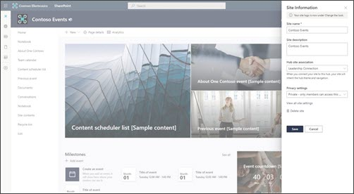

# Manage settings and permissions when SharePoint and Teams are integrated

In this article, learn how to manage settings and permissions when Teams and SharePoint are integrated together. Learn more about [integrations between SharePoint and Teams, basic terminology, and structure.](teams-connected-sites.md)

## How to identify and navigate between SharePoint and Teams

Teams-connected sites include additional information to indicate the connection to Teams. In the SharePoint site header, you will see the Teams icon following the site logo and site title.

In the site, the **Go to channel** link is available in the command bar when viewing document libraries. For the parent site, this link redirects to Teams and the general channel for the team. For the channel sites, it links to the channel in teams.

 

In the parent team site, the **Go to channel** link will be available in the command bar when viewing document libraries.

Additionally, from teams and channels in Microsoft Teams, you can select the ellipsis (...) at the top-right of the channel and then **Open in SharePoint** to navigate to the Teams connected team site or channel site in SharePoint.

## Manage settings and permissions

When SharePoint sites and Teams are integrated, certain setting and classifications need to be managed in the [settings in Microsoft Teams](https://support.microsoft.com/office/manage-team-settings-and-permissions-in-teams-ce053b04-1b8e-4796-baa8-90dc427b3acc). You'll notice that when you navigate to **Settings** in SharePoint site, certain options are not editable, like **Permissions**. Learn more about [viewing and managing settings in Microsoft Teams](https://support.microsoft.com/office/manage-team-settings-and-permissions-in-teams-ce053b04-1b8e-4796-baa8-90dc427b3acc).

| Settings managed in SharePoint | Settings managed in Teams  |
| :------------------- | :------------------- |
| - Site name   - Site description   - Hub association | - Site permissions   - Sensitivity classification   - Private channel membership|

> [!NOTE]
> Channel sites display site permissions in the SharePoint site permissions panel in read-only mode. Site owners can access and update site sharing or guest expiration options in the panel, but they need to go to Microsoft Teams to manage site permissions.

## Channel site home page layout

For private and shared channel sites, you'll find a unique home page layout that is designed to encourage and guide usage of typical SharePoint tasks. You'll find easy access to the [News web part](https://support.microsoft.com/office/use-the-news-web-part-on-a-sharepoint-page-c2dcee50-f5d7-434b-8cb9-a7feefd9f165), [Documents web part](https://support.microsoft.com/office/use-the-document-library-web-part-a9dfecc3-2050-4528-9f00-2c5afc5731b0), and links to documentation for creating lists, automating tasks, and changing the look of your site.  

## Channel sites and hub associations

Just like typical SharePoint sites, [channel sites](teams-connected-sites.md) can be associated to a [SharePoint hub sites](https://support.microsoft.com/office/what-is-a-sharepoint-hub-site-fe26ae84-14b7-45b6-a6d1-948b3966427f) from the parent team site. Upon associating the parent team to the hub, all channel sites (private and shared) are also associated to the hub. 

When channel sites get associated with a hub, the hub navigation gets inherited across the parent team and channel sites. The entire team (parent team and channels) is treated as one entity.

> [!NOTE]
> Hub site association doesn't appear in the Site information panel for channel sites. Hub site associations are managed from the parent team site.

## How to maximize the benefits of SharePoint and Teams integration

- **Upload and share files in Teams** - Share a file in a team or channel and the file will become accessible to everyone in the team. The file will also automatically sync to the corresponding SharePoint site document library. Learn more about [file sharing in Teams](https://support.microsoft.com/office/share-files-in-teams-0c4d34ee-5dd8-46d5-ab35-0d227b5e6eb5) and [how to coauthor content with your team](https://support.microsoft.com/office/document-collaboration-and-co-authoring-ee1509b4-1f6e-401e-b04a-782d26f564a4).
- **Pin resources from SharePoint as a tab in Teams** - Add published SharePoint pages, lists, and document libraries as individual tabs in a Teams channel. [Learn more](https://support.microsoft.com/office/add-a-sharepoint-page-list-or-document-library-as-a-tab-in-teams-131edef1-455f-4c67-a8ce-efa2ebf25f0b).
- **Use team templates in Teams and SharePoint** - Teams has team templates that can be used to quickly create a new team and connected site that come pre-populated with resources and folders. [Learn more about how to create a new team using a template](https://support.microsoft.com/office/create-a-team-with-team-templates-702a2977-e662-4038-bef5-bdf8ee47b17b)

## Learn more

[Overview of SharePoint and Teams integration](teams-connected-sites.md)

[Manage policies in Teams](/MicrosoftTeams/teams-policies)

[Manage settings and permissions in Teams](https://support.microsoft.com/office/ce053b04-1b8e-4796-baa8-90dc427b3acc)

[Create a Microsoft Team from SharePoint](https://support.microsoft.com/office/create-a-microsoft-team-from-sharepoint-545973b6-c38f-426a-b2b6-16405a561628)

[Microsoft Teams can have standard or private channels](https://support.microsoft.com/office/teams-can-have-standard-or-private-channels-de3e20b0-7494-439c-b7e5-75899ebe6a0e)

