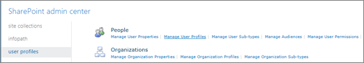
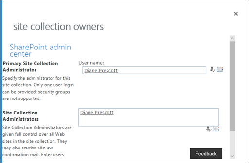
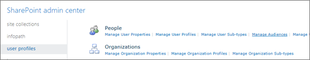
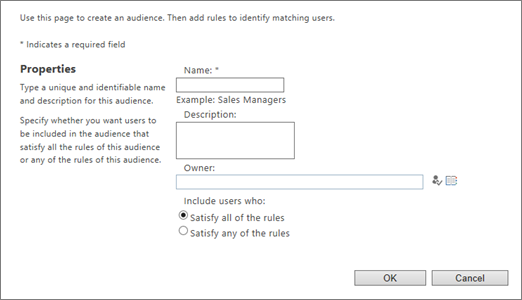
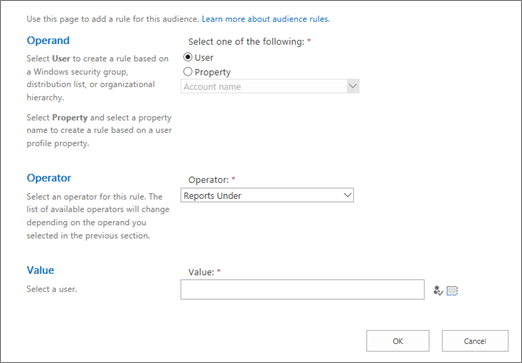
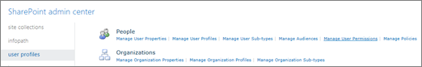

# Manage user profiles in the SharePoint admin center

This article is for global admins and SharePoint admins in Microsoft 365. 

- If you're running SharePoint Server, see [Administer the User Profile service in SharePoint Server](/SharePoint/administration/user-profile-service-administration).
  
- If you're not an admin, see [View and update your profile in Office Delve](https://support.office.com/article/4e84343b-eedf-45a1-aeb9-8627ccca14ba) for info about changing your profile.
  
Most organizations don't need to change any user profile settings in the SharePoint admin center. For the organizations that do need to work with user profile settings, this article describes the most common tasks.
  
## Create and edit custom user properties

In Microsoft 365, identity is managed by Azure Active Directory. For info about this, see [Understanding Microsoft 365 identity and Azure Active Directory](/office365/enterprise/about-office-365-identity). SharePoint receives this profile information. If you need to store additional info about your users, you can create custom properties in the SharePoint admin center. For info about doing this, see [Add and edit user profile properties in SharePoint](add-and-edit-user-profile-properties.md).
  
> [!NOTE]
> Instead of creating user sub-types in the SharePoint admin center, we recommend using the Microsoft 365 admin center to [Compare groups](/office365/admin/create-groups/compare-groups) or using the Azure AD admin center to [create groups with dynamic membership](/azure/active-directory/users-groups-roles/groups-dynamic-membership).
  
## Add and remove admins for a user's OneDrive

Follow these steps to transfer ownership of a OneDrive to a different user, or give a user full control over another user's OneDrive.
  
1. Go to the [More features page of the new SharePoint admin center](https://admin.microsoft.com/sharepoint?page=classicfeatures&modern=true), and sign in with an account that has [admin permissions](/sharepoint/sharepoint-admin-role) for your organization.

>[!NOTE]
>If you have Office 365 Germany, [sign in to the Microsoft 365 admin center](https://go.microsoft.com/fwlink/p/?linkid=848041), then browse to the SharePoint admin center and open the More features page.  If you have Office 365 operated by 21Vianet (China), [sign in to the Microsoft 365 admin center](https://go.microsoft.com/fwlink/p/?linkid=850627), then browse to the SharePoint admin center and open the More features page.
 
2. Under **User profiles**, select **Open**. 
    
3. Under **People**, select **Manage User Profiles**.
    
    
  
4. Enter the user's name and select **Find**.
    
5. Right-click the user, and then select **Manage site collection owners**.
    
6. Add and remove admins for the OneDrive, and then select **OK**.
    
    
  
For info about automatically transferring ownership of OneDrive to a user's manager when the user account is marked for deletion, see [Set up access delegation](/onedrive/retention-and-deletion).
> [!NOTE]
> For full OneDrive functionality, the user must be a site collection administrator of the organization's OneDrive site. Removing this permission is not supported.

## Manage audiences

Audiences let you customize content on pages so that it appears only to particular people based on their:
  
- Membership in a distribution list or security group
    
- Location in the reporting structure or public info in the user profile
    
For example, you can display a navigational link to only people in a particular geographic location. For info about using audiences, see [Target content to specific audiences](https://support.office.com/article/33d84cb6-14ed-4e53-a426-74c38ea32293).

> [!NOTE]
> Only sites that use classic templates can be customized based on audience.  Audiences are not a security feature. They help you deliver relevant content to specific groups of people, but don't prevent content from being available to anyone with the appropriate permissions.

To add, edit, or delete an audience or an audience rule, go to the Manage Audiences page:
  
1. Go to the [More features page of the new SharePoint admin center](https://admin.microsoft.com/sharepoint?page=classicfeatures&modern=true), and sign in with an account that has [admin permissions](/sharepoint/sharepoint-admin-role) for your organization.

>[!NOTE]
>If you have Office 365 Germany, [sign in to the Microsoft 365 admin center](https://go.microsoft.com/fwlink/p/?linkid=848041), then browse to the SharePoint admin center and open the More features page.  If you have Office 365 operated by 21Vianet (China), [sign in to the Microsoft 365 admin center](https://go.microsoft.com/fwlink/p/?linkid=850627), then browse to the SharePoint admin center and open the More features page.

2. Under **User profiles**, select **Open**.
    
3. Under **People**, select **Manage Audiences**.
    
    
  
    Creating a new audience:
    
    
  
    Creating a new rule for the audience:
    
    
  
Audiences compile approximately weekly, and you can only view audience members after the audience compiles. The user profiles page shows the number of audiences, the number of uncompiled audiences, and the compilation status and time.
  
## Disable OneDrive creation for some users

If some users are licensed to use OneDrive, but you don't want them to create a OneDrive (perhaps for regulatory reasons), you can prevent them from doing so.

> [!NOTE]
> If a user already created a OneDrive, changing the following setting won't delete it.
  
1. Go to the [More features page of the new SharePoint admin center](https://admin.microsoft.com/sharepoint?page=classicfeatures&modern=true), and sign in with an account that has [admin permissions](/sharepoint/sharepoint-admin-role) for your organization.

>[!NOTE]
>If you have Office 365 Germany, [sign in to the Microsoft 365 admin center](https://go.microsoft.com/fwlink/p/?linkid=848041), then browse to the SharePoint admin center and open the More features page.  If you have Office 365 operated by 21Vianet (China), [sign in to the Microsoft 365 admin center](https://go.microsoft.com/fwlink/p/?linkid=850627), then browse to the SharePoint admin center and open the More features page.
 
2. Under **User profiles**, select **Open**. 

3. Under **People**, select **Manage User Permissions**.
    
    
  
4. By default, "Everyone except external users" has permission to "Create Personal Site" (which includes creating a OneDrive and saving user data such as followed and frequent sites). Remove that group and add specific groups to allow only a subset of licensed users to create a OneDrive.
    
    

> [!NOTE]
> The **Disable OneDrive** check box has no effect. Use the "Create Personal Site" check box to specify the security groups that have permission to create a OneDrive.  
  
5. Select **OK**.
