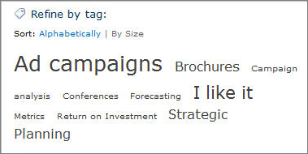
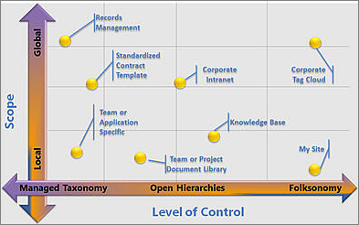
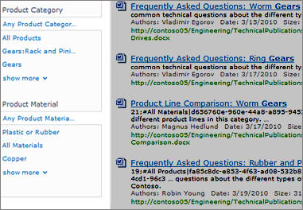
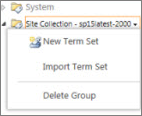
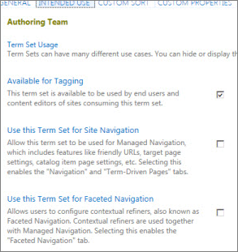

# Introduction to managed metadata

Metadata is information about information. For example, a book's title and author is metadata. Metadata can be many kinds of information -- a location, a date, or a catalog item number. When you use SharePoint products, you can manage the metadata centrally. You can organize the metadata in a way that makes sense in your business and use the metadata to make it easier to find what you want. 
  
This article describes some important terminology of managed metadata, and gives you a quick look at how you can use the tools in SharePoint to manage metadata. 
  
## Important terminology

This section contains definitions of some key terminology. These terms and concepts appear frequently in articles about managed metadata.
  
### Taxonomy

A taxonomy is a formal classification system. A taxonomy groups the words, labels, and terms that describe something, and then arranges the groups into a hierarchy. 
  
People construct taxonomies for almost any kind of information, from biological systems to organizational structures. For example, biologists group living organisms into four major classifications: animal, plant, fungus, and microbe. Each of these major groups has many subdivisions. Together, the whole system is a taxonomy. 
  
Organizations create taxonomies in too many ways to list. They create Chart of Accounts taxonomies to manage accounting systems, organization charts and job classifications to manage employees, product catalogs and so on. All these taxonomies are structured hierarchies of information; formal classification systems that help people handle information. 
  
### Folksonomy

A folksonomy is an informal classification system. It evolves gradually as web site users collaborate on words, labels, and terms on a site. Originally, folksonomies developed from popular applications such as bookmarking.
  
If you have ever seen a tag cloud on a website, then you have seen a visualization of a folksonomy. The following figure shows a tag cloud on a SharePoint site. 
  

  
A folksonomy-based approach to metadata can be useful. It creates a way to share the knowledge and expertise of site users. By using a folksonomy, content classification can evolve together with changing business needs and user interests.
  
### Term Set

A Term set is a group of related terms. 
  
Terms sets can have different scope, depending on where you create the term set.
  
- **Local term sets** are created within the context of a site collection, and are available for use (and visible) only to users of that site collection. For example, when you create a term set for a metadata column in a list or library, then the term set is local. It is available only in the site collection that contains this list or library. For example, a media library might have a metadata column that shows the kind of media (diagram, photograph, screen shot, video, etc.). The list of permitted terms is relevant only to this library, and available for use in the library. 
    
- **Global term sets** are available for use across all sites that subscribe to a specific Managed Metadata Service application. For example, an organization might create a term set that lists names of business units in the organization, such as Human Resources, Marketing, Information Technology, and so on. 
    
In addition, you can configure a term set as closed or open. In a closed term set, users can't add new terms unless they have appropriate permissions. In an open term set, users can add new terms in a column that is mapped to the term set.
  
### Terms

A term is a specific word or phrase that you associated with an item on a SharePoint site. It is a single item in a term set. A term has a unique ID and it can have many text labels (synonyms). If you work on a multilingual site, the term can have labels in different languages.
  
There are two types of terms:
  
- **Managed terms** Managed terms are terms that are pre-defined. Term Store administrators organize managed terms into a hierarchical term set. 
    
- **Enterprise keywords** An enterprise keyword is a word or phrase that a user adds to items on a SharePoint site. The collection of enterprise keywords is known as the Keywords set. Typically, users can add any word or phrase to an item as a keyword. This means that you can use enterprise keywords for folksonomy-style tagging. Sometimes, Term Store administrators move enterprise keywords into a specific managed term set. When they are part of a managed term set, keywords become available in the context of that term set. 
    
To learn more about how to create and manage terms, see [Create and manage terms in a term set](create-and-manage-terms.md).
  
### Group

In SharePoint products, group is a security term. With respect to managed metadata, a group is a set of term sets that all share common security requirements. Only users who have contributor permissions for a specific group can manage term sets that belong to the group or create new term sets within it. Organizations should create groups for term sets that will have unique access or security needs.
  
To learn more about how to create a group for term sets, see [Set up a new group for term sets](set-up-new-group-for-term-sets.md).
  
### Term Store management tool

The Term Store management tool is the tool that people who manage taxonomies use to create or manage term sets and the terms within them. The Term Store management tool displays all the global term sets and any local term sets available for the site collection from which you access the Term Store management tool. 
  
### Managed Metadata column

A Managed Metadata column is a special kind of column that you can add to lists or libraries. It enables site users to select terms from a specific term set. A Managed Metadata column can map to an existing term set, or you can create a local term set specifically for the column. 
  
To learn how to work with a Managed Metadata column, see [Create a managed metadata column](https://support.office.com/article/c2a06717-8105-4aea-890d-3082853ab7b7)
  
### Enterprise Keywords column

The enterprise Keywords column is a column that you can add to content types, lists, or libraries to enable users to tag items with words or phrases that they choose. By default, it is a multi-value column. When users type a word or phrase into the column, SharePoint presents type-ahead suggestions. Type-ahead suggestions might include items from managed term sets and the Keywords term set. Users can select an existing value, or enter something new.

List or library owners can enable or disable metadata publishing by updating the **Enterprise Metadata and Keywords Settings** for a list or library. 
  
To learn how to add a special keywords column, see [Add an enterprise keywords column to a list or library](https://support.office.com/article/314ce556-e4bf-4ef7-9939-6a1bedfc434a).
  
### Tagging

In a general sense, tagging refers to the act of applying metadata to an item, whether the tag is managed metadata or a social tag. 
  
## Metadata scenarios: from taxonomies to folksonomies

SharePoint metadata management supports a range of approaches to metadata, from formal taxonomies to user-driven folksonomies. You can implement formal taxonomies through managed terms and term sets. You can also use enterprise keywords and social tagging, which enable site users to tag content with keywords that they choose.
  
In addition, SharePoint products offer flexibility. You can choose how much structure and control to use with metadata, and you can choose the scope of control and structure. For example:
  
- You can apply control globally across sites, or make local to specific sites. 
    
- You can configure term sets to be closed or open to user contributions. 
    
- You can choose to use enterprise keywords and social tagging with managed terms, or not. 
    
SharePoint products enable organizations to combine the advantages of formal, managed taxonomies with the dynamic benefits of social tagging in customized ways.
  
The following diagram shows how different requirements might use different levels of scope and control.
  

  
## Benefits of managed metadata

There are several advantages to using managed metadata across the sites in an organization:
  
### Consistent use of metadata

The managed metadata features in SharePoint products enable you to control how users add metadata to content. For example, by using term sets and managed terms, you can control which terms users can add to content, and you can control who can add new terms. You can also limit enterprise keywords to a specific list by configuring the Keywords term set as closed. 
  
When the same terms are used consistently across sites, it is easier to build robust processes or solutions that rely on metadata. Additionally, it is easier for site users to apply metadata consistently to their content.
  
### Improved content discoverability

When the content across sites in an organization has consistent metadata, it is easier to find business information and data by using search. Search features such as the refinement panel, which displays on the left-hand side of the search results page, enable users to filter search results based on metadata.
  

### Metadata navigation for sites

Metadata navigation for sites enables a site administrator to create navigation elements based on metadata terms. For more information including performance recommendations, see [Navigation options for SharePoint Online](/office365/enterprise/navigation-options-for-sharepoint-online).
  
### Metadata navigation for lists and libraries

Metadata navigation enables users to create views of information dynamically, based on specific metadata fields. Then, users can locate libraries by using folders or by using metadata pivots, and refine the results by using additional Key Filters. To learn how to set this up, see [Set up metadata navigation for a list or library](https://support.office.com/article/c222a75d-8b18-44e2-9ed8-7ee4e0d23cfc) and [Use grouping to modify a SharePoint view](https://support.office.com/article/18548b63-a869-4fcf-89b1-ba3d04784df7).
  
### Increased flexibility

Managed metadata makes it easier for Term Store Administrators to maintain and adapt your metadata as business needs evolve. You can update a term set easily. And, new or updated terms automatically become available when you associate a Managed Metadata column with that term set. For example, if you merge multiple terms into one term, content that is tagged with these terms is automatically updated to reflect this change. You can specify multiple synonyms (or labels) for individual terms. If your site is multilingual, you can also specify multilingual labels for individual terms.
  
## Managing metadata

 Managing metadata effectively requires careful thought and planning. Think about the kind of information that you want to manage the content of lists and libraries, and think about the way that the information is used in the organization. You can create term sets of metadata terms for lots of different information. 
  
For example, you might have a single content type for a document. Each document can have metadata that identifies many of the relevant facts about it, such as these examples: 
  
- Document purpose - Is it a sales proposal? An engineering specification? A Human Resources procedure? 
    
- Document author, and names of people who changed it
    
- Date of creation, date of approval, date of most recent modification
    
- Department responsible for any budgetary implications of the document
    
- Audience 
    
Here are some important activities that are involved with managing metadata:
  
- Planning and configuring
    
- Managing terms, term sets, and groups
    
- Specifying properties for metadata
    
### Planning and configuring managed metadata

Your organization may want to do careful planning before you start to use managed metadata. The amount of planning that you must do depends on how formal your taxonomy is. It also depends on how much control that you want to impose on metadata. 
  
If you want to let users help develop your taxonomy, then you can just have users add keywords to items, and then organize these into term sets as necessary.
  
If your organization wants to use managed term sets to implement formal taxonomies, then it is important to involve key stakeholders in planning and development. After the key stakeholders in the organization agree upon the required term sets, you can use the Term Store management tool to import or create your term sets. To learn how to access the tool, see [Open the Term Store management tool](open-term-store-management-tool.md)
  
### Managing terms, term sets, and groups

The Term Store management tool provides a tree control that you can use to perform most tasks. Your user role for this tool determines the tasks that you can perform. To work on global terms in the Term Store management tool, you must be a global admin or SharePoint admin in Office 365, or a Term Store Administrator in SharePoint. To work on terms for a site, you can be a designated Group Manager or Contributor for term sets. 
  
For more information, see [Create and manage groups and term sets](set-up-new-group-for-term-sets.md).
  
To take actions on an item in the hierarchy, follow these steps.
  
1. Point to the name of the Managed Metadata Service application, group, term set, or term that you want to change, and then click the arrow that appears.
    
2. Select the actions that you want from the menu. 
    
For example, if you are a Term Store Administrator or a Group Manager you can create, import, or delete term sets in a group. Term set contributors can create new term sets.
  

  
### Properties for terms and term sets

At each level of the hierarchy, you can configure specific properties for a group, term set, or term by using the properties pane in the Term Store management tool. For example, if you are configuring a term set, you can specify information such as Name, Description, Owner, Contact, and Stakeholders in pane available on the **General** tab. You can also specify whether you want a term set to be open or closed to new submissions from users. Or, you can choose the **Intended Use** tab, and specify whether the term set should be available for tagging or site navigation. 
  

  

