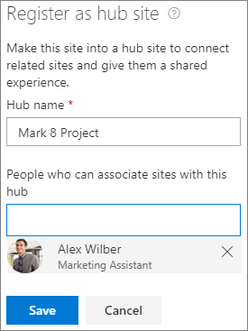

# Sharing and permissions in the SharePoint modern experience

Traditionally, SharePoint permissions have been managed through a set of permissions groups within a site (Owners, Members, Visitors, etc.). In SharePoint, this remains true for some types of sites, but additional options are available.

The three main types of sites in SharePoint are:

- **Team sites** - Team sites provide a collaboration environment for your teams and projects. Each team site, by default, is part of a Microsoft 365 group, which includes a mailbox, shared calendar, and other collaboration tools. Team sites may also be part of a team in Microsoft Teams. Permissions for team sites are best managed through the associated Microsoft 365 group or Teams team.
- **Communication sites** - Communication sites are for broadcasting news and status across the organization. Communication site permissions are managed by using the SharePoint Owners, Members, and Visitors groups for the site.
- **Hubs** - Hubs are team sites or communication sites that the administrator has configured as a hub. They're designed to provide connection between related sites through shared navigation. Permissions for hubs can be managed through the Owners, Members, and Visitors groups, or through the associated Microsoft 365 group if there is one. Special permissions are needed to associate sites to a hub.

## Team site permissions and Microsoft 365 Groups

By default, each SharePoint team site is part of an [Microsoft 365 group](https://support.office.com/article/b565caa1-5c40-40ef-9915-60fdb2d97fa2). a Microsoft 365 group is a single permissions group that is associated with various Microsoft 365 services. This includes a SharePoint site, an instance of Planner, a mailbox, a shared calendar, and others.

When you add owners or members to the Microsoft 365 group, they're given access to the SharePoint site along with the other group-connected services. Group owners become site owners, and group members become site members.

It's possible to manage SharePoint site permissions separately from the Microsoft 365 group by using SharePoint groups, but we recommend against it. In such a case, group members will continue to have access to the site, but users added directly to the site won't have access to any of the group services. The exception is view-only access - Microsoft 365 groups don't have a visitors permission for view-only access, so any users you wish to have view permissions on the site must be added directly to the visitors group on the site.

### Using team sites with Teams

Microsoft Teams provides a hub for collaboration by bringing together various services including a SharePoint team site. Within the Teams experience, users can directly access SharePoint along with the other services. Each team is associated with a Microsoft 365 group and Teams uses that group to manage its permissions.

For scenarios where a SharePoint site is used with Teams, we recommend doing all permission management through Teams. As with Microsoft 365 groups, team owners become site owners and team members become site members. View-only permissions are managed through the site.

For details about how SharePoint and Teams interact, see [How SharePoint and OneDrive interact with Microsoft Teams](https://docs.microsoft.com/microsoftteams/sharepoint-onedrive-interact).

## Communication site permissions

Communication sites aren't connected to Microsoft 365 groups and use the standard SharePoint permissions groups:

- Owners
- Members
- Visitors

Normally with communication sites, you'll have one or more owners, a relatively small number of members who create the content for the site, and a large number of visitors who are the people you're sharing information with.

You can give people permissions to the site by adding individual users, security groups, or Microsoft 365 groups to one of the three SharePoint groups.

If a communication site is used by members of a team in Teams, you may want to add the Microsoft 365 group associated with the team to the members group of the communication site. This will allow members of the team to create content in the communication site.

The visitors group is a good place to use security groups. In many organizations, this is the easiest way to add large numbers of users to a site.

## Hub permissions

Managing permissions in hubs is dependent on the underlying type of site. If the site is a group-connected team site, then you should manage permissions through the Microsoft 365 group. If it's a communication site, then you should manage permissions through the SharePoint groups.

Hub owners define the shared experiences for hub navigation and theme. Hub members create content on the hub as with any other SharePoint site. Owners and members of the sites associated with the parent hub create content on their individual sites.

The SharePoint admin must specify which users can connect other sites to the hub. This is done in the SharePoint admin center and cannot be changed by site owners.

## Sharable links

Giving people permissions to a site, group, or team gives them access to all site content. If you want to share an individual file or folder, you can do so with sharable links. There are three primary link types:

  - *Anyone* links give access to the item to anyone who has the link, including people outside your organization. People using an *Anyone* link don't have to authenticate, and their access can't be audited.
  - *People in your organization* links work for only people inside your Microsoft 365 organization. (They don't work for guests in the directory, only members).  
  - *Specific people* links only work for the people that users specify when they share the item.  

For more about the different types of sharing links, see [Securing your data](https://docs.microsoft.com/sharepoint/deploy-file-collaboration#securing-your-data).

## Guest sharing

The external sharing features of SharePoint let users in your organization share content with people outside the organization (such as partners, vendors, clients, or customers). You can also use external sharing to share between licensed users on multiple Microsoft 365 subscriptions if your organization has more than one subscription. Planning for external sharing should be included as part of your overall permissions planning for SharePoint.

SharePoint has external sharing settings at both the organization level and the site level (previously called the "site collection" level). To allow external sharing on any site, you must allow it at the organization level. You can then restrict external sharing for other sites. 

  
Whichever option you choose at the organization or site level, the more restrictive functionality is still available. For example, if you choose to allow sharing using *Anyone* links, users can still share with guests, who sign in, and with internal users. 
  
External sharing is turned on by default for your organization. Default settings for individual sites vary depending on the type of site. See [Site level settings](https://docs.microsoft.com/Office365/Enterprise/office-365-guest-settings#sharepoint-site-level) for more information.
  
### Security and privacy

If you have confidential information that should never be shared externally, we recommend storing the information in a site that has external sharing turned off. Create additional sites as needed to use for external sharing. This helps you to manage security risk by preventing external access to sensitive information.

## SharePoint and OneDrive integration with Azure AD B2B (Preview)

Azure AD B2B provides authentication and management of guest users. Authentication happens via one-time passcode when they don't already have a work or school account or a Microsoft account (MSA).

With SharePoint and OneDrive integration, the Azure B2B one-time passcode feature is used for external sharing of files, folders, list items, document libraries and sites.

With Azure B2B integration, all guest users are added to the directory and can be managed using Microsoft 365 security and compliance tools. We encourage you to try the [SharePoint and OneDrive integration with Azure AD B2B Preview](sharepoint-azureb2b-integration-preview.md).

## See also

[External sharing overview](external-sharing-overview.md)

[Turn external sharing on or off for SharePoint](turn-external-sharing-on-or-off.md)

[Share SharePoint files or folders](https://support.office.com/article/1fe37332-0f9a-4719-970e-d2578da4941c)
