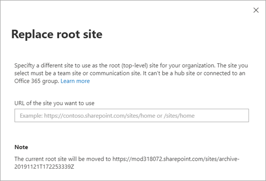

# Modernize your root site
  
When SharePoint is set up for an organization, a root (or top-level) site is created. Before April 2019, the site was created as a classic team site. Now, a communication site is set up as the root site for new organizations. If your environment was set up before April 2019, you can modernize your root site three ways:

- If you have a different site that you want to use as your root site, or if you want to use a modern team site, [replace (swap) the root site](#replace-your-root-site) with it.
- If you want the content on your classic team site to be displayed with the layout of a communication site, [apply the communication site experience](#apply-the-communication-site-experience-to-the-root-site-coming-soon) to the root site. This feature isn't available yet, but is coming soon.
- If you want to continue using the classic team site, [enable the modern site pages library experience](/sharepoint/dev/transform/modernize-userinterface-lists-and-libraries) and [set a modern page as the home page](/sharepoint/dev/transform/modernize-userinterface-site-pages) of the root site. This gives users a modern team site experience with the left navigation.

> [!IMPORTANT]
> Before you launch an intranet landing page at your root site location, we strongly encourage you to [review the guidance about launching healthy portals](portal-health.md). <br>Some functionality is introduced gradually to organizations that have opted in to the [Targeted release option in Microsoft 365](/office365/admin/manage/release-options-in-office-365). This means that you might not yet see some features described in this article, or they might look different.

## What's the root site?

The root site for your organization is one of the sites that's provisioned automatically when you purchase and set up an Microsoft 365 or Microsoft 365 plan that includes SharePoint. The URL of this site is typically *contoso*.sharepoint.com, the default name is "Communication site," and the owner is Company Administrator (all global admins in the organization). The root site can't be connected to an Microsoft 365 group. 

> [!WARNING]
> Do not delete the root site for your organization. If you do, users won't be able to access any SharePoint sites until you restore the root site. 

## Replace your root site

Before you begin, make sure you:

1. Note any "Featured links" that have been added on the SharePoint start page. You'll need to add them again after you replace the root site. [Learn how](change-links-list-on-sharepoint-home-page.md)
2. Review your source site to make sure it has the same policies, permissions, and external sharing settings as your current root site.
3. Communicate the upcoming change to users. This can help reduce user confusion and calls to your help desk. If users are using files on the sites you're replacing, ask them to close the files and check the site recycle bin to make sure it contains no files they want to keep.  

By default, a site redirect will be created that will redirect traffic from the source site to the root site. For info about site redirects, see [Manage site redirects](manage-site-redirects.md). 

If you've [turned on audit log search](/office365/securitycompliance/turn-audit-log-search-on-or-off), the following events can be recorded:

- Scheduled site swap: A site replacement (swap) was scheduled at this time
- Swapped site: A site replacement (swap) completed successfully at this time
- Failed site swap: A site replacement (swap) failed at this time and won't be tried again
 
### Limitations

- The site you select as the new root site must be a communication site (SITEPAGEPUBLISHING#0), a modern team site that isn't connected to an Microsoft 365 group (STS#3), or a classic team site (STS#0). 
- The root site can't be connected to an Microsoft 365 group. 
- When you replace the root site, both the current site and the new site can't be hub sites or associated with a hub. If either site is a hub site, unregister it as a hub site, replace the root site, and then re-register the site as a hub site. If either site is associated with a hub, disassociate the site, replace the root site, and then reassociate the site. [Learn how to manage hubs in the new SharePoint admin center](manage-sites-in-new-admin-center.md#change-a-sites-hub-association)
- Replacing the root site with another site replaces the entire site collection with the new site collection. If your current root site has subsites, they'll be archived. 
- The site you select as the new root site must be within the same domain as the current root site.
  
### Use the new SharePoint admin center

We recommend replacing the root site at a time when site usage is low.  

1. Go to the [Active sites page of the new SharePoint admin center](https://admin.microsoft.com/sharepoint?page=siteManagement&modern=true) and sign in with an account that has [admin permissions](/sharepoint/sharepoint-admin-role) for your organization.

>[!NOTE]
>If you have Microsoft 365 Germany, [sign in to the Microsoft 365 admin center](https://go.microsoft.com/fwlink/p/?linkid=848041), then browse to the SharePoint admin center and open the Active sites page. <br>If you have Microsoft 365 operated by 21Vianet (China), [sign in to the Microsoft 365 admin center](https://go.microsoft.com/fwlink/p/?linkid=850627), then browse to the SharePoint admin center and open the Active sites page.

2. In the upper right, make sure the **All sites** view is selected.

3. In the URL column, select to sort A to Z so the current root site appears at the top of the list.

4. Select the root site (https<i></i>://contoso.<i></i>sharepoint.com).

5. Select **Replace site**.

    

6. In the **URL of the site you want to use** box, enter the full or relative URL of the site that you want to become the new root site.

7. Select **Save**.

    While the root site is being replaced, it might return a "not found" (HTTP 404) error for few minutes.

    After you replace the root site, content must be recrawled to update the search index. This might take some time depending on factors such as the amount of content in these sites. Anything dependent on the search index might return incomplete results until the sites have been recrawled.

8. If the new root site was an organization news site, update the URL. [Get a list of all organizational news sites](/powershell/module/sharepoint-online/get-spoorgnewssite?view=sharepoint-ps)

9. If you disabled site redirects, you'll need to update sharing links and any apps or files (like the OneDrive sync app and OneNote files) to refer to the new URL.

> [!NOTE]
> For info about using PowerShell to replace (swap) the root site, see [Invoke-SPOSiteSwap](/powershell/module/sharepoint-online/invoke-spositeswap).<br>Project Server sites might need to be validated to make sure they're still associated correctly.

## Apply the communication site experience to the root site (coming soon)

When you apply the communication site experience to the root site:

- A new modern home page is created for the root site (only the site at the root, not any subsites)
- Full-width pages with horizontal navigation become available (the top navigation from classic view is hidden, but can be seen on classic pages like the Site settings page)
- [Custom script](allow-or-prevent-custom-script.md) is disabled
- Minor Versioning on the Site Pages library is enabled
- Site Pages are the default content type in the Site Pages library

The permissions and content of the root site aren't changed, and the root site still appears as having the template "team site (classic experience)" or STS#0.

### Limitations

- The root site can be converted to a communication site only if the classic publishing feature was never turned on. 
- The root site must have quick launch site navigation enabled. [Learn how to do this](https://support.office.com/article/c040f014-acbb-4c98-8174-48428cf02b25)


### Run the PowerShell cmdlet

1. [Download the latest SharePoint Online Management Shell](https://go.microsoft.com/fwlink/p/?LinkId=255251).

    > [!NOTE]
    > If you installed a previous version of the SharePoint Online Management Shell, go to Add or remove programs and uninstall "SharePoint Online Management Shell." <br>On the Download Center page, select your language and then click the Download button. You'll be asked to choose between downloading a x64 and x86 .msi file. Download the x64 file if you're running the 64-bit version of Windows or the x86 file if you're running the 32-bit version. If you don't know, see https://support.microsoft.com/help/13443/windows-which-operating-system. After the file downloads, run it and follow the steps in the Setup Wizard. 
    
2. Connect to SharePoint Online as a [global admin or SharePoint admin](/sharepoint/sharepoint-admin-role) in Microsoft 365. To learn how, see [Getting started with SharePoint Online Management Shell](/powershell/sharepoint/sharepoint-online/connect-sharepoint-online).
    
3. Run Enable-SPOCommSite.

```PowerShell
Enable-SPOCommSite -SiteUrl https://contoso.sharepoint.com
```

For more info about this cmdlet, see [Enable-SPOCommSite](/powershell/module/sharepoint-online/Enable-SPOCommSite). 
