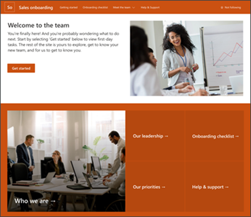
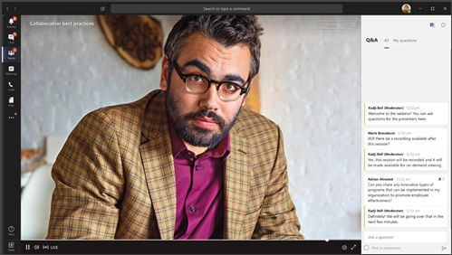
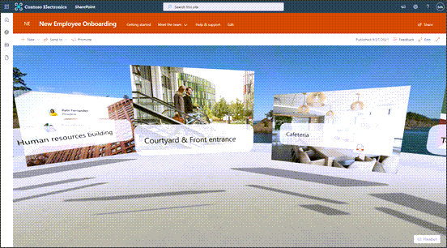
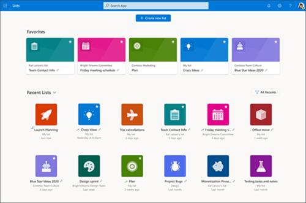
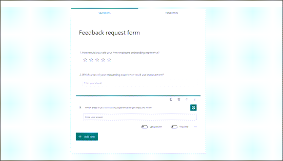

# Onboard new employees into your organization
 

Make new employee onboarding (sometimes referred to as NEO) a great experience by fostering an all-in-one hybrid work environment where new employees can find important resources, meet people in their organization, and prepare to be successful in their new role.  

When entering a new organization, knowing where resources are located, who to go to for help, and how to find training materials in an organized and personalized environment will help new employees navigate your organization efficiently. This article will guide you on how to create a welcoming onboarding environment for new employees using Microsoft’s modern work tools.  

**Create a virtual onboarding experience by:** 

- Planning and implementing an end-to-end experience based on your organization’s tools, resources, and initiatives 
- Hosting a virtual welcome event to share resources and introduce onboarding buddies 
- Using a pre-populated SharePoint site template to provide a home base for new team members 
- Creating a personalized onboarding checklist using the Onboarding checklist list template 
- Curating a training experience for new team members using Viva Learning and LinkedIn Learning
 

## Overview of how to create an onboarding experience

|Icon                  | Phase                | Tasks          |
| :-------------------: | :-------------------: |:----------------|
|   | **Plan** | - Scope your audience    - Map out the employee onboarding experience    - Review Microsoft 365 onboarding tools   - Consider creating a new employee support community in Yammer |
|   | **Build**  | - Consider using a live event to welcome and orient new team members   -  Include partners like hiring managers, business owners, and human resources in the planning process   - Have a plan to maintain NEO content over time   - Create an onboarding site using the New employee onboarding template    - Customize an Onboarding checklist template in Microsoft 365 Lists   - Prepare a survey to ask for feedback at the end of onboarding |
| | **Launch**  | - Send out invites, instructions, and resources using Outlook Mail and Calender.    - Gather insights from each platform used to measure overall performance of the employee onboarding process    - Use feedback to inform the next onboarding session. |

## Plan the onboarding experience

|  |   |  |
| :-------------: | :--------------: |:------------:|
| **Step 1: Scope your audience and goals** |**Step 2: Map the onboarding experience**| **Step 3: Review Microsoft 365 tools**|
|-Determine the needs and the size of your audience.     -Define deliverables and desired outcomes of the onboarding experience     -Establish tone and messaging  | -Establish and onboarding timeline    -Define which onboarding tasks need to be completed   - Prioritize onboarding tasks    -Curate learning materials     -Ask for feedback frequently    | - choose onboarding tools that will best suit your needs.   |

**Planning considerations:** 

- Even before a new employee’s first day on the job, they will need some information about NEO before the event itself. Consider a pre-onboarding SharePoint site that can help new employees gather the right documents and prepare for the NEO event as soon as they sign their offer letter. 
- Some new employees cannot attend the NEO event in person. Consider if it’s better to pre-record an event that can be shown to people who cannot attend in person or if you can live-stream the in-person event and new employees who are remote can join online. 
- Regardless of the NEO event attendance is in person or remotely, the NEO audience will need access to the same resources on desktop and mobile devices. 

### Step 1: Start by determining your audience profile and size 
New employees will have diverse backgrounds, roles, and career experience. Some new employees will be able to attend an event in person while other can only attend remotely. Some tools and resources will need to be accessible from a mobile device. The same resources will need to be available regardless of the new employee orientation method. 

The size of your onboarding group will determine the platforms and resources you use. Learn more about defining your audience profile and scoping audience size. 
 
 

| Groups of 1-19                |Groups of 20 or more              |
| :--------------- | :---------------- |
|   |  |
|Office (PowerPoint, word)   SharePoint   Teams   Viva Learning   Viva Connections   SharePoint Spaces  | Office (PowerPoint, word)   SharePoint   Teams   Viva Learning   Viva Connections   SharePoint Spaces   Yammer   |

#### Define the desired outcome and priority content

When each employee completes onboarding, what would the indication of completion be? In many organizations, onboarding happens for more than one part of the business, consider offering an onboarding structure that allows the new employee to become familiar with the organization and the team they will be working with. Consider setting up modules that guide employees through onboarding and lets them know about their progress.  

#### Consider the tone and messaging for your onboarding process

Make new employees feel welcome and excited to be joining your organization. Use [PowerPoint](https://support.microsoft.com/office/basic-tasks-for-creating-a-powerpoint-presentation-efbbc1cd-c5f1-4264-b48e-c8a7b0334e36) to prepare a well-crafted message that lists out the various benefits and resources your new employees can take advantage of as members of your organization. Introduce them to the culture of your company by laying out company history, fun facts, and more.  

 

### Step 2: Map the ideal employee onboarding experience 
From inception to orientation to day one on the job, the new employee journey has a huge impact on the success of that employee. Ensure the new employee is provided the best tools to start out with by mapping out the new employee onboarding experience.

   

#### Define which onboarding tasks need to be completed 

Create deliverables that let you know that each employee has achieved full competency in a specific subject that is important to the job. This can be learning about the company itself, specific tools, organizational expectations, and more.  

#### Collect, prioritize, and organize resources and content  

When entering a new environment, understanding the order in which deliverables should be completed may be a blind spot for new employees. Help them prioritize onboarding deliverables by laying them out in a way that signals priority. This could be as simple as writing them out for them or integrating [Microsoft Lists](https://support.microsoft.com/microsoft-lists). Learn how to [use Microsoft Lists to help onboard employees](#build-the-new-employee-onboarding-experience). 

#### Curate learning materials

Which learning materials are needed to help make the new employee successful? Curate learning modules for each employee that helps orient them on organizational needs, team needs, and the tools that they will be working with daily. Learn more about [using Viva Learning](#build-the-new-employee-onboarding-experience)

 

#### Get feedback along the way

The goal of every onboarding process is to make sure each new employee feels fully equipped to be successful in their new job. Receiving honest feedback once employees are finished with the onboarding process is the best way to fill in the gaps and improve onboarding for incoming employees. Find out what worked and what could use improvement by creating simple and thoughtful surveys. Learn more about [getting feedback using Microsoft Forms](#build-the-new-employee-onboarding-experience). 

 

### Step 3: Review Microsoft 365 onboarding tools 
A great option is to use Teams live meetings, live events, and chat functionality to welcome new employees and provide an engaging experience for those that can attend in-person as well as remote. Direct users to information and contacts on a SharePoint communications site. Consider using a NEO Yammer channel where new people can ask questions and get answers. You can even consider using SharePoint spaces for virtual training or facility tours. Then, bring it all together using Viva Connections, which integrates SharePoint content into Microsoft Teams. 

- **Microsoft Teams meeting** - Meetings in Teams include audio, video, and screen sharing, and are great for communicating with groups of fewer than 300 individuals. Teams can be used for meetings that happen in person, remotely, or a combination of the two. Additionally, the meeting can be recorded and shared with new employees who were unable to attend the meeting. 

- **SharePoint communication site** - Create a SharePoint communication site using the [New employee onboarding site template](https://support.microsoft.com/office/new-employee-onboarding-template-38b5b290-1703-4c94-beb3-907e0ad4a052?ui=en-US&rs=en-US&ad=US). Use the site to direct new employees to relevant resources, contacts, and conversations in new employee Yammer communities.  

- **Yammer channel** – Create a [Yammer channel](https://support.microsoft.com/office/join-and-create-a-community-in-yammer-56aaf591-1fbc-4160-ba26-0c4723c23fd6) just for new employees. Choose to create one NEO channel for the entire organization or region or create channels for each new group of new employees. Then, use the [Yammer web part](https://support.microsoft.com/office/use-a-yammer-web-part-in-sharepoint-online-a53cfa0c-3d09-42c8-a286-1038a81c59da) on the SharePoint NEO site to integrate the conversation with other resources and contacts.  

- **Microsoft Viva** – [Viva modules](viva.md) are personalized employee experiences that display as app in Microsoft Teams. Use [Viva Connections](/viva/connections/viva-connections-overview)to bring onboarding resources and tools into one place. Content in the Viva Connections experience can be [targeted to specific audiences](https://support.microsoft.com/office/target-content-to-a-specific-audience-on-a-sharepoint-site-68113d1b-be99-4d4c-a61c-73b087f48a81). Use [Viva Learning](/viva/learning/) to curate learning modules for each employee that helps orient them on organizational needs, team needs, and the tools that they will be working with daily. 

- **SharePoint spaces**- Use SharePoint Spaces to create an immersive platform that allows new employees to take a virtual tour of the campus.  

 

 

## Build the new employee onboarding experience 

Build out the employee onboarding experience one platform at a time. The tools listed here can be connected to each other providing a thorough and connected onboarding journey for the new employee.  

### Create an onboarding site using SharePoint

  
 

Create an internal communication site that acts as a home for new employees. This site should lay out resources, deliverables, and company information in and organized way. This site should also contain the most up-to-date information to ensure the new employee has everything needed to be successful. Try organizing action items on this site in a way that signals priority. List the things that need to be finished first at the top. This will help employees organize their work in onboarding to the best of their ability and gives each new employee the same starting point. 

Microsoft offers a new customizable employee onboarding SharePoint communication site template that can help get you started.  

Get started with [SharePoint site templates](https://support.microsoft.com/office/apply-and-customize-sharepoint-site-templates-39382463-0e45-4d1b-be27-0e96aeec8398)

 

### Use live meetings to administer a virtual employee orientation

 
  

With the emergence of virtual work, having face time with other people in the organization is still important in making sure employees can communicate with leaders, peers, and ask top-of-mind questions. Use Microsoft Teams to administer virtual employee orientation.  

Make this live event fun and engaging by giving employees an opportunity to communicate with each other in the Teams chat box or allow employees to ask questions on camera or through the moderated Q&A in Teams live events.  

Learn more about [Teams live events](/microsoftteams/teams-live-events/what-are-teams-live-events).  

 

### Give employees a tour of the campus using SharePoint Spaces

 
 
 

SharePoint Spaces is a tool that provides immersive online experiences using 2D and 3D web parts. Guide new employees through a virtual 360-degree tour of the campus. Incorporate helpful links and web parts that provide important information and helps the employee complete onboarding tasks.  

 

Learn more about [SharePoint Spaces](https://support.microsoft.com/office/sharepoint-spaces-7b65edfb-7cc9-42e3-af37-178d79364a5e).  

### Help the new employee prioritize deliverables with Microsoft Lists
 

 
 

When entering a new environment, understanding the order in which deliverables should be completed may be a blind spot for new employees. Help them prioritize onboarding deliverables by laying them out in a way that signals priority. This could be as simple as writing them out for them or creating tasks in [Microsoft Lists](https://support.microsoft.com/microsoft-lists) and adding the [List app](/MicrosoftTeams/manage-lists-app) in the New employee Teams channel for easy access. You can also integrate List into the new employee onboarding SharePoint site using the [List web part](https://support.microsoft.com/office/use-the-list-web-part-ef0a1b80-f8b3-443d-b04a-1e76c70b5537). 

 

### Use Viva Connections and integrate with other Microsoft Viva experiences

 
 

Help orient new employees by providing them with the most important company information, resources, and updates regularly. Viva Connections is a digital platform built on the existing capabilities of Microsoft 365 that allows organizations to customize employee experiences and gain access to the most important information the most used tools and resources on both desktop and mobile devices. [Learn more about creating onboarding experiences using Microsoft Viva](/viva/solutions/viva-onboard-change-roles).

**Learn more about Viva modules:**

| [Viva Learning](/viva/learning/) | [Viva Topics](/viva/connections/viva-connections-overview) | [Viva Insights](/viva/insights/) | [Viva Connections](/viva/connections/viva-connections-overview) |
|---|---|---|---|---|
 | Target specific training for new employees. | New team members can learn about popular terms, acronyms, projects, and more. | Help new team members spend time productively. | Provide easy access to benefits, training materials, and resources. |

#### Help employees learn the job with Viva Learning

 
 

Viva Learning (Preview) is an application for Microsoft Teams that allows users to discover, recommend, and access learning modules from different platforms to help users gain knowledge in any specific focus area. Viva Learning (Preview) pulls content from LinkedIn Learning, Microsoft Learn, Microsoft 365 Training, and other partners. Use Viva Learning to curate learning modules for each employee that helps orient them on organizational needs, team needs, and the tools that they will be working with daily.  

In Viva Learning (Preview), managers of an organization or team can assign learning and track the learning progress of each module. The Viva Learning (Preview) home view aggregates a variety of information, including assigned content from learning management systems, recommended learnings, trending content, and learning provider content libraries. 

Learn more about [Viva Learning (Preview)](/microsoft-365/learning/?view=o365-worldwide).  

### Create Virtual Communities for new employees in Yammer

 
 
Give new employees the opportunity to connect with each other and build a supportive virtual community in Yammer. Yammer is a platform that connects leaders, communicators, and employees to build communities, share knowledge, and engage across the organization. Yammer allows you to set up a community specifically for new employees within the organizational platform.

Naturally, employees come across information at different times in their onboarding process. Creating a space where new employees can build a community for themselves gives them the opportunity to share information as they come across it. In this virtual space, new employees can share resources, share ideas, and get to know each other. It also helps them build internal bonds that can last over the course of their career.

Learn more about building communities in [Yammer](/yammer/get-started-with-yammer/newyammer-faq). 

### Ask for feedback using Microsoft Forms

 
 
The best way to improve the new employee onboarding experience is by asking for feedback. Understand what worked best and what could use improvement by asking for feedback after all deliverables have been completed by new employees. 

Use Microsoft forms to build short surveys that answer the questions that could inform the onboarding experience moving forward. 
Learn more about [Microsoft forms](https://support.microsoft.com/forms). 

## Launch the new employee onboarding experience 

Use [Outlook](https://outlook.office.com/owa/) to invite all new employees to orientation. In this email, lay out all the resources starting with the Viva Connections homepage that contains links to the New Employee SharePoint site, the New Employee orientation live meeting event post, learning objectives and more. Be sure to include any necessary information and important direct contact. 

Gather insights from each platform along the way. Use these insights to inform managers, team leads, and other stakeholders. Look for insights such as live event attendance, audience reach, site traffic, and more. 

Use the feedback gathered from each onboarding cycle to inform the next onboarding cycle. 

### More Resources

[Review Microsoft 365 communication tools and methods](review-communication-apps.md)