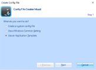
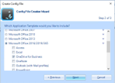
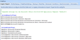
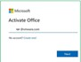

# Set up Microsoft Office and OneDrive in Omnissa Horizon Virtual Apps using Dynamic Environment Manager

This article describes how to enable and use OneDrive in Horizon Virtual Apps.

## Prerequisites

To enable OneDrive in Horizon Virtual Apps, you will need to have Omnissa Dynamic Environment Manager (DEM) configured. Follow DEM product documentation for installation and configuration of DEM:

https://docs.omnissa.com/bundle/DEMInstallConfigGuideV2312/page/IntroductiontoDynamicEnvironmentManager.html

Follow Omnissa Horizon articles for configuring published apps:

https://docs.omnissa.com/bundle/Desktops-and-Applications-in-HorizonV2312/page/ConfigureHorizon8forPublishedApplicationsDelivery.html

**Omnissa Horizon**:

1.	Start the Omnissa Dynamic Environment Manager management console and click **Create Config File** and select **Use an Application Template**. \
\

1.	Select the application template (Microsoft Office 2016/2019/365), **Select OneDrive for Business** and click **Next**. \
\

1.	Provide the File name and Description and click Finish. \
\

1.	Add the following **Import / Export** settings:

    `[IncludeRegistryTrees]` \
`HKCU\Software\Microsoft\Office` \
`HKCU\Software\Microsoft\Internet Explorer` \
`HKCU\Software\Microsoft\Windows\CurrentVersion\Internet Settings` \
`HKCU\Software\Microsoft\Windows\CurrentVersion\Shell Extensions\Cached` \
`HKCU\Software\Microsoft\OneDrive`

    `[IncludeFolderTrees]` \
`<Appdata>\Microsoft\Windows\Recent` \
`<Appdata>\Microsoft\crypto` \
`<Appdata>\SystemCertificates` \
`<LocalAppdata>\Microsoft\IdentityCache` \
`<LocalAppdata>\Microsoft\Internet Explorer` \
`<LocalAppdata>\Microsoft\Windows\INetCache` \
\

**Validation:**

Using the Omnissa Horizon client, launch any Microsoft Office published app.

Activate Microsoft Office \
\

After Activation, attempt to save a document and you will see the default location is OneDrive. \
\

