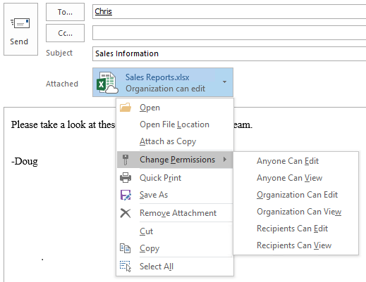
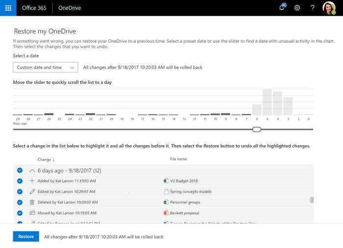

# Overview of OneDrive in Microsoft 365

OneDrive is a robust but simple-to-use cloud storage platform for small businesses, enterprises, and everything in between. Unlike other cloud storage providers, most of the advanced enterprise-focused features in OneDrive are available for every subscription type, enabling organizations to use OneDrive in whatever way benefits them the most. This guide describes the features available and how they can benefit your organization.

## Key OneDrive features

The features listed in this section address common customer concerns or specific compliance requirements, or provide unique functionality available only in OneDrive. For a full list of features available across OneDrive plans, see [Microsoft OneDrive](https://onedrive.live.com/about).

### OneDrive Files On-Demand

OneDrive Files On-Demand enables users to view, search for, and interact with files stored in OneDrive from within File Explorer, without downloading all the files to their device. The feature provides a seamless look and feel for both OneDrive and local files without taking up space on the local hard drive. As shown in the following screenshot, files that have not been downloaded have a cloud icon for their status. For those files that have been downloaded, the status shows a green checkmark.

By default, files are downloaded only when you need to access them. However, if you plan to access a file while disconnected from the internet, simply make the file available offline by right-clicking it, and then selecting **Always keep on this device**. Alternatively, if you want to free space on your device and remove the downloaded copy of a file, right-click the file, and then select **Free up space**. The following screenshot shows the right-click menu for OneDrive files on a device running Windows.

For more information about OneDrive Files On-Demand, see [Learn about OneDrive Files On-Demand](https://support.office.com/article/0e6860d3-d9f3-4971-b321-7092438fb38e).

### Modern attachments

OneDrive integrates with Microsoft Outlook to enable easy sharing of OneDrive files that appear just like email attachments. This feature provides a familiar sharing experience but centralizes storage of attachments in OneDrive. This allows your users to all collaborate on the same file instead of sending different versions back and forth in email. In addition, you can configure sharing permissions on the files directly from within Outlook.

To reduce the potential for confusion when users choose to add a copy versus a link to attached OneDrive files, you can set the default behavior of Outlook, as demonstrated in [How to control default attachment state when you attach a cloud file in Outlook 2016](https://support.microsoft.com/help/4011261/how-to-set-attachment-preference-for-attaching-a-cloud-file-in-outlook).

### Files Restore

The OneDrive Files Restore feature lets users restore files to any point over the past 30 days. To select the desired recovery time, OneDrive presents you with a histogram that shows file activity so that you can determine which recovered time meets your needs. From there, simply select the file history entry to which you want to restore, and all changes after that point will be rolled back.

In addition, because the histogram shows individual activity on a file, users can use this feature to quickly view their files' modification history. For more information about this feature, see [Restore your OneDrive](https://support.office.com/article/fa231298-759d-41cf-bcd0-25ac53eb8a15).

### Recycle bin

OneDrive has a recycle bin similar to the one available in Windows. Deleted files are moved to the recycle bin and kept for a designated time before being permanently deleted. For work or school accounts, deleted files are purged after 93 days unless configured otherwise. For a demonstration of how the recycle bin works, see [Restore deleted files or folders in OneDrive](https://support.office.com/article/949ada80-0026-4db3-a953-c99083e6a84f).

### Known Folder Move

Known Folder Move enables Windows and Mac users to select commonly used folders, such as their desktop and documents to automatically synchronize to OneDrive. You can add this feature during the initial setup of OneDrive or after it has been configured. This capability provides a simple migration option for users looking to add known folders to their existing list of synchronized folders. For more information about Known Folder Move, see [Redirect and move Windows known folders to OneDrive](/onedrive/redirect-known-folders) and [Redirect and move macOS Desktop and Documents folders to OneDrive](/onedrive/redirect-known-folders-macos).

### Syncing files

Users can upload, download, and interact with OneDrive files from a web browser, but the ideal OneDrive experience comes from the Windows and Mac sync apps and the iOS and Android mobile apps. With these clients and apps, saving files to OneDrive and interacting with them is much easier than visiting a website each time you need something. Through this experience, you can seamlessly integrate OneDrive into your existing file interaction experiences.

For information about planning and deploying the sync app for your organization, see [Plan file sync for SharePoint and OneDrive in Microsoft 365](plan-file-sync.md).

## Manage OneDrive

Many organizations use OneDrive without changing any of the options. To change these settings, use the SharePoint admin center.

- **Sharing.** Go to <a href="https://go.microsoft.com/fwlink/?linkid=2185222" target="_blank">Sharing</a> to set sharing settings at the organization level. To learn more, see [Manage sharing settings](/sharepoint/turn-external-sharing-on-or-off).

- **Sync.** Go to <a href="https://go.microsoft.com/fwlink/?linkid=2185072" target="_blank">Settings</a> and select  **Sync**. You can require that synced computers be joined to your domain or block uploads based on file type.

- **Storage limit.** Go to <a href="https://go.microsoft.com/fwlink/?linkid=2185072" target="_blank">Settings</a> and select **Storage limit**. Set the default storage space for all new and existing users who are licensed for a qualifying plan and for whom you haven't set specific storage limits.

- **Retention.** Go to <a href="https://go.microsoft.com/fwlink/?linkid=2185072" target="_blank">Settings</a> and select **Retention**. Configure how long to keep data for users whose accounts have been deleted (the default is 30 days).

- **Access control.** Go to <a href="https://go.microsoft.com/fwlink/?linkid=2185071" target="_blank">Access control</a> to control access from unmanaged devices or based on network location.

- **Compliance.** [View the compliance and risk management solutions available in Microsoft 365](https://compliance.microsoft.com/solutioncatalog)

- **Notifications.** Go to <a href="https://go.microsoft.com/fwlink/?linkid=2185072" target="_blank">Settings</a> and select **Notifications**. For information about this setting, see [Control notifications](/onedrive/turn-on-external-sharing-notifications).

## Get help with OneDrive

If you need help with OneDrive, you have many ways to find solutions to common issues or request help:

- **Tech community.** Find helpful information from other customers in the community by reviewing the discussions in the [OneDrive Tech Community](https://techcommunity.microsoft.com/t5/OneDrive-for-Business/ct-p/OneDriveforBusiness) and the [Microsoft OneDrive Blog](https://techcommunity.microsoft.com/t5/OneDrive-Blog/bg-p/OneDriveBlog).

- **Support documentation.** For a list of recent issues in OneDrive and how to resolve or work around them, see [Fixes or workarounds for recent issues in OneDrive](https://support.office.com/article/36110213-f3f6-490d-8cb7-3833539def0b). For getting started info, see [Get started with OneDrive](https://support.office.com/article/c7f31921-e2e5-4b00-959a-cc9ad6297de7), [Employee file storage (video training)](https://support.office.com/article/12dbe3e4-dbef-48f8-a90e-87f1bc607073) and [Why use OneDrive to store your docs](https://support.office.com/article/e55c4fa8-1e03-4d75-956b-924620bdfa2d).

- **Microsoft Support.** If you need help from Microsoft to troubleshoot an issue or configure or deploy OneDrive, see [Contact Microsoft](https://support.microsoft.com/gp/contactus81?Audience=Commercial).
