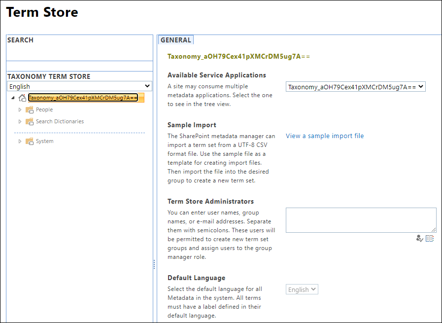

# Open the Term Store Management Tool

If your organization uses managed term sets to implement formal taxonomies, you can use the Term Store management tool to import or create the term sets. If you're a Term store admin, follow these steps to open the Term Store Management Tool.
  
1. For a site that you own, go to the **Site Settings** page.
2. Under **Site Administration**, select **Term store management**.

If you're a global or SharePoint admin in Microsoft 365, you can access the Term Store Management Tool from the SharePoint admin center.

1. Open the SharePoint admin center.
2. In the left navigation, under **Content services**, choose **Term store**.
