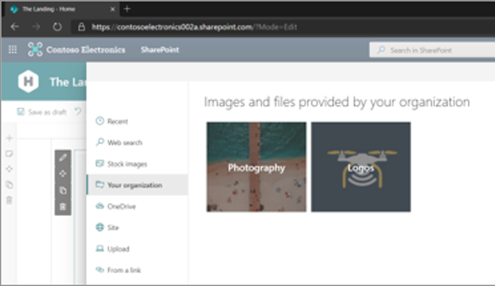
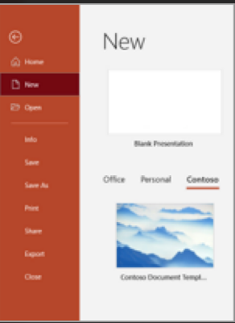

# Create an organization assets library

> [!NOTE]
> This feature is not available for Office 365 operated by 21Vianet (China) or Microsoft 365 US Government plans.
>
> You can specify up to 30 organization asset libraries for a single organization. All of these libraries (regardless of type) must be on the same site. Only libraries (not folders) can be set as organization asset libraries.

If your organization needs to store and manage files for all your users to use, you can specify one or more document libraries on a SharePoint site as an "organization assets library." You can create two types of organization assets:

- **Images such as photos and logos**: When a user adds a web part to any modern page in SharePoint and that web part opens the file picker, the user can select "Your organization" in the left pane to browse the libraries you've specified.

    

- **Office templates**: When a user creates a new Office document, they can select the tab for your organization to see the available templates. The following Office apps are supported:
  - Word, Excel, or PowerPoint desktop apps. Microsoft 365 Apps Version 2002 or later is also required.

    

  - PowerPoint on the web. Templates aren't available from the **New** menu. Instead, users need to go to the PowerPoint start page and select **Office Template Library**. For the organization assets library to appear to a user in PowerPoint on the web, the user must be assigned a license to Office 365 E3 or E5.

    > [!NOTE]
    > - For the organization assets library to appear to a user in PowerPoint on the web, the user must be assigned a license to Office 365 E3 or E5. Users who use the Word, Excel, or PowerPoint desktop app also need Microsoft 365 Apps Version 2002 or later. (The organization assets library is not available in Word on the web or Excel on the web.)
    > - Allow up to 24 hours for the organization assets library to appear to a user in the desktop apps.
    > - Uploaded template files must be in the following formats:
    >   - **Excel**: .xltx. [Learn how to save an Excel workbook as a template](https://support.microsoft.com/office/save-a-workbook-as-a-template-58c6625a-2c0b-4446-9689-ad8baec39e1e).
    >   - **Word**: .dotx. [Learn how to save a Word document in this format](https://support.microsoft.com/topic/create-a-template-86a1d089-5ae2-4d53-9042-1191bce57deb).
    >   - **PowerPoint**: .potx. [Learn how to save a PowerPoint file in this format](https://support.microsoft.com/office/ee4429ad-2a74-4100-82f7-50f8169c8aca).
    > - Users need at least read permissions on the root site for your organization for the organization assets library to appear in the desktop apps.

    Organization fonts are supported on PowerPoint for the web. [Learn more about support for your organization fonts here.](support-for-organization-fonts-in-PowerPoint-for-the-web.md)

## Use Microsoft PowerShell to specify a library as an organization assets library

1. Select an existing site or create a new site for the organization assets. This can be any type of site, such as a communication site, a team site that's connected to a Microsoft 365 Group, or a modern team site that isn't connected to a Microsoft 365 Group.

    > [!NOTE]
    > All organization asset libraries must be on the same site.

2. **Set the permissions on the site**. Add the people you want to be able to upload files as members or owners of the site or Microsoft 365 Group. Add "Everyone except external users" as visitors. If necessary, [customize the permissions for the library](https://support.office.com/article/02d770f3-59eb-4910-a608-5f84cc297782). You can customize the permissions of up to 100 files and folders in the library.

3. Upload the images or Office templates to a document library.

4. [Download the latest SharePoint Online Management Shell](https://go.microsoft.com/fwlink/p/?LinkId=255251).

    > [!NOTE]
    > If you installed a previous version of the SharePoint Online Management Shell, go to Add or remove programs and uninstall "SharePoint Online Management Shell."

5. Connect to SharePoint as a [Global Administrator or SharePoint Administrator](./sharepoint-admin-role.md) in Microsoft 365. To learn how, see [Getting started with SharePoint Online Management Shell](/powershell/sharepoint/sharepoint-online/connect-sharepoint-online).

6. Run the following command to designate the document library as an organization assets library:

    ```PowerShell
    Add-SPOOrgAssetsLibrary -LibraryUrl <URL> [-ThumbnailUrl <URL>] [-OrgAssetType <ImageDocumentLibrary or OfficeTemplateLibrary>] [-CdnType <Public or Private>]
    ```

   - *LibraryURL* is the absolute URL of the library to be designated as a central location for organization assets.
   - *ThumbnailURL* is the URL for the image file that you want to appear in the card's background in the file picker; this image must be on the same site as the library. The name publicly displayed for the library will be the organization's name.
   - *OrgAssetType* is either `ImageDocumentLibrary` or `OfficeTemplateLibrary`. If you don't specify the *OrgAssetType*, the library will be designated as an image library by default.
   - If you don't specify the *CdnType*, it will enable a private CDN by default.

   [Learn more about the Add-SPOOrgAssetsLibrary cmdlet](/powershell/module/sharepoint-online/add-spoorgassetslibrary).

   Example:

   ```powershell
   Add-SPOOrgAssetsLibrary -LibraryURL https://contoso.sharepoint.com/sites/branding/Assets -ThumbnailURL https://contoso.sharepoint.com/sites/branding/Assets/contosologo.jpg -OrgAssetType ImageDocumentLibrary
   ```

> [!NOTE]
> Adding an organization assets library will enable a content delivery network (CDN) for your organization to provide fast and reliable performance for shared assets. You'll be prompted to enable a CDN for each organization asset library you add. For more information, see [Content Delivery Networks (CDNs)](/office365/enterprise/content-delivery-networks).

## Related commands

- See information about all organization asset libraries on the site: <br/>`Get-SPOOrgAssetsLibrary` <br/>[Learn more about this cmdlet](/powershell/module/sharepoint-online/get-spoorgassetslibrary).

- Update thumbnail URL: <br/>`Set-SPOOrgAssetsLibrary -LibraryUrl <String> -ThumbnailUrl <String>` <br/>[Learn more about this cmdlet](/powershell/module/sharepoint-online/set-spoorgassetslibrary).

- Remove a library: <br/>`Remove-SPOOrgAssetsLibrary -LibraryUrl <String>` <br/>[Learn more about this cmdlet](/powershell/module/sharepoint-online/remove-spoorgassetslibrary).

