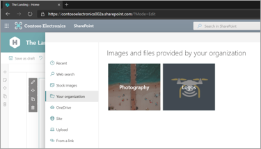
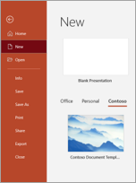

# Create an organization assets library

If your organization needs to store and manage files for all your users to use, you can specify one or more document libraries on a site as an "organization assets library." You can create two types of organization assets:

- **Images such as photos and logos**. When a user adds a web part to any modern page in SharePoint and that web part opens the file picker, the user can select "Your organization" in the left pane to browse the libraries you've specified. 

    

- **Office templates**. When a user selects to create a new Office file (from Office.com or an Office desktop app), the user can select the tab for your organization to see the templates. (To use this feature on Office.com, users  need to be assigned a license to Office 365 E3 or E5.)

    

> [!NOTE]
> This feature is not available for Office 365 Germany, Office 365 operated by 21Vianet (China), or Office 365 US Government plans. <br>You can specify up to 30 organization asset libraries for a single organization. All of these libraries (regardless of type) must be on the same site. 


## Use Microsoft PowerShell to specify a library as an organization assets library
  
1. Select an existing site or create a new site for the organization assets. This can be any type of site, such as a communication site, an Office 365 group-connected team site, or a modern team site that isn't connected to an Office 365 group.

    > [!NOTE]
    > All organization asset libraries must be on the same site.

2. Set the permissions on the site. Add the people you want to be able to upload files as members or owners of the site or Office 365 group. Add anyone you want to be able to access the files (such as "Everyone except external users") as visitors. 

3. Upload the images or Office templates to a document library.

4. [Download the latest SharePoint Online Management Shell version](https://go.microsoft.com/fwlink/p/?LinkId=255251).

    > [!NOTE]
    > If you installed a previous version of the SharePoint Online Management Shell, go to Add or remove programs and uninstall “SharePoint Online Management Shell.” <br>On the Download Center page, select your language and then click the Download button. You’ll be asked to choose between downloading a x64 and x86 .msi file. Download the x64 file if you’re running the 64-bit version of Windows or the x86 file if you’re running the 32-bit version. If you don’t know, see https://support.microsoft.com/help/13443/windows-which-operating-system. After the file downloads, run it and follow the steps in the Setup Wizard. 
    
5. Connect to SharePoint Online as a global admin or SharePoint admin in Office 365. To learn how, see [Getting started with SharePoint Online Management Shell](/powershell/sharepoint/sharepoint-online/connect-sharepoint-online).
    
6. Run the following command to designate the document library as an organization assets library:
  
    ```PowerShell
    Add-SPOOrgAssetsLibrary -LibraryUrl <URL> [-ThumbnailUrl <URL>] [-OrgAssetType <ImageDocumentLibrary or OfficeTemplateLibrary>] [-CdnType <Public or Private>]
    ```

LibraryURL is the absolute URL of the library to be designated as a central location for organization assets. ThumbnailURL is the URL for the image file that you want to appear in the card's background in the file picker; this image must be on the same site as the library. The name publicly displayed for the library will be the name of the library on the SharePoint site. OrgAssetType is either ImageDocumentLibrary or OfficeTemplateLibrary. If you don't specify the OrgAssetType, the library will be designated as an image library by default. If you don't specify the CdnType, it will enable a private CDN by default. [Learn more about the Add-SPOOrgAssetsLibrary cmdlet](/powershell/module/sharepoint-online/add-spoorgassetslibrary)

Example: `Add-SPOOrgAssetsLibrary -LibraryURL https://contoso.sharepoint.com/sites/branding/Assets -ThumbnailURL https://contoso.sharepoint.com/sites/branding/Assets/contosologo.jpg` -OrgAssetType ImageDocumentLibrary


> [!NOTE]
> Adding an organization assets library will enable a content delivery network (CDN) for your organization to provide fast and reliable performance for shared assets. You'll be prompted to enable a CDN for each organization asset library you add. Vanity domains are currently not supported. [More info about CDNs](/office365/enterprise/content-delivery-networks)

 
## Related commands 

- See information about all organization asset libraries on the site: `Get-SPOOrgAssetsLibrary` [Learn more about this cmdlet](/powershell/module/sharepoint-online/get-spoorgassetslibrary) 
- Update thumbnail URL: `Set-SPOOrgAssetsLibrary -LibraryUrl <String> -ThumbnailUrl <String>` [Learn more about this cmdlet](/powershell/module/sharepoint-online/set-spoorgassetslibrary) 
- Remove a library: `Remove-SPOOrgAssetsLibrary -LibraryUrl <String>` [Learn more about this cmdlet](/powershell/module/sharepoint-online/remove-spoorgassetslibrary)
