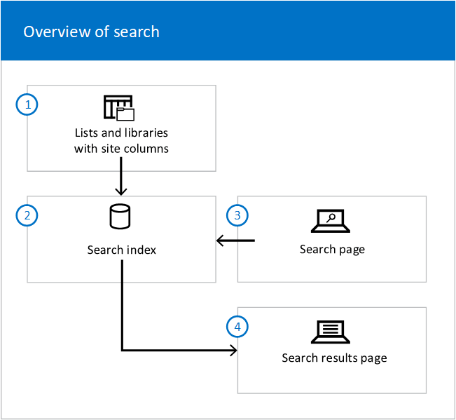

# Overview of search in SharePoint Online

If you're responsible for search in your organization, learn how you can tailor the search experience to your organization and make search even better for your users.

SharePoint Online has both a classic and a modern search experience, where [Microsoft search in SharePoint](https://docs.microsoft.com/microsoftsearch/overview-microsoft-search) is the modern search experience. The most visible difference is that the Microsoft search box is placed at the top of SharePoint, in the header bar. Another difference is that Microsoft search is personal. The results one user sees are different from what other users see, even when they search for the same words. Users see results before they start typing in the search box, based on their previous activity and trending content in Microsoft 365, and the results update as they type. The search results are easy to explore without any effort from you as an admin. Learn more about the Microsoft search experience for users in [Find what you need with Microsoft search](https://support.office.com/article/d5ed5d11-9e5d-4f1d-b8b4-3d371fe0cb87).

Both search experiences use the same search index to find search results. You can customize and tailor the classic search experience more than Microsoft search in SharePoint. Some classic search settings can impact both experiences, [learn how to avoid impacting Microsoft search](differences-classic-modern-search.md). Read [When to use which search experience](get-started-with-modern-search-experience.md) to decide which experience is best for your organization.

Below are the main areas where you can customize and impact the search experience and make sure that search is performing the way you want. The high-level overview of [How search works](overview-of-search.md#howsearchworks) can also help you understand where and how you can impact the search experience in SharePoint Online.
  
Many of the classic search features are available on the [search administration page](manage-search-the-admin-center.md) in the SharePoint admin center.

## 1. Make sure the content can be found
  
The content must be crawled and added to the search index for your users to find what they're looking for when they search in SharePoint Online. Microsoft search uses the same index of SharePoint content as classic search does.
  
See how you can make content searchable, and how you can crawl content to get it into the search index. Also, see how you can help users search for content across Microsoft 365 and on-premises SharePoint Server at the same time. [Learn more](make-sure-content-can-be-found.md)
  
## 2. Make the search results look great
  
Presenting the search results the right way makes content easier to find.
  
See how you can manage the classic experience in the Search Center in SharePoint Online, and how you can use the different search Web Parts to help each user find what they're looking for. [Learn more](make-search-results-look-great.md)
  
## 3. Show relevant search results
  
All search results are not relevant to everyone all the time.
  
See how you can show each user exactly the results they're looking for. [Learn more](show-relevant-search-results.md)
  
## 4. Check logs, limits and reports
  
See how you can check if the crawler has added content to the search index, and if your users are finding what they're looking for. Look up the limits for search, for example how many entries you can have in a custom search dictionary. [Learn more](check-logs-limits-and-reports.md)
  
## How search works

This high-level overview of how search works can help you understand where and how you can customize the search in SharePoint Online. 
  
In lists and libraries, site columns store detailed information about each document.
  
1. Search **crawls** the lists and libraries and adds the site columns and values to the search index.

2. In the **search index**, site columns are mapped to managed properties.

3. When a user enters a **query** in a search box, the query is sent to the search index. 

4. The search engine finds **matching results** and sends them to a search results page.

## See also

[Learn about Microsoft search](https://docs.microsoft.com/microsoftsearch/overview-microsoft-search)

[Get started with Microsoft search in SharePoint](https://docs.microsoft.com/microsoftsearch/get-started-search-in-sharepoint-online)
